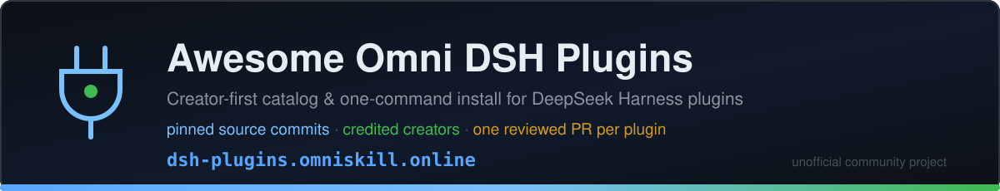
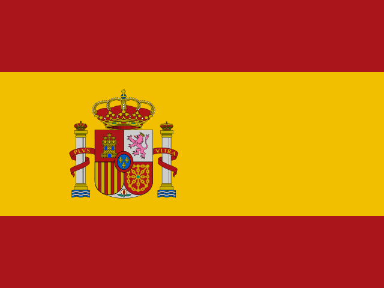
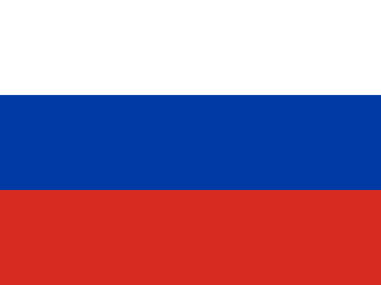
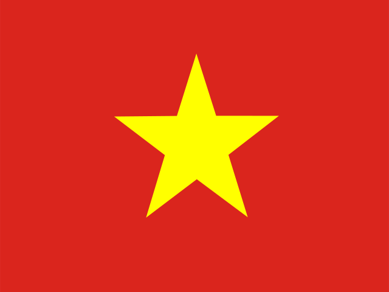

<div align="center">



# 🧩 Awesome Omni DSH Plugins

> **Unofficial community project. Not affiliated with, endorsed by, or sponsored by DeepSeek.**
> DeepSeek names and marks belong to their respective owner.

Creator-first discovery and one-command installation for **DeepSeek Harness (DSH)** plugins.

<h2>
  🌐 <a href="https://dsh-plugins.omniroute.online"><strong>dsh-plugins.omniroute.online</strong></a> 🌐
</h2>
<h3>
  <a href="https://dsh-plugins.omniroute.online">Browse, search and install every plugin on the website →</a>
</h3>

[](https://dsh-plugins.omniroute.online)
[](https://www.npmjs.com/package/omni-dsh-plugins)
[](https://github.com/diegosouzapw/awesome-omni-dsh-plugins/actions/workflows/validate-catalog.yml)
[](LICENSE)
[](https://dsh-plugins.omniroute.online)

<br/>

<b>🌐 In 43 languages</b>
<br/><br/>
<a href="README.md"></a>
<a href="docs/i18n/pt-BR/README.md"></a>
<a href="docs/i18n/zh-CN/README.md"></a>
<a href="docs/i18n/zh-TW/README.md"></a>
<a href="docs/i18n/pt/README.md"></a>
<a href="docs/i18n/es/README.md"></a>
<a href="docs/i18n/fr/README.md"></a>
<a href="docs/i18n/it/README.md"></a>
<a href="docs/i18n/de/README.md"></a>
<a href="docs/i18n/nl/README.md"></a>
<a href="docs/i18n/ru/README.md"></a>
<a href="docs/i18n/uk-UA/README.md"></a>
<a href="docs/i18n/pl/README.md"></a>
<a href="docs/i18n/cs/README.md"></a>
<a href="docs/i18n/sk/README.md"></a>
<a href="docs/i18n/ro/README.md"></a>
<a href="docs/i18n/hu/README.md"></a>
<a href="docs/i18n/bg/README.md"></a>
<a href="docs/i18n/da/README.md"></a>
<a href="docs/i18n/fi/README.md"></a>
<a href="docs/i18n/no/README.md"></a>
<a href="docs/i18n/sv/README.md"></a>
<a href="docs/i18n/ja/README.md"></a>
<a href="docs/i18n/ko/README.md"></a>
<a href="docs/i18n/th/README.md"></a>
<a href="docs/i18n/vi/README.md"></a>
<a href="docs/i18n/id/README.md"></a>
<a href="docs/i18n/ms/README.md"></a>
<a href="docs/i18n/phi/README.md"></a>
<a href="docs/i18n/in/README.md"></a>
<a href="docs/i18n/hi/README.md"></a>
<a href="docs/i18n/gu/README.md"></a>
<a href="docs/i18n/mr/README.md"></a>
<a href="docs/i18n/ta/README.md"></a>
<a href="docs/i18n/te/README.md"></a>
<a href="docs/i18n/bn/README.md"></a>
<a href="docs/i18n/ur/README.md"></a>
<a href="docs/i18n/fa/README.md"></a>
<a href="docs/i18n/ar/README.md"></a>
<a href="docs/i18n/he/README.md"></a>
<a href="docs/i18n/tr/README.md"></a>
<a href="docs/i18n/az/README.md"></a>
<a href="docs/i18n/sw/README.md"></a>

</div>

---

## ⭐ Top 10 plugins

Ranked by exact-repository stars — only stars earned by the plugin's own repository count, never
a parent project's ([ranking predicate](docs/RANKING.md)). Every name links to the creator's
repository, pinned at the exact commit the catalog validated.

| #   | Plugin | Creator | ★ | Category | What it does |
| --- | ------ | ------- | --- | -------- | ------------ |
| 1 | [modlens](https://github.com/liustack/modlens) | [@liustack](https://github.com/liustack) | 3270 | Vision & multimodal | Plug-in vision for text-only LLMs, powered by the free Antigravity CLI |
| 2 | [dsh-better-sidebar](https://github.com/omdsh-dev/DSH-better-sidebar) | [@Menghuan1918](https://github.com/Menghuan1918) | 2330 | Coding & dev tools | DSH web plugin: a VSCode-like right sidebar (explorer / editor / terminal / git / browser), isolated per… |
| 3 | [dsh-tui](https://github.com/ccch1mneyyy/dsh-TUI) | [@CikeSeven](https://github.com/CikeSeven) | 2189 | UI & dashboards | Claude Code style interactive TUI front door for DeepSeek Harness agents, built on the ported Ink core. |
| 4 | [dsh-vision-router](https://github.com/ysr666/dsh-vision-router) | [@ysr666](https://github.com/ysr666) | 843 | Vision & multimodal | Eyes for text-only DeepSeek Harness agents: built-in free vision chain (no key) + pixel-level vision tools… |
| 5 | [dsh-agent-teams](https://github.com/NanmiCoder/dsh-agent-teams) | [@NanmiCoder](https://github.com/NanmiCoder) | 836 | Sessions & productivity | AgentTeams for DeepSeek Harness: multi-agent team collaboration (captain, members, tasks with dependencies,… |
| 6 | [dsh-context](https://github.com/bowenliang123/dsh-context) | [@bowenliang123](https://github.com/bowenliang123) | 825 | UI & dashboards | A DeepSeek Harness plugin for context insight and management, with context dashboard and context command, for… |
| 7 | [dsh-vision-toolkit](https://github.com/Anionex/dsh-vision-toolkit) | [@Anionex](https://github.com/Anionex) | 750 | Vision & multimodal | DeepSeek Harness-native integration for agent-vision-toolkit: image Q&A, OCR, grounding, UI restoration,… |
| 8 | [graph-memory](https://github.com/adoresever/graph-memory) | [@adoresever](https://github.com/adoresever) | 565 | Memory & RAG | Knowledge graph memory for DeepSeek Harness and OpenClaw — cross-session recall, PageRank, communities, and… |
| 9 | [dsh-ads](https://github.com/Nagi-ovo/dsh-ads) | [@Nagi-ovo](https://github.com/Nagi-ovo) | 511 | Entertainment | DSH ad-infestation plugin: localized Chinese portal ads and English scam-ad parody, with fake pop-ups, a… |
| 10 | [dsh-pocket](https://github.com/shaobeichen/dsh-pocket) | [@shaobeichen](https://github.com/shaobeichen) | 458 | Coding & dev tools | Put DeepSeek Harness in your pocket : one package, one settings tab — scan a QR code and your phone shows… |

<div align="center">

### 👉 [**Search all plugins, read the details and copy the install command on the website →**](https://dsh-plugins.omniroute.online) 👈

</div>

## At a glance

| Surface     | What it is                                                       | Where                                                                    |
| ----------- | ---------------------------------------------------------------- | ------------------------------------------------------------------------ |
| **Website** | Rendered catalog browser with search and ranking                 | [dsh-plugins.omniroute.online](https://dsh-plugins.omniroute.online)     |
| **Catalog** | One YAML file per plugin, the single source of truth             | [`catalog/plugins/`](catalog/plugins)                                    |
| **Schema**  | Public JSON Schema (draft 2020-12) every entry validates against | [`schemas/plugin.schema.yaml`](schemas/plugin.schema.yaml)               |
| **CLI**     | Search, inspect, validate and install from the catalog           | [`omni-dsh-plugins`](https://www.npmjs.com/package/omni-dsh-plugins) |
| **Machine feeds** | `catalog.json` + `catalog.snapshot.json` for tools           | [catalog.json](https://dsh-plugins.omniroute.online/catalog.json) · [catalog.snapshot.json](https://dsh-plugins.omniroute.online/catalog.snapshot.json) |

This repository is the public source of truth for the catalog. Every listing is one YAML file
under `catalog/plugins/`, validated against a published JSON Schema, added through one
individually reviewed pull request, and always credited to the plugin's original creator.
Nothing in the catalog is generated from another catalog or list: each entry is reconstructed
from the original creator repository at a pinned commit.

The website is maintained from private source. The CLI lives here, under [`cli/`](cli), and this
repository carries the public catalog data, schema and policies they both consume.

## Catalog status

**779 plugins merged.** Every plugin enters through an individually reviewed pull request, one at
a time, from the original creator repository, with a pinned source commit and explicit
attribution.

## 🚀 Install the CLI

```bash
npx omni-dsh-plugins --help
```

The package is published as `omni-dsh-plugins@1.0.1` and the command above is
the canonical invocation today; no installer script is hosted here.

### Use the CLI today

Version 1.0.1 ships read-only discovery and validation commands plus consent-gated install
commands. The full command reference, including flags, exit codes and the code-execution
consent gate, is in [docs/CLI.md](docs/CLI.md).

| Command                        | What it does                                                        | Touches your system?                    |
| ------------------------------ | ------------------------------------------------------------------- | --------------------------------------- |
| `catalog validate --catalog .` | Validate catalog YAML, schema and local semantics                   | No — read-only                          |
| `search <query...>`            | Search public catalog fields locally                                | No — read-only                          |
| `info <id>`                    | Show one public catalog entry                                       | No — read-only                          |
| `list`                         | List catalog-managed installs without modifying profiles            | No — read-only                          |
| `doctor`                       | Read-only Node, DSH, native Windows policy and catalog diagnostics  | No — read-only                          |
| `add <id> --profile <name> --dry-run` | Show the verified install plan without files or subprocesses | No — dry-run                            |
| `add <id> --profile <name> --allow-code-execution` | Install through official DSH delegation        | Yes — only with explicit consent flag   |

```bash
# Validate the catalog in this repository (what CI runs):
npx omni-dsh-plugins catalog validate --catalog .

# Search and inspect locally, without installing anything:
npx omni-dsh-plugins search memory --catalog .
npx omni-dsh-plugins info <plugin-id> --catalog .

# Preview an install plan; nothing is written and no subprocess runs:
npx omni-dsh-plugins add <plugin-id> --profile default --dry-run
```

Mutating commands (`add`, `update`, `remove`) never execute plugin lifecycle code unless you
pass `--allow-code-execution`. On native Windows those mutations are disabled in v1.0.1; use
WSL. Read-only and dry-run commands work everywhere.

## 🔍 How a plugin enters the catalog


1. **One plugin, one branch, one pull request.** The PR adds or changes exactly one YAML file
   under `catalog/plugins/`.
2. **Creator-first.** A PR opened by the plugin's creator or owning organization always takes
   precedence over community curation or automation for the same plugin — see
   [docs/CREDIT.md](docs/CREDIT.md).
3. **Evidence from the original source.** Every field is reconstructed from the creator's
   repository at a pinned 40-character commit: description, license, DSH integration, install
   descriptor, stars.
4. **Local validation.** `catalog validate` checks structure and local semantics; it is the same
   check the `catalog-validation` CI job runs on the PR.
5. **Maintainer gates.** Before merge, maintainers separately verify repository identity,
   creator binding and pinned evidence. A green local validation is necessary, never sufficient.

The complete contract — required evidence, YAML rules, stars policy, collision handling and the
review gates — is in [CONTRIBUTING.md](CONTRIBUTING.md). How decisions are made and by whom is
in [docs/GOVERNANCE.md](docs/GOVERNANCE.md).

## 📄 Anatomy of an entry

Each entry is one YAML file named after its ID. The example below validates against the current
schema (field-by-field reference in [docs/SCHEMA.md](docs/SCHEMA.md)):

```yaml
schemaVersion: 1
id: example-notes-search
name: Example Notes Search
description:
  en: >-
    Searches a local Markdown notes folder from DSH sessions and returns
    matching snippets with file paths.
  evidencePath: README.md
unofficial: true
kind: plugin
primaryCategory: search-research
tags:
  - search
  - notes
  - cli
source:
  repository: https://github.com/example-creator/example-notes-search
  repositoryNodeId: R_kgDOExample01
  subpath: null
  commit: 0123456789abcdef0123456789abcdef01234567
creator:
  github: example-creator
package:
  ecosystem: npm
  name: example-notes-search
  version: 1.4.2
dsh:
  profiles:
    - default
  evidencePath: dsh-plugin.json
repositoryScope: dedicated
popularity:
  starsPolicy: exact-repository
  stars: 128
license:
  spdx: MIT
verification:
  status: eligible
  checkedAt: "2026-08-18T12:00:00Z"
  repositoryIdentity: resolved
  smokeTest: null
provenance:
  discussion: null
  comment: null
```

Key invariants enforced by the schema:

- `unofficial: true` and `schemaVersion: 1` are constants.
- A monorepo plugin must use `stars: null` — parent-project stars are never inherited.
- The install descriptor is either an exact-version npm package or the pinned source itself;
  it is data, never a shell command.
- `verified` status requires reviewable smoke-test evidence; otherwise the entry is `eligible`
  with `smokeTest: null`.

## 🗂 What belongs here

This repository catalogs independently published integrations for DeepSeek Harness (DSH),
including native plugins, plugin families, themes, skills, clients and bridges. Artifact kinds,
capability categories and interface tags are defined in [docs/CATEGORIES.md](docs/CATEGORIES.md).

Each public record is one YAML file under `catalog/plugins/` and must validate against
`schemas/plugin.schema.yaml`. A listing means the documented eligibility or verification checks
were completed; it is not a security certification or DeepSeek endorsement.

## 🏅 Ranking and verification

Only dedicated, native, eligible or verified plugin repositories with stars belonging to that
exact repository can enter a star ranking. Integrations stored inside broader monorepos remain
discoverable but use `stars: null` and never inherit parent-project stars. See
[docs/RANKING.md](docs/RANKING.md) for the complete predicate.

Public verification states distinguish structural eligibility from an installation smoke test.
No state represents absolute safety. Review a plugin's repository, pinned commit, license and
installation behavior before using it.

## 🤝 Contribute or claim an entry

Read [CONTRIBUTING.md](CONTRIBUTING.md) before opening a pull request. A pull request must add or
change exactly one plugin entry and must cite the original creator repository rather than another
catalog. Creator-authored pull requests take precedence over automated catalog pull requests.

Structured issue forms are available for creator claims, corrections and removals. Never submit
credentials, private contact details or other secrets.

## 👩‍🎨 Plugin creators

The catalog exists because these creators shipped plugins. Every entry credits its creator and
links back to their repository — always.

<a href="https://github.com/Nagi-ovo" title="@Nagi-ovo — dsh-visualize"></a>
<a href="https://github.com/Gin-7" title="@Gin-7 — dsh-pet-remielle"></a>
<a href="https://github.com/Sutera-Diffusus" title="@Sutera-Diffusus — dsh-whale-musume"></a>
<a href="https://github.com/gxinxing" title="@gxinxing — deepseek-harness-tui"></a>
<a href="https://github.com/turtle1999" title="@turtle1999 — dsh-tui"></a>
<a href="https://github.com/moguiyu" title="@moguiyu — dsh-tavily-workspace"></a>
<a href="https://github.com/pyf2818" title="@pyf2818 — dsh-bili-widget"></a>
<a href="https://github.com/MangMax" title="@MangMax — dsh-themes"></a>
<a href="https://github.com/DocJlm" title="@DocJlm — dsh-arknights"></a>
<a href="https://github.com/Lum1104" title="@Lum1104 — dsh-bridge-browser"></a>

Want your plugin here with full credit? [Open one PR with one YAML entry](CONTRIBUTING.md) — or
[claim an existing entry](https://github.com/diegosouzapw/awesome-omni-dsh-plugins/issues/new/choose)
if someone cataloged your work before you did.

## 📚 Documentation

| Document                                     | What it covers                                                       |
| -------------------------------------------- | -------------------------------------------------------------------- |
| [CONTRIBUTING.md](CONTRIBUTING.md)           | The full contribution contract: evidence, YAML rules, review gates    |
| [SECURITY.md](SECURITY.md)                   | Reporting plugin or catalog vulnerabilities; secrets policy           |
| [docs/SCHEMA.md](docs/SCHEMA.md)             | Field-by-field reference for `schemas/plugin.schema.yaml`             |
| [docs/CLI.md](docs/CLI.md)                   | CLI command reference for `omni-dsh-plugins@1.0.1`          |
| [docs/GOVERNANCE.md](docs/GOVERNANCE.md)     | How the catalog is governed: precedence, gates, claims and removals   |
| [docs/CATEGORIES.md](docs/CATEGORIES.md)     | Artifact kinds, primary capability categories, tags, repository scope |
| [docs/CREDIT.md](docs/CREDIT.md)             | Creator credit, PR precedence and Git identity policy                 |
| [docs/RANKING.md](docs/RANKING.md)           | The public ranking predicate and verification states                  |
| [docs/UNOFFICIAL.md](docs/UNOFFICIAL.md)     | Unofficial status and trademark posture                               |

## 🌐 Translations

This README is available in 43 languages under [`docs/i18n/`](docs/i18n) — use the flag selector
at the top. English is the source of truth; when a translation and the English text disagree,
the English text governs. Corrections to any translation are welcome through normal pull
requests.

## 📜 License and attribution

Documentation and repository templates are licensed under the [MIT License](LICENSE). Original
catalog facts and editorial YAML metadata are dedicated under [CC0-1.0](LICENSE-CATALOG).
Upstream code, names, logos and screenshots remain under their original owners and licenses.
See [docs/CREDIT.md](docs/CREDIT.md) and [docs/UNOFFICIAL.md](docs/UNOFFICIAL.md).

<div align="center">

### ⭐ If this catalog helped you find a plugin, star the repo — it helps creators get found.

**[Browse all plugins on the website →](https://dsh-plugins.omniroute.online)**

</div>
