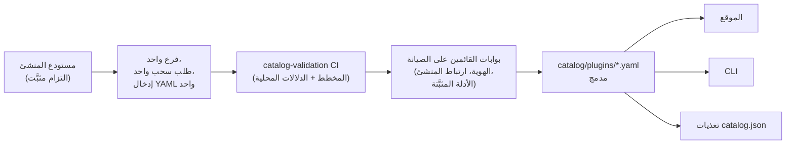

<div align="center">


# 🧩 Awesome Omni DSH Plugins

> **مشروع مجتمعي غير رسمي. غير مرتبط بـ DeepSeek ولا معتمَد منها ولا برعايتها.**
> أسماء وعلامات DeepSeek ملك لأصحابها المعنيين.

اكتشاف يمنح الأولوية للمنشئين وتثبيت بأمر واحد لإضافات **DeepSeek Harness (DSH)**.

<h2>
  🌐 <a href="https://dsh-plugins.omniroute.online"><strong>dsh-plugins.omniroute.online</strong></a> 🌐
</h2>
<h3>
  <a href="https://dsh-plugins.omniroute.online">تصفح وابحث وثبّت كل إضافة على الموقع →</a>
</h3>

[](https://dsh-plugins.omniroute.online)
[](https://www.npmjs.com/package/@diegosouza.pw/dsh-plugins)
[](https://github.com/diegosouzapw/awesome-omni-dsh-plugins/actions/workflows/validate-catalog.yml)
[](../../LICENSE)
[](https://dsh-plugins.omniroute.online)

<br/>

<b>🌐 بـ 43 لغة</b>
<br/><br/>
<a href="../../README.md"></a>
<a href="../pt-BR/README.md"></a>
<a href="../zh-CN/README.md"></a>
<a href="../zh-TW/README.md"></a>
<a href="../pt/README.md"></a>
<a href="../es/README.md"></a>
<a href="../fr/README.md"></a>
<a href="../it/README.md"></a>
<a href="../de/README.md"></a>
<a href="../nl/README.md"></a>
<a href="../ru/README.md"></a>
<a href="../uk-UA/README.md"></a>
<a href="../pl/README.md"></a>
<a href="../cs/README.md"></a>
<a href="../sk/README.md"></a>
<a href="../ro/README.md"></a>
<a href="../hu/README.md"></a>
<a href="../bg/README.md"></a>
<a href="../da/README.md"></a>
<a href="../fi/README.md"></a>
<a href="../no/README.md"></a>
<a href="../sv/README.md"></a>
<a href="../ja/README.md"></a>
<a href="../ko/README.md"></a>
<a href="../th/README.md"></a>
<a href="../vi/README.md"></a>
<a href="../id/README.md"></a>
<a href="../ms/README.md"></a>
<a href="../phi/README.md"></a>
<a href="../in/README.md"></a>
<a href="../hi/README.md"></a>
<a href="../gu/README.md"></a>
<a href="../mr/README.md"></a>
<a href="../ta/README.md"></a>
<a href="../te/README.md"></a>
<a href="../bn/README.md"></a>
<a href="../ur/README.md"></a>
<a href="../fa/README.md"></a>
<a href="README.md"></a>
<a href="../he/README.md"></a>
<a href="../tr/README.md"></a>
<a href="../az/README.md"></a>
<a href="../sw/README.md"></a>

</div>

---

## ⭐ أفضل 10 إضافات

مرتّبة حسب نجوم المستودع الدقيق — تُحتسب فقط النجوم التي حصل عليها مستودع الإضافة نفسه، وليس نجوم مشروع أصلي أبدًا ([معيار الترتيب](../../docs/RANKING.md)). كل اسم يرتبط بمستودع المنشئ، مثبَّتًا عند نفس الالتزام (commit) الذي تحقق منه الكتالوج.

| # | الإضافة | المنشئ | ★ | الفئة | ما الذي تفعله |
| --- | ------ | ------- | --- | -------- | ------------ |
| 1 | [dsh-visualize](https://github.com/Nagi-ovo/dsh-visualize) | [@Nagi-ovo](https://github.com/Nagi-ovo) | 180 | UI & dashboards | تصور مضمّن: يعرض النموذج مخططات ورسومًا بيانية تفاعلية داخل الجلسة |
| 2 | [dsh-pet-remielle](https://github.com/Gin-7/dsh-pet-remielle) | [@Gin-7](https://github.com/Gin-7) | 20 | Entertainment | حيوان أليف شفاف لسطح المكتب قابل للتوصيل السريع (Remielle، Zenless Zone Zero) لواجهة الويب الخاصة بـ DSH |
| 3 | [dsh-whale-musume](https://github.com/Sutera-Diffusus/dsh-whale-musume) | [@Sutera-Diffusus](https://github.com/Sutera-Diffusus) | 19 | Entertainment | شخصية حوت-فتاة متحركة Kanban Musume تتفاعل مع نشاط لوحة التحكم |
| 4 | [deepseek-harness-tui](https://github.com/gxinxing/deepseek-harness-tui) | [@gxinxing](https://github.com/gxinxing) | 7 | UI & dashboards | عميل دردشة طرفي بملء الشاشة بأسلوب curses لتشغيل جلسات dsh |
| 5 | [dsh-tui](https://github.com/turtle1999/turtle-ui) | [@turtle1999](https://github.com/turtle1999) | 7 | UI & dashboards | بوابة طرفية تفاعلية pi-tui: منتقي الجلسات، دردشة متدفقة، اختصارات لوحة المفاتيح |
| 6 | [dsh-tavily-workspace](https://github.com/moguiyu/dsh-tavily) | [@moguiyu](https://github.com/moguiyu) | 3 | Search & research | أداة بحث متقدمة اختيارية من Tavily مع إدارة مفاتيح متعددة ومقياس استخدام |
| 7 | [dsh-bili-widget](https://github.com/pyf2818/dsh-bili-widget) | [@pyf2818](https://github.com/pyf2818) | 2 | Entertainment | أداة فيديو bilibili عائمة: توصيات، الأكثر رواجًا، تصنيفات وبحث |
| 8 | [dsh-themes](https://github.com/MangMax/dsh-themes) | [@MangMax](https://github.com/MangMax) | 1 | Entertainment | إضافة مظهر: لوحات ألوان مدمجة، وضع فاتح/داكن/حسب النظام، سمات VS Code |
| 9 | [dsh-arknights](https://github.com/DocJlm/dsh-arknights) | [@DocJlm](https://github.com/DocJlm) | — | Entertainment | سمة غير تجارية لحديقة Arknights النجمية تضم Pramanix وEyjafjalla |
| 10 | [dsh-bridge-browser](https://github.com/Lum1104/dsh-browser) | [@Lum1104](https://github.com/Lum1104) | — | Browser automation | جسر WebSocket موثّق بالرمز المميز لامتداد المتصفح المرافق |

<div align="center">

### 👉 [**ابحث عن جميع الإضافات، اقرأ التفاصيل وانسخ أمر التثبيت من الموقع →**](https://dsh-plugins.omniroute.online) 👈

</div>

## نظرة سريعة

| الواجهة | ما هي | أين |
| ----------- | ---------------------------------------------------------------- | ------------------------------------------------------------------------ |
| **الموقع** | متصفح كتالوج مُصيَّر مع بحث وترتيب | [dsh-plugins.omniroute.online](https://dsh-plugins.omniroute.online) |
| **الكتالوج** | ملف YAML واحد لكل إضافة، المصدر الوحيد للحقيقة | [`catalog/plugins/`](../../catalog/plugins) |
| **المخطط (Schema)** | مخطط JSON عام (المسودة 2020-12) يُتحقق كل إدخال في مقابله | [`schemas/plugin.schema.yaml`](../../schemas/plugin.schema.yaml) |
| **CLI** | بحث وفحص والتحقق والتثبيت من الكتالوج | [`@diegosouza.pw/dsh-plugins`](https://www.npmjs.com/package/@diegosouza.pw/dsh-plugins) |
| **تغذيات آلية** | `catalog.json` + `catalog.snapshot.json` للأدوات | [catalog.json](https://dsh-plugins.omniroute.online/catalog.json) · [catalog.snapshot.json](https://dsh-plugins.omniroute.online/catalog.snapshot.json) |

هذا المستودع هو مصدر الحقيقة العام للكتالوج. كل إدراج هو ملف YAML واحد تحت `catalog/plugins/`، تم التحقق منه مقابل مخطط JSON منشور، وأُضيف عبر طلب سحب واحد رُوجع بشكل فردي، ويُنسب دائمًا إلى المنشئ الأصلي للإضافة. لا شيء في الكتالوج يُولَّد من كتالوج أو قائمة أخرى: كل إدخال يُعاد بناؤه من مستودع المنشئ الأصلي عند التزام (commit) مثبَّت.

يُصان الموقع وواجهة سطر الأوامر (CLI) من مصدر خاص؛ يحمل هذا المستودع بيانات الكتالوج العامة والمخطط والسياسات التي يستهلكانها.

## حالة الكتالوج

**تم دمج 10 إضافات.** تدخل كل إضافة عبر طلب سحب واحد رُوجع بشكل فردي، واحدة تلو الأخرى، من مستودع المنشئ الأصلي، مع التزام مصدر مثبَّت ونسب صريح.

## 🚀 تثبيت واجهة سطر الأوامر (CLI)

```bash
npx @diegosouza.pw/dsh-plugins --help
```

تُنشر الحزمة المحدودة النطاق باسم `@diegosouza.pw/dsh-plugins@0.1.0`، والأمر أعلاه هو الاستدعاء المعتمد اليوم؛ لا يُستضاف أي نص تثبيت هنا.

### استخدام CLI اليوم

يشحن الإصدار 0.1.0 أوامر اكتشاف وتحقق للقراءة فقط بالإضافة إلى أوامر تثبيت مشروطة بالموافقة. المرجع الكامل للأوامر، بما في ذلك الأعلام (flags) ورموز الخروج وبوابة الموافقة على تنفيذ الكود، موجود في [docs/CLI.md](../../docs/CLI.md).

| الأمر | ما الذي يفعله | هل يمسّ نظامك؟ |
| ------------------------------ | ------------------------------------------------------------------- | --------------------------------------- |
| `catalog validate --catalog .` | التحقق من YAML الكتالوج والمخطط والدلالات المحلية | لا — للقراءة فقط |
| `search <query...>` | بحث محلي في حقول الكتالوج العامة | لا — للقراءة فقط |
| `info <id>` | عرض إدخال واحد من الكتالوج العام | لا — للقراءة فقط |
| `list` | سرد التثبيتات المُدارة بالكتالوج دون تعديل الملفات الشخصية | لا — للقراءة فقط |
| `doctor` | تشخيصات للقراءة فقط لـ Node وDSH وسياسة Windows الأصلية والكتالوج | لا — للقراءة فقط |
| `add <id> --profile <name> --dry-run` | عرض خطة التثبيت المُتحقَّق منها دون ملفات أو عمليات فرعية | لا — تجربة جافة (dry-run) |
| `add <id> --profile <name> --allow-code-execution` | التثبيت عبر التفويض الرسمي لـ DSH | نعم — فقط مع علم الموافقة الصريحة |

```bash
# Validate the catalog in this repository (what CI runs):
npx @diegosouza.pw/dsh-plugins@0.1.0 catalog validate --catalog .

# Search and inspect locally, without installing anything:
npx @diegosouza.pw/dsh-plugins@0.1.0 search memory --catalog .
npx @diegosouza.pw/dsh-plugins@0.1.0 info <plugin-id> --catalog .

# Preview an install plan; nothing is written and no subprocess runs:
npx @diegosouza.pw/dsh-plugins@0.1.0 add <plugin-id> --profile default --dry-run
```

الأوامر المُغيِّرة (`add`، `update`، `remove`) لا تنفذ أبدًا كود دورة حياة الإضافة ما لم تمرر `--allow-code-execution`. على Windows الأصلي، هذه التعديلات معطّلة في الإصدار v0.1.0؛ استخدم WSL. تعمل أوامر القراءة فقط والتجربة الجافة (dry-run) في كل مكان.

## 🔍 كيف تدخل إضافة إلى الكتالوج



1. **إضافة واحدة، فرع واحد، طلب سحب واحد.** يضيف طلب السحب أو يغيّر بالضبط ملف YAML واحد تحت `catalog/plugins/`.
2. **أولوية للمنشئ.** طلب السحب الذي يفتحه منشئ الإضافة أو المنظمة المالكة له الأولوية دائمًا على تنسيق المجتمع أو الأتمتة لنفس الإضافة — انظر [docs/CREDIT.md](../../docs/CREDIT.md).
3. **دليل من المصدر الأصلي.** يُعاد بناء كل حقل من مستودع المنشئ عند التزام مثبَّت من 40 حرفًا: الوصف، الترخيص، تكامل DSH، واصف التثبيت، النجوم.
4. **تحقق محلي.** يفحص `catalog validate` البنية والدلالات المحلية؛ وهو نفس الفحص الذي تشغّله وظيفة CI الخاصة بـ `catalog-validation` على طلب السحب.
5. **بوابات القائمين على الصيانة.** قبل الدمج، يتحقق القائمون على الصيانة بشكل منفصل من هوية المستودع وارتباط المنشئ والأدلة المثبَّتة. التحقق المحلي الناجح ضروري، لكنه ليس كافيًا أبدًا.

العقد الكامل — الأدلة المطلوبة، وقواعد YAML، وسياسة النجوم، ومعالجة التعارضات، وبوابات المراجعة — موجود في [CONTRIBUTING.md](../../CONTRIBUTING.md). كيفية اتخاذ القرارات ومن يتخذها موضح في [docs/GOVERNANCE.md](../../docs/GOVERNANCE.md).

## 📄 تشريح إدخال

كل إدخال هو ملف YAML واحد سُمّي وفق معرّفه (ID). المثال أدناه يتحقق مقابل المخطط الحالي (مرجع حقل بحقل في [docs/SCHEMA.md](../../docs/SCHEMA.md)):

```yaml
schemaVersion: 1
id: example-notes-search
name: Example Notes Search
description:
  en: >-
    Searches a local Markdown notes folder from DSH sessions and returns
    matching snippets with file paths.
  evidencePath: README.md
unofficial: true
kind: plugin
primaryCategory: search-research
tags:
  - search
  - notes
  - cli
source:
  repository: https://github.com/example-creator/example-notes-search
  repositoryNodeId: R_kgDOExample01
  subpath: null
  commit: 0123456789abcdef0123456789abcdef01234567
creator:
  github: example-creator
package:
  ecosystem: npm
  name: example-notes-search
  version: 1.4.2
dsh:
  profiles:
    - default
  evidencePath: dsh-plugin.json
repositoryScope: dedicated
popularity:
  starsPolicy: exact-repository
  stars: 128
license:
  spdx: MIT
verification:
  status: eligible
  checkedAt: "2026-08-18T12:00:00Z"
  repositoryIdentity: resolved
  smokeTest: null
provenance:
  discussion: null
  comment: null
```

الثوابت الأساسية التي يفرضها المخطط:

- `unofficial: true` و`schemaVersion: 1` ثابتان.
- يجب أن تستخدم إضافة المستودع الأحادي (monorepo) القيمة `stars: null` — لا تُورَّث نجوم المشروع الأصلي أبدًا.
- واصف التثبيت إما حزمة npm بإصدار دقيق أو المصدر المثبَّت نفسه؛ إنه بيانات، وليس أمر شل أبدًا.
- تتطلب حالة `verified` دليل اختبار دخان (smoke test) قابل للمراجعة؛ وإلا يكون الإدخال `eligible` مع `smokeTest: null`.

## 🗂 ما الذي ينتمي إلى هنا

يفهرس هذا المستودع التكاملات المنشورة بشكل مستقل لـ DeepSeek Harness (DSH)، بما في ذلك الإضافات الأصلية وعائلات الإضافات والسمات والمهارات والعملاء والجسور. أنواع المصنوعات (artifacts) وفئات القدرات ووسوم الواجهة معرّفة في [docs/CATEGORIES.md](../../docs/CATEGORIES.md).

كل سجل عام هو ملف YAML واحد تحت `catalog/plugins/` ويجب أن يتحقق مقابل `schemas/plugin.schema.yaml`. الإدراج يعني إتمام فحوصات الأهلية أو التحقق الموثّقة؛ إنه ليس شهادة أمنية ولا تأييدًا من DeepSeek.

## 🏅 الترتيب والتحقق

يمكن فقط لمستودعات الإضافات المخصصة أو الأصلية أو المؤهلة أو المتحقق منها التي تنتمي نجومها إلى ذلك المستودع بالضبط أن تدخل ترتيب النجوم. التكاملات المخزنة داخل مستودعات أحادية (monorepos) أوسع تبقى قابلة للاكتشاف لكنها تستخدم `stars: null` ولا ترث أبدًا نجوم المشروع الأصلي. انظر [docs/RANKING.md](../../docs/RANKING.md) للمعيار الكامل.

تميّز حالات التحقق العامة الأهلية البنيوية عن اختبار دخان التثبيت (smoke test). لا تمثل أي حالة أمانًا مطلقًا. راجع مستودع الإضافة، والالتزام المثبَّت، والترخيص، وسلوك التثبيت قبل استخدامها.

## 🤝 ساهم أو طالب بإدخال

اقرأ [CONTRIBUTING.md](../../CONTRIBUTING.md) قبل فتح طلب سحب. يجب أن يضيف طلب السحب أو يغيّر إدخال إضافة واحد بالضبط وأن يستشهد بمستودع المنشئ الأصلي وليس بكتالوج آخر. طلبات السحب التي كتبها المنشئ لها الأولوية على طلبات سحب الكتالوج الآلية.

تتوفر نماذج مشكلات (issue) منظمة لمطالبات المنشئين والتصحيحات والإزالات. لا ترسل أبدًا بيانات اعتماد أو تفاصيل اتصال خاصة أو أسرار أخرى.

## 👩‍🎨 منشئو الإضافات

يوجد الكتالوج لأن هؤلاء المنشئين أطلقوا إضافات. كل إدخال ينسب الفضل لمنشئه ويرتبط دائمًا بمستودعه.

<a href="https://github.com/Nagi-ovo" title="@Nagi-ovo — dsh-visualize"></a>
<a href="https://github.com/Gin-7" title="@Gin-7 — dsh-pet-remielle"></a>
<a href="https://github.com/Sutera-Diffusus" title="@Sutera-Diffusus — dsh-whale-musume"></a>
<a href="https://github.com/gxinxing" title="@gxinxing — deepseek-harness-tui"></a>
<a href="https://github.com/turtle1999" title="@turtle1999 — dsh-tui"></a>
<a href="https://github.com/moguiyu" title="@moguiyu — dsh-tavily-workspace"></a>
<a href="https://github.com/pyf2818" title="@pyf2818 — dsh-bili-widget"></a>
<a href="https://github.com/MangMax" title="@MangMax — dsh-themes"></a>
<a href="https://github.com/DocJlm" title="@DocJlm — dsh-arknights"></a>
<a href="https://github.com/Lum1104" title="@Lum1104 — dsh-bridge-browser"></a>

تريد إضافتك هنا مع نسب كامل؟ [افتح طلب سحب واحدًا بإدخال YAML واحد](../../CONTRIBUTING.md) — أو [طالب بإدخال موجود](https://github.com/diegosouzapw/awesome-omni-dsh-plugins/issues/new/choose) إذا فهرس شخص ما عملك قبلك.

## 📚 التوثيق

| المستند | ما الذي يغطيه |
| --------------------------------------------- | ---------------------------------------------------------------------- |
| [CONTRIBUTING.md](../../CONTRIBUTING.md) | عقد المساهمة الكامل: الأدلة، قواعد YAML، بوابات المراجعة |
| [SECURITY.md](../../SECURITY.md) | الإبلاغ عن ثغرات الإضافات أو الكتالوج؛ سياسة الأسرار |
| [docs/SCHEMA.md](../../docs/SCHEMA.md) | مرجع حقل بحقل لـ `schemas/plugin.schema.yaml` |
| [docs/CLI.md](../../docs/CLI.md) | مرجع أوامر CLI لـ `@diegosouza.pw/dsh-plugins@0.1.0` |
| [docs/GOVERNANCE.md](../../docs/GOVERNANCE.md) | كيفية حوكمة الكتالوج: الأولوية، البوابات، المطالبات والإزالات |
| [docs/CATEGORIES.md](../../docs/CATEGORIES.md) | أنواع المصنوعات، فئات القدرات الأساسية، الوسوم، نطاق المستودع |
| [docs/CREDIT.md](../../docs/CREDIT.md) | نسب المنشئ، أولوية طلبات السحب وسياسة هوية Git |
| [docs/RANKING.md](../../docs/RANKING.md) | معيار الترتيب العام وحالات التحقق |
| [docs/UNOFFICIAL.md](../../docs/UNOFFICIAL.md) | الوضع غير الرسمي وموقف العلامة التجارية |

## 🌐 الترجمات

تتوفر ملفات README هذه بـ 43 لغة تحت [`docs/i18n/`](..) — استخدم منتقي الأعلام في الأعلى. الإنجليزية هي مصدر الحقيقة؛ عندما تختلف ترجمة عن النص الإنجليزي، يسود النص الإنجليزي. التصحيحات لأي ترجمة مرحّب بها عبر طلبات السحب العادية.

## 📜 الترخيص والنسب

التوثيق وقوالب المستودع مرخّصة تحت [رخصة MIT](../../LICENSE). حقائق الكتالوج الأصلية والبيانات الوصفية التحريرية لـ YAML مُهداة تحت [CC0-1.0](../../LICENSE-CATALOG). يبقى الكود المنبع (upstream) والأسماء والشعارات ولقطات الشاشة تحت مالكيها وتراخيصها الأصلية. انظر [docs/CREDIT.md](../../docs/CREDIT.md) و[docs/UNOFFICIAL.md](../../docs/UNOFFICIAL.md).

<div align="center">

### ⭐ إذا ساعدك هذا الكتالوج في إيجاد إضافة، ضع نجمة على المستودع — هذا يساعد المنشئين على أن يُكتشَفوا.

**[تصفّح جميع الإضافات على الموقع →](https://dsh-plugins.omniroute.online)**

</div>
