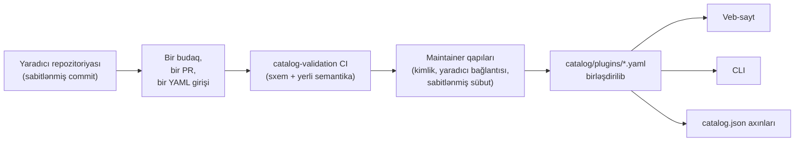

<div align="center">


# 🧩 Awesome Omni DSH Plugins

> **Qeyri-rəsmi icma layihəsi. DeepSeek ilə əlaqəli deyil, onun tərəfindən təsdiqlənmir və ya maliyyələşdirilmir.**
> DeepSeek adları və nişanları müvafiq sahiblərinə məxsusdur.

**DeepSeek Harness (DSH)** plaginləri üçün yaradıcı-öncəlikli kəşf və bir əmrlə quraşdırma.

<h2>
  🌐 <a href="https://dsh-plugins.omniroute.online"><strong>dsh-plugins.omniroute.online</strong></a> 🌐
</h2>
<h3>
  <a href="https://dsh-plugins.omniroute.online">Veb-saytda bütün plaginlərə baxın, axtarın və quraşdırın →</a>
</h3>

[](https://dsh-plugins.omniroute.online)
[](https://www.npmjs.com/package/@diegosouza.pw/dsh-plugins)
[](https://github.com/diegosouzapw/awesome-omni-dsh-plugins/actions/workflows/validate-catalog.yml)
[](../../LICENSE)
[](https://dsh-plugins.omniroute.online)

<br/>

<b>🌐 43 dildə</b>
<br/><br/>
<a href="../../README.md"></a>
<a href="../pt-BR/README.md"></a>
<a href="../zh-CN/README.md"></a>
<a href="../zh-TW/README.md"></a>
<a href="../pt/README.md"></a>
<a href="../es/README.md"></a>
<a href="../fr/README.md"></a>
<a href="../it/README.md"></a>
<a href="../de/README.md"></a>
<a href="../nl/README.md"></a>
<a href="../ru/README.md"></a>
<a href="../uk-UA/README.md"></a>
<a href="../pl/README.md"></a>
<a href="../cs/README.md"></a>
<a href="../sk/README.md"></a>
<a href="../ro/README.md"></a>
<a href="../hu/README.md"></a>
<a href="../bg/README.md"></a>
<a href="../da/README.md"></a>
<a href="../fi/README.md"></a>
<a href="../no/README.md"></a>
<a href="../sv/README.md"></a>
<a href="../ja/README.md"></a>
<a href="../ko/README.md"></a>
<a href="../th/README.md"></a>
<a href="../vi/README.md"></a>
<a href="../id/README.md"></a>
<a href="../ms/README.md"></a>
<a href="../phi/README.md"></a>
<a href="../in/README.md"></a>
<a href="../hi/README.md"></a>
<a href="../gu/README.md"></a>
<a href="../mr/README.md"></a>
<a href="../ta/README.md"></a>
<a href="../te/README.md"></a>
<a href="../bn/README.md"></a>
<a href="../ur/README.md"></a>
<a href="../fa/README.md"></a>
<a href="../ar/README.md"></a>
<a href="../he/README.md"></a>
<a href="../tr/README.md"></a>
<a href="README.md"></a>
<a href="../sw/README.md"></a>

</div>

---

## ⭐ İlk 10 plagin

Dəqiq repozitoriya ulduzlarına görə sıralanıb — yalnız plaginin öz repozitoriyasının qazandığı
ulduzlar sayılır, heç vaxt valideyn layihənin ulduzları ([sıralama predikatı](../../docs/RANKING.md)).
Hər ad yaradıcının repozitoriyasına keçid verir, kataloqun doğruladığı dəqiq commit-də sabitlənib.

| #   | Plagin | Yaradıcı | ★ | Kateqoriya | Nə edir |
| --- | ------ | ------- | --- | -------- | ------------ |
| 1 | [dsh-visualize](https://github.com/Nagi-ovo/dsh-visualize) | [@Nagi-ovo](https://github.com/Nagi-ovo) | 180 | UI & dashboards | Daxili vizuallaşdırma: model sessiya daxilində interaktiv qrafiklər və diaqramlar göstərir |
| 2 | [dsh-pet-remielle](https://github.com/Gin-7/dsh-pet-remielle) | [@Gin-7](https://github.com/Gin-7) | 20 | Entertainment | DSH veb interfeysi üçün isti-qoşulan şəffaf masaüstü ev heyvanı (Remielle, Zenless Zone Zero) |
| 3 | [dsh-whale-musume](https://github.com/Sutera-Diffusus/dsh-whale-musume) | [@Sutera-Diffusus](https://github.com/Sutera-Diffusus) | 19 | Entertainment | Panel fəallığına reaksiya verən animasiyalı balina-qız Kanban Musume maskotu |
| 4 | [deepseek-harness-tui](https://github.com/gxinxing/deepseek-harness-tui) | [@gxinxing](https://github.com/gxinxing) | 7 | UI & dashboards | dsh sessiyalarını idarə etmək üçün curses üslubunda tam ekran terminal söhbət klienti |
| 5 | [dsh-tui](https://github.com/turtle1999/turtle-ui) | [@turtle1999](https://github.com/turtle1999) | 7 | UI & dashboards | İnteraktiv pi-tui terminal giriş qapısı: sessiya seçici, axın söhbəti, klaviatura qısayolları |
| 6 | [dsh-tavily-workspace](https://github.com/moguiyu/dsh-tavily) | [@moguiyu](https://github.com/moguiyu) | 3 | Search & research | Çoxlu açar idarəetməsi və istifadə göstəricisi olan istəyə bağlı Tavily qabaqcıl axtarış aləti |
| 7 | [dsh-bili-widget](https://github.com/pyf2818/dsh-bili-widget) | [@pyf2818](https://github.com/pyf2818) | 2 | Entertainment | Üzən bilibili video vidjeti: tövsiyələr, trendlər, reytinqlər və axtarış |
| 8 | [dsh-themes](https://github.com/MangMax/dsh-themes) | [@MangMax](https://github.com/MangMax) | 1 | Entertainment | Görünüş plagini: daxili palitralar, açıq/tünd/sistem rejimi, VS Code temaları |
| 9 | [dsh-arknights](https://github.com/DocJlm/dsh-arknights) | [@DocJlm](https://github.com/DocJlm) | — | Entertainment | Pramanix və Eyjafjalla ilə qeyri-kommersiya Arknights astral-garden dərisi |
| 10 | [dsh-bridge-browser](https://github.com/Lum1104/dsh-browser) | [@Lum1104](https://github.com/Lum1104) | — | Browser automation | Müşayiət edən brauzer əlavəsi üçün token ilə doğrulanmış WebSocket körpüsü |

<div align="center">

### 👉 [**Bütün plaginləri axtarın, təfərrüatları oxuyun və quraşdırma əmrini veb-saytdan kopyalayın →**](https://dsh-plugins.omniroute.online) 👈

</div>

## Bir baxışda

| Səth     | Nədir                                                       | Harada                                                                    |
| ----------- | ---------------------------------------------------------------- | ------------------------------------------------------------------------ |
| **Veb-sayt** | Axtarış və sıralama ilə göstərilən kataloq brauzeri                 | [dsh-plugins.omniroute.online](https://dsh-plugins.omniroute.online)     |
| **Kataloq** | Plagin başına bir YAML faylı, yeganə həqiqət mənbəyi             | [`catalog/plugins/`](../../catalog/plugins)                                    |
| **Sxem**  | Hər girişin doğrulandığı ictimai JSON Sxemi (draft 2020-12) | [`schemas/plugin.schema.yaml`](../../schemas/plugin.schema.yaml)               |
| **CLI**     | Kataloqdan axtarış, yoxlama, doğrulama və quraşdırma           | [`@diegosouza.pw/dsh-plugins`](https://www.npmjs.com/package/@diegosouza.pw/dsh-plugins) |
| **Maşın axınları** | Alətlər üçün `catalog.json` + `catalog.snapshot.json`           | [catalog.json](https://dsh-plugins.omniroute.online/catalog.json) · [catalog.snapshot.json](https://dsh-plugins.omniroute.online/catalog.snapshot.json) |

Bu repozitoriya kataloqun ictimai həqiqət mənbəyidir. Hər giriş `catalog/plugins/` altında bir
YAML faylıdır, dərc edilmiş JSON Sxeminə qarşı doğrulanır, ayrıca nəzərdən keçirilmiş bir pull
request vasitəsilə əlavə olunur və həmişə plaginin orijinal yaradıcısına kredit verilir. Kataloqda
heç nə başqa kataloqdan və ya siyahıdan yaradılmır: hər giriş orijinal yaradıcının repozitoriyasından
sabitlənmiş commit əsasında yenidən qurulur.

Veb-sayt və CLI xüsusi mənbədən idarə olunur; bu repozitoriya onların istifadə etdiyi ictimai
kataloq məlumatlarını, sxemi və siyasətləri daşıyır.

## Kataloq statusu

**10 plagin birləşdirilib.** Hər plagin bir sabitlənmiş mənbə commit-i və açıq kreditlə, orijinal
yaradıcının repozitoriyasından, bir dəfəyə bir olmaqla, ayrıca nəzərdən keçirilmiş pull request
vasitəsilə daxil olur.

## 🚀 CLI-ni quraşdırın

```bash
npx @diegosouza.pw/dsh-plugins --help
```

Əhatəli paket `@diegosouza.pw/dsh-plugins@0.1.0` kimi dərc edilib və yuxarıdakı əmr bu gün üçün
kanonik çağırışdır; burada heç bir quraşdırma skripti yerləşdirilmir.

### CLI-ni bu gün istifadə edin

Versiya 0.1.0 yalnız-oxumaq üçün kəşf və doğrulama əmrləri, eləcə də razılıq ilə qapılanan
quraşdırma əmrləri təqdim edir. Bayraqlar, çıxış kodları və kod icrası razılıq qapısı daxil olmaqla
tam əmr istinadı [docs/CLI.md](../../docs/CLI.md) sənədindədir.

| Əmr                        | Nə edir                                                        | Sisteminizə toxunurmu?                    |
| ------------------------------ | ------------------------------------------------------------------- | --------------------------------------- |
| `catalog validate --catalog .` | Kataloq YAML-ını, sxemini və yerli semantikanı doğrulayır                   | Xeyr — yalnız oxumaq üçün                          |
| `search <query...>`            | İctimai kataloq sahələrini yerli olaraq axtarır                                | Xeyr — yalnız oxumaq üçün                          |
| `info <id>`                    | Bir ictimai kataloq girişini göstərir                                       | Xeyr — yalnız oxumaq üçün                          |
| `list`                         | Profilləri dəyişmədən kataloq tərəfindən idarə olunan quraşdırmaları sadalayır            | Xeyr — yalnız oxumaq üçün                          |
| `doctor`                       | Node, DSH, yerli Windows siyasəti və kataloq üçün yalnız-oxumaq diaqnostikası  | Xeyr — yalnız oxumaq üçün                          |
| `add <id> --profile <name> --dry-run` | Fayllar və ya alt-proseslər olmadan doğrulanmış quraşdırma planını göstərir | Xeyr — sınaq icrası                            |
| `add <id> --profile <name> --allow-code-execution` | Rəsmi DSH nümayəndəliyi vasitəsilə quraşdırır        | Bəli — yalnız açıq razılıq bayrağı ilə   |

```bash
# Validate the catalog in this repository (what CI runs):
npx @diegosouza.pw/dsh-plugins@0.1.0 catalog validate --catalog .

# Search and inspect locally, without installing anything:
npx @diegosouza.pw/dsh-plugins@0.1.0 search memory --catalog .
npx @diegosouza.pw/dsh-plugins@0.1.0 info <plugin-id> --catalog .

# Preview an install plan; nothing is written and no subprocess runs:
npx @diegosouza.pw/dsh-plugins@0.1.0 add <plugin-id> --profile default --dry-run
```

Dəyişiklik edən əmrlər (`add`, `update`, `remove`) siz `--allow-code-execution` bayrağını
verməyincə heç vaxt plagin yaşam dövrü kodunu icra etmir. Yerli Windows-da bu dəyişikliklər
v0.1.0-da deaktivdir; WSL istifadə edin. Yalnız-oxumaq və sınaq icrası əmrləri hər yerdə işləyir.

## 🔍 Plagin kataloqa necə daxil olur



1. **Bir plagin, bir budaq, bir pull request.** PR `catalog/plugins/` altında dəqiq bir YAML
   faylını əlavə edir və ya dəyişir.
2. **Yaradıcı-öncəlikli.** Plaginin yaradıcısı və ya sahib təşkilat tərəfindən açılan PR eyni
   plagin üçün icma kurasiyasından və ya avtomatlaşdırmadan həmişə üstündür — bax
   [docs/CREDIT.md](../../docs/CREDIT.md).
3. **Orijinal mənbədən sübut.** Hər sahə yaradıcının repozitoriyasından sabitlənmiş 40 simvollu
   commit əsasında yenidən qurulur: təsvir, lisenziya, DSH inteqrasiyası, quraşdırma
   təsviredicisi, ulduzlar.
4. **Yerli doğrulama.** `catalog validate` strukturu və yerli semantikanı yoxlayır; bu, PR üzərində
   işləyən `catalog-validation` CI vəzifəsinin etdiyi eyni yoxlamadır.
5. **Maintainer qapıları.** Birləşdirilmədən əvvəl maintainer-lər repozitoriya kimliyini, yaradıcı
   bağlantısını və sabitlənmiş sübutu ayrıca doğrulayır. Yaşıl yerli doğrulama zəruridir, amma
   heç vaxt kifayət deyil.

Tam müqavilə — tələb olunan sübut, YAML qaydaları, ulduz siyasəti, toqquşma emalı və nəzərdən
keçirmə qapıları — [CONTRIBUTING.md](../../CONTRIBUTING.md) sənədindədir. Qərarların necə və kim
tərəfindən verildiyi [docs/GOVERNANCE.md](../../docs/GOVERNANCE.md) sənədindədir.

## 📄 Bir girişin anatomiyası

Hər giriş ID-si adına uyğun adlandırılmış bir YAML faylıdır. Aşağıdakı nümunə cari sxemə qarşı
doğrulanır (sahə-sahə istinad [docs/SCHEMA.md](../../docs/SCHEMA.md) sənədindədir):

```yaml
schemaVersion: 1
id: example-notes-search
name: Example Notes Search
description:
  en: >-
    Searches a local Markdown notes folder from DSH sessions and returns
    matching snippets with file paths.
  evidencePath: README.md
unofficial: true
kind: plugin
primaryCategory: search-research
tags:
  - search
  - notes
  - cli
source:
  repository: https://github.com/example-creator/example-notes-search
  repositoryNodeId: R_kgDOExample01
  subpath: null
  commit: 0123456789abcdef0123456789abcdef01234567
creator:
  github: example-creator
package:
  ecosystem: npm
  name: example-notes-search
  version: 1.4.2
dsh:
  profiles:
    - default
  evidencePath: dsh-plugin.json
repositoryScope: dedicated
popularity:
  starsPolicy: exact-repository
  stars: 128
license:
  spdx: MIT
verification:
  status: eligible
  checkedAt: "2026-08-18T12:00:00Z"
  repositoryIdentity: resolved
  smokeTest: null
provenance:
  discussion: null
  comment: null
```

Sxem tərəfindən tətbiq edilən əsas invariantlar:

- `unofficial: true` və `schemaVersion: 1` sabitdir.
- Monorepo plagini `stars: null` istifadə etməlidir — valideyn layihənin ulduzları heç vaxt
  miras alınmır.
- Quraşdırma təsviredicisi ya dəqiq versiyalı npm paketi, ya da sabitlənmiş mənbənin özüdür;
  bu məlumatdır, heç vaxt shell əmri deyil.
- `verified` statusu nəzərdən keçirilə bilən smoke-test sübutu tələb edir; əks halda giriş
  `smokeTest: null` ilə `eligible`dir.

## 🗂 Burada nə var

Bu repozitoriya DeepSeek Harness (DSH) üçün müstəqil dərc edilmiş inteqrasiyaları kataloqlaşdırır,
o cümlədən native plaginlər, plagin ailələri, temalar, bacarıqlar, klientlər və körpülər.
Artefakt növləri, imkan kateqoriyaları və interfeys teqləri
[docs/CATEGORIES.md](../../docs/CATEGORIES.md) sənədində müəyyən edilib.

Hər ictimai qeyd `catalog/plugins/` altında bir YAML faylıdır və `schemas/plugin.schema.yaml`
sxeminə qarşı doğrulanmalıdır. Siyahıda olmaq sənədləşdirilmiş uyğunluq və ya doğrulama
yoxlamalarının tamamlandığını bildirir; bu, təhlükəsizlik sertifikatı və ya DeepSeek təsdiqi
deyil.

## 🏅 Sıralama və doğrulama

Yalnız ulduzları məhz həmin repozitoriyaya məxsus olan xüsusi, native, uyğun və ya doğrulanmış
plagin repozitoriyaları ulduz sıralamasına daxil ola bilər. Daha geniş monorepolarda saxlanan
inteqrasiyalar aşkarlana bilən qalır, lakin `stars: null` istifadə edir və heç vaxt valideyn
layihənin ulduzlarını miras almır. Tam predikat üçün [docs/RANKING.md](../../docs/RANKING.md)
sənədinə baxın.

İctimai doğrulama vəziyyətləri struktur uyğunluğunu quraşdırma smoke testindən ayırır. Heç bir
vəziyyət mütləq təhlükəsizliyi təmsil etmir. İstifadə etməzdən əvvəl plaginin repozitoriyasını,
sabitlənmiş commit-ini, lisenziyasını və quraşdırma davranışını nəzərdən keçirin.

## 🤝 Töhfə verin və ya girişə iddia edin

Pull request açmazdan əvvəl [CONTRIBUTING.md](../../CONTRIBUTING.md) sənədini oxuyun. Pull request
dəqiq bir plagin girişini əlavə etməli və ya dəyişməli, başqa kataloq deyil, orijinal yaradıcının
repozitoriyasına istinad etməlidir. Yaradıcı tərəfindən yazılmış pull request-lər avtomatlaşdırılmış
kataloq pull request-lərindən üstündür.

Yaradıcı iddiaları, düzəlişlər və silinmələr üçün strukturlaşdırılmış issue formaları mövcuddur.
Heç vaxt kimlik məlumatları, şəxsi əlaqə detalları və ya digər sirlər göndərməyin.

## 👩‍🎨 Plagin yaradıcıları

Kataloq mövcuddur, çünki bu yaradıcılar plaginlər yaratdı. Hər giriş öz yaradıcısına kredit verir
və onun repozitoriyasına keçid edir — həmişə.

<a href="https://github.com/Nagi-ovo" title="@Nagi-ovo — dsh-visualize"></a>
<a href="https://github.com/Gin-7" title="@Gin-7 — dsh-pet-remielle"></a>
<a href="https://github.com/Sutera-Diffusus" title="@Sutera-Diffusus — dsh-whale-musume"></a>
<a href="https://github.com/gxinxing" title="@gxinxing — deepseek-harness-tui"></a>
<a href="https://github.com/turtle1999" title="@turtle1999 — dsh-tui"></a>
<a href="https://github.com/moguiyu" title="@moguiyu — dsh-tavily-workspace"></a>
<a href="https://github.com/pyf2818" title="@pyf2818 — dsh-bili-widget"></a>
<a href="https://github.com/MangMax" title="@MangMax — dsh-themes"></a>
<a href="https://github.com/DocJlm" title="@DocJlm — dsh-arknights"></a>
<a href="https://github.com/Lum1104" title="@Lum1104 — dsh-bridge-browser"></a>

Plaginizin burada tam kreditlə görünməsini istəyirsiniz?
[Bir YAML girişi olan bir PR açın](../../CONTRIBUTING.md) — və ya
[mövcud girişə iddia edin](https://github.com/diegosouzapw/awesome-omni-dsh-plugins/issues/new/choose),
əgər kimsə işinizi sizdən əvvəl kataloqlaşdırıbsa.

## 📚 Sənədləşmə

| Sənəd                                     | Nəyi əhatə edir                                                       |
| -------------------------------------------- | -------------------------------------------------------------------- |
| [CONTRIBUTING.md](../../CONTRIBUTING.md)           | Tam töhfə müqaviləsi: sübut, YAML qaydaları, nəzərdən keçirmə qapıları    |
| [SECURITY.md](../../SECURITY.md)                   | Plagin və ya kataloq zəifliklərinin bildirilməsi; sirlər siyasəti           |
| [docs/SCHEMA.md](../../docs/SCHEMA.md)             | `schemas/plugin.schema.yaml` üçün sahə-sahə istinad             |
| [docs/CLI.md](../../docs/CLI.md)                   | `@diegosouza.pw/dsh-plugins@0.1.0` üçün CLI əmr istinadı          |
| [docs/GOVERNANCE.md](../../docs/GOVERNANCE.md)     | Kataloqun necə idarə edildiyi: üstünlük, qapılar, iddialar və silinmələr   |
| [docs/CATEGORIES.md](../../docs/CATEGORIES.md)     | Artefakt növləri, əsas imkan kateqoriyaları, teqlər, repozitoriya əhatəsi |
| [docs/CREDIT.md](../../docs/CREDIT.md)             | Yaradıcı krediti, PR üstünlüyü və Git kimlik siyasəti                 |
| [docs/RANKING.md](../../docs/RANKING.md)           | İctimai sıralama predikatı və doğrulama vəziyyətləri                  |
| [docs/UNOFFICIAL.md](../../docs/UNOFFICIAL.md)     | Qeyri-rəsmi status və ticarət nişanı mövqeyi                               |

## 🌐 Tərcümələr

Bu README [`docs/i18n/`](..) altında 43 dildə mövcuddur — yuxarıdakı bayraq seçicidən istifadə
edin. İngilis dili həqiqət mənbəyidir; tərcümə ilə ingilis mətni fərqləndikdə, ingilis mətni
üstündür. İstənilən tərcümədəki düzəlişlər adi pull request-lər vasitəsilə xoş qarşılanır.

## 📜 Lisenziya və kredit

Sənədləşmə və repozitoriya şablonları [MIT Lisenziyası](../../LICENSE) altında lisenziyalaşdırılıb.
Orijinal kataloq faktları və redaktə YAML metadataları [CC0-1.0](../../LICENSE-CATALOG) altında
ictimai sahəyə həsr edilib. Yuxarı axın kodu, adları, loqoları və ekran görüntüləri öz orijinal
sahibləri və lisenziyaları altında qalır. Bax [docs/CREDIT.md](../../docs/CREDIT.md) və
[docs/UNOFFICIAL.md](../../docs/UNOFFICIAL.md).

<div align="center">

### ⭐ Bu kataloq plagin tapmağınıza kömək etdisə, repozitoriyaya ulduz verin — bu, yaradıcıların tapılmasına kömək edir.

**[Veb-saytda bütün plaginlərə baxın →](https://dsh-plugins.omniroute.online)**

</div>
