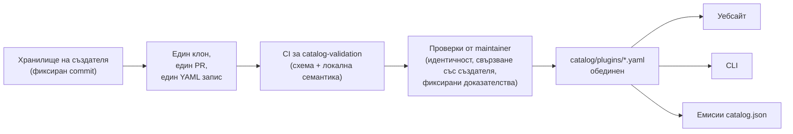

<div align="center">


# 🧩 Awesome Omni DSH Plugins

> **Неофициален проект на общността. Не е свързан с, одобрен от или спонсориран от DeepSeek.**
> Имената и марките на DeepSeek принадлежат на съответния им собственик.

Откриване с приоритет на създателите и инсталиране с една команда за плъгини за **DeepSeek Harness (DSH)**.

<h2>
  🌐 <a href="https://dsh-plugins.omniroute.online"><strong>dsh-plugins.omniroute.online</strong></a> 🌐
</h2>
<h3>
  <a href="https://dsh-plugins.omniroute.online">Разглеждайте, търсете и инсталирайте всеки плъгин на уебсайта →</a>
</h3>

[](https://dsh-plugins.omniroute.online)
[](https://www.npmjs.com/package/@diegosouza.pw/dsh-plugins)
[](https://github.com/diegosouzapw/awesome-omni-dsh-plugins/actions/workflows/validate-catalog.yml)
[](../../LICENSE)
[](https://dsh-plugins.omniroute.online)

<br/>

<b>🌐 На 43 езика</b>
<br/><br/>
<a href="../../README.md"></a>
<a href="../pt-BR/README.md"></a>
<a href="../zh-CN/README.md"></a>
<a href="../zh-TW/README.md"></a>
<a href="../pt/README.md"></a>
<a href="../es/README.md"></a>
<a href="../fr/README.md"></a>
<a href="../it/README.md"></a>
<a href="../de/README.md"></a>
<a href="../nl/README.md"></a>
<a href="../ru/README.md"></a>
<a href="../uk-UA/README.md"></a>
<a href="../pl/README.md"></a>
<a href="../cs/README.md"></a>
<a href="../sk/README.md"></a>
<a href="../ro/README.md"></a>
<a href="../hu/README.md"></a>
<a href="README.md"></a>
<a href="../da/README.md"></a>
<a href="../fi/README.md"></a>
<a href="../no/README.md"></a>
<a href="../sv/README.md"></a>
<a href="../ja/README.md"></a>
<a href="../ko/README.md"></a>
<a href="../th/README.md"></a>
<a href="../vi/README.md"></a>
<a href="../id/README.md"></a>
<a href="../ms/README.md"></a>
<a href="../phi/README.md"></a>
<a href="../in/README.md"></a>
<a href="../hi/README.md"></a>
<a href="../gu/README.md"></a>
<a href="../mr/README.md"></a>
<a href="../ta/README.md"></a>
<a href="../te/README.md"></a>
<a href="../bn/README.md"></a>
<a href="../ur/README.md"></a>
<a href="../fa/README.md"></a>
<a href="../ar/README.md"></a>
<a href="../he/README.md"></a>
<a href="../tr/README.md"></a>
<a href="../az/README.md"></a>
<a href="../sw/README.md"></a>

</div>

---

## ⭐ Топ 10 плъгини

Класирани по звезди на точното хранилище — броят се само звездите, спечелени от собственото
хранилище на плъгина, никога тези на родителски проект ([предикат за класиране](../../docs/RANKING.md)).
Всяко име води към хранилището на създателя, фиксирано на точния commit, който каталогът е валидирал.

| #   | Плъгин | Създател | ★ | Категория | Какво прави |
| --- | ------ | ------- | --- | -------- | ------------ |
| 1 | [dsh-visualize](https://github.com/Nagi-ovo/dsh-visualize) | [@Nagi-ovo](https://github.com/Nagi-ovo) | 180 | UI & dashboards | Вградена визуализация: моделът изобразява интерактивни графики и диаграми директно в сесията |
| 2 | [dsh-pet-remielle](https://github.com/Gin-7/dsh-pet-remielle) | [@Gin-7](https://github.com/Gin-7) | 20 | Entertainment | Прозрачен настолен домашен любимец с горещо включване (Remielle, Zenless Zone Zero) за уеб интерфейса на DSH |
| 3 | [dsh-whale-musume](https://github.com/Sutera-Diffusus/dsh-whale-musume) | [@Sutera-Diffusus](https://github.com/Sutera-Diffusus) | 19 | Entertainment | Анимиран талисман Kanban Musume — момиче-кит, който реагира на активността на таблото |
| 4 | [deepseek-harness-tui](https://github.com/gxinxing/deepseek-harness-tui) | [@gxinxing](https://github.com/gxinxing) | 7 | UI & dashboards | Терминален чат клиент на цял екран в стил curses за управление на dsh сесии |
| 5 | [dsh-tui](https://github.com/turtle1999/turtle-ui) | [@turtle1999](https://github.com/turtle1999) | 7 | UI & dashboards | Интерактивна терминална начална страница pi-tui: избор на сесия, стрийминг чат, клавишни комбинации |
| 6 | [dsh-tavily-workspace](https://github.com/moguiyu/dsh-tavily) | [@moguiyu](https://github.com/moguiyu) | 3 | Search & research | Незадължителен инструмент за разширено търсене Tavily с управление на множество ключове и индикатор за използване |
| 7 | [dsh-bili-widget](https://github.com/pyf2818/dsh-bili-widget) | [@pyf2818](https://github.com/pyf2818) | 2 | Entertainment | Плаваща видео джаджа за bilibili: препоръки, тенденции, класации и търсене |
| 8 | [dsh-themes](https://github.com/MangMax/dsh-themes) | [@MangMax](https://github.com/MangMax) | 1 | Entertainment | Плъгин за външен вид: вградени палитри, светъл/тъмен/системен режим, теми на VS Code |
| 9 | [dsh-arknights](https://github.com/DocJlm/dsh-arknights) | [@DocJlm](https://github.com/DocJlm) | — | Entertainment | Нетърговски скин Arknights astral-garden с Pramanix и Eyjafjalla |
| 10 | [dsh-bridge-browser](https://github.com/Lum1104/dsh-browser) | [@Lum1104](https://github.com/Lum1104) | — | Browser automation | WebSocket мост с удостоверяване чрез токен за придружаващото разширение за браузър |

<div align="center">

### 👉 [**Разгледайте всички плъгини, прочетете подробностите и копирайте командата за инсталиране на уебсайта →**](https://dsh-plugins.omniroute.online) 👈

</div>

## Накратко

| Повърхност     | Какво е                                                       | Къде                                                                    |
| ----------- | ---------------------------------------------------------------- | ------------------------------------------------------------------------ |
| **Уебсайт** | Изобразен браузър на каталога с търсене и класиране                 | [dsh-plugins.omniroute.online](https://dsh-plugins.omniroute.online)     |
| **Каталог** | Един YAML файл на плъгин, единственият източник на истина             | [`catalog/plugins/`](../../catalog/plugins)                                    |
| **Схема**  | Публична JSON схема (draft 2020-12), спрямо която се валидира всеки запис | [`schemas/plugin.schema.yaml`](../../schemas/plugin.schema.yaml)               |
| **CLI**     | Търсене, инспектиране, валидиране и инсталиране от каталога           | [`@diegosouza.pw/dsh-plugins`](https://www.npmjs.com/package/@diegosouza.pw/dsh-plugins) |
| **Машинни емисии** | `catalog.json` + `catalog.snapshot.json` за инструменти           | [catalog.json](https://dsh-plugins.omniroute.online/catalog.json) · [catalog.snapshot.json](https://dsh-plugins.omniroute.online/catalog.snapshot.json) |

Това хранилище е публичният източник на истина за каталога. Всеки запис е един YAML файл под
`catalog/plugins/`, валидиран спрямо публикувана JSON схема, добавен чрез индивидуално прегледан
pull request и винаги приписван на оригиналния създател на плъгина. Нищо в каталога не се
генерира от друг каталог или списък: всеки запис се възстановява от хранилището на оригиналния
създател при фиксиран commit.

Уебсайтът и CLI се поддържат от частен изходен код; това хранилище съдържа публичните данни на
каталога, схемата и политиките, които те използват.

## Статус на каталога

**10 обединени плъгина.** Всеки плъгин влиза чрез индивидуално прегледан pull request, по един
наведнъж, от оригиналното хранилище на създателя, с фиксиран изходен commit и изрично приписване.

## 🚀 Инсталиране на CLI

```bash
npx @diegosouza.pw/dsh-plugins --help
```

Пакетът с обхват е публикуван като `@diegosouza.pw/dsh-plugins@0.1.0` и командата по-горе е
каноничният начин за извикване днес; тук не се хоства скрипт за инсталиране.

### Използване на CLI днес

Версия 0.1.0 включва команди само за четене за откриване и валидиране, плюс команди за
инсталиране, заключени зад съгласие. Пълната справка за командите, включително флагове, кодове
за изход и портала за съгласие за изпълнение на код, е в [docs/CLI.md](../../docs/CLI.md).

| Команда                        | Какво прави                                                        | Засяга ли системата ви?                    |
| ------------------------------ | ------------------------------------------------------------------- | --------------------------------------- |
| `catalog validate --catalog .` | Валидира YAML на каталога, схемата и локалната семантика                   | Не — само за четене                          |
| `search <query...>`            | Търси в публичните полета на каталога локално                                | Не — само за четене                          |
| `info <id>`                    | Показва един публичен запис от каталога                                       | Не — само за четене                          |
| `list`                         | Изброява инсталации, управлявани от каталога, без да променя профили            | Не — само за четене                          |
| `doctor`                       | Диагностика само за четене на Node, DSH, политиката за нативен Windows и каталога  | Не — само за четене                          |
| `add <id> --profile <name> --dry-run` | Показва верифицирания план за инсталиране без файлове или подпроцеси | Не — пробно изпълнение                            |
| `add <id> --profile <name> --allow-code-execution` | Инсталира чрез официалното делегиране на DSH        | Да — само с изричен флаг за съгласие   |

```bash
# Validate the catalog in this repository (what CI runs):
npx @diegosouza.pw/dsh-plugins@0.1.0 catalog validate --catalog .

# Search and inspect locally, without installing anything:
npx @diegosouza.pw/dsh-plugins@0.1.0 search memory --catalog .
npx @diegosouza.pw/dsh-plugins@0.1.0 info <plugin-id> --catalog .

# Preview an install plan; nothing is written and no subprocess runs:
npx @diegosouza.pw/dsh-plugins@0.1.0 add <plugin-id> --profile default --dry-run
```

Командите, извършващи промени (`add`, `update`, `remove`), никога не изпълняват код от жизнения
цикъл на плъгина, освен ако не подадете `--allow-code-execution`. При нативен Windows тези
промени са забранени в v0.1.0; използвайте WSL. Командите само за четене и пробните изпълнения
работят навсякъде.

## 🔍 Как плъгин влиза в каталога



1. **Един плъгин, един клон, един pull request.** PR-ът добавя или променя точно един YAML файл
   в `catalog/plugins/`.
2. **Приоритет на създателя.** PR, отворен от създателя на плъгина или притежаващата организация,
   винаги има предимство пред курирането от общността или автоматизацията за същия плъгин —
   вижте [docs/CREDIT.md](../../docs/CREDIT.md).
3. **Доказателства от оригиналния източник.** Всяко поле се възстановява от хранилището на
   създателя при фиксиран 40-символен commit: описание, лиценз, DSH интеграция, дескриптор за
   инсталиране, звезди.
4. **Локална валидация.** `catalog validate` проверява структурата и локалната семантика; това е
   същата проверка, която CI задачата `catalog-validation` изпълнява върху PR-а.
5. **Проверки от maintainer.** Преди обединяване, maintainer-ите отделно проверяват идентичността
   на хранилището, свързването със създателя и фиксираните доказателства. Успешна локална
   валидация е необходима, но никога достатъчна.

Пълният договор — необходими доказателства, YAML правила, политика за звезди, обработка на
колизии и проверките при преглед — е в [CONTRIBUTING.md](../../CONTRIBUTING.md). Как се вземат
решенията и от кого е описано в [docs/GOVERNANCE.md](../../docs/GOVERNANCE.md).

## 📄 Анатомия на запис

Всеки запис е един YAML файл, именуван на неговия ID. Примерът по-долу се валидира спрямо
текущата схема (справка поле по поле в [docs/SCHEMA.md](../../docs/SCHEMA.md)):

```yaml
schemaVersion: 1
id: example-notes-search
name: Example Notes Search
description:
  en: >-
    Searches a local Markdown notes folder from DSH sessions and returns
    matching snippets with file paths.
  evidencePath: README.md
unofficial: true
kind: plugin
primaryCategory: search-research
tags:
  - search
  - notes
  - cli
source:
  repository: https://github.com/example-creator/example-notes-search
  repositoryNodeId: R_kgDOExample01
  subpath: null
  commit: 0123456789abcdef0123456789abcdef01234567
creator:
  github: example-creator
package:
  ecosystem: npm
  name: example-notes-search
  version: 1.4.2
dsh:
  profiles:
    - default
  evidencePath: dsh-plugin.json
repositoryScope: dedicated
popularity:
  starsPolicy: exact-repository
  stars: 128
license:
  spdx: MIT
verification:
  status: eligible
  checkedAt: "2026-08-18T12:00:00Z"
  repositoryIdentity: resolved
  smokeTest: null
provenance:
  discussion: null
  comment: null
```

Ключови инварианти, налагани от схемата:

- `unofficial: true` и `schemaVersion: 1` са константи.
- Плъгин в monorepo трябва да използва `stars: null` — звездите на родителския проект никога не
  се наследяват.
- Дескрипторът за инсталиране е или npm пакет с точна версия, или самият фиксиран източник; той
  е данни, никога shell команда.
- Статусът `verified` изисква проверими доказателства от smoke test; в противен случай записът е
  `eligible` с `smokeTest: null`.

## 🗂 Какво принадлежи тук

Това хранилище каталогизира независимо публикувани интеграции за DeepSeek Harness (DSH),
включително нативни плъгини, семейства плъгини, теми, умения, клиенти и мостове. Видовете
артефакти, категориите възможности и таговете за интерфейси са дефинирани в
[docs/CATEGORIES.md](../../docs/CATEGORIES.md).

Всеки публичен запис е един YAML файл в `catalog/plugins/` и трябва да се валидира спрямо
`schemas/plugin.schema.yaml`. Присъствието в списъка означава, че документираните проверки за
допустимост или верификация са завършени; това не е сертификат за сигурност или одобрение от
DeepSeek.

## 🏅 Класиране и верификация

Само посветени, нативни, допустими или верифицирани хранилища на плъгини със звезди, принадлежащи
на точно това хранилище, могат да влязат в класиране по звезди. Интеграциите, съхранявани в
по-широки monorepo, остават откриваеми, но използват `stars: null` и никога не наследяват
звездите на родителския проект. Вижте [docs/RANKING.md](../../docs/RANKING.md) за пълния предикат.

Публичните състояния на верификация разграничават структурната допустимост от smoke test на
инсталацията. Нито едно състояние не представлява абсолютна безопасност. Прегледайте хранилището
на плъгина, фиксирания commit, лиценза и поведението при инсталиране, преди да го използвате.

## 🤝 Допринесете или заявете права върху запис

Прочетете [CONTRIBUTING.md](../../CONTRIBUTING.md), преди да отворите pull request. Pull request
трябва да добавя или променя точно един запис за плъгин и трябва да цитира оригиналното хранилище
на създателя, а не друг каталог. Pull request-и, създадени от автора, имат предимство пред
автоматизирани pull request-и за каталога.

Налични са структурирани формуляри за проблеми за заявки от създатели, корекции и премахвания.
Никога не изпращайте идентификационни данни, лична информация за контакт или други тайни.

## 👩‍🎨 Създатели на плъгини

Каталогът съществува, защото тези създатели пуснаха плъгини. Всеки запис приписва заслуга на
своя създател и води обратно към хранилището му — винаги.

<a href="https://github.com/Nagi-ovo" title="@Nagi-ovo — dsh-visualize"></a>
<a href="https://github.com/Gin-7" title="@Gin-7 — dsh-pet-remielle"></a>
<a href="https://github.com/Sutera-Diffusus" title="@Sutera-Diffusus — dsh-whale-musume"></a>
<a href="https://github.com/gxinxing" title="@gxinxing — deepseek-harness-tui"></a>
<a href="https://github.com/turtle1999" title="@turtle1999 — dsh-tui"></a>
<a href="https://github.com/moguiyu" title="@moguiyu — dsh-tavily-workspace"></a>
<a href="https://github.com/pyf2818" title="@pyf2818 — dsh-bili-widget"></a>
<a href="https://github.com/MangMax" title="@MangMax — dsh-themes"></a>
<a href="https://github.com/DocJlm" title="@DocJlm — dsh-arknights"></a>
<a href="https://github.com/Lum1104" title="@Lum1104 — dsh-bridge-browser"></a>

Искате ли вашият плъгин да е тук с пълна заслуга?
[Отворете един PR с един YAML запис](../../CONTRIBUTING.md) — или
[заявете съществуващ запис](https://github.com/diegosouzapw/awesome-omni-dsh-plugins/issues/new/choose)
ако някой е каталогизирал работата ви преди вас.

## 📚 Документация

| Документ                                     | Какво обхваща                                                       |
| -------------------------------------------- | -------------------------------------------------------------------- |
| [CONTRIBUTING.md](../../CONTRIBUTING.md)           | Пълният договор за принос: доказателства, YAML правила, проверки при преглед    |
| [SECURITY.md](../../SECURITY.md)                   | Докладване на уязвимости в плъгини или каталога; политика за тайни           |
| [docs/SCHEMA.md](../../docs/SCHEMA.md)             | Справка поле по поле за `schemas/plugin.schema.yaml`             |
| [docs/CLI.md](../../docs/CLI.md)                   | Справка за командите на CLI за `@diegosouza.pw/dsh-plugins@0.1.0`          |
| [docs/GOVERNANCE.md](../../docs/GOVERNANCE.md)     | Как се управлява каталогът: приоритет, проверки, заявки и премахвания   |
| [docs/CATEGORIES.md](../../docs/CATEGORIES.md)     | Видове артефакти, основни категории възможности, тагове, обхват на хранилището |
| [docs/CREDIT.md](../../docs/CREDIT.md)             | Заслуга на създателя, приоритет на PR и политика за Git идентичност                 |
| [docs/RANKING.md](../../docs/RANKING.md)           | Публичният предикат за класиране и състоянията на верификация                  |
| [docs/UNOFFICIAL.md](../../docs/UNOFFICIAL.md)     | Неофициален статус и позиция относно търговски марки                               |

## 🌐 Преводи

Този README е наличен на 43 езика в [`docs/i18n/`](..) — използвайте селектора с флагове
най-отгоре. Английският е източникът на истина; когато преводът и английският текст се разминават,
английският текст има предимство. Корекции на всеки превод са добре дошли чрез обикновени
pull request-и.

## 📜 Лиценз и приписване

Документацията и шаблоните на хранилището са лицензирани под [MIT лиценз](../../LICENSE).
Оригиналните факти в каталога и редакционните YAML метаданни са предоставени под
[CC0-1.0](../../LICENSE-CATALOG). Кодът, имената, логата и екранните снимки от upstream остават
под техните оригинални собственици и лицензи. Вижте [docs/CREDIT.md](../../docs/CREDIT.md) и
[docs/UNOFFICIAL.md](../../docs/UNOFFICIAL.md).

<div align="center">

### ⭐ Ако този каталог ви е помогнал да намерите плъгин, дайте звезда на хранилището — това помага на създателите да бъдат открити.

**[Разгледайте всички плъгини на уебсайта →](https://dsh-plugins.omniroute.online)**

</div>
