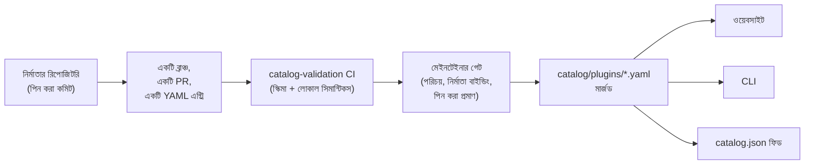

<div align="center">


# 🧩 Awesome Omni DSH Plugins

> **এটি একটি অনানুষ্ঠানিক কমিউনিটি প্রকল্প। DeepSeek-এর সাথে এর কোনো সম্পর্ক নেই, DeepSeek এটিকে অনুমোদন বা স্পনসর করে না।**
> DeepSeek-এর নাম ও চিহ্নসমূহ তাদের নিজ নিজ মালিকের সম্পত্তি।

**DeepSeek Harness (DSH)** প্লাগইনের জন্য নির্মাতা-কেন্দ্রিক আবিষ্কার এবং এক-কমান্ডে ইনস্টলেশন।

<h2>
  🌐 <a href="https://dsh-plugins.omniroute.online"><strong>dsh-plugins.omniroute.online</strong></a> 🌐
</h2>
<h3>
  <a href="https://dsh-plugins.omniroute.online">ওয়েবসাইটে সব প্লাগইন ব্রাউজ, সার্চ এবং ইনস্টল করুন →</a>
</h3>

[](https://dsh-plugins.omniroute.online)
[](https://www.npmjs.com/package/@diegosouza.pw/dsh-plugins)
[](https://github.com/diegosouzapw/awesome-omni-dsh-plugins/actions/workflows/validate-catalog.yml)
[](../../LICENSE)
[](https://dsh-plugins.omniroute.online)

<br/>

<b>🌐 43টি ভাষায়</b>
<br/><br/>
<a href="../../README.md"></a>
<a href="../pt-BR/README.md"></a>
<a href="../zh-CN/README.md"></a>
<a href="../zh-TW/README.md"></a>
<a href="../pt/README.md"></a>
<a href="../es/README.md"></a>
<a href="../fr/README.md"></a>
<a href="../it/README.md"></a>
<a href="../de/README.md"></a>
<a href="../nl/README.md"></a>
<a href="../ru/README.md"></a>
<a href="../uk-UA/README.md"></a>
<a href="../pl/README.md"></a>
<a href="../cs/README.md"></a>
<a href="../sk/README.md"></a>
<a href="../ro/README.md"></a>
<a href="../hu/README.md"></a>
<a href="../bg/README.md"></a>
<a href="../da/README.md"></a>
<a href="../fi/README.md"></a>
<a href="../no/README.md"></a>
<a href="../sv/README.md"></a>
<a href="../ja/README.md"></a>
<a href="../ko/README.md"></a>
<a href="../th/README.md"></a>
<a href="../vi/README.md"></a>
<a href="../id/README.md"></a>
<a href="../ms/README.md"></a>
<a href="../phi/README.md"></a>
<a href="../in/README.md"></a>
<a href="../hi/README.md"></a>
<a href="../gu/README.md"></a>
<a href="../mr/README.md"></a>
<a href="../ta/README.md"></a>
<a href="../te/README.md"></a>
<a href="README.md"></a>
<a href="../ur/README.md"></a>
<a href="../fa/README.md"></a>
<a href="../ar/README.md"></a>
<a href="../he/README.md"></a>
<a href="../tr/README.md"></a>
<a href="../az/README.md"></a>
<a href="../sw/README.md"></a>

</div>

---

## ⭐ শীর্ষ ১০ প্লাগইন

একদম নিজস্ব রিপোজিটরির স্টার অনুযায়ী র‌্যাংক করা হয়েছে — শুধুমাত্র প্লাগইনের নিজস্ব রিপোজিটরি অর্জিত স্টারই গণনা করা হয়,
কোনো প্যারেন্ট প্রজেক্টের স্টার নয় ([র‌্যাংকিং নির্ণায়ক](../../docs/RANKING.md))। প্রতিটি নাম নির্মাতার
রিপোজিটরিতে লিংক করে, যা ক্যাটালগ যাচাই করা ঠিক সেই কমিটে পিন করা।

| #   | প্লাগইন | নির্মাতা | ★ | বিভাগ | এটি কী করে |
| --- | ------ | ------- | --- | -------- | ------------ |
| 1 | [dsh-visualize](https://github.com/Nagi-ovo/dsh-visualize) | [@Nagi-ovo](https://github.com/Nagi-ovo) | 180 | UI & dashboards | ইনলাইন ভিজ্যুয়ালাইজেশন: মডেল সেশনের ভেতরেই ইন্টারঅ্যাক্টিভ চার্ট ও ডায়াগ্রাম রেন্ডার করে |
| 2 | [dsh-pet-remielle](https://github.com/Gin-7/dsh-pet-remielle) | [@Gin-7](https://github.com/Gin-7) | 20 | Entertainment | DSH ওয়েব GUI-র জন্য হট-প্লাগেবল স্বচ্ছ ডেস্কটপ পোষ্য (Remielle, Zenless Zone Zero) |
| 3 | [dsh-whale-musume](https://github.com/Sutera-Diffusus/dsh-whale-musume) | [@Sutera-Diffusus](https://github.com/Sutera-Diffusus) | 19 | Entertainment | অ্যানিমেটেড হোয়েল-গার্ল কানবান মুসুমে মাসকট, যা ড্যাশবোর্ড কার্যক্রমে প্রতিক্রিয়া দেখায় |
| 4 | [deepseek-harness-tui](https://github.com/gxinxing/deepseek-harness-tui) | [@gxinxing](https://github.com/gxinxing) | 7 | UI & dashboards | dsh সেশন চালানোর জন্য ফুল-স্ক্রিন curses-স্টাইল টার্মিনাল চ্যাট ক্লায়েন্ট |
| 5 | [dsh-tui](https://github.com/turtle1999/turtle-ui) | [@turtle1999](https://github.com/turtle1999) | 7 | UI & dashboards | ইন্টারঅ্যাক্টিভ pi-tui টার্মিনাল ফ্রন্ট ডোর: সেশন পিকার, স্ট্রিমিং চ্যাট, কীবাইন্ডিং |
| 6 | [dsh-tavily-workspace](https://github.com/moguiyu/dsh-tavily) | [@moguiyu](https://github.com/moguiyu) | 3 | Search & research | অপ্ট-ইন Tavily অ্যাডভান্সড সার্চ টুল, মাল্টি-কী ম্যানেজমেন্ট ও ব্যবহার-গেজসহ |
| 7 | [dsh-bili-widget](https://github.com/pyf2818/dsh-bili-widget) | [@pyf2818](https://github.com/pyf2818) | 2 | Entertainment | ভাসমান bilibili ভিডিও উইজেট: সুপারিশ, ট্রেন্ডিং, র‌্যাংকিং ও সার্চ |
| 8 | [dsh-themes](https://github.com/MangMax/dsh-themes) | [@MangMax](https://github.com/MangMax) | 1 | Entertainment | অ্যাপিয়ারেন্স প্লাগইন: বিল্ট-ইন প্যালেট, লাইট/ডার্ক/সিস্টেম মোড, VS Code থিম |
| 9 | [dsh-arknights](https://github.com/DocJlm/dsh-arknights) | [@DocJlm](https://github.com/DocJlm) | — | Entertainment | অ-বাণিজ্যিক Arknights অ্যাস্ট্রাল-গার্ডেন স্কিন, যাতে রয়েছে Pramanix ও Eyjafjalla |
| 10 | [dsh-bridge-browser](https://github.com/Lum1104/dsh-browser) | [@Lum1104](https://github.com/Lum1104) | — | Browser automation | কম্প্যানিয়ন ব্রাউজার এক্সটেনশনের জন্য টোকেন-প্রমাণিত WebSocket ব্রিজ |

<div align="center">

### 👉 [**ওয়েবসাইটে সব প্লাগইন সার্চ করুন, বিস্তারিত পড়ুন এবং ইনস্টল কমান্ড কপি করুন →**](https://dsh-plugins.omniroute.online) 👈

</div>

## এক নজরে

| সারফেস     | এটি কী                                                       | কোথায়                                                                    |
| ----------- | ---------------------------------------------------------------- | ------------------------------------------------------------------------ |
| **ওয়েবসাইট** | সার্চ ও র‌্যাংকিংসহ রেন্ডার করা ক্যাটালগ ব্রাউজার                 | [dsh-plugins.omniroute.online](https://dsh-plugins.omniroute.online)     |
| **ক্যাটালগ** | প্রতিটি প্লাগইনের জন্য একটি YAML ফাইল, একমাত্র সত্যের উৎস             | [`catalog/plugins/`](../../catalog/plugins)                                    |
| **স্কিমা**  | পাবলিক JSON স্কিমা (draft 2020-12), যার বিপরীতে প্রতিটি এন্ট্রি যাচাই করা হয় | [`schemas/plugin.schema.yaml`](../../schemas/plugin.schema.yaml)               |
| **সিএলআই**     | ক্যাটালগ থেকে সার্চ, পরিদর্শন, যাচাই ও ইনস্টল করুন           | [`@diegosouza.pw/dsh-plugins`](https://www.npmjs.com/package/@diegosouza.pw/dsh-plugins) |
| **মেশিন ফিড** | টুলসের জন্য `catalog.json` + `catalog.snapshot.json`           | [catalog.json](https://dsh-plugins.omniroute.online/catalog.json) · [catalog.snapshot.json](https://dsh-plugins.omniroute.online/catalog.snapshot.json) |

এই রিপোজিটরিটি ক্যাটালগের জন্য পাবলিক সত্যের উৎস। প্রতিটি এন্ট্রি `catalog/plugins/`-এর অধীনে একটি YAML ফাইল,
যা প্রকাশিত JSON স্কিমার বিপরীতে যাচাই করা হয়, একটি করে পৃথকভাবে পর্যালোচিত পুল রিকোয়েস্টের মাধ্যমে যোগ করা
হয়, এবং সবসময় প্লাগইনের মূল নির্মাতাকে কৃতিত্ব দেওয়া হয়। ক্যাটালগের কোনো কিছুই অন্য কোনো ক্যাটালগ বা তালিকা
থেকে তৈরি করা হয় না: প্রতিটি এন্ট্রি একটি পিন করা কমিট অনুযায়ী মূল নির্মাতার রিপোজিটরি থেকে পুনর্গঠন করা হয়।

ওয়েবসাইট এবং সিএলআই প্রাইভেট সোর্স থেকে রক্ষণাবেক্ষণ করা হয়; এই রিপোজিটরিতে থাকে পাবলিক
ক্যাটালগ ডেটা, স্কিমা এবং নীতিমালা, যা তারা ব্যবহার করে।

## ক্যাটালগ স্ট্যাটাস

**১০টি প্লাগইন মার্জ করা হয়েছে।** প্রতিটি প্লাগইন একটি করে পৃথকভাবে পর্যালোচিত পুল রিকোয়েস্টের মাধ্যমে, একবারে
একটি করে, মূল নির্মাতার রিপোজিটরি থেকে, একটি পিন করা সোর্স কমিট ও স্পষ্ট কৃতিত্বসহ প্রবেশ করে।

## 🚀 সিএলআই ইনস্টল করুন

```bash
npx @diegosouza.pw/dsh-plugins --help
```

স্কোপড প্যাকেজটি `@diegosouza.pw/dsh-plugins@0.1.0` হিসেবে প্রকাশিত, এবং উপরের কমান্ডটিই আজকের দিনের
প্রামাণিক (canonical) আহ্বান পদ্ধতি; এখানে কোনো ইনস্টলার স্ক্রিপ্ট হোস্ট করা নেই।

### আজই সিএলআই ব্যবহার করুন

সংস্করণ 0.1.0-এ রয়েছে রিড-অনলি ডিসকভারি ও ভ্যালিডেশন কমান্ড, পাশাপাশি সম্মতি-গেটেড ইনস্টল কমান্ড। ফ্ল্যাগ,
এক্সিট কোড এবং কোড-এক্সিকিউশন সম্মতি-গেটসহ সম্পূর্ণ কমান্ড রেফারেন্স আছে [docs/CLI.md](../../docs/CLI.md)-এ।

| Command                        | এটি কী করে                                                        | আপনার সিস্টেম স্পর্শ করে?                    |
| ------------------------------ | ------------------------------------------------------------------- | --------------------------------------- |
| `catalog validate --catalog .` | ক্যাটালগ YAML, স্কিমা এবং লোকাল সিমান্টিকস যাচাই করে                   | না — শুধু রিড-অনলি                          |
| `search <query...>`            | লোকালি পাবলিক ক্যাটালগ ফিল্ড সার্চ করে                                | না — শুধু রিড-অনলি                          |
| `info <id>`                    | একটি পাবলিক ক্যাটালগ এন্ট্রি দেখায়                                       | না — শুধু রিড-অনলি                          |
| `list`                         | প্রোফাইল পরিবর্তন না করেই ক্যাটালগ-পরিচালিত ইনস্টলগুলোর তালিকা দেখায়            | না — শুধু রিড-অনলি                          |
| `doctor`                       | Node, DSH, নেটিভ Windows পলিসি এবং ক্যাটালগের রিড-অনলি ডায়াগনস্টিকস  | না — শুধু রিড-অনলি                          |
| `add <id> --profile <name> --dry-run` | কোনো ফাইল বা সাবপ্রসেস ছাড়াই যাচাইকৃত ইনস্টল পরিকল্পনা দেখায় | না — শুধু ড্রাই-রান                            |
| `add <id> --profile <name> --allow-code-execution` | অফিসিয়াল DSH ডেলিগেশনের মাধ্যমে ইনস্টল করে        | হ্যাঁ — শুধুমাত্র স্পষ্ট সম্মতি ফ্ল্যাগসহ   |

```bash
# Validate the catalog in this repository (what CI runs):
npx @diegosouza.pw/dsh-plugins@0.1.0 catalog validate --catalog .

# Search and inspect locally, without installing anything:
npx @diegosouza.pw/dsh-plugins@0.1.0 search memory --catalog .
npx @diegosouza.pw/dsh-plugins@0.1.0 info <plugin-id> --catalog .

# Preview an install plan; nothing is written and no subprocess runs:
npx @diegosouza.pw/dsh-plugins@0.1.0 add <plugin-id> --profile default --dry-run
```

মিউটেটিং কমান্ডগুলো (`add`, `update`, `remove`) কখনোই প্লাগইন লাইফসাইকেল কোড এক্সিকিউট করে না, যতক্ষণ না
আপনি `--allow-code-execution` পাস করেন। নেটিভ Windows-এ এই মিউটেশনগুলো v0.1.0-এ নিষ্ক্রিয়; WSL ব্যবহার
করুন। রিড-অনলি এবং ড্রাই-রান কমান্ডগুলো সব জায়গায় কাজ করে।

## 🔍 কীভাবে একটি প্লাগইন ক্যাটালগে প্রবেশ করে



1. **একটি প্লাগইন, একটি ব্রাঞ্চ, একটি পুল রিকোয়েস্ট।** PR-টি `catalog/plugins/`-এর অধীনে ঠিক একটি YAML
   ফাইল যোগ বা পরিবর্তন করে।
2. **নির্মাতা-প্রথম।** প্লাগইনের নির্মাতা বা মালিক প্রতিষ্ঠান কর্তৃক খোলা একটি PR, একই প্লাগইনের জন্য
   কমিউনিটি কিউরেশন বা অটোমেশনের চেয়ে সবসময় অগ্রাধিকার পায় — দেখুন [docs/CREDIT.md](../../docs/CREDIT.md)।
3. **মূল উৎস থেকে প্রমাণ।** প্রতিটি ফিল্ড নির্মাতার রিপোজিটরি থেকে একটি পিন করা ৪০-অক্ষরের কমিট অনুযায়ী
   পুনর্গঠন করা হয়: বিবরণ, লাইসেন্স, DSH ইন্টিগ্রেশন, ইনস্টল ডেস্ক্রিপ্টর, স্টার।
4. **লোকাল ভ্যালিডেশন।** `catalog validate` গঠন এবং লোকাল সিমান্টিকস পরীক্ষা করে; এটি সেই একই চেক, যা
   `catalog-validation` CI জব PR-এ চালায়।
5. **মেইনটেইনার গেট।** মার্জের আগে, মেইনটেইনাররা আলাদাভাবে রিপোজিটরির পরিচয়, নির্মাতা বাইন্ডিং এবং পিন
   করা প্রমাণ যাচাই করেন। একটি সবুজ (green) লোকাল ভ্যালিডেশন প্রয়োজনীয়, কিন্তু কখনোই যথেষ্ট নয়।

সম্পূর্ণ চুক্তি — প্রয়োজনীয় প্রমাণ, YAML নিয়ম, স্টার নীতি, সংঘর্ষ (collision) ব্যবস্থাপনা এবং পর্যালোচনা
গেট — আছে [CONTRIBUTING.md](../../CONTRIBUTING.md)-এ। সিদ্ধান্তগুলো কীভাবে ও কার দ্বারা নেওয়া হয়, তা আছে
[docs/GOVERNANCE.md](../../docs/GOVERNANCE.md)-এ।

## 📄 একটি এন্ট্রির গঠন

প্রতিটি এন্ট্রি তার ID অনুযায়ী নামকরণ করা একটি YAML ফাইল। নিচের উদাহরণটি বর্তমান স্কিমার বিপরীতে যাচাই
হয় (ফিল্ড-বাই-ফিল্ড রেফারেন্স [docs/SCHEMA.md](../../docs/SCHEMA.md)-এ):

```yaml
schemaVersion: 1
id: example-notes-search
name: Example Notes Search
description:
  en: >-
    Searches a local Markdown notes folder from DSH sessions and returns
    matching snippets with file paths.
  evidencePath: README.md
unofficial: true
kind: plugin
primaryCategory: search-research
tags:
  - search
  - notes
  - cli
source:
  repository: https://github.com/example-creator/example-notes-search
  repositoryNodeId: R_kgDOExample01
  subpath: null
  commit: 0123456789abcdef0123456789abcdef01234567
creator:
  github: example-creator
package:
  ecosystem: npm
  name: example-notes-search
  version: 1.4.2
dsh:
  profiles:
    - default
  evidencePath: dsh-plugin.json
repositoryScope: dedicated
popularity:
  starsPolicy: exact-repository
  stars: 128
license:
  spdx: MIT
verification:
  status: eligible
  checkedAt: "2026-08-18T12:00:00Z"
  repositoryIdentity: resolved
  smokeTest: null
provenance:
  discussion: null
  comment: null
```

স্কিমা দ্বারা প্রয়োগকৃত মূল ইনভ্যারিয়েন্টগুলো:

- `unofficial: true` এবং `schemaVersion: 1` ধ্রুবক (constant)।
- একটি মনোরিপো প্লাগইনকে অবশ্যই `stars: null` ব্যবহার করতে হবে — প্যারেন্ট-প্রজেক্টের স্টার কখনো
  উত্তরাধিকারসূত্রে পাওয়া যায় না।
- ইনস্টল ডেস্ক্রিপ্টর হয় একটি নির্দিষ্ট-সংস্করণের npm প্যাকেজ, নতুবা পিন করা সোর্স নিজেই; এটি ডেটা,
  কখনো শেল কমান্ড নয়।
- `verified` স্ট্যাটাসের জন্য পর্যালোচনাযোগ্য স্মোক-টেস্ট প্রমাণ প্রয়োজন; নয়তো এন্ট্রিটি `smokeTest: null`
  সহ `eligible` থাকে।

## 🗂 এখানে কী থাকে

এই রিপোজিটরি DeepSeek Harness (DSH)-এর জন্য স্বাধীনভাবে প্রকাশিত ইন্টিগ্রেশনগুলো ক্যাটালগ করে, যার মধ্যে
রয়েছে নেটিভ প্লাগইন, প্লাগইন পরিবার, থিম, স্কিল, ক্লায়েন্ট এবং ব্রিজ। আর্টিফ্যাক্ট ধরন, ক্যাপাবিলিটি বিভাগ
এবং ইন্টারফেস ট্যাগ সংজ্ঞায়িত করা আছে [docs/CATEGORIES.md](../../docs/CATEGORIES.md)-এ।

প্রতিটি পাবলিক রেকর্ড `catalog/plugins/`-এর অধীনে একটি YAML ফাইল এবং অবশ্যই `schemas/plugin.schema.yaml`-এর
বিপরীতে যাচাই হতে হবে। একটি তালিকাভুক্তি মানে হলো নথিভুক্ত যোগ্যতা বা যাচাইকরণ চেক সম্পন্ন হয়েছে; এটি কোনো
নিরাপত্তা সার্টিফিকেশন বা DeepSeek অনুমোদন নয়।

## 🏅 র‌্যাংকিং ও যাচাইকরণ

শুধুমাত্র ডেডিকেটেড, নেটিভ, যোগ্য বা যাচাইকৃত প্লাগইন রিপোজিটরি — যাদের স্টার ঠিক সেই রিপোজিটরির নিজস্ব —
একটি স্টার র‌্যাংকিংয়ে প্রবেশ করতে পারে। বৃহত্তর মনোরিপোর ভেতরে সংরক্ষিত ইন্টিগ্রেশনগুলো আবিষ্কারযোগ্য
থাকে, কিন্তু `stars: null` ব্যবহার করে এবং কখনো প্যারেন্ট-প্রজেক্টের স্টার উত্তরাধিকারসূত্রে পায় না। দেখুন
[docs/RANKING.md](../../docs/RANKING.md) সম্পূর্ণ নির্ণায়কের জন্য।

পাবলিক যাচাইকরণ অবস্থাগুলো কাঠামোগত যোগ্যতা ও ইনস্টলেশন স্মোক-টেস্টের মধ্যে পার্থক্য দেখায়। কোনো অবস্থাই
সম্পূর্ণ নিরাপত্তার নিশ্চয়তা দেয় না। ব্যবহারের আগে একটি প্লাগইনের রিপোজিটরি, পিন করা কমিট, লাইসেন্স এবং
ইনস্টলেশন আচরণ পর্যালোচনা করুন।

## 🤝 অবদান রাখুন বা একটি এন্ট্রি দাবি করুন

একটি পুল রিকোয়েস্ট খোলার আগে [CONTRIBUTING.md](../../CONTRIBUTING.md) পড়ুন। একটি পুল রিকোয়েস্টে অবশ্যই
ঠিক একটি প্লাগইন এন্ট্রি যোগ বা পরিবর্তন করতে হবে এবং অন্য কোনো ক্যাটালগ নয়, মূল নির্মাতার রিপোজিটরি উল্লেখ
করতে হবে। নির্মাতা-রচিত পুল রিকোয়েস্ট, অটোমেটেড ক্যাটালগ পুল রিকোয়েস্টের চেয়ে অগ্রাধিকার পায়।

গঠনমূলক (structured) ইস্যু ফর্ম পাওয়া যায় নির্মাতা দাবি, সংশোধন এবং অপসারণের জন্য। কখনো ক্রেডেনশিয়াল,
ব্যক্তিগত যোগাযোগের তথ্য বা অন্য কোনো গোপনীয় তথ্য জমা দেবেন না।

## 👩‍🎨 প্লাগইন নির্মাতারা

এই ক্যাটালগ টিকে আছে কারণ এই নির্মাতারা প্লাগইন তৈরি করেছেন। প্রতিটি এন্ট্রি তার নির্মাতাকে কৃতিত্ব দেয় এবং
তাদের রিপোজিটরিতে ফিরে লিংক করে — সবসময়।

<a href="https://github.com/Nagi-ovo" title="@Nagi-ovo — dsh-visualize"></a>
<a href="https://github.com/Gin-7" title="@Gin-7 — dsh-pet-remielle"></a>
<a href="https://github.com/Sutera-Diffusus" title="@Sutera-Diffusus — dsh-whale-musume"></a>
<a href="https://github.com/gxinxing" title="@gxinxing — deepseek-harness-tui"></a>
<a href="https://github.com/turtle1999" title="@turtle1999 — dsh-tui"></a>
<a href="https://github.com/moguiyu" title="@moguiyu — dsh-tavily-workspace"></a>
<a href="https://github.com/pyf2818" title="@pyf2818 — dsh-bili-widget"></a>
<a href="https://github.com/MangMax" title="@MangMax — dsh-themes"></a>
<a href="https://github.com/DocJlm" title="@DocJlm — dsh-arknights"></a>
<a href="https://github.com/Lum1104" title="@Lum1104 — dsh-bridge-browser"></a>

সম্পূর্ণ কৃতিত্বসহ এখানে আপনার প্লাগইন চান? [একটি YAML এন্ট্রিসহ একটি PR খুলুন](../../CONTRIBUTING.md) — অথবা
[একটি বিদ্যমান এন্ট্রি দাবি করুন](https://github.com/diegosouzapw/awesome-omni-dsh-plugins/issues/new/choose)
যদি কেউ আপনার আগেই আপনার কাজ ক্যাটালগ করে থাকে।

## 📚 ডকুমেন্টেশন

| নথি                                     | যা কভার করে                                                       |
| -------------------------------------------- | -------------------------------------------------------------------- |
| [CONTRIBUTING.md](../../CONTRIBUTING.md)           | সম্পূর্ণ অবদান চুক্তি: প্রমাণ, YAML নিয়ম, পর্যালোচনা গেট    |
| [SECURITY.md](../../SECURITY.md)                   | প্লাগইন বা ক্যাটালগের দুর্বলতা রিপোর্ট করা; গোপনীয়তা নীতি           |
| [docs/SCHEMA.md](../../docs/SCHEMA.md)             | `schemas/plugin.schema.yaml`-এর জন্য ফিল্ড-বাই-ফিল্ড রেফারেন্স             |
| [docs/CLI.md](../../docs/CLI.md)                   | `@diegosouza.pw/dsh-plugins@0.1.0`-এর জন্য CLI কমান্ড রেফারেন্স          |
| [docs/GOVERNANCE.md](../../docs/GOVERNANCE.md)     | ক্যাটালগ কীভাবে পরিচালিত হয়: অগ্রাধিকার, গেট, দাবি এবং অপসারণ   |
| [docs/CATEGORIES.md](../../docs/CATEGORIES.md)     | আর্টিফ্যাক্ট ধরন, প্রাথমিক ক্যাপাবিলিটি বিভাগ, ট্যাগ, রিপোজিটরির পরিধি |
| [docs/CREDIT.md](../../docs/CREDIT.md)             | নির্মাতা কৃতিত্ব, PR অগ্রাধিকার এবং Git পরিচয় নীতি                 |
| [docs/RANKING.md](../../docs/RANKING.md)           | পাবলিক র‌্যাংকিং নির্ণায়ক এবং যাচাইকরণ অবস্থা                       |
| [docs/UNOFFICIAL.md](../../docs/UNOFFICIAL.md)     | অনানুষ্ঠানিক স্ট্যাটাস এবং ট্রেডমার্ক অবস্থান                               |

## 🌐 অনুবাদ

এই README [`docs/i18n/`](..)-এর অধীনে 43টি ভাষায় পাওয়া যায় — উপরের ফ্ল্যাগ সিলেক্টর ব্যবহার করুন। ইংরেজি
সত্যের উৎস; একটি অনুবাদ এবং ইংরেজি টেক্সটের মধ্যে অমিল হলে, ইংরেজি টেক্সটই প্রাধান্য পায়। স্বাভাবিক পুল
রিকোয়েস্টের মাধ্যমে যেকোনো অনুবাদে সংশোধন স্বাগত।

## 📜 লাইসেন্স ও কৃতিত্ব

ডকুমেন্টেশন এবং রিপোজিটরি টেমপ্লেট [MIT লাইসেন্স](../../LICENSE)-এর অধীনে লাইসেন্সকৃত। মূল ক্যাটালগ তথ্য
এবং এডিটোরিয়াল YAML মেটাডেটা [CC0-1.0](../../LICENSE-CATALOG)-এর অধীনে উৎসর্গীকৃত। আপস্ট্রিম কোড, নাম,
লোগো এবং স্ক্রিনশট তাদের মূল মালিক ও লাইসেন্সের অধীনেই থাকে। দেখুন [docs/CREDIT.md](../../docs/CREDIT.md)
এবং [docs/UNOFFICIAL.md](../../docs/UNOFFICIAL.md)।

<div align="center">

### ⭐ এই ক্যাটালগ যদি আপনাকে একটি প্লাগইন খুঁজে পেতে সাহায্য করে থাকে, তাহলে রিপোতে স্টার দিন — এটি নির্মাতাদের খুঁজে পেতে সাহায্য করে।

**[ওয়েবসাইটে সব প্লাগইন ব্রাউজ করুন →](https://dsh-plugins.omniroute.online)**

</div>
