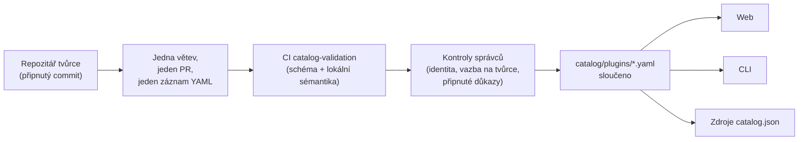

<div align="center">


# 🧩 Awesome Omni DSH Plugins

> **Neoficiální komunitní projekt. Není propojen se společností DeepSeek, není jí schválen ani sponzorován.**
> Názvy a ochranné známky DeepSeek patří jejich vlastníkovi.

Vyhledávání upřednostňující tvůrce a instalace jedním příkazem pro pluginy **DeepSeek Harness (DSH)**.

<h2>
  🌐 <a href="https://dsh-plugins.omniroute.online"><strong>dsh-plugins.omniroute.online</strong></a> 🌐
</h2>
<h3>
  <a href="https://dsh-plugins.omniroute.online">Procházejte, vyhledávejte a instalujte libovolný plugin na webu →</a>
</h3>

[](https://dsh-plugins.omniroute.online)
[](https://www.npmjs.com/package/@diegosouza.pw/dsh-plugins)
[](https://github.com/diegosouzapw/awesome-omni-dsh-plugins/actions/workflows/validate-catalog.yml)
[](../../LICENSE)
[](https://dsh-plugins.omniroute.online)

<br/>

<b>🌐 V 43 jazycích</b>
<br/><br/>
<a href="../../README.md"></a>
<a href="../pt-BR/README.md"></a>
<a href="../zh-CN/README.md"></a>
<a href="../zh-TW/README.md"></a>
<a href="../pt/README.md"></a>
<a href="../es/README.md"></a>
<a href="../fr/README.md"></a>
<a href="../it/README.md"></a>
<a href="../de/README.md"></a>
<a href="../nl/README.md"></a>
<a href="../ru/README.md"></a>
<a href="../uk-UA/README.md"></a>
<a href="../pl/README.md"></a>
<a href="README.md"></a>
<a href="../sk/README.md"></a>
<a href="../ro/README.md"></a>
<a href="../hu/README.md"></a>
<a href="../bg/README.md"></a>
<a href="../da/README.md"></a>
<a href="../fi/README.md"></a>
<a href="../no/README.md"></a>
<a href="../sv/README.md"></a>
<a href="../ja/README.md"></a>
<a href="../ko/README.md"></a>
<a href="../th/README.md"></a>
<a href="../vi/README.md"></a>
<a href="../id/README.md"></a>
<a href="../ms/README.md"></a>
<a href="../phi/README.md"></a>
<a href="../in/README.md"></a>
<a href="../hi/README.md"></a>
<a href="../gu/README.md"></a>
<a href="../mr/README.md"></a>
<a href="../ta/README.md"></a>
<a href="../te/README.md"></a>
<a href="../bn/README.md"></a>
<a href="../ur/README.md"></a>
<a href="../fa/README.md"></a>
<a href="../ar/README.md"></a>
<a href="../he/README.md"></a>
<a href="../tr/README.md"></a>
<a href="../az/README.md"></a>
<a href="../sw/README.md"></a>

</div>

---

## ⭐ 10 nejlepších pluginů

Žebříček podle hvězdiček přesného repozitáře — počítají se pouze hvězdičky získané vlastním
repozitářem pluginu, nikdy repozitářem nadřazeného projektu ([predikát žebříčku](../../docs/RANKING.md)).
Každý název odkazuje na repozitář tvůrce, připnutý na přesném commitu, který katalog ověřil.

| #   | Plugin | Tvůrce | ★ | Kategorie | Co dělá |
| --- | ------ | ------- | --- | -------- | ------------ |
| 1 | [dsh-visualize](https://github.com/Nagi-ovo/dsh-visualize) | [@Nagi-ovo](https://github.com/Nagi-ovo) | 180 | UI & dashboards | Vizualizace přímo v obsahu: model vykresluje interaktivní grafy a diagramy přímo v relaci |
| 2 | [dsh-pet-remielle](https://github.com/Gin-7/dsh-pet-remielle) | [@Gin-7](https://github.com/Gin-7) | 20 | Entertainment | Za chodu připojitelný průhledný desktopový mazlíček (Remielle, Zenless Zone Zero) pro webové rozhraní DSH |
| 3 | [dsh-whale-musume](https://github.com/Sutera-Diffusus/dsh-whale-musume) | [@Sutera-Diffusus](https://github.com/Sutera-Diffusus) | 19 | Entertainment | Animovaný maskot velrybí dívky ve stylu Kanban Musume, reagující na aktivitu na nástěnce |
| 4 | [deepseek-harness-tui](https://github.com/gxinxing/deepseek-harness-tui) | [@gxinxing](https://github.com/gxinxing) | 7 | UI & dashboards | Celoobrazovkový terminálový chatovací klient ve stylu curses pro ovládání relací dsh |
| 5 | [dsh-tui](https://github.com/turtle1999/turtle-ui) | [@turtle1999](https://github.com/turtle1999) | 7 | UI & dashboards | Interaktivní terminálové rozhraní pi-tui: výběr relace, streamovaný chat, klávesové zkratky |
| 6 | [dsh-tavily-workspace](https://github.com/moguiyu/dsh-tavily) | [@moguiyu](https://github.com/moguiyu) | 3 | Search & research | Volitelný pokročilý vyhledávací nástroj Tavily se správou více klíčů a ukazatelem využití |
| 7 | [dsh-bili-widget](https://github.com/pyf2818/dsh-bili-widget) | [@pyf2818](https://github.com/pyf2818) | 2 | Entertainment | Plovoucí video widget bilibili: doporučení, trendy, žebříčky a vyhledávání |
| 8 | [dsh-themes](https://github.com/MangMax/dsh-themes) | [@MangMax](https://github.com/MangMax) | 1 | Entertainment | Plugin vzhledu: vestavěné palety, světlý/tmavý/systémový režim, motivy VS Code |
| 9 | [dsh-arknights](https://github.com/DocJlm/dsh-arknights) | [@DocJlm](https://github.com/DocJlm) | — | Entertainment | Nekomerční vzhled „astrální zahrada“ podle Arknights s postavami Pramanix a Eyjafjalla |
| 10 | [dsh-bridge-browser](https://github.com/Lum1104/dsh-browser) | [@Lum1104](https://github.com/Lum1104) | — | Browser automation | WebSocket most s autentizací tokenem pro doprovodné rozšíření prohlížeče |

<div align="center">

### 👉 [**Vyhledávejte všechny pluginy, čtěte podrobnosti a kopírujte instalační příkaz na webu →**](https://dsh-plugins.omniroute.online) 👈

</div>

## Stručný přehled

| Oblast     | Co to je                                                       | Kde                                                                    |
| ----------- | ---------------------------------------------------------------- | ------------------------------------------------------------------------ |
| **Web** | Vykreslený prohlížeč katalogu s vyhledáváním a žebříčkem                 | [dsh-plugins.omniroute.online](https://dsh-plugins.omniroute.online)     |
| **Katalog** | Jeden soubor YAML na plugin, jediný zdroj pravdy             | [`catalog/plugins/`](../../catalog/plugins)                                    |
| **Schéma**  | Veřejné JSON Schema (draft 2020-12), vůči kterému je ověřen každý záznam | [`schemas/plugin.schema.yaml`](../../schemas/plugin.schema.yaml)               |
| **CLI**     | Vyhledávání, prohlížení, ověřování a instalace z katalogu           | [`@diegosouza.pw/dsh-plugins`](https://www.npmjs.com/package/@diegosouza.pw/dsh-plugins) |
| **Strojově čitelné zdroje** | `catalog.json` + `catalog.snapshot.json` pro nástroje           | [catalog.json](https://dsh-plugins.omniroute.online/catalog.json) · [catalog.snapshot.json](https://dsh-plugins.omniroute.online/catalog.snapshot.json) |

Tento repozitář je veřejným zdrojem pravdy pro katalog. Každý záznam je jeden soubor YAML
v `catalog/plugins/`, ověřený vůči zveřejněnému JSON Schema, přidaný samostatně zkontrolovaným
pull requestem a vždy s uvedením původního tvůrce pluginu.
Nic v katalogu není generováno z jiného katalogu nebo seznamu: každý záznam je rekonstruován
z repozitáře původního tvůrce na připnutém commitu.

Web a CLI jsou udržovány ze soukromého zdrojového kódu; tento repozitář obsahuje veřejná
data katalogu, schéma a zásady, které využívají.

## Stav katalogu

**Sloučeno 10 pluginů.** Každý plugin vstupuje do katalogu přes samostatně zkontrolovaný pull
request, jeden po druhém, z repozitáře původního tvůrce, s připnutým zdrojovým commitem
a výslovným uvedením autorství.

## 🚀 Instalace CLI

```bash
npx @diegosouza.pw/dsh-plugins --help
```

Balíček s rozsahem je publikován jako `@diegosouza.pw/dsh-plugins@0.1.0` a výše uvedený příkaz
je dnes kanonickým způsobem vyvolání; instalační skript zde není hostován.

### Možnosti CLI už dnes

Verze 0.1.0 obsahuje příkazy pro vyhledávání a ověřování pouze pro čtení a instalační příkazy
podmíněné souhlasem. Úplná referenční dokumentace příkazů, včetně příznaků, návratových kódů
a brány souhlasu se spuštěním kódu, je v [docs/CLI.md](../../docs/CLI.md).

| Příkaz                        | Co dělá                                                        | Zasahuje do systému?                    |
| ------------------------------ | ------------------------------------------------------------------- | --------------------------------------- |
| `catalog validate --catalog .` | Ověří YAML katalogu, schéma a lokální sémantiku                   | Ne — pouze pro čtení                          |
| `search <query...>`            | Lokálně prohledá veřejná pole katalogu                                | Ne — pouze pro čtení                          |
| `info <id>`                    | Zobrazí jeden veřejný záznam katalogu                                       | Ne — pouze pro čtení                          |
| `list`                         | Vypíše instalace spravované katalogem bez úprav profilů            | Ne — pouze pro čtení                          |
| `doctor`                       | Diagnostika Node, DSH, nativní politiky Windows a katalogu pouze pro čtení  | Ne — pouze pro čtení                          |
| `add <id> --profile <name> --dry-run` | Zobrazí ověřený instalační plán bez souborů nebo podprocesů | Ne — zkušební běh                            |
| `add <id> --profile <name> --allow-code-execution` | Instaluje přes oficiální delegaci DSH        | Ano — pouze s výslovným příznakem souhlasu   |

```bash
# Validate the catalog in this repository (what CI runs):
npx @diegosouza.pw/dsh-plugins@0.1.0 catalog validate --catalog .

# Search and inspect locally, without installing anything:
npx @diegosouza.pw/dsh-plugins@0.1.0 search memory --catalog .
npx @diegosouza.pw/dsh-plugins@0.1.0 info <plugin-id> --catalog .

# Preview an install plan; nothing is written and no subprocess runs:
npx @diegosouza.pw/dsh-plugins@0.1.0 add <plugin-id> --profile default --dry-run
```

Měnící příkazy (`add`, `update`, `remove`) nikdy nespustí kód životního cyklu pluginu, pokud
nepředáte příznak `--allow-code-execution`. V nativním Windows jsou tyto měnící operace ve
v0.1.0 zakázány; použijte WSL. Příkazy pouze pro čtení a zkušební běh fungují všude.

## 🔍 Jak se plugin dostane do katalogu



1. **Jeden plugin, jedna větev, jeden pull request.** PR přidává nebo mění přesně jeden soubor
   YAML v `catalog/plugins/`.
2. **Přednost tvůrce.** PR otevřený tvůrcem pluginu nebo vlastnící organizací má vždy přednost
   před kurátorstvím komunity nebo automatizací pro stejný plugin — viz
   [docs/CREDIT.md](../../docs/CREDIT.md).
3. **Důkazy z původního zdroje.** Každé pole je rekonstruováno z repozitáře tvůrce na
   připnutém 40znakovém commitu: popis, licence, integrace s DSH, instalační deskriptor,
   hvězdičky.
4. **Lokální validace.** `catalog validate` kontroluje strukturu a lokální sémantiku; jde
   o stejnou kontrolu, jakou pro PR spouští úloha CI `catalog-validation`.
5. **Kontroly správců.** Před sloučením správci samostatně ověřují identitu repozitáře,
   vazbu na tvůrce a připnuté důkazy. Zelená lokální validace je nutná, nikdy však postačující.

Úplná smlouva — požadované důkazy, pravidla YAML, zásady hvězdiček, řešení kolizí a kontroly
při revizi — je v [CONTRIBUTING.md](../../CONTRIBUTING.md). Jak a kým se rozhoduje, popisuje
[docs/GOVERNANCE.md](../../docs/GOVERNANCE.md).

## 📄 Anatomie záznamu

Každý záznam je jeden soubor YAML pojmenovaný podle svého ID. Níže uvedený příklad je platný
vůči aktuálnímu schématu (referenci pole po poli najdete v [docs/SCHEMA.md](../../docs/SCHEMA.md)):

```yaml
schemaVersion: 1
id: example-notes-search
name: Example Notes Search
description:
  en: >-
    Searches a local Markdown notes folder from DSH sessions and returns
    matching snippets with file paths.
  evidencePath: README.md
unofficial: true
kind: plugin
primaryCategory: search-research
tags:
  - search
  - notes
  - cli
source:
  repository: https://github.com/example-creator/example-notes-search
  repositoryNodeId: R_kgDOExample01
  subpath: null
  commit: 0123456789abcdef0123456789abcdef01234567
creator:
  github: example-creator
package:
  ecosystem: npm
  name: example-notes-search
  version: 1.4.2
dsh:
  profiles:
    - default
  evidencePath: dsh-plugin.json
repositoryScope: dedicated
popularity:
  starsPolicy: exact-repository
  stars: 128
license:
  spdx: MIT
verification:
  status: eligible
  checkedAt: "2026-08-18T12:00:00Z"
  repositoryIdentity: resolved
  smokeTest: null
provenance:
  discussion: null
  comment: null
```

Klíčové invarianty vynucené schématem:

- `unofficial: true` a `schemaVersion: 1` jsou konstanty.
- Plugin z monorepozitáře musí používat `stars: null` — hvězdičky nadřazeného projektu se nikdy nedědí.
- Instalační deskriptor je buď npm balíček s přesnou verzí, nebo přímo připnutý zdroj; jde
  o data, nikdy o shellový příkaz.
- Stav `verified` vyžaduje ověřitelné důkazy o smoke testu; jinak má záznam stav `eligible`
  s `smokeTest: null`.

## 🗂 Co sem patří

Tento repozitář katalogizuje nezávisle publikované integrace pro DeepSeek Harness (DSH),
včetně nativních pluginů, rodin pluginů, motivů, dovedností, klientů a mostů. Druhy artefaktů,
kategorie schopností a značky rozhraní jsou definovány v [docs/CATEGORIES.md](../../docs/CATEGORIES.md).

Každý veřejný záznam je jeden soubor YAML v `catalog/plugins/` a musí být platný vůči
`schemas/plugin.schema.yaml`. Zařazení znamená, že byly dokončeny zdokumentované kontroly
způsobilosti nebo ověření; nejde o bezpečnostní certifikaci ani schválení ze strany DeepSeek.

## 🏅 Žebříček a ověření

Do žebříčku hvězdiček se mohou dostat pouze vyhrazené, nativní, způsobilé nebo ověřené
repozitáře pluginů, jejichž hvězdičky patří přesně tomuto repozitáři. Integrace uložené
uvnitř širších monorepozitářů zůstávají dohledatelné, ale používají `stars: null` a nikdy
nedědí hvězdičky nadřazeného projektu. Úplný predikát je v [docs/RANKING.md](../../docs/RANKING.md).

Veřejné stavy ověření odlišují strukturální způsobilost od instalačního smoke testu.
Žádný stav nepředstavuje absolutní bezpečnost. Před použitím pluginu zkontrolujte jeho
repozitář, připnutý commit, licenci a chování při instalaci.

## 🤝 Přispějte nebo si nárokujte záznam

Před otevřením pull requestu si přečtěte [CONTRIBUTING.md](../../CONTRIBUTING.md). Pull request musí
přidávat nebo měnit přesně jeden záznam pluginu a musí odkazovat na repozitář původního tvůrce,
nikoli na jiný katalog. Pull requesty od tvůrců mají přednost před automatizovanými pull
requesty katalogu.

Pro nároky tvůrců, opravy a odstranění jsou k dispozici strukturované formuláře issue. Nikdy
neposílejte přihlašovací údaje, soukromé kontaktní údaje ani jiná tajemství.

## 👩‍🎨 Tvůrci pluginů

Tento katalog existuje díky tomu, že tito tvůrci vydali své pluginy. Každý záznam vždy uvádí
svého tvůrce a odkazuje zpět na jeho repozitář.

<a href="https://github.com/Nagi-ovo" title="@Nagi-ovo — dsh-visualize"></a>
<a href="https://github.com/Gin-7" title="@Gin-7 — dsh-pet-remielle"></a>
<a href="https://github.com/Sutera-Diffusus" title="@Sutera-Diffusus — dsh-whale-musume"></a>
<a href="https://github.com/gxinxing" title="@gxinxing — deepseek-harness-tui"></a>
<a href="https://github.com/turtle1999" title="@turtle1999 — dsh-tui"></a>
<a href="https://github.com/moguiyu" title="@moguiyu — dsh-tavily-workspace"></a>
<a href="https://github.com/pyf2818" title="@pyf2818 — dsh-bili-widget"></a>
<a href="https://github.com/MangMax" title="@MangMax — dsh-themes"></a>
<a href="https://github.com/DocJlm" title="@DocJlm — dsh-arknights"></a>
<a href="https://github.com/Lum1104" title="@Lum1104 — dsh-bridge-browser"></a>

Chcete tady svůj plugin s plným uvedením autorství? [Otevřete jeden PR s jedním záznamem
YAML](../../CONTRIBUTING.md) — nebo [si nárokujte existující
záznam](https://github.com/diegosouzapw/awesome-omni-dsh-plugins/issues/new/choose), pokud vaši
práci zkatalogizoval někdo jiný dřív než vy.

## 📚 Dokumentace

| Dokument                                     | Co popisuje                                                       |
| -------------------------------------------- | -------------------------------------------------------------------- |
| [CONTRIBUTING.md](../../CONTRIBUTING.md)           | Úplná smlouva pro přispěvatele: důkazy, pravidla YAML, kontroly při revizi    |
| [SECURITY.md](../../SECURITY.md)                   | Hlášení zranitelností pluginu nebo katalogu; zásady pro tajemství           |
| [docs/SCHEMA.md](../../docs/SCHEMA.md)             | Reference pole po poli pro `schemas/plugin.schema.yaml`             |
| [docs/CLI.md](../../docs/CLI.md)                   | Reference příkazů CLI pro `@diegosouza.pw/dsh-plugins@0.1.0`          |
| [docs/GOVERNANCE.md](../../docs/GOVERNANCE.md)     | Jak je katalog řízen: přednost, kontroly, nároky a odstranění   |
| [docs/CATEGORIES.md](../../docs/CATEGORIES.md)     | Druhy artefaktů, hlavní kategorie schopností, značky, rozsah repozitáře |
| [docs/CREDIT.md](../../docs/CREDIT.md)             | Uvedení tvůrce, přednost PR a zásady identity v Gitu                 |
| [docs/RANKING.md](../../docs/RANKING.md)           | Veřejný predikát žebříčku a stavy ověření                  |
| [docs/UNOFFICIAL.md](../../docs/UNOFFICIAL.md)     | Neoficiální status a postoj k ochranným známkám                               |

## 🌐 Překlady

Tento README je k dispozici ve 43 jazycích ve složce [`docs/i18n/`](..) — použijte výběr
vlajek nahoře. Zdrojem pravdy je anglický text; pokud se překlad a anglický text liší,
platí anglický text. Opravy jakéhokoli překladu jsou vítány prostřednictvím běžných pull
requestů.

## 📜 Licence a uvedení autorství

Dokumentace a šablony repozitáře jsou licencovány pod [licencí MIT](../../LICENSE). Původní
fakta katalogu a redakční metadata YAML jsou uvolněna pod licencí [CC0-1.0](../../LICENSE-CATALOG).
Zdrojový kód, názvy, loga a snímky obrazovky zůstávají pod svými původními vlastníky a
licencemi. Viz [docs/CREDIT.md](../../docs/CREDIT.md) a [docs/UNOFFICIAL.md](../../docs/UNOFFICIAL.md).

<div align="center">

### ⭐ Pokud vám tento katalog pomohl najít plugin, dejte repozitáři hvězdičku — pomůže to tvůrcům, aby je bylo vidět.

**[Procházet všechny pluginy na webu →](https://dsh-plugins.omniroute.online)**

</div>
