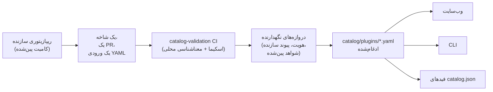

<div align="center">


# 🧩 Awesome Omni DSH Plugins

> **پروژه غیررسمی جامعه. وابسته به، تأییدشده توسط یا اسپانسرشده توسط DeepSeek نیست.**
> نام‌ها و علائم DeepSeek متعلق به مالک مربوطه‌شان است.

کشف اولویت‌دار برای سازندگان و نصب تک‌دستوری برای افزونه‌های **DeepSeek Harness (DSH)**.

<h2>
  🌐 <a href="https://dsh-plugins.omniroute.online"><strong>dsh-plugins.omniroute.online</strong></a> 🌐
</h2>
<h3>
  <a href="https://dsh-plugins.omniroute.online">همهٔ افزونه‌ها را در وب‌سایت مرور، جستجو و نصب کنید →</a>
</h3>

[](https://dsh-plugins.omniroute.online)
[](https://www.npmjs.com/package/@diegosouza.pw/dsh-plugins)
[](https://github.com/diegosouzapw/awesome-omni-dsh-plugins/actions/workflows/validate-catalog.yml)
[](../../LICENSE)
[](https://dsh-plugins.omniroute.online)

<br/>

<b>🌐 به ۴۳ زبان</b>
<br/><br/>
<a href="../../README.md"></a>
<a href="../pt-BR/README.md"></a>
<a href="../zh-CN/README.md"></a>
<a href="../zh-TW/README.md"></a>
<a href="../pt/README.md"></a>
<a href="../es/README.md"></a>
<a href="../fr/README.md"></a>
<a href="../it/README.md"></a>
<a href="../de/README.md"></a>
<a href="../nl/README.md"></a>
<a href="../ru/README.md"></a>
<a href="../uk-UA/README.md"></a>
<a href="../pl/README.md"></a>
<a href="../cs/README.md"></a>
<a href="../sk/README.md"></a>
<a href="../ro/README.md"></a>
<a href="../hu/README.md"></a>
<a href="../bg/README.md"></a>
<a href="../da/README.md"></a>
<a href="../fi/README.md"></a>
<a href="../no/README.md"></a>
<a href="../sv/README.md"></a>
<a href="../ja/README.md"></a>
<a href="../ko/README.md"></a>
<a href="../th/README.md"></a>
<a href="../vi/README.md"></a>
<a href="../id/README.md"></a>
<a href="../ms/README.md"></a>
<a href="../phi/README.md"></a>
<a href="../in/README.md"></a>
<a href="../hi/README.md"></a>
<a href="../gu/README.md"></a>
<a href="../mr/README.md"></a>
<a href="../ta/README.md"></a>
<a href="../te/README.md"></a>
<a href="../bn/README.md"></a>
<a href="../ur/README.md"></a>
<a href="README.md"></a>
<a href="../ar/README.md"></a>
<a href="../he/README.md"></a>
<a href="../tr/README.md"></a>
<a href="../az/README.md"></a>
<a href="../sw/README.md"></a>

</div>

---

## ⭐ ۱۰ افزونهٔ برتر

رتبه‌بندی بر اساس ستاره‌های دقیقِ ریپازیتوری — فقط ستاره‌هایی که ریپازیتوری خودِ افزونه کسب کرده شمرده می‌شوند، هرگز ستاره‌های یک پروژهٔ والد ([قاعدهٔ رتبه‌بندی](../../docs/RANKING.md))۔ هر نام به ریپازیتوری سازنده لینک می‌شود، پین‌شده در همان کامیتی که کاتالوگ اعتبارسنجی کرده است.

| # | افزونه | سازنده | ★ | دسته | چه کاری انجام می‌دهد |
| --- | ------ | ------- | --- | -------- | ------------ |
| 1 | [dsh-visualize](https://github.com/Nagi-ovo/dsh-visualize) | [@Nagi-ovo](https://github.com/Nagi-ovo) | 180 | UI & dashboards | نمایش درون‌خطی: مدل نمودارها و دیاگرام‌های تعاملی را داخل نشست رندر می‌کند |
| 2 | [dsh-pet-remielle](https://github.com/Gin-7/dsh-pet-remielle) | [@Gin-7](https://github.com/Gin-7) | 20 | Entertainment | پت رومیزی شفاف و قابل اتصال گرم (Remielle، Zenless Zone Zero) برای رابط وب DSH |
| 3 | [dsh-whale-musume](https://github.com/Sutera-Diffusus/dsh-whale-musume) | [@Sutera-Diffusus](https://github.com/Sutera-Diffusus) | 19 | Entertainment | شخصیت متحرک نهنگ‌دختر Kanban Musume که به فعالیت داشبورد واکنش نشان می‌دهد |
| 4 | [deepseek-harness-tui](https://github.com/gxinxing/deepseek-harness-tui) | [@gxinxing](https://github.com/gxinxing) | 7 | UI & dashboards | کلاینت چت ترمینالی تمام‌صفحه به سبک curses برای هدایت نشست‌های dsh |
| 5 | [dsh-tui](https://github.com/turtle1999/turtle-ui) | [@turtle1999](https://github.com/turtle1999) | 7 | UI & dashboards | درگاه ترمینالی تعاملی pi-tui: انتخاب‌گر نشست، چت جریانی، کلیدهای میان‌بر |
| 6 | [dsh-tavily-workspace](https://github.com/moguiyu/dsh-tavily) | [@moguiyu](https://github.com/moguiyu) | 3 | Search & research | ابزار جستجوی پیشرفتهٔ Tavily با رضایت کاربر، مدیریت چندکلیدی و نشانگر مصرف |
| 7 | [dsh-bili-widget](https://github.com/pyf2818/dsh-bili-widget) | [@pyf2818](https://github.com/pyf2818) | 2 | Entertainment | ویجت شناور ویدئوی bilibili: پیشنهادها، پرطرفدارها، رتبه‌بندی‌ها و جستجو |
| 8 | [dsh-themes](https://github.com/MangMax/dsh-themes) | [@MangMax](https://github.com/MangMax) | 1 | Entertainment | افزونهٔ ظاهری: پالت‌های داخلی، حالت روشن/تاریک/سیستم، تم‌های VS Code |
| 9 | [dsh-arknights](https://github.com/DocJlm/dsh-arknights) | [@DocJlm](https://github.com/DocJlm) | — | Entertainment | پوستهٔ غیرتجاری باغ اختری Arknights با حضور Pramanix و Eyjafjalla |
| 10 | [dsh-bridge-browser](https://github.com/Lum1104/dsh-browser) | [@Lum1104](https://github.com/Lum1104) | — | Browser automation | پل WebSocket با احراز هویت توکنی برای افزونهٔ همراه مرورگر |

<div align="center">

### 👉 [**همهٔ افزونه‌ها را جستجو کنید، جزئیات را بخوانید و دستور نصب را از وب‌سایت کپی کنید →**](https://dsh-plugins.omniroute.online) 👈

</div>

## نمای کلی

| سطح | چیست | کجا |
| ----------- | ---------------------------------------------------------------- | ------------------------------------------------------------------------ |
| **وب‌سایت** | مرورگر کاتالوگ رندرشده با جستجو و رتبه‌بندی | [dsh-plugins.omniroute.online](https://dsh-plugins.omniroute.online) |
| **کاتالوگ** | یک فایل YAML برای هر افزونه، تنها منبع حقیقت | [`catalog/plugins/`](../../catalog/plugins) |
| **اسکیما** | JSON Schema عمومی (پیش‌نویس 2020-12) که هر ورودی در برابر آن اعتبارسنجی می‌شود | [`schemas/plugin.schema.yaml`](../../schemas/plugin.schema.yaml) |
| **CLI** | جستجو، بازرسی، اعتبارسنجی و نصب از کاتالوگ | [`@diegosouza.pw/dsh-plugins`](https://www.npmjs.com/package/@diegosouza.pw/dsh-plugins) |
| **فیدهای ماشینی** | `catalog.json` + `catalog.snapshot.json` برای ابزارها | [catalog.json](https://dsh-plugins.omniroute.online/catalog.json) · [catalog.snapshot.json](https://dsh-plugins.omniroute.online/catalog.snapshot.json) |

این ریپازیتوری منبع حقیقتِ عمومیِ کاتالوگ است. هر فهرست یک فایل YAML زیر `catalog/plugins/` است که در برابر یک JSON Schema منتشرشده اعتبارسنجی شده، از طریق یک pull request بازبینی‌شدهٔ جداگانه افزوده شده، و همیشه به سازندهٔ اصلی افزونه اعتبار داده می‌شود. هیچ‌چیز در کاتالوگ از کاتالوگ یا فهرست دیگری تولید نمی‌شود: هر ورودی از ریپازیتوری سازندهٔ اصلی در یک کامیت پین‌شده بازسازی می‌شود.

وب‌سایت و CLI از منبع خصوصی نگهداری می‌شوند؛ این ریپازیتوری داده‌های عمومی کاتالوگ، اسکیما و سیاست‌هایی را که آن‌ها مصرف می‌کنند در بر دارد.

## وضعیت کاتالوگ

**۱۰ افزونه ادغام شده است.** هر افزونه از طریق یک pull request بازبینی‌شدهٔ جداگانه، یکی‌یکی، از ریپازیتوری سازندهٔ اصلی، با یک کامیت منبع پین‌شده و اعتباردهی صریح وارد می‌شود.

## 🚀 نصب CLI

```bash
npx @diegosouza.pw/dsh-plugins --help
```

این بستهٔ اسکوپ‌شده به‌صورت `@diegosouza.pw/dsh-plugins@0.1.0` منتشر می‌شود و دستور بالا امروز فراخوانی استاندارد است؛ هیچ اسکریپت نصب‌کننده‌ای اینجا میزبانی نمی‌شود.

### استفاده از CLI امروز

نسخهٔ 0.1.0 دستورات فقط‌خواندنیِ کشف و اعتبارسنجی به‌همراه دستورات نصبِ مشروط به رضایت را ارائه می‌دهد. مرجع کامل دستورات، شامل پرچم‌ها، کدهای خروج و دروازهٔ رضایتِ اجرای کد، در [docs/CLI.md](../../docs/CLI.md) است.

| دستور | چه کاری انجام می‌دهد | به سیستم شما دست می‌زند؟ |
| ------------------------------ | ------------------------------------------------------------------- | --------------------------------------- |
| `catalog validate --catalog .` | اعتبارسنجی YAML، اسکیما و معناشناسی محلیِ کاتالوگ | نه — فقط‌خواندنی |
| `search <query...>` | جستجوی محلی فیلدهای عمومی کاتالوگ | نه — فقط‌خواندنی |
| `info <id>` | نمایش یک ورودی عمومی کاتالوگ | نه — فقط‌خواندنی |
| `list` | فهرست نصب‌های تحت مدیریت کاتالوگ بدون تغییر پروفایل‌ها | نه — فقط‌خواندنی |
| `doctor` | تشخیص فقط‌خواندنیِ Node، DSH، سیاست بومی Windows و کاتالوگ | نه — فقط‌خواندنی |
| `add <id> --profile <name> --dry-run` | نمایش طرح نصب تأییدشده بدون فایل یا زیرفرآیند | نه — dry-run |
| `add <id> --profile <name> --allow-code-execution` | نصب از طریق تفویض رسمی DSH | بله — فقط با پرچم رضایت صریح |

```bash
# Validate the catalog in this repository (what CI runs):
npx @diegosouza.pw/dsh-plugins@0.1.0 catalog validate --catalog .

# Search and inspect locally, without installing anything:
npx @diegosouza.pw/dsh-plugins@0.1.0 search memory --catalog .
npx @diegosouza.pw/dsh-plugins@0.1.0 info <plugin-id> --catalog .

# Preview an install plan; nothing is written and no subprocess runs:
npx @diegosouza.pw/dsh-plugins@0.1.0 add <plugin-id> --profile default --dry-run
```

دستورات جهش‌دهنده (`add`، `update`، `remove`) هرگز کد چرخهٔ حیات افزونه را اجرا نمی‌کنند مگر آنکه `--allow-code-execution` را ارسال کنید. در Windows بومی این جهش‌ها در نسخهٔ v0.1.0 غیرفعال‌اند؛ از WSL استفاده کنید. دستورات فقط‌خواندنی و dry-run همه‌جا کار می‌کنند.

## 🔍 چگونه یک افزونه وارد کاتالوگ می‌شود



1. **یک افزونه، یک شاخه، یک pull request.** این PR دقیقاً یک فایل YAML زیر `catalog/plugins/` را اضافه یا تغییر می‌دهد.
2. **اولویت با سازنده.** یک PR که توسط سازندهٔ افزونه یا سازمان مالک آن باز شده باشد همیشه بر ویرایش جامعه یا خودکارسازی برای همان افزونه اولویت دارد — ببینید [docs/CREDIT.md](../../docs/CREDIT.md).
3. **شواهد از منبع اصلی.** هر فیلد از ریپازیتوری سازنده در یک کامیت ۴۰ کاراکتریِ پین‌شده بازسازی می‌شود: توضیحات، مجوز، یکپارچگی DSH، توصیف‌گر نصب، ستاره‌ها.
4. **اعتبارسنجی محلی.** `catalog validate` ساختار و معناشناسی محلی را بررسی می‌کند؛ این همان بررسی‌ای است که job سی‌آی `catalog-validation` روی PR اجرا می‌کند.
5. **دروازه‌های نگهدارنده.** پیش از ادغام، نگهدارندگان به‌طور جداگانه هویت ریپازیتوری، پیوند سازنده و شواهد پین‌شده را تأیید می‌کنند. اعتبارسنجی محلیِ سبز لازم است، اما هرگز کافی نیست.

قرارداد کامل — شواهد لازم، قواعد YAML، سیاست ستاره‌ها، مدیریت برخورد و دروازه‌های بازبینی — در [CONTRIBUTING.md](../../CONTRIBUTING.md) است. اینکه تصمیم‌ها چگونه و توسط چه کسی گرفته می‌شوند در [docs/GOVERNANCE.md](../../docs/GOVERNANCE.md) آمده است.

## 📄 آناتومی یک ورودی

هر ورودی یک فایل YAML است که به نام شناسهٔ (ID) خود نام‌گذاری شده. مثال زیر در برابر اسکیمای فعلی اعتبارسنجی می‌شود (مرجع فیلد‌به‌فیلد در [docs/SCHEMA.md](../../docs/SCHEMA.md)):

```yaml
schemaVersion: 1
id: example-notes-search
name: Example Notes Search
description:
  en: >-
    Searches a local Markdown notes folder from DSH sessions and returns
    matching snippets with file paths.
  evidencePath: README.md
unofficial: true
kind: plugin
primaryCategory: search-research
tags:
  - search
  - notes
  - cli
source:
  repository: https://github.com/example-creator/example-notes-search
  repositoryNodeId: R_kgDOExample01
  subpath: null
  commit: 0123456789abcdef0123456789abcdef01234567
creator:
  github: example-creator
package:
  ecosystem: npm
  name: example-notes-search
  version: 1.4.2
dsh:
  profiles:
    - default
  evidencePath: dsh-plugin.json
repositoryScope: dedicated
popularity:
  starsPolicy: exact-repository
  stars: 128
license:
  spdx: MIT
verification:
  status: eligible
  checkedAt: "2026-08-18T12:00:00Z"
  repositoryIdentity: resolved
  smokeTest: null
provenance:
  discussion: null
  comment: null
```

قوانین ثابت کلیدی که اسکیما اجرا می‌کند:

- `unofficial: true` و `schemaVersion: 1` ثابت هستند.
- یک افزونهٔ مونوریپو باید از `stars: null` استفاده کند — ستاره‌های پروژهٔ والد هرگز به ارث نمی‌رسند.
- توصیف‌گر نصب یا یک بستهٔ npm با نسخهٔ دقیق است یا خودِ منبع پین‌شده؛ این داده است، هرگز یک دستور شل نیست.
- وضعیت `verified` نیازمند شواهد قابل‌بازبینی از smoke test است؛ در غیر این صورت ورودی با `smokeTest: null` به‌صورت `eligible` است.

## 🗂 اینجا چه چیزی جای می‌گیرد

این ریپازیتوری یکپارچه‌سازی‌های منتشرشدهٔ مستقل برای DeepSeek Harness (DSH) را فهرست می‌کند، از جمله افزونه‌های بومی، خانواده‌های افزونه، تم‌ها، مهارت‌ها، کلاینت‌ها و پل‌ها. انواع مصنوع، دسته‌های قابلیت و برچسب‌های رابط در [docs/CATEGORIES.md](../../docs/CATEGORIES.md) تعریف شده‌اند.

هر رکورد عمومی یک فایل YAML زیر `catalog/plugins/` است و باید در برابر `schemas/plugin.schema.yaml` اعتبارسنجی شود. فهرست‌شدن به معنای تکمیل بررسی‌های مستندشدهٔ واجدشرایطی یا اعتبارسنجی است؛ این یک گواهی امنیتی یا تأیید DeepSeek نیست.

## 🏅 رتبه‌بندی و اعتبارسنجی

فقط ریپازیتوری‌های افزونهٔ اختصاصی، بومی، واجدشرایط یا تأییدشده‌ای که ستاره‌هایشان متعلق به همان ریپازیتوری دقیق باشد می‌توانند در رتبه‌بندی ستاره‌ای وارد شوند. یکپارچه‌سازی‌هایی که درون مونوریپوهای بزرگ‌تر ذخیره شده‌اند همچنان قابل کشف باقی می‌مانند اما از `stars: null` استفاده می‌کنند و هرگز ستاره‌های پروژهٔ والد را به ارث نمی‌برند. برای قاعدهٔ کامل [docs/RANKING.md](../../docs/RANKING.md) را ببینید.

وضعیت‌های اعتبارسنجیِ عمومی واجدشرایطیِ ساختاری را از یک آزمایش نصب (smoke test) متمایز می‌کنند. هیچ وضعیتی نشان‌دهندهٔ امنیت مطلق نیست. پیش از استفاده، ریپازیتوری، کامیت پین‌شده، مجوز و رفتار نصب افزونه را بررسی کنید.

## 🤝 مشارکت کنید یا ادعای یک ورودی را ثبت کنید

پیش از باز کردن یک pull request، [CONTRIBUTING.md](../../CONTRIBUTING.md) را بخوانید. یک pull request باید دقیقاً یک ورودی افزونه را اضافه یا تغییر دهد و باید به ریپازیتوری سازندهٔ اصلی استناد کند نه یک کاتالوگ دیگر. pull requestهایی که توسط سازنده نوشته شده‌اند بر pull requestهای خودکار کاتالوگ اولویت دارند.

فرم‌های issue ساختاریافته برای ادعای سازنده، اصلاحات و حذف‌ها در دسترس است. هرگز اعتبارنامه، اطلاعات تماس خصوصی یا سایر اطلاعات محرمانه ارسال نکنید.

## 👩‍🎨 سازندگان افزونه

این کاتالوگ به این دلیل وجود دارد که این سازندگان افزونه منتشر کرده‌اند. هر ورودی سازندهٔ خود را اعتبار می‌دهد و همیشه به ریپازیتوری آن‌ها لینک برمی‌گردد.

<a href="https://github.com/Nagi-ovo" title="@Nagi-ovo — dsh-visualize"></a>
<a href="https://github.com/Gin-7" title="@Gin-7 — dsh-pet-remielle"></a>
<a href="https://github.com/Sutera-Diffusus" title="@Sutera-Diffusus — dsh-whale-musume"></a>
<a href="https://github.com/gxinxing" title="@gxinxing — deepseek-harness-tui"></a>
<a href="https://github.com/turtle1999" title="@turtle1999 — dsh-tui"></a>
<a href="https://github.com/moguiyu" title="@moguiyu — dsh-tavily-workspace"></a>
<a href="https://github.com/pyf2818" title="@pyf2818 — dsh-bili-widget"></a>
<a href="https://github.com/MangMax" title="@MangMax — dsh-themes"></a>
<a href="https://github.com/DocJlm" title="@DocJlm — dsh-arknights"></a>
<a href="https://github.com/Lum1104" title="@Lum1104 — dsh-bridge-browser"></a>

می‌خواهید افزونهٔ شما اینجا با اعتبار کامل باشد؟ [یک PR با یک ورودی YAML باز کنید](../../CONTRIBUTING.md) — یا اگر کسی پیش از شما کار شما را کاتالوگ کرده، [ادعای یک ورودی موجود را ثبت کنید](https://github.com/diegosouzapw/awesome-omni-dsh-plugins/issues/new/choose).

## 📚 مستندات

| سند | چه چیزی را پوشش می‌دهد |
| --------------------------------------------- | ---------------------------------------------------------------------- |
| [CONTRIBUTING.md](../../CONTRIBUTING.md) | قرارداد کامل مشارکت: شواهد، قواعد YAML، دروازه‌های بازبینی |
| [SECURITY.md](../../SECURITY.md) | گزارش آسیب‌پذیری‌های افزونه یا کاتالوگ؛ سیاست اطلاعات محرمانه |
| [docs/SCHEMA.md](../../docs/SCHEMA.md) | مرجع فیلد‌به‌فیلد برای `schemas/plugin.schema.yaml` |
| [docs/CLI.md](../../docs/CLI.md) | مرجع دستورات CLI برای `@diegosouza.pw/dsh-plugins@0.1.0` |
| [docs/GOVERNANCE.md](../../docs/GOVERNANCE.md) | کاتالوگ چگونه اداره می‌شود: اولویت، دروازه‌ها، ادعاها و حذف‌ها |
| [docs/CATEGORIES.md](../../docs/CATEGORIES.md) | انواع مصنوع، دسته‌های اصلی قابلیت، برچسب‌ها، دامنهٔ ریپازیتوری |
| [docs/CREDIT.md](../../docs/CREDIT.md) | اعتبار سازنده، اولویت PR و سیاست هویت Git |
| [docs/RANKING.md](../../docs/RANKING.md) | قاعدهٔ رتبه‌بندی عمومی و وضعیت‌های اعتبارسنجی |
| [docs/UNOFFICIAL.md](../../docs/UNOFFICIAL.md) | وضعیت غیررسمی و موضع علامت تجاری |

## 🌐 ترجمه‌ها

این README به ۴۳ زبان زیر [`docs/i18n/`](..) در دسترس است — از انتخاب‌گر پرچم در بالا استفاده کنید. زبان انگلیسی منبع حقیقت است؛ هرگاه ترجمه‌ای با متن انگلیسی مغایرت داشته باشد، متن انگلیسی مرجع است. اصلاحات هر ترجمه از طریق pull requestهای معمول خوش‌آمد است.

## 📜 مجوز و اعتباردهی

مستندات و قالب‌های ریپازیتوری تحت [مجوز MIT](../../LICENSE) منتشر شده‌اند. حقایق اصلی کاتالوگ و ابرداده‌های ویرایشی YAML تحت [CC0-1.0](../../LICENSE-CATALOG) وقف شده‌اند. کد، نام‌ها، لوگوها و اسکرین‌شات‌های بالادستی تحت مالکان و مجوزهای اصلی خود باقی می‌مانند. ببینید [docs/CREDIT.md](../../docs/CREDIT.md) و [docs/UNOFFICIAL.md](../../docs/UNOFFICIAL.md).

<div align="center">

### ⭐ اگر این کاتالوگ به شما در یافتن یک افزونه کمک کرد، به ریپو ستاره بدهید — این به دیده‌شدن سازندگان کمک می‌کند.

**[همهٔ افزونه‌ها را در وب‌سایت مرور کنید →](https://dsh-plugins.omniroute.online)**

</div>
