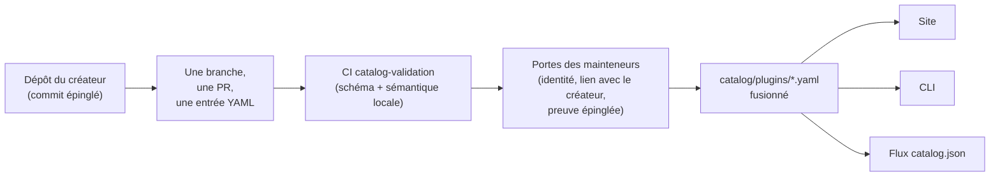

<div align="center">


# 🧩 Awesome Omni DSH Plugins

> **Projet communautaire non officiel. Non affilié à DeepSeek, non approuvé ni sponsorisé par DeepSeek.**
> Les noms et marques DeepSeek appartiennent à leur propriétaire respectif.

Découverte axée sur le créateur et installation en une seule commande pour les plugins **DeepSeek Harness (DSH)**.

<h2>
  🌐 <a href="https://dsh-plugins.omniroute.online"><strong>dsh-plugins.omniroute.online</strong></a> 🌐
</h2>
<h3>
  <a href="https://dsh-plugins.omniroute.online">Parcourez, recherchez et installez n'importe quel plugin sur le site →</a>
</h3>

[](https://dsh-plugins.omniroute.online)
[](https://www.npmjs.com/package/@diegosouza.pw/dsh-plugins)
[](https://github.com/diegosouzapw/awesome-omni-dsh-plugins/actions/workflows/validate-catalog.yml)
[](../../LICENSE)
[](https://dsh-plugins.omniroute.online)

<br/>

<b>🌐 En 43 langues</b>
<br/><br/>
<a href="../../README.md"></a>
<a href="../pt-BR/README.md"></a>
<a href="../zh-CN/README.md"></a>
<a href="../zh-TW/README.md"></a>
<a href="../pt/README.md"></a>
<a href="../es/README.md"></a>
<a href="README.md"></a>
<a href="../it/README.md"></a>
<a href="../de/README.md"></a>
<a href="../nl/README.md"></a>
<a href="../ru/README.md"></a>
<a href="../uk-UA/README.md"></a>
<a href="../pl/README.md"></a>
<a href="../cs/README.md"></a>
<a href="../sk/README.md"></a>
<a href="../ro/README.md"></a>
<a href="../hu/README.md"></a>
<a href="../bg/README.md"></a>
<a href="../da/README.md"></a>
<a href="../fi/README.md"></a>
<a href="../no/README.md"></a>
<a href="../sv/README.md"></a>
<a href="../ja/README.md"></a>
<a href="../ko/README.md"></a>
<a href="../th/README.md"></a>
<a href="../vi/README.md"></a>
<a href="../id/README.md"></a>
<a href="../ms/README.md"></a>
<a href="../phi/README.md"></a>
<a href="../in/README.md"></a>
<a href="../hi/README.md"></a>
<a href="../gu/README.md"></a>
<a href="../mr/README.md"></a>
<a href="../ta/README.md"></a>
<a href="../te/README.md"></a>
<a href="../bn/README.md"></a>
<a href="../ur/README.md"></a>
<a href="../fa/README.md"></a>
<a href="../ar/README.md"></a>
<a href="../he/README.md"></a>
<a href="../tr/README.md"></a>
<a href="../az/README.md"></a>
<a href="../sw/README.md"></a>

</div>

---

## ⭐ Top 10 des plugins

Classé selon les étoiles du dépôt exact — seules comptent les étoiles obtenues par le dépôt propre du plugin, jamais celles d'un projet parent ([prédicat de classement](../../docs/RANKING.md)). Chaque nom renvoie vers le dépôt du créateur, épinglé au commit exact validé par le catalogue.

| # | Plugin | Créateur | ★ | Catégorie | Ce qu'il fait |
| --- | ------ | ------- | --- | -------- | ------------ |
| 1 | [dsh-visualize](https://github.com/Nagi-ovo/dsh-visualize) | [@Nagi-ovo](https://github.com/Nagi-ovo) | 180 | UI & dashboards | Visualisation intégrée : le modèle affiche des graphiques et diagrammes interactifs dans la session |
| 2 | [dsh-pet-remielle](https://github.com/Gin-7/dsh-pet-remielle) | [@Gin-7](https://github.com/Gin-7) | 20 | Entertainment | Animal de bureau transparent branchable à chaud (Remielle, Zenless Zone Zero) pour l'interface web du DSH |
| 3 | [dsh-whale-musume](https://github.com/Sutera-Diffusus/dsh-whale-musume) | [@Sutera-Diffusus](https://github.com/Sutera-Diffusus) | 19 | Entertainment | Mascotte animée de fille-baleine Kanban Musume qui réagit à l'activité du tableau de bord |
| 4 | [deepseek-harness-tui](https://github.com/gxinxing/deepseek-harness-tui) | [@gxinxing](https://github.com/gxinxing) | 7 | UI & dashboards | Client de chat en terminal plein écran, façon curses, pour piloter les sessions dsh |
| 5 | [dsh-tui](https://github.com/turtle1999/turtle-ui) | [@turtle1999](https://github.com/turtle1999) | 7 | UI & dashboards | Porte d'entrée interactive en terminal pi-tui : sélecteur de session, chat en streaming, raccourcis clavier |
| 6 | [dsh-tavily-workspace](https://github.com/moguiyu/dsh-tavily) | [@moguiyu](https://github.com/moguiyu) | 3 | Search & research | Outil de recherche avancée Tavily à activer, avec gestion multi-clés et jauge d'utilisation |
| 7 | [dsh-bili-widget](https://github.com/pyf2818/dsh-bili-widget) | [@pyf2818](https://github.com/pyf2818) | 2 | Entertainment | Widget flottant de vidéos bilibili : recommandations, tendances, classements et recherche |
| 8 | [dsh-themes](https://github.com/MangMax/dsh-themes) | [@MangMax](https://github.com/MangMax) | 1 | Entertainment | Plugin d'apparence : palettes intégrées, mode clair/sombre/système, thèmes VS Code |
| 9 | [dsh-arknights](https://github.com/DocJlm/dsh-arknights) | [@DocJlm](https://github.com/DocJlm) | — | Entertainment | Skin non commercial de jardin astral Arknights mettant en scène Pramanix et Eyjafjalla |
| 10 | [dsh-bridge-browser](https://github.com/Lum1104/dsh-browser) | [@Lum1104](https://github.com/Lum1104) | — | Browser automation | Pont WebSocket authentifié par jeton pour l'extension de navigateur associée |

<div align="center">

### 👉 👉 [**Recherchez tous les plugins, consultez les détails et copiez la commande d'installation sur le site →**](https://dsh-plugins.omniroute.online) 👈 👈

</div>

## En un coup d'œil

| Surface     | Ce que c'est                                                       | Où                                                                    |
| ----------- | ---------------------------------------------------------------- | ------------------------------------------------------------------------ |
| **Site** | Navigateur de catalogue rendu, avec recherche et classement | [dsh-plugins.omniroute.online](https://dsh-plugins.omniroute.online) |
| **Catalogue** | Un fichier YAML par plugin, l'unique source de vérité | [`catalog/plugins/`](../../catalog/plugins) |
| **Schéma** | JSON Schema public (draft 2020-12) auquel chaque entrée est validée | [`schemas/plugin.schema.yaml`](../../schemas/plugin.schema.yaml) |
| **CLI** | Recherche, inspecte, valide et installe depuis le catalogue | [`@diegosouza.pw/dsh-plugins`](https://www.npmjs.com/package/@diegosouza.pw/dsh-plugins) |
| **Flux machine** | `catalog.json` + `catalog.snapshot.json` pour les outils | [catalog.json](https://dsh-plugins.omniroute.online/catalog.json) · [catalog.snapshot.json](https://dsh-plugins.omniroute.online/catalog.snapshot.json) |

Ce dépôt est la source publique de vérité du catalogue. Chaque entrée est un fichier YAML sous `catalog/plugins/`, validé selon un JSON Schema publié, ajouté via une pull request revue individuellement et toujours crédité au créateur original du plugin. Rien dans le catalogue n'est généré à partir d'un autre catalogue ou d'une autre liste : chaque entrée est reconstruite à partir du dépôt original du créateur, à un commit épinglé.

Le site et la CLI sont maintenus à partir d'une source privée ; ce dépôt contient les données publiques du catalogue, le schéma et les politiques qu'ils consomment.

## État du catalogue

**10 plugins fusionnés.** Chaque plugin entre via une pull request revue individuellement, une à la fois, depuis le dépôt original du créateur, avec un commit source épinglé et une attribution explicite.

## 🚀 Installer la CLI

```bash
npx @diegosouza.pw/dsh-plugins --help
```

Le paquet à portée est publié sous le nom `@diegosouza.pw/dsh-plugins@0.1.0` et la commande ci-dessus est aujourd'hui l'invocation canonique ; aucun script d'installation n'est hébergé ici.

### Utiliser la CLI aujourd'hui

La version 0.1.0 fournit des commandes de découverte et de validation en lecture seule, ainsi que des commandes d'installation soumises à consentement. La référence complète des commandes, y compris les indicateurs, les codes de sortie et le verrou de consentement pour l'exécution de code, se trouve dans [docs/CLI.md](../../docs/CLI.md).

| Commande                        | Ce qu'elle fait                                                        | Touche votre système ?                    |
| ------------------------------ | ------------------------------------------------------------------- | ---------------------------------------- |
| `catalog validate --catalog .` | Valide le YAML du catalogue, le schéma et la sémantique locale | Non — lecture seule |
| `search <query...>` | Recherche les champs publics du catalogue localement | Non — lecture seule |
| `info <id>` | Affiche une entrée publique du catalogue | Non — lecture seule |
| `list` | Liste les installations gérées par le catalogue sans modifier les profils | Non — lecture seule |
| `doctor` | Diagnostics en lecture seule de Node, DSH, politique native Windows et catalogue | Non — lecture seule |
| `add <id> --profile <name> --dry-run` | Affiche le plan d'installation vérifié sans fichiers ni sous-processus | Non — simulation (dry-run) |
| `add <id> --profile <name> --allow-code-execution` | Installe via la délégation officielle du DSH | Oui — uniquement avec l'indicateur de consentement explicite |

```bash
# Validate the catalog in this repository (what CI runs):
npx @diegosouza.pw/dsh-plugins@0.1.0 catalog validate --catalog .

# Search and inspect locally, without installing anything:
npx @diegosouza.pw/dsh-plugins@0.1.0 search memory --catalog .
npx @diegosouza.pw/dsh-plugins@0.1.0 info <plugin-id> --catalog .

# Preview an install plan; nothing is written and no subprocess runs:
npx @diegosouza.pw/dsh-plugins@0.1.0 add <plugin-id> --profile default --dry-run
```

Les commandes de modification (`add`, `update`, `remove`) n'exécutent jamais le code de cycle de vie du plugin, sauf si vous passez `--allow-code-execution`. Sur Windows natif, ces modifications sont désactivées dans la v0.1.0 ; utilisez WSL. Les commandes en lecture seule et en simulation fonctionnent partout.

## 🔍 Comment un plugin entre dans le catalogue



1. **Un plugin, une branche, une pull request.** La PR ajoute ou modifie exactement un fichier YAML sous `catalog/plugins/`.
2. **Priorité au créateur.** Une PR ouverte par le créateur du plugin ou par l'organisation propriétaire prime toujours sur la curation communautaire ou l'automatisation pour ce même plugin — voir [docs/CREDIT.md](../../docs/CREDIT.md).
3. **Preuves issues de la source originale.** Chaque champ est reconstruit à partir du dépôt du créateur, à un commit épinglé de 40 caractères : description, licence, intégration DSH, descripteur d'installation, étoiles.
4. **Validation locale.** `catalog validate` vérifie la structure et la sémantique locale ; c'est le même contrôle que le job CI `catalog-validation` exécute sur la PR.
5. **Portes des mainteneurs.** Avant la fusion, les mainteneurs vérifient séparément l'identité du dépôt, le lien avec le créateur et les preuves épinglées. Une validation locale au vert est nécessaire, jamais suffisante.

Le contrat complet — preuves requises, règles YAML, politique des étoiles, gestion des collisions et portes de revue — se trouve dans [CONTRIBUTING.md](../../CONTRIBUTING.md). Comment les décisions sont prises et par qui figure dans [docs/GOVERNANCE.md](../../docs/GOVERNANCE.md).

## 📄 Anatomie d'une entrée

Chaque entrée est un fichier YAML nommé d'après son ID. L'exemple ci-dessous est valide selon le schéma actuel (référence champ par champ dans [docs/SCHEMA.md](../../docs/SCHEMA.md)) :

```yaml
schemaVersion: 1
id: example-notes-search
name: Example Notes Search
description:
  en: >-
    Searches a local Markdown notes folder from DSH sessions and returns
    matching snippets with file paths.
  evidencePath: README.md
unofficial: true
kind: plugin
primaryCategory: search-research
tags:
  - search
  - notes
  - cli
source:
  repository: https://github.com/example-creator/example-notes-search
  repositoryNodeId: R_kgDOExample01
  subpath: null
  commit: 0123456789abcdef0123456789abcdef01234567
creator:
  github: example-creator
package:
  ecosystem: npm
  name: example-notes-search
  version: 1.4.2
dsh:
  profiles:
    - default
  evidencePath: dsh-plugin.json
repositoryScope: dedicated
popularity:
  starsPolicy: exact-repository
  stars: 128
license:
  spdx: MIT
verification:
  status: eligible
  checkedAt: "2026-08-18T12:00:00Z"
  repositoryIdentity: resolved
  smokeTest: null
provenance:
  discussion: null
  comment: null
```

Invariants clés imposés par le schéma :

- `unofficial: true` et `schemaVersion: 1` sont des constantes.
- Un plugin de monorepo doit utiliser `stars: null` — les étoiles du projet parent ne sont jamais héritées.
- Le descripteur d'installation est soit un paquet npm à version exacte, soit la source épinglée elle-même ; ce sont des données, jamais une commande shell.
- Le statut `verified` exige une preuve de test de fumée vérifiable ; sinon l'entrée est `eligible` avec `smokeTest: null`.

## 🗂 Ce qui a sa place ici

Ce dépôt catalogue des intégrations publiées de manière indépendante pour DeepSeek Harness (DSH), y compris des plugins natifs, des familles de plugins, des thèmes, des skills, des clients et des ponts. Les types d'artefacts, les catégories de capacités et les étiquettes d'interface sont définis dans [docs/CATEGORIES.md](../../docs/CATEGORIES.md).

Chaque enregistrement public est un fichier YAML sous `catalog/plugins/` et doit être valide selon `schemas/plugin.schema.yaml`. Une inscription signifie que les contrôles documentés d'éligibilité ou de vérification ont été effectués ; ce n'est ni une certification de sécurité ni un soutien de DeepSeek.

## 🏅 Classement et vérification

Seuls les dépôts de plugins dédiés, natifs, éligibles ou vérifiés, dont les étoiles appartiennent exactement à ce dépôt, peuvent entrer dans un classement par étoiles. Les intégrations stockées dans des monorepos plus larges restent détectables mais utilisent `stars: null` et n'héritent jamais des étoiles du projet parent. Voir [docs/RANKING.md](../../docs/RANKING.md) pour le prédicat complet.

Les états de vérification publics distinguent l'éligibilité structurelle d'un test de fumée d'installation. Aucun état ne représente une sécurité absolue. Examinez le dépôt du plugin, le commit épinglé, la licence et le comportement d'installation avant de l'utiliser.

## 🤝 Contribuer ou revendiquer une entrée

Lisez [CONTRIBUTING.md](../../CONTRIBUTING.md) avant d'ouvrir une pull request. Une pull request doit ajouter ou modifier exactement une entrée de plugin et doit citer le dépôt original du créateur plutôt qu'un autre catalogue. Les pull requests rédigées par le créateur priment sur les pull requests automatisées du catalogue.

Des formulaires d'issue structurés sont disponibles pour les revendications de créateur, les corrections et les suppressions. N'envoyez jamais d'identifiants, de coordonnées privées ou d'autres secrets.

## 👩‍🎨 Créateurs des plugins

Le catalogue existe grâce à ces créateurs qui ont publié des plugins. Chaque entrée crédite son créateur et renvoie vers son dépôt — toujours.

<a href="https://github.com/Nagi-ovo" title="@Nagi-ovo — dsh-visualize"></a>
<a href="https://github.com/Gin-7" title="@Gin-7 — dsh-pet-remielle"></a>
<a href="https://github.com/Sutera-Diffusus" title="@Sutera-Diffusus — dsh-whale-musume"></a>
<a href="https://github.com/gxinxing" title="@gxinxing — deepseek-harness-tui"></a>
<a href="https://github.com/turtle1999" title="@turtle1999 — dsh-tui"></a>
<a href="https://github.com/moguiyu" title="@moguiyu — dsh-tavily-workspace"></a>
<a href="https://github.com/pyf2818" title="@pyf2818 — dsh-bili-widget"></a>
<a href="https://github.com/MangMax" title="@MangMax — dsh-themes"></a>
<a href="https://github.com/DocJlm" title="@DocJlm — dsh-arknights"></a>
<a href="https://github.com/Lum1104" title="@Lum1104 — dsh-bridge-browser"></a>

Vous voulez votre plugin ici, avec un crédit complet ? [Ouvrez une PR avec une entrée YAML](../../CONTRIBUTING.md) — ou [revendiquez une entrée existante](https://github.com/diegosouzapw/awesome-omni-dsh-plugins/issues/new/choose) si quelqu'un a catalogué votre travail avant vous.

## 📚 Documentation

| Document                                     | Ce qu'il couvre                                                       |
| --------------------------------------------- | ---------------------------------------------------------------------- |
| [CONTRIBUTING.md](../../CONTRIBUTING.md)           | Le contrat de contribution complet : preuves, règles YAML, portes de revue    |
| [SECURITY.md](../../SECURITY.md)           | Signaler des vulnérabilités de plugin ou de catalogue ; politique des secrets    |
| [docs/SCHEMA.md](../../docs/SCHEMA.md)           | Référence champ par champ de `schemas/plugin.schema.yaml`    |
| [docs/CLI.md](../../docs/CLI.md)           | Référence des commandes CLI pour `@diegosouza.pw/dsh-plugins@0.1.0`    |
| [docs/GOVERNANCE.md](../../docs/GOVERNANCE.md)           | Comment le catalogue est gouverné : précédence, portes, revendications et suppressions    |
| [docs/CATEGORIES.md](../../docs/CATEGORIES.md)           | Types d'artefacts, catégories de capacités principales, étiquettes, portée du dépôt    |
| [docs/CREDIT.md](../../docs/CREDIT.md)           | Crédit du créateur, précédence des PR et politique d'identité Git    |
| [docs/RANKING.md](../../docs/RANKING.md)           | Le prédicat de classement public et les états de vérification    |
| [docs/UNOFFICIAL.md](../../docs/UNOFFICIAL.md)           | Statut non officiel et posture en matière de marques    |

## 🌐 Traductions

Ce README est disponible en 43 langues sous [`docs/i18n/`](..) — utilisez le sélecteur de drapeaux en haut de page. L'anglais fait foi ; en cas de divergence entre une traduction et le texte anglais, le texte anglais prévaut. Les corrections à toute traduction sont les bienvenues via des pull requests normales.

## 📜 Licence et attribution

La documentation et les modèles de dépôt sont sous licence [MIT](../../LICENSE). Les faits originaux du catalogue et les métadonnées éditoriales YAML sont dédiés sous [CC0-1.0](../../LICENSE-CATALOG). Le code, les noms, les logos et les captures d'écran en amont restent sous leurs propriétaires et licences d'origine. Voir [docs/CREDIT.md](../../docs/CREDIT.md) et [docs/UNOFFICIAL.md](../../docs/UNOFFICIAL.md).

<div align="center">

### ⭐ Si ce catalogue vous a aidé à trouver un plugin, mettez une étoile au dépôt — cela aide les créateurs à être découverts.

**[Parcourez tous les plugins sur le site →](https://dsh-plugins.omniroute.online)**

</div>
