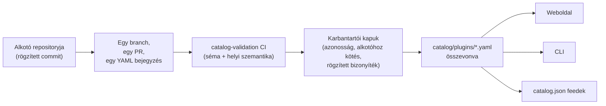

<div align="center">


# 🧩 Awesome Omni DSH Plugins

> **Nem hivatalos közösségi projekt. Nem áll kapcsolatban a DeepSeekkel, és a DeepSeek nem hagyta jóvá, nem is támogatja.**
> A DeepSeek nevek és védjegyek a jogos tulajdonosukat illetik.

Alkotó-központú felfedezés és egyparancsos telepítés a **DeepSeek Harness (DSH)** bővítményekhez.

<h2>
  🌐 <a href="https://dsh-plugins.omniroute.online"><strong>dsh-plugins.omniroute.online</strong></a> 🌐
</h2>
<h3>
  <a href="https://dsh-plugins.omniroute.online">Böngéssz, keress és telepíts bármelyik bővítményt a weboldalon →</a>
</h3>

[](https://dsh-plugins.omniroute.online)
[](https://www.npmjs.com/package/@diegosouza.pw/dsh-plugins)
[](https://github.com/diegosouzapw/awesome-omni-dsh-plugins/actions/workflows/validate-catalog.yml)
[](../../LICENSE)
[](https://dsh-plugins.omniroute.online)

<br/>

<b>🌐 43 nyelven</b>
<br/><br/>
<a href="../../README.md"></a>
<a href="../pt-BR/README.md"></a>
<a href="../zh-CN/README.md"></a>
<a href="../zh-TW/README.md"></a>
<a href="../pt/README.md"></a>
<a href="../es/README.md"></a>
<a href="../fr/README.md"></a>
<a href="../it/README.md"></a>
<a href="../de/README.md"></a>
<a href="../nl/README.md"></a>
<a href="../ru/README.md"></a>
<a href="../uk-UA/README.md"></a>
<a href="../pl/README.md"></a>
<a href="../cs/README.md"></a>
<a href="../sk/README.md"></a>
<a href="../ro/README.md"></a>
<a href="README.md"></a>
<a href="../bg/README.md"></a>
<a href="../da/README.md"></a>
<a href="../fi/README.md"></a>
<a href="../no/README.md"></a>
<a href="../sv/README.md"></a>
<a href="../ja/README.md"></a>
<a href="../ko/README.md"></a>
<a href="../th/README.md"></a>
<a href="../vi/README.md"></a>
<a href="../id/README.md"></a>
<a href="../ms/README.md"></a>
<a href="../phi/README.md"></a>
<a href="../in/README.md"></a>
<a href="../hi/README.md"></a>
<a href="../gu/README.md"></a>
<a href="../mr/README.md"></a>
<a href="../ta/README.md"></a>
<a href="../te/README.md"></a>
<a href="../bn/README.md"></a>
<a href="../ur/README.md"></a>
<a href="../fa/README.md"></a>
<a href="../ar/README.md"></a>
<a href="../he/README.md"></a>
<a href="../tr/README.md"></a>
<a href="../az/README.md"></a>
<a href="../sw/README.md"></a>

</div>

---

## ⭐ Top 10 bővítmény

A rangsor a pontos repository csillagai alapján készül — csak a bővítmény saját repositoryja
által szerzett csillagok számítanak, egy szülőprojekté soha ([rangsorolási szabály](../../docs/RANKING.md)).
Minden név az alkotó repositoryjára mutat, a katalógus által ellenőrzött pontos commitra rögzítve.

| #   | Bővítmény | Alkotó | ★ | Kategória | Mit csinál |
| --- | ------ | ------- | --- | -------- | ------------ |
| 1 | [dsh-visualize](https://github.com/Nagi-ovo/dsh-visualize) | [@Nagi-ovo](https://github.com/Nagi-ovo) | 180 | UI & dashboards | Beágyazott vizualizáció: a modell interaktív diagramokat és grafikonokat jelenít meg közvetlenül a munkamenetben |
| 2 | [dsh-pet-remielle](https://github.com/Gin-7/dsh-pet-remielle) | [@Gin-7](https://github.com/Gin-7) | 20 | Entertainment | Menet közben csatlakoztatható, átlátszó asztali kedvenc (Remielle, Zenless Zone Zero) a DSH webes felületéhez |
| 3 | [dsh-whale-musume](https://github.com/Sutera-Diffusus/dsh-whale-musume) | [@Sutera-Diffusus](https://github.com/Sutera-Diffusus) | 19 | Entertainment | Animált bálnalány Kanban Musume kabala, amely reagál a vezérlőpult aktivitására |
| 4 | [deepseek-harness-tui](https://github.com/gxinxing/deepseek-harness-tui) | [@gxinxing](https://github.com/gxinxing) | 7 | UI & dashboards | Teljes képernyős, curses-stílusú terminál chatkliens dsh munkamenetek vezérléséhez |
| 5 | [dsh-tui](https://github.com/turtle1999/turtle-ui) | [@turtle1999](https://github.com/turtle1999) | 7 | UI & dashboards | Interaktív pi-tui terminál előtér: munkamenet-választó, streamelt chat, billentyűkombinációk |
| 6 | [dsh-tavily-workspace](https://github.com/moguiyu/dsh-tavily) | [@moguiyu](https://github.com/moguiyu) | 3 | Search & research | Opcionálisan bekapcsolható Tavily fejlett keresőeszköz több kulcs kezelésével és használati mérővel |
| 7 | [dsh-bili-widget](https://github.com/pyf2818/dsh-bili-widget) | [@pyf2818](https://github.com/pyf2818) | 2 | Entertainment | Lebegő bilibili videó widget: ajánlások, trendek, ranglisták és keresés |
| 8 | [dsh-themes](https://github.com/MangMax/dsh-themes) | [@MangMax](https://github.com/MangMax) | 1 | Entertainment | Megjelenés bővítmény: beépített paletták, világos/sötét/rendszer mód, VS Code témák |
| 9 | [dsh-arknights](https://github.com/DocJlm/dsh-arknights) | [@DocJlm](https://github.com/DocJlm) | — | Entertainment | Nem kereskedelmi célú, Arknights ihletésű „asztrálkert” kinézet Pramanix és Eyjafjalla szereplőkkel |
| 10 | [dsh-bridge-browser](https://github.com/Lum1104/dsh-browser) | [@Lum1104](https://github.com/Lum1104) | — | Browser automation | Token-hitelesítésű WebSocket híd a kísérő böngészőbővítményhez |

<div align="center">

### 👉 [**Keress az összes bővítmény között, olvasd el a részleteket, és másold ki a telepítőparancsot a weboldalon →**](https://dsh-plugins.omniroute.online) 👈

</div>

## Röviden

| Felület     | Mi ez                                                       | Hol                                                                    |
| ----------- | ---------------------------------------------------------------- | ------------------------------------------------------------------------ |
| **Weboldal** | Renderelt katalógusböngésző kereséssel és rangsorral                 | [dsh-plugins.omniroute.online](https://dsh-plugins.omniroute.online)     |
| **Katalógus** | Bővítményenként egy YAML-fájl, az egyetlen hiteles forrás             | [`catalog/plugins/`](../../catalog/plugins)                                    |
| **Séma**  | Nyilvános JSON Schema (draft 2020-12), amely alapján minden bejegyzést ellenőriznek | [`schemas/plugin.schema.yaml`](../../schemas/plugin.schema.yaml)               |
| **CLI**     | Keresés, vizsgálat, ellenőrzés és telepítés a katalógusból           | [`@diegosouza.pw/dsh-plugins`](https://www.npmjs.com/package/@diegosouza.pw/dsh-plugins) |
| **Gépi feedek** | `catalog.json` + `catalog.snapshot.json` eszközök számára           | [catalog.json](https://dsh-plugins.omniroute.online/catalog.json) · [catalog.snapshot.json](https://dsh-plugins.omniroute.online/catalog.snapshot.json) |

Ez a repository a katalógus nyilvános hiteles forrása. Minden bejegyzés egy YAML-fájl
a `catalog/plugins/` alatt, amelyet egy közzétett JSON Schema alapján ellenőriztek, egyedileg
átvizsgált pull requesten keresztül adtak hozzá, és mindig a bővítmény eredeti alkotójának
tulajdonítanak. A katalógusban semmi nem másik katalógusból vagy listából származik: minden
bejegyzés az eredeti alkotó repositoryjából épül újra, egy rögzített commitnál.

A weboldalt és a CLI-t privát forrásból tartják karban; ez a repository tartalmazza azokat
a nyilvános katalógusadatokat, sémát és irányelveket, amelyeket felhasználnak.

## Katalógus állapota

**10 bővítmény összevonva.** Minden bővítmény egyedileg átvizsgált pull requesten keresztül
kerül a katalógusba, egyesével, az eredeti alkotó repositoryjából, rögzített forrás-committal
és kifejezett tulajdonítással.

## 🚀 A CLI telepítése

```bash
npx @diegosouza.pw/dsh-plugins --help
```

A hatókörös csomag `@diegosouza.pw/dsh-plugins@0.1.0` néven jelenik meg, és a fenti parancs
ma a hivatalos hívási mód; telepítő szkript itt nincs elhelyezve.

### A CLI már ma is használható

A 0.1.0 verzió csak olvasható felfedező és ellenőrző parancsokat tartalmaz, valamint
hozzájáruláshoz kötött telepítő parancsokat. A teljes parancsreferencia — a jelölőkkel,
kilépési kódokkal és a kódfuttatási hozzájárulási kapuval együtt — a [docs/CLI.md](../../docs/CLI.md) fájlban található.

| Parancs                        | Mit csinál                                                        | Módosítja a rendszert?                    |
| ------------------------------ | ------------------------------------------------------------------- | --------------------------------------- |
| `catalog validate --catalog .` | Ellenőrzi a katalógus YAML-ját, sémáját és a helyi szemantikát                   | Nem — csak olvasható                          |
| `search <query...>`            | Helyben keres a katalógus nyilvános mezői között                                | Nem — csak olvasható                          |
| `info <id>`                    | Megjelenít egy nyilvános katalógusbejegyzést                                       | Nem — csak olvasható                          |
| `list`                         | Felsorolja a katalógus által kezelt telepítéseket a profilok módosítása nélkül            | Nem — csak olvasható                          |
| `doctor`                       | Csak olvasható diagnosztika a Node-hoz, DSH-hoz, natív Windows-irányelvhez és a katalógushoz  | Nem — csak olvasható                          |
| `add <id> --profile <name> --dry-run` | Megjeleníti az ellenőrzött telepítési tervet fájlok vagy alfolyamatok nélkül | Nem — próbafuttatás                            |
| `add <id> --profile <name> --allow-code-execution` | Telepít a hivatalos DSH-delegáláson keresztül        | Igen — csak kifejezett hozzájárulási jelölővel   |

```bash
# Validate the catalog in this repository (what CI runs):
npx @diegosouza.pw/dsh-plugins@0.1.0 catalog validate --catalog .

# Search and inspect locally, without installing anything:
npx @diegosouza.pw/dsh-plugins@0.1.0 search memory --catalog .
npx @diegosouza.pw/dsh-plugins@0.1.0 info <plugin-id> --catalog .

# Preview an install plan; nothing is written and no subprocess runs:
npx @diegosouza.pw/dsh-plugins@0.1.0 add <plugin-id> --profile default --dry-run
```

A módosító parancsok (`add`, `update`, `remove`) soha nem futtatják a bővítmény
élettartam-kódját, hacsak nem adod meg a `--allow-code-execution` jelölőt. Natív Windowson
ezek a módosítások a v0.1.0-ban le vannak tiltva; használj WSL-t. A csak olvasható és a
próbafuttatási parancsok mindenhol működnek.

## 🔍 Hogyan kerül egy bővítmény a katalógusba



1. **Egy bővítmény, egy branch, egy pull request.** A PR pontosan egy YAML-fájlt ad hozzá
   vagy módosít a `catalog/plugins/` alatt.
2. **Alkotó-elsőbbség.** A bővítmény alkotója vagy a tulajdonos szervezet által nyitott PR
   mindig elsőbbséget élvez a közösségi kurátorlással vagy automatizálással szemben
   ugyanahhoz a bővítményhez — lásd [docs/CREDIT.md](../../docs/CREDIT.md).
3. **Bizonyíték az eredeti forrásból.** Minden mező az alkotó repositoryjából épül újra, egy
   rögzített, 40 karakteres committal: leírás, licenc, DSH-integráció, telepítési leíró,
   csillagok.
4. **Helyi ellenőrzés.** A `catalog validate` ellenőrzi a szerkezetet és a helyi szemantikát;
   ugyanaz az ellenőrzés, amelyet a `catalog-validation` CI feladat futtat a PR-on.
5. **Karbantartói kapuk.** Az összevonás előtt a karbantartók külön ellenőrzik a repository
   azonosságát, az alkotóhoz kötést és a rögzített bizonyítékokat. A zöld helyi ellenőrzés
   szükséges, de soha nem elégséges.

A teljes szerződés — a szükséges bizonyítékok, a YAML-szabályok, a csillag-irányelv, az
ütközéskezelés és az átvizsgálási kapuk — a [CONTRIBUTING.md](../../CONTRIBUTING.md) fájlban található.
Hogy hogyan és ki hozza meg a döntéseket, azt a [docs/GOVERNANCE.md](../../docs/GOVERNANCE.md) írja le.

## 📄 Egy bejegyzés felépítése

Minden bejegyzés egy, az azonosítója szerint elnevezett YAML-fájl. Az alábbi példa megfelel a
jelenlegi sémának (mezőnkénti referencia a [docs/SCHEMA.md](../../docs/SCHEMA.md) fájlban):

```yaml
schemaVersion: 1
id: example-notes-search
name: Example Notes Search
description:
  en: >-
    Searches a local Markdown notes folder from DSH sessions and returns
    matching snippets with file paths.
  evidencePath: README.md
unofficial: true
kind: plugin
primaryCategory: search-research
tags:
  - search
  - notes
  - cli
source:
  repository: https://github.com/example-creator/example-notes-search
  repositoryNodeId: R_kgDOExample01
  subpath: null
  commit: 0123456789abcdef0123456789abcdef01234567
creator:
  github: example-creator
package:
  ecosystem: npm
  name: example-notes-search
  version: 1.4.2
dsh:
  profiles:
    - default
  evidencePath: dsh-plugin.json
repositoryScope: dedicated
popularity:
  starsPolicy: exact-repository
  stars: 128
license:
  spdx: MIT
verification:
  status: eligible
  checkedAt: "2026-08-18T12:00:00Z"
  repositoryIdentity: resolved
  smokeTest: null
provenance:
  discussion: null
  comment: null
```

A séma által kikényszerített kulcsfontosságú invariánsok:

- Az `unofficial: true` és a `schemaVersion: 1` állandók.
- Egy monorepóból származó bővítménynek `stars: null` értéket kell használnia — a szülőprojekt csillagai soha nem öröklődnek.
- A telepítési leíró vagy egy pontos verziójú npm csomag, vagy maga a rögzített forrás; ez
  adat, soha nem shell parancs.
- A `verified` állapot ellenőrizhető smoke-teszt bizonyítékot igényel; egyébként a bejegyzés
  állapota `eligible`, `smokeTest: null` értékkel.

## 🗂 Mi tartozik ide

Ez a repository a DeepSeek Harness (DSH) számára önállóan közzétett integrációkat katalogizálja,
beleértve a natív bővítményeket, bővítménycsaládokat, témákat, skilleket, klienseket és hidakat.
A műtárgytípusok, képességkategóriák és interfészcímkék a [docs/CATEGORIES.md](../../docs/CATEGORIES.md) fájlban vannak meghatározva.

Minden nyilvános bejegyzés egy YAML-fájl a `catalog/plugins/` alatt, és meg kell felelnie a
`schemas/plugin.schema.yaml` sémának. Egy bejegyzés azt jelenti, hogy a dokumentált
jogosultsági vagy ellenőrzési vizsgálatok megtörténtek; ez nem biztonsági tanúsítvány, és nem
is a DeepSeek jóváhagyása.

## 🏅 Rangsorolás és ellenőrzés

Csillag-rangsorba csak dedikált, natív, jogosult vagy ellenőrzött bővítmény-repositoryk
kerülhetnek, amelyek csillagai pontosan ahhoz a repositoryhoz tartoznak. A nagyobb monorepókban
tárolt integrációk továbbra is felfedezhetők, de `stars: null` értéket használnak, és soha nem
örökölnek szülőprojekt-csillagokat. A teljes szabályt lásd a [docs/RANKING.md](../../docs/RANKING.md) fájlban.

A nyilvános ellenőrzési állapotok megkülönböztetik a szerkezeti jogosultságot a telepítési
smoke-teszttől. Egyik állapot sem jelent abszolút biztonságot. Használat előtt vizsgáld meg a
bővítmény repositoryját, a rögzített commitot, a licencet és a telepítés viselkedését.

## 🤝 Járulj hozzá, vagy igényelj egy bejegyzést

Olvasd el a [CONTRIBUTING.md](../../CONTRIBUTING.md) fájlt, mielőtt pull requestet nyitnál. Egy pull
requestnek pontosan egy bővítménybejegyzést kell hozzáadnia vagy módosítania, és az eredeti
alkotó repositoryjára kell hivatkoznia, nem egy másik katalógusra. Az alkotók által készített
pull requestek elsőbbséget élveznek az automatizált katalógus pull requestekkel szemben.

Strukturált issue-űrlapok állnak rendelkezésre alkotói igénylésekhez, javításokhoz és
eltávolításokhoz. Soha ne küldj be hitelesítő adatokat, privát elérhetőségeket vagy más
titkokat.

## 👩‍🎨 Bővítmény-alkotók

A katalógus azért létezik, mert ezek az alkotók bővítményeket adtak ki. Minden bejegyzés
feltünteti az alkotóját, és mindig visszamutat a repositoryjára.

<a href="https://github.com/Nagi-ovo" title="@Nagi-ovo — dsh-visualize"></a>
<a href="https://github.com/Gin-7" title="@Gin-7 — dsh-pet-remielle"></a>
<a href="https://github.com/Sutera-Diffusus" title="@Sutera-Diffusus — dsh-whale-musume"></a>
<a href="https://github.com/gxinxing" title="@gxinxing — deepseek-harness-tui"></a>
<a href="https://github.com/turtle1999" title="@turtle1999 — dsh-tui"></a>
<a href="https://github.com/moguiyu" title="@moguiyu — dsh-tavily-workspace"></a>
<a href="https://github.com/pyf2818" title="@pyf2818 — dsh-bili-widget"></a>
<a href="https://github.com/MangMax" title="@MangMax — dsh-themes"></a>
<a href="https://github.com/DocJlm" title="@DocJlm — dsh-arknights"></a>
<a href="https://github.com/Lum1104" title="@Lum1104 — dsh-bridge-browser"></a>

Szeretnéd, hogy a bővítményed itt szerepeljen, teljes elismeréssel? [Nyiss egy PR-t egy YAML
bejegyzéssel](../../CONTRIBUTING.md) — vagy [igényelj egy meglévő
bejegyzést](https://github.com/diegosouzapw/awesome-omni-dsh-plugins/issues/new/choose), ha valaki
már korábban katalogizálta a munkádat, mint te.

## 📚 Dokumentáció

| Dokumentum                                     | Miről szól                                                       |
| -------------------------------------------- | -------------------------------------------------------------------- |
| [CONTRIBUTING.md](../../CONTRIBUTING.md)           | A teljes hozzájárulási szerződés: bizonyítékok, YAML-szabályok, átvizsgálási kapuk    |
| [SECURITY.md](../../SECURITY.md)                   | Bővítmény- vagy katalógussérülékenységek jelentése; titok-irányelv           |
| [docs/SCHEMA.md](../../docs/SCHEMA.md)             | Mezőnkénti referencia a `schemas/plugin.schema.yaml` fájlhoz             |
| [docs/CLI.md](../../docs/CLI.md)                   | CLI parancsreferencia a `@diegosouza.pw/dsh-plugins@0.1.0` verzióhoz          |
| [docs/GOVERNANCE.md](../../docs/GOVERNANCE.md)     | Hogyan irányítják a katalógust: elsőbbség, kapuk, igénylések és eltávolítások   |
| [docs/CATEGORIES.md](../../docs/CATEGORIES.md)     | Műtárgytípusok, elsődleges képességkategóriák, címkék, repository-hatókör |
| [docs/CREDIT.md](../../docs/CREDIT.md)             | Alkotói elismerés, PR-elsőbbség és Git-azonosítási irányelv                 |
| [docs/RANKING.md](../../docs/RANKING.md)           | A nyilvános rangsorolási szabály és az ellenőrzési állapotok                  |
| [docs/UNOFFICIAL.md](../../docs/UNOFFICIAL.md)     | Nem hivatalos státusz és védjegyekkel kapcsolatos álláspont                               |

## 🌐 Fordítások

Ez a README 43 nyelven elérhető a [`docs/i18n/`](..) mappában — használd a lap tetején lévő
zászlóválasztót. Az angol szöveg a hiteles forrás; ha egy fordítás eltér az angol szövegtől, az
angol szöveg az irányadó. Bármely fordítás javításait szívesen fogadjuk szokásos pull
requesteken keresztül.

## 📜 Licenc és tulajdonítás

A dokumentáció és a repository-sablonok az [MIT licenc](../../LICENSE) alatt állnak. Az eredeti
katalógustényeket és a szerkesztői YAML-metaadatokat [CC0-1.0](../../LICENSE-CATALOG) alatt tették
közkinccsé. Az upstream kód, nevek, logók és képernyőképek az eredeti tulajdonosaik és
licenceik alatt maradnak. Lásd: [docs/CREDIT.md](../../docs/CREDIT.md) és [docs/UNOFFICIAL.md](../../docs/UNOFFICIAL.md).

<div align="center">

### ⭐ Ha ez a katalógus segített megtalálni egy bővítményt, csillagozd meg a repositoryt — ezzel segíted az alkotók felfedezését.

**[Böngéssz az összes bővítmény között a weboldalon →](https://dsh-plugins.omniroute.online)**

</div>
