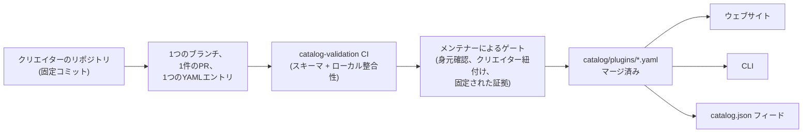

<div align="center">


# 🧩 Awesome Omni DSH Plugins

> **これは非公式のコミュニティプロジェクトです。DeepSeek とは提携・承認・スポンサー関係はありません。**
> DeepSeek の名称および商標は、それぞれの権利者に帰属します。

**DeepSeek Harness (DSH)** プラグインを、クリエイター最優先で見つけ、ワンコマンドでインストールできます。

<h2>
  🌐 <a href="https://dsh-plugins.omniroute.online"><strong>dsh-plugins.omniroute.online</strong></a> 🌐
</h2>
<h3>
  <a href="https://dsh-plugins.omniroute.online">ウェブサイトですべてのプラグインを閲覧・検索・インストール →</a>
</h3>

[](https://dsh-plugins.omniroute.online)
[](https://www.npmjs.com/package/@diegosouza.pw/dsh-plugins)
[](https://github.com/diegosouzapw/awesome-omni-dsh-plugins/actions/workflows/validate-catalog.yml)
[](../../LICENSE)
[](https://dsh-plugins.omniroute.online)

<br/>

<b>🌐 43言語に対応</b>
<br/><br/>
<a href="../../README.md"></a>
<a href="../pt-BR/README.md"></a>
<a href="../zh-CN/README.md"></a>
<a href="../zh-TW/README.md"></a>
<a href="../pt/README.md"></a>
<a href="../es/README.md"></a>
<a href="../fr/README.md"></a>
<a href="../it/README.md"></a>
<a href="../de/README.md"></a>
<a href="../nl/README.md"></a>
<a href="../ru/README.md"></a>
<a href="../uk-UA/README.md"></a>
<a href="../pl/README.md"></a>
<a href="../cs/README.md"></a>
<a href="../sk/README.md"></a>
<a href="../ro/README.md"></a>
<a href="../hu/README.md"></a>
<a href="../bg/README.md"></a>
<a href="../da/README.md"></a>
<a href="../fi/README.md"></a>
<a href="../no/README.md"></a>
<a href="../sv/README.md"></a>
<a href="README.md"></a>
<a href="../ko/README.md"></a>
<a href="../th/README.md"></a>
<a href="../vi/README.md"></a>
<a href="../id/README.md"></a>
<a href="../ms/README.md"></a>
<a href="../phi/README.md"></a>
<a href="../in/README.md"></a>
<a href="../hi/README.md"></a>
<a href="../gu/README.md"></a>
<a href="../mr/README.md"></a>
<a href="../ta/README.md"></a>
<a href="../te/README.md"></a>
<a href="../bn/README.md"></a>
<a href="../ur/README.md"></a>
<a href="../fa/README.md"></a>
<a href="../ar/README.md"></a>
<a href="../he/README.md"></a>
<a href="../tr/README.md"></a>
<a href="../az/README.md"></a>
<a href="../sw/README.md"></a>

</div>

---

## ⭐ トップ10プラグイン

ランキングは、そのプラグイン自身のリポジトリが獲得したスターのみを対象とし、親プロジェクトのスターは決してカウントしません
([ランキング判定基準](../../docs/RANKING.md))。名前はすべて、カタログが検証した時点のコミットに固定されたクリエイターの
リポジトリにリンクしています。

| #   | Plugin | Creator | ★ | Category | 機能概要 |
| --- | ------ | ------- | --- | -------- | ------------ |
| 1 | [dsh-visualize](https://github.com/Nagi-ovo/dsh-visualize) | [@Nagi-ovo](https://github.com/Nagi-ovo) | 180 | UI & dashboards | インライン可視化:セッション内でモデルがインタラクティブなチャートや図を描画 |
| 2 | [dsh-pet-remielle](https://github.com/Gin-7/dsh-pet-remielle) | [@Gin-7](https://github.com/Gin-7) | 20 | Entertainment | DSH Web GUI 向けのホットプラグ対応・透過型デスクトップペット(『ゼンレスゾーンゼロ』のレミリア) |
| 3 | [dsh-whale-musume](https://github.com/Sutera-Diffusus/dsh-whale-musume) | [@Sutera-Diffusus](https://github.com/Sutera-Diffusus) | 19 | Entertainment | ダッシュボードの活動に反応するアニメーション付きクジラ少女の看板娘マスコット |
| 4 | [deepseek-harness-tui](https://github.com/gxinxing/deepseek-harness-tui) | [@gxinxing](https://github.com/gxinxing) | 7 | UI & dashboards | dsh セッションを操作するための curses 風フルスクリーン端末チャットクライアント |
| 5 | [dsh-tui](https://github.com/turtle1999/turtle-ui) | [@turtle1999](https://github.com/turtle1999) | 7 | UI & dashboards | インタラクティブな pi-tui 端末フロントドア:セッション選択、ストリーミングチャット、キーバインド |
| 6 | [dsh-tavily-workspace](https://github.com/moguiyu/dsh-tavily) | [@moguiyu](https://github.com/moguiyu) | 3 | Search & research | オプトイン方式の Tavily 高度検索ツール、複数キー管理と使用量ゲージ付き |
| 7 | [dsh-bili-widget](https://github.com/pyf2818/dsh-bili-widget) | [@pyf2818](https://github.com/pyf2818) | 2 | Entertainment | フローティング bilibili 動画ウィジェット:おすすめ、トレンド、ランキング、検索 |
| 8 | [dsh-themes](https://github.com/MangMax/dsh-themes) | [@MangMax](https://github.com/MangMax) | 1 | Entertainment | 外観プラグイン:内蔵パレット、ライト/ダーク/システム連動モード、VS Code テーマ |
| 9 | [dsh-arknights](https://github.com/DocJlm/dsh-arknights) | [@DocJlm](https://github.com/DocJlm) | — | Entertainment | 『アークナイツ』プラマニクス&エイヤフィヤトラをフィーチャーした非商用の基地デコレーション |
| 10 | [dsh-bridge-browser](https://github.com/Lum1104/dsh-browser) | [@Lum1104](https://github.com/Lum1104) | — | Browser automation | 対応ブラウザ拡張機能向けのトークン認証 WebSocket ブリッジ |

<div align="center">

### 👉 [**ウェブサイトですべてのプラグインを検索し、詳細を読んでインストールコマンドをコピー →**](https://dsh-plugins.omniroute.online) 👈

</div>

## 概要

| 項目     | 内容                                                       | 場所                                                                    |
| ----------- | ---------------------------------------------------------------- | ------------------------------------------------------------------------ |
| **ウェブサイト** | 検索とランキング機能付きのカタログ閲覧画面                 | [dsh-plugins.omniroute.online](https://dsh-plugins.omniroute.online)     |
| **カタログ** | プラグインごとに1つの YAML ファイル、唯一の信頼できる情報源             | [`catalog/plugins/`](../../catalog/plugins)                                    |
| **スキーマ**  | すべてのエントリが検証対象とする、公開された JSON Schema(draft 2020-12) | [`schemas/plugin.schema.yaml`](../../schemas/plugin.schema.yaml)               |
| **CLI**     | カタログからの検索、確認、検証、インストール           | [`@diegosouza.pw/dsh-plugins`](https://www.npmjs.com/package/@diegosouza.pw/dsh-plugins) |
| **マシン向けフィード** | ツール向けの `catalog.json` + `catalog.snapshot.json`           | [catalog.json](https://dsh-plugins.omniroute.online/catalog.json) · [catalog.snapshot.json](https://dsh-plugins.omniroute.online/catalog.snapshot.json) |

このリポジトリは、カタログの公開された信頼できる情報源です。すべての掲載項目は `catalog/plugins/` 配下の1つの YAML
ファイルであり、公開された JSON Schema に対して検証され、個別にレビューされた1件のプルリクエストを通じて追加され、常に
プラグインの本来のクリエイターがクレジットされます。カタログ内のいかなる項目も他のカタログや一覧から生成されることはなく、
各エントリはクリエイター本来のリポジトリの固定コミットから再構築されています。

ウェブサイトと CLI は非公開のソースコードから保守されています。本リポジトリは、それらが利用する公開カタログデータ、
スキーマ、ポリシーを保持しています。

## カタログの状況

**10件のプラグインをマージ済み。** すべてのプラグインは、本来のクリエイターのリポジトリから、固定されたソースコミット
と明確なクレジット表示とともに、個別にレビューされた1件のプルリクエストを通じて、1件ずつ登録されます。

## 🚀 CLI のインストール

```bash
npx @diegosouza.pw/dsh-plugins --help
```

このスコープ付きパッケージは `@diegosouza.pw/dsh-plugins@0.1.0` として公開されており、上記のコマンドが現時点での標準
呼び出し方法です。インストーラースクリプトはここではホストされていません。

### CLI を今すぐ使う

バージョン 0.1.0 は、読み取り専用の発見・検証コマンドと、同意を必要とするインストールコマンドを提供します。フラグ、
終了コード、コード実行の同意ゲートを含む完全なコマンドリファレンスは [docs/CLI.md](../../docs/CLI.md) にあります。

| コマンド                        | 機能概要                                                        | システムへの影響                    |
| ------------------------------ | ------------------------------------------------------------------- | --------------------------------------- |
| `catalog validate --catalog .` | カタログの YAML、スキーマ、ローカル整合性を検証                   | なし——読み取り専用                          |
| `search <query...>`            | 公開カタログのフィールドをローカルで検索                                | なし——読み取り専用                          |
| `info <id>`                    | 公開カタログの1エントリを表示                                       | なし——読み取り専用                          |
| `list`                         | プロファイルを変更せずに、カタログで管理されたインストール一覧を表示            | なし——読み取り専用                          |
| `doctor`                       | Node、DSH、ネイティブ Windows のポリシー、カタログの読み取り専用診断  | なし——読み取り専用                          |
| `add <id> --profile <name> --dry-run` | ファイルもサブプロセスも生成せずに、検証済みのインストール計画を表示 | なし——ドライラン                            |
| `add <id> --profile <name> --allow-code-execution` | 公式の DSH デリゲーション経由でインストール        | あり——明示的な同意フラグを渡した場合のみ   |

```bash
# Validate the catalog in this repository (what CI runs):
npx @diegosouza.pw/dsh-plugins@0.1.0 catalog validate --catalog .

# Search and inspect locally, without installing anything:
npx @diegosouza.pw/dsh-plugins@0.1.0 search memory --catalog .
npx @diegosouza.pw/dsh-plugins@0.1.0 info <plugin-id> --catalog .

# Preview an install plan; nothing is written and no subprocess runs:
npx @diegosouza.pw/dsh-plugins@0.1.0 add <plugin-id> --profile default --dry-run
```

状態を変更するコマンド(`add`、`update`、`remove`)は、`--allow-code-execution` を渡さない限り、プラグインの
ライフサイクルコードを実行することはありません。ネイティブ Windows 上では、v0.1.0 においてこれらの変更操作は無効化
されています。WSL を使用してください。読み取り専用コマンドとドライランコマンドはどの環境でも動作します。

## 🔍 プラグインがカタログに登録される流れ



1. **1プラグイン、1ブランチ、1プルリクエスト。** PR は `catalog/plugins/` 配下のちょうど1つの YAML ファイルのみを
   追加または変更します。
2. **クリエイター優先。** プラグインのクリエイター本人、または権利を持つ組織が開いた PR は、同一プラグインについて
   コミュニティによる整理や自動化よりも常に優先されます——[docs/CREDIT.md](../../docs/CREDIT.md) を参照してください。
3. **本来の情報源からの証拠。** すべてのフィールドは、固定された40文字のコミットにおけるクリエイターのリポジトリから
   再構築されます:説明、ライセンス、DSH 統合、インストール記述子、スター数。
4. **ローカル検証。** `catalog validate` は構造とローカル整合性をチェックします。これは `catalog-validation` CI
   ジョブが PR 上で実行するチェックと同一です。
5. **メンテナーによるゲート。** マージ前に、メンテナーがリポジトリの身元、クリエイターへの紐付け、固定された証拠を
   個別に確認します。ローカル検証が緑であることは必要条件ですが、十分条件ではありません。

必要な証拠、YAML ルール、スターポリシー、衝突時の扱い、レビューゲートを含む完全な取り決めは
[CONTRIBUTING.md](../../CONTRIBUTING.md) にあります。意思決定がどのように、誰によって行われるかは
[docs/GOVERNANCE.md](../../docs/GOVERNANCE.md) にあります。

## 📄 エントリの構造

各エントリは、その ID にちなんで名付けられた1つの YAML ファイルです。以下の例は現行スキーマに対して検証を通過します
(フィールドごとのリファレンスは [docs/SCHEMA.md](../../docs/SCHEMA.md)):

```yaml
schemaVersion: 1
id: example-notes-search
name: Example Notes Search
description:
  en: >-
    Searches a local Markdown notes folder from DSH sessions and returns
    matching snippets with file paths.
  evidencePath: README.md
unofficial: true
kind: plugin
primaryCategory: search-research
tags:
  - search
  - notes
  - cli
source:
  repository: https://github.com/example-creator/example-notes-search
  repositoryNodeId: R_kgDOExample01
  subpath: null
  commit: 0123456789abcdef0123456789abcdef01234567
creator:
  github: example-creator
package:
  ecosystem: npm
  name: example-notes-search
  version: 1.4.2
dsh:
  profiles:
    - default
  evidencePath: dsh-plugin.json
repositoryScope: dedicated
popularity:
  starsPolicy: exact-repository
  stars: 128
license:
  spdx: MIT
verification:
  status: eligible
  checkedAt: "2026-08-18T12:00:00Z"
  repositoryIdentity: resolved
  smokeTest: null
provenance:
  discussion: null
  comment: null
```

スキーマによって強制される主な不変条件:

- `unofficial: true` と `schemaVersion: 1` は固定値です。
- monorepo 内のプラグインは `stars: null` を使用しなければなりません——親プロジェクトのスターは決して継承されません。
- インストール記述子は、バージョンが厳密に指定された npm パッケージ、または固定されたソースそのもののいずれかであり、
  データであってシェルコマンドでは決してありません。
- `verified` ステータスにはレビュー可能なスモークテストの証拠が必要です。それ以外の場合、エントリは `smokeTest: null`
  の `eligible` ステータスになります。

## 🗂 このリポジトリが扱う対象

このリポジトリは、DeepSeek Harness(DSH)向けに独立して公開された統合機能——ネイティブプラグイン、プラグインファミリー、
テーマ、スキル、クライアント、ブリッジなど——をカタログ化しています。成果物の種類、機能カテゴリ、インターフェースタグは
[docs/CATEGORIES.md](../../docs/CATEGORIES.md) で定義されています。

各公開レコードは `catalog/plugins/` 配下の1つの YAML ファイルであり、`schemas/plugin.schema.yaml` に対して検証を
通過する必要があります。掲載されていることは、文書化された適格性または検証チェックが完了したことを意味するのみで、
セキュリティ認証や DeepSeek による承認を意味するものではありません。

## 🏅 ランキングと検証

そのリポジトリ自身に帰属するスターを持つ、専用・ネイティブ・適格・検証済みのプラグインリポジトリのみが、スター
ランキングに参加できます。より大きな monorepo 内に格納された統合機能も引き続き発見可能ですが、`stars: null` を
使用し、親プロジェクトのスターを継承することは決してありません。完全な判定基準は
[docs/RANKING.md](../../docs/RANKING.md) を参照してください。

公開されている検証ステータスは、構造上の適格性とインストールのスモークテストを区別するものです。どのステータスも
絶対的な安全性を表すものではありません。使用前に、プラグインのリポジトリ、固定コミット、ライセンス、インストール時の
挙動を必ず確認してください。

## 🤝 貢献する・エントリを申請する

プルリクエストを送る前に [CONTRIBUTING.md](../../CONTRIBUTING.md) を読んでください。1件のプルリクエストは、ちょうど
1つのプラグインエントリを追加または変更するものでなければならず、他のカタログではなく本来のクリエイターのリポジトリを
引用しなければなりません。クリエイター本人によるプルリクエストは、自動化されたカタログのプルリクエストよりも優先され
ます。

クリエイターによる申請、修正、削除には、構造化された issue フォームが用意されています。認証情報、個人の連絡先、
その他の機密情報は決して送信しないでください。

## 👩‍🎨 プラグインクリエイター

このカタログが存在するのは、これらのクリエイターがプラグインを公開してくれたからです。すべてのエントリは、必ず
クリエイターをクレジットし、そのリポジトリへリンクしています。

<a href="https://github.com/Nagi-ovo" title="@Nagi-ovo — dsh-visualize"></a>
<a href="https://github.com/Gin-7" title="@Gin-7 — dsh-pet-remielle"></a>
<a href="https://github.com/Sutera-Diffusus" title="@Sutera-Diffusus — dsh-whale-musume"></a>
<a href="https://github.com/gxinxing" title="@gxinxing — deepseek-harness-tui"></a>
<a href="https://github.com/turtle1999" title="@turtle1999 — dsh-tui"></a>
<a href="https://github.com/moguiyu" title="@moguiyu — dsh-tavily-workspace"></a>
<a href="https://github.com/pyf2818" title="@pyf2818 — dsh-bili-widget"></a>
<a href="https://github.com/MangMax" title="@MangMax — dsh-themes"></a>
<a href="https://github.com/DocJlm" title="@DocJlm — dsh-arknights"></a>
<a href="https://github.com/Lum1104" title="@Lum1104 — dsh-bridge-browser"></a>

あなたのプラグインもここに、しっかりクレジット付きで掲載しませんか?[1つの YAML エントリを含む1件の PR を送る](../../CONTRIBUTING.md)か、
すでに誰かがあなたの作品より先にカタログ化していた場合は
[既存エントリを申請する](https://github.com/diegosouzapw/awesome-omni-dsh-plugins/issues/new/choose)ことができます。

## 📚 ドキュメント

| ドキュメント                                     | 内容                                                       |
| -------------------------------------------- | ---------------------------------------------------------------------------- |
| [CONTRIBUTING.md](../../CONTRIBUTING.md)           | 完全な貢献規約:必要な証拠、YAML ルール、レビューゲート    |
| [SECURITY.md](../../SECURITY.md)                   | プラグインやカタログの脆弱性の報告方法、機密情報ポリシー           |
| [docs/SCHEMA.md](../../docs/SCHEMA.md)             | `schemas/plugin.schema.yaml` のフィールドごとのリファレンス             |
| [docs/CLI.md](../../docs/CLI.md)                   | `@diegosouza.pw/dsh-plugins@0.1.0` の CLI コマンドリファレンス          |
| [docs/GOVERNANCE.md](../../docs/GOVERNANCE.md)     | カタログの統治方法:優先順位、ゲート、申請、削除   |
| [docs/CATEGORIES.md](../../docs/CATEGORIES.md)     | 成果物の種類、主要な機能カテゴリ、タグ、リポジトリ範囲 |
| [docs/CREDIT.md](../../docs/CREDIT.md)             | クリエイターのクレジット、PR の優先順位、Git ID ポリシー                 |
| [docs/RANKING.md](../../docs/RANKING.md)           | 公開されているランキング判定基準と検証ステータス                  |
| [docs/UNOFFICIAL.md](../../docs/UNOFFICIAL.md)     | 非公式である旨の位置付けと商標に関する立場                               |

## 🌐 翻訳

この README は [`docs/i18n/`](..) 配下で43言語版が提供されています——ページ上部の国旗セレクターを使用してください。
英語版が唯一の信頼できる情報源であり、翻訳と英語のテキストが食い違う場合は、英語のテキストが優先されます。翻訳への
修正提案は、通常のプルリクエストを通じて歓迎します。

## 📜 ライセンスとクレジット

ドキュメントおよびリポジトリテンプレートは [MIT ライセンス](../../LICENSE) の下で提供されています。カタログの元となる
事実情報および編集された YAML メタデータは、[CC0-1.0](../../LICENSE-CATALOG) の下でパブリックドメインに提供されて
います。アップストリームのコード、名称、ロゴ、スクリーンショットは、それぞれの本来の所有者と本来のライセンスの下に
残ります。[docs/CREDIT.md](../../docs/CREDIT.md) および [docs/UNOFFICIAL.md](../../docs/UNOFFICIAL.md) を参照して
ください。

<div align="center">

### ⭐ このカタログでお目当てのプラグインが見つかったら、ぜひリポジトリにスターを——クリエイターに見つけてもらう助けになります。

**[ウェブサイトですべてのプラグインを見る →](https://dsh-plugins.omniroute.online)**

</div>
