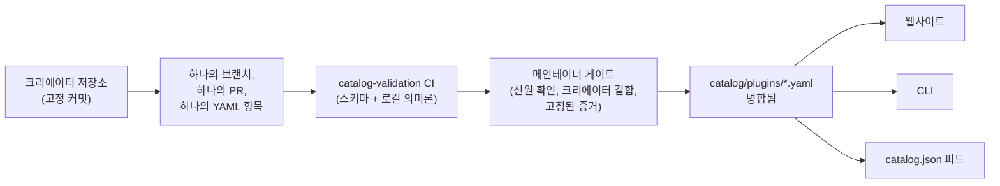

<div align="center">


# 🧩 Awesome Omni DSH Plugins

> **비공식 커뮤니티 프로젝트입니다. DeepSeek과 제휴, 승인 또는 후원 관계가 없습니다.**
> DeepSeek의 이름과 상표는 각 소유자에게 귀속됩니다.

**DeepSeek Harness (DSH)** 플러그인을 크리에이터 우선으로 찾고, 명령어 한 줄로 설치할 수 있습니다.

<h2>
  🌐 <a href="https://dsh-plugins.omniroute.online"><strong>dsh-plugins.omniroute.online</strong></a> 🌐
</h2>
<h3>
  <a href="https://dsh-plugins.omniroute.online">웹사이트에서 모든 플러그인을 둘러보고, 검색하고, 설치하세요 →</a>
</h3>

[](https://dsh-plugins.omniroute.online)
[](https://www.npmjs.com/package/@diegosouza.pw/dsh-plugins)
[](https://github.com/diegosouzapw/awesome-omni-dsh-plugins/actions/workflows/validate-catalog.yml)
[](../../LICENSE)
[](https://dsh-plugins.omniroute.online)

<br/>

<b>🌐 43개 언어 지원</b>
<br/><br/>
<a href="../../README.md"></a>
<a href="../pt-BR/README.md"></a>
<a href="../zh-CN/README.md"></a>
<a href="../zh-TW/README.md"></a>
<a href="../pt/README.md"></a>
<a href="../es/README.md"></a>
<a href="../fr/README.md"></a>
<a href="../it/README.md"></a>
<a href="../de/README.md"></a>
<a href="../nl/README.md"></a>
<a href="../ru/README.md"></a>
<a href="../uk-UA/README.md"></a>
<a href="../pl/README.md"></a>
<a href="../cs/README.md"></a>
<a href="../sk/README.md"></a>
<a href="../ro/README.md"></a>
<a href="../hu/README.md"></a>
<a href="../bg/README.md"></a>
<a href="../da/README.md"></a>
<a href="../fi/README.md"></a>
<a href="../no/README.md"></a>
<a href="../sv/README.md"></a>
<a href="../ja/README.md"></a>
<a href="README.md"></a>
<a href="../th/README.md"></a>
<a href="../vi/README.md"></a>
<a href="../id/README.md"></a>
<a href="../ms/README.md"></a>
<a href="../phi/README.md"></a>
<a href="../in/README.md"></a>
<a href="../hi/README.md"></a>
<a href="../gu/README.md"></a>
<a href="../mr/README.md"></a>
<a href="../ta/README.md"></a>
<a href="../te/README.md"></a>
<a href="../bn/README.md"></a>
<a href="../ur/README.md"></a>
<a href="../fa/README.md"></a>
<a href="../ar/README.md"></a>
<a href="../he/README.md"></a>
<a href="../tr/README.md"></a>
<a href="../az/README.md"></a>
<a href="../sw/README.md"></a>

</div>

---

## ⭐ 인기 플러그인 TOP 10

순위는 플러그인 자신의 저장소가 받은 스타만을 기준으로 하며, 상위 프로젝트의 스타는 절대 포함하지 않습니다
([순위 판정 기준](../../docs/RANKING.md)). 모든 이름은 카탈로그가 검증한 시점의 정확한 커밋에 고정된 크리에이터의
저장소로 연결됩니다.

| #   | Plugin | Creator | ★ | Category | 기능 설명 |
| --- | ------ | ------- | --- | -------- | ------------ |
| 1 | [dsh-visualize](https://github.com/Nagi-ovo/dsh-visualize) | [@Nagi-ovo](https://github.com/Nagi-ovo) | 180 | UI & dashboards | 인라인 시각화: 모델이 세션 안에서 인터랙티브한 차트와 다이어그램을 직접 렌더링 |
| 2 | [dsh-pet-remielle](https://github.com/Gin-7/dsh-pet-remielle) | [@Gin-7](https://github.com/Gin-7) | 20 | Entertainment | DSH 웹 GUI용 핫플러그 지원 투명 데스크톱 펫(《젠레스 존 제로》 레미엘) |
| 3 | [dsh-whale-musume](https://github.com/Sutera-Diffusus/dsh-whale-musume) | [@Sutera-Diffusus](https://github.com/Sutera-Diffusus) | 19 | Entertainment | 대시보드 활동에 반응하는 애니메이션 고래 소녀 간판 마스코트 |
| 4 | [deepseek-harness-tui](https://github.com/gxinxing/deepseek-harness-tui) | [@gxinxing](https://github.com/gxinxing) | 7 | UI & dashboards | dsh 세션을 제어하기 위한 curses 스타일 전체 화면 터미널 채팅 클라이언트 |
| 5 | [dsh-tui](https://github.com/turtle1999/turtle-ui) | [@turtle1999](https://github.com/turtle1999) | 7 | UI & dashboards | 인터랙티브한 pi-tui 터미널 진입점: 세션 선택기, 스트리밍 채팅, 키 바인딩 |
| 6 | [dsh-tavily-workspace](https://github.com/moguiyu/dsh-tavily) | [@moguiyu](https://github.com/moguiyu) | 3 | Search & research | 다중 키 관리와 사용량 게이지를 갖춘, 옵트인 방식의 Tavily 고급 검색 도구 |
| 7 | [dsh-bili-widget](https://github.com/pyf2818/dsh-bili-widget) | [@pyf2818](https://github.com/pyf2818) | 2 | Entertainment | 떠다니는 bilibili 동영상 위젯: 추천, 인기, 랭킹, 검색 |
| 8 | [dsh-themes](https://github.com/MangMax/dsh-themes) | [@MangMax](https://github.com/MangMax) | 1 | Entertainment | 외형 플러그인: 내장 팔레트, 라이트/다크/시스템 연동 모드, VS Code 테마 |
| 9 | [dsh-arknights](https://github.com/DocJlm/dsh-arknights) | [@DocJlm](https://github.com/DocJlm) | — | Entertainment | 《명일방주》 프라마닉스와 에이야퍄들라가 등장하는 비상업적 기지 스킨 |
| 10 | [dsh-bridge-browser](https://github.com/Lum1104/dsh-browser) | [@Lum1104](https://github.com/Lum1104) | — | Browser automation | 연동 브라우저 확장 프로그램을 위한 토큰 인증 WebSocket 브리지 |

<div align="center">

### 👉 [**웹사이트에서 모든 플러그인을 검색하고, 상세 정보를 읽고, 설치 명령어를 복사하세요 →**](https://dsh-plugins.omniroute.online) 👈

</div>

## 한눈에 보기

| 구성 요소     | 설명                                                       | 위치                                                                    |
| ----------- | ---------------------------------------------------------------- | ------------------------------------------------------------------------ |
| **웹사이트** | 검색과 순위 기능을 갖춘 카탈로그 브라우저                 | [dsh-plugins.omniroute.online](https://dsh-plugins.omniroute.online)     |
| **카탈로그** | 플러그인당 하나의 YAML 파일, 유일한 신뢰 가능한 정보 소스             | [`catalog/plugins/`](../../catalog/plugins)                                    |
| **스키마**  | 모든 항목이 검증받는 공개 JSON Schema(draft 2020-12) | [`schemas/plugin.schema.yaml`](../../schemas/plugin.schema.yaml)               |
| **CLI**     | 카탈로그에서 검색, 조회, 검증, 설치           | [`@diegosouza.pw/dsh-plugins`](https://www.npmjs.com/package/@diegosouza.pw/dsh-plugins) |
| **머신 피드** | 도구용 `catalog.json` + `catalog.snapshot.json`           | [catalog.json](https://dsh-plugins.omniroute.online/catalog.json) · [catalog.snapshot.json](https://dsh-plugins.omniroute.online/catalog.snapshot.json) |

이 저장소는 카탈로그의 공개된 신뢰 가능한 정보 소스입니다. 모든 등록 항목은 `catalog/plugins/` 아래의 YAML 파일 하나이며,
공개된 JSON Schema로 검증되고, 개별적으로 리뷰된 하나의 풀 리퀘스트를 통해 추가되며, 항상 플러그인의 원래 크리에이터를
크레딧합니다. 카탈로그의 어떤 항목도 다른 카탈로그나 목록에서 생성되지 않습니다. 각 항목은 크리에이터의 원본 저장소에서
고정된 커밋을 기준으로 재구성됩니다.

웹사이트와 CLI는 비공개 소스 코드로 관리됩니다. 이 저장소는 그것들이 사용하는 공개 카탈로그 데이터, 스키마, 정책을
담고 있습니다.

## 카탈로그 현황

**10개 플러그인 병합 완료.** 모든 플러그인은 원래 크리에이터의 저장소로부터, 고정된 소스 커밋과 명시적인 크레딧과 함께,
개별적으로 리뷰된 풀 리퀘스트를 통해 한 번에 하나씩 등록됩니다.

## 🚀 CLI 설치

```bash
npx @diegosouza.pw/dsh-plugins --help
```

이 스코프 패키지는 `@diegosouza.pw/dsh-plugins@0.1.0`으로 배포되어 있으며, 위 명령어가 현재 표준 실행 방법입니다.
이곳에는 별도의 설치 스크립트가 호스팅되어 있지 않습니다.

### 지금 CLI 사용하기

버전 0.1.0은 읽기 전용 탐색·검증 명령어와, 동의가 필요한 설치 명령어를 함께 제공합니다. 플래그, 종료 코드, 코드 실행
동의 절차를 포함한 전체 명령어 참조는 [docs/CLI.md](../../docs/CLI.md)에 있습니다.

| 명령어                        | 기능 설명                                                        | 시스템에 영향을 주나요?                    |
| ------------------------------ | ------------------------------------------------------------------- | --------------------------------------- |
| `catalog validate --catalog .` | 카탈로그 YAML, 스키마, 로컬 의미론을 검증                   | 아니요 — 읽기 전용                          |
| `search <query...>`            | 공개 카탈로그 필드를 로컬에서 검색                                | 아니요 — 읽기 전용                          |
| `info <id>`                    | 공개 카탈로그 항목 하나를 표시                                       | 아니요 — 읽기 전용                          |
| `list`                         | 프로필을 변경하지 않고 카탈로그가 관리하는 설치 목록을 표시            | 아니요 — 읽기 전용                          |
| `doctor`                       | Node, DSH, 네이티브 Windows 정책, 카탈로그에 대한 읽기 전용 진단  | 아니요 — 읽기 전용                          |
| `add <id> --profile <name> --dry-run` | 파일이나 서브프로세스 없이 검증된 설치 계획을 표시 | 아니요 — 드라이런                            |
| `add <id> --profile <name> --allow-code-execution` | 공식 DSH 위임을 통해 설치        | 예 — 명시적 동의 플래그를 전달한 경우에만   |

```bash
# Validate the catalog in this repository (what CI runs):
npx @diegosouza.pw/dsh-plugins@0.1.0 catalog validate --catalog .

# Search and inspect locally, without installing anything:
npx @diegosouza.pw/dsh-plugins@0.1.0 search memory --catalog .
npx @diegosouza.pw/dsh-plugins@0.1.0 info <plugin-id> --catalog .

# Preview an install plan; nothing is written and no subprocess runs:
npx @diegosouza.pw/dsh-plugins@0.1.0 add <plugin-id> --profile default --dry-run
```

상태를 변경하는 명령어(`add`, `update`, `remove`)는 `--allow-code-execution`을 전달하지 않는 한 절대 플러그인
라이프사이클 코드를 실행하지 않습니다. 네이티브 Windows에서는 v0.1.0에서 이러한 변경 작업이 비활성화되어 있으므로
WSL을 사용하세요. 읽기 전용 및 드라이런 명령어는 어떤 환경에서도 동작합니다.

## 🔍 플러그인이 카탈로그에 등록되는 과정



1. **하나의 플러그인, 하나의 브랜치, 하나의 풀 리퀘스트.** PR은 `catalog/plugins/` 아래의 정확히 하나의 YAML 파일만
   추가하거나 변경합니다.
2. **크리에이터 우선.** 플러그인의 크리에이터 본인이나 소유 조직이 연 PR은 동일 플러그인에 대해 커뮤니티 큐레이션이나
   자동화보다 항상 우선합니다 — [docs/CREDIT.md](../../docs/CREDIT.md) 참고.
3. **원본 소스에서 나온 증거.** 모든 필드는 크리에이터의 저장소에서 고정된 40자리 커밋을 기준으로 재구성됩니다: 설명,
   라이선스, DSH 통합, 설치 디스크립터, 스타 수.
4. **로컬 검증.** `catalog validate`는 구조와 로컬 의미론을 검사합니다. 이는 `catalog-validation` CI 작업이 PR에서
   실행하는 검사와 동일합니다.
5. **메인테이너 게이트.** 병합 전, 메인테이너는 저장소 신원, 크리에이터 결합, 고정된 증거를 별도로 검증합니다. 로컬
   검증 통과는 필요조건일 뿐, 결코 충분조건이 아닙니다.

필요한 증거, YAML 규칙, 스타 정책, 충돌 처리, 리뷰 게이트를 포함한 전체 규약은
[CONTRIBUTING.md](../../CONTRIBUTING.md)에 있습니다. 의사결정이 어떻게, 누구에 의해 이루어지는지는
[docs/GOVERNANCE.md](../../docs/GOVERNANCE.md)에 있습니다.

## 📄 항목의 구조

각 항목은 자신의 ID 이름을 딴 YAML 파일 하나입니다. 아래 예시는 현재 스키마로 검증을 통과합니다(필드별 참조는
[docs/SCHEMA.md](../../docs/SCHEMA.md)):

```yaml
schemaVersion: 1
id: example-notes-search
name: Example Notes Search
description:
  en: >-
    Searches a local Markdown notes folder from DSH sessions and returns
    matching snippets with file paths.
  evidencePath: README.md
unofficial: true
kind: plugin
primaryCategory: search-research
tags:
  - search
  - notes
  - cli
source:
  repository: https://github.com/example-creator/example-notes-search
  repositoryNodeId: R_kgDOExample01
  subpath: null
  commit: 0123456789abcdef0123456789abcdef01234567
creator:
  github: example-creator
package:
  ecosystem: npm
  name: example-notes-search
  version: 1.4.2
dsh:
  profiles:
    - default
  evidencePath: dsh-plugin.json
repositoryScope: dedicated
popularity:
  starsPolicy: exact-repository
  stars: 128
license:
  spdx: MIT
verification:
  status: eligible
  checkedAt: "2026-08-18T12:00:00Z"
  repositoryIdentity: resolved
  smokeTest: null
provenance:
  discussion: null
  comment: null
```

스키마가 강제하는 핵심 불변 조건:

- `unofficial: true`와 `schemaVersion: 1`은 고정 상수입니다.
- 모노레포에 속한 플러그인은 반드시 `stars: null`을 사용해야 합니다 — 상위 프로젝트의 스타는 절대 상속되지 않습니다.
- 설치 디스크립터는 정확한 버전이 지정된 npm 패키지이거나 고정된 소스 그 자체이며, 어디까지나 데이터일 뿐 셸 명령어가
  아닙니다.
- `verified` 상태가 되려면 리뷰 가능한 스모크 테스트 증거가 필요합니다. 그렇지 않으면 항목은 `smokeTest: null`인
  `eligible` 상태로 유지됩니다.

## 🗂 이 저장소가 다루는 대상

이 저장소는 DeepSeek Harness(DSH)를 위해 독립적으로 배포된 통합 요소들을 카탈로그화합니다. 여기에는 네이티브
플러그인, 플러그인 패밀리, 테마, 스킬, 클라이언트, 브리지가 포함됩니다. 아티팩트 종류, 기능 카테고리, 인터페이스
태그는 [docs/CATEGORIES.md](../../docs/CATEGORIES.md)에 정의되어 있습니다.

각 공개 레코드는 `catalog/plugins/` 아래의 YAML 파일 하나이며, `schemas/plugin.schema.yaml`에 대해 반드시
검증을 통과해야 합니다. 등록되어 있다는 것은 문서화된 자격 요건 또는 검증 절차가 완료되었음을 의미할 뿐, 보안
인증이나 DeepSeek의 보증을 의미하지 않습니다.

## 🏅 순위와 검증

정확히 해당 저장소 자신에게 속한 스타를 가진, 전용·네이티브·자격 있음·검증됨 상태의 플러그인 저장소만 스타 순위에
포함될 수 있습니다. 더 큰 모노레포 안에 저장된 통합 요소도 여전히 탐색은 가능하지만 `stars: null`을 사용하며 상위
프로젝트의 스타를 절대 상속하지 않습니다. 전체 판정 기준은 [docs/RANKING.md](../../docs/RANKING.md)를 참고하세요.

공개된 검증 상태는 구조적 자격 요건과 설치 스모크 테스트를 구분해서 보여줄 뿐, 어떤 상태도 절대적인 안전성을
의미하지 않습니다. 사용하기 전에 플러그인의 저장소, 고정 커밋, 라이선스, 설치 동작을 직접 검토하세요.

## 🤝 기여하기 또는 항목 인증받기

풀 리퀘스트를 열기 전에 [CONTRIBUTING.md](../../CONTRIBUTING.md)를 읽어 주세요. 풀 리퀘스트는 정확히 하나의 플러그인
항목만 추가하거나 변경해야 하며, 다른 카탈로그가 아니라 원래 크리에이터의 저장소를 인용해야 합니다. 크리에이터 본인이
작성한 풀 리퀘스트는 자동화된 카탈로그 풀 리퀘스트보다 우선합니다.

크리에이터 인증, 정정, 삭제를 위한 구조화된 이슈 양식이 준비되어 있습니다. 자격 증명, 개인 연락처 등 민감 정보는
절대 제출하지 마세요.

## 👩‍🎨 플러그인 크리에이터

이 카탈로그가 존재하는 것은 이 크리에이터들이 플러그인을 출시했기 때문입니다. 모든 항목은 항상 크리에이터를 크레딧하고
그들의 저장소로 다시 연결됩니다.

<a href="https://github.com/Nagi-ovo" title="@Nagi-ovo — dsh-visualize"></a>
<a href="https://github.com/Gin-7" title="@Gin-7 — dsh-pet-remielle"></a>
<a href="https://github.com/Sutera-Diffusus" title="@Sutera-Diffusus — dsh-whale-musume"></a>
<a href="https://github.com/gxinxing" title="@gxinxing — deepseek-harness-tui"></a>
<a href="https://github.com/turtle1999" title="@turtle1999 — dsh-tui"></a>
<a href="https://github.com/moguiyu" title="@moguiyu — dsh-tavily-workspace"></a>
<a href="https://github.com/pyf2818" title="@pyf2818 — dsh-bili-widget"></a>
<a href="https://github.com/MangMax" title="@MangMax — dsh-themes"></a>
<a href="https://github.com/DocJlm" title="@DocJlm — dsh-arknights"></a>
<a href="https://github.com/Lum1104" title="@Lum1104 — dsh-bridge-browser"></a>

여러분의 플러그인도 온전한 크레딧과 함께 여기에 올리고 싶으신가요? [YAML 항목 하나가 담긴 PR을 하나 열어](../../CONTRIBUTING.md)
주시거나, 누군가 여러분보다 먼저 작업물을 카탈로그화했다면
[기존 항목을 인증받으세요](https://github.com/diegosouzapw/awesome-omni-dsh-plugins/issues/new/choose).

## 📚 문서

| 문서                                     | 다루는 내용                                                       |
| -------------------------------------------- | ---------------------------------------------------------------------------- |
| [CONTRIBUTING.md](../../CONTRIBUTING.md)           | 전체 기여 규약: 필요한 증거, YAML 규칙, 리뷰 게이트    |
| [SECURITY.md](../../SECURITY.md)                   | 플러그인 또는 카탈로그 취약점 신고, 민감 정보 정책           |
| [docs/SCHEMA.md](../../docs/SCHEMA.md)             | `schemas/plugin.schema.yaml`의 필드별 참조             |
| [docs/CLI.md](../../docs/CLI.md)                   | `@diegosouza.pw/dsh-plugins@0.1.0`의 CLI 명령어 참조          |
| [docs/GOVERNANCE.md](../../docs/GOVERNANCE.md)     | 카탈로그의 거버넌스 방식: 우선순위, 게이트, 인증, 삭제   |
| [docs/CATEGORIES.md](../../docs/CATEGORIES.md)     | 아티팩트 종류, 주요 기능 카테고리, 태그, 저장소 범위 |
| [docs/CREDIT.md](../../docs/CREDIT.md)             | 크리에이터 크레딧, PR 우선순위, Git ID 정책                 |
| [docs/RANKING.md](../../docs/RANKING.md)           | 공개된 순위 판정 기준과 검증 상태                  |
| [docs/UNOFFICIAL.md](../../docs/UNOFFICIAL.md)     | 비공식 상태와 상표에 대한 입장                               |

## 🌐 번역

이 README는 [`docs/i18n/`](..) 아래에서 43개 언어로 제공됩니다 — 상단의 국기 선택기를 사용하세요. 영어 버전이 유일한
신뢰 가능한 원본이며, 번역과 영어 원문이 다를 경우 영어 원문이 우선합니다. 어떤 번역이든 일반적인 풀 리퀘스트를 통한
수정 제안을 환영합니다.

## 📜 라이선스 및 크레딧

문서와 저장소 템플릿은 [MIT 라이선스](../../LICENSE)로 제공됩니다. 원본 카탈로그 사실 정보와 편집된 YAML 메타데이터는
[CC0-1.0](../../LICENSE-CATALOG)으로 퍼블릭 도메인에 헌정되어 있습니다. 업스트림 코드, 이름, 로고, 스크린샷은 각각의
원래 소유자와 원래 라이선스 아래 그대로 유지됩니다. [docs/CREDIT.md](../../docs/CREDIT.md)와
[docs/UNOFFICIAL.md](../../docs/UNOFFICIAL.md)를 참고하세요.

<div align="center">

### ⭐ 이 카탈로그가 원하는 플러그인을 찾는 데 도움이 되었다면, 저장소에 스타를 남겨 주세요 — 크리에이터들이 더 많이 발견되는 데 도움이 됩니다.

**[웹사이트에서 모든 플러그인 보기 →](https://dsh-plugins.omniroute.online)**

</div>
