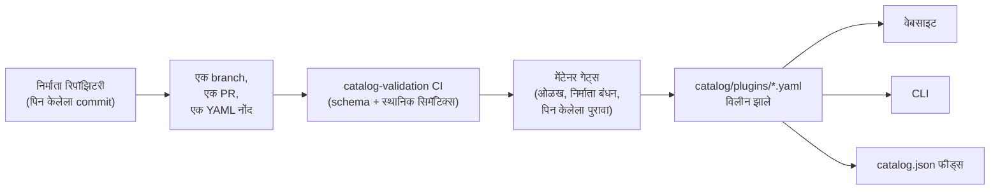

<div align="center">


# 🧩 अप्रतिम Omni DSH प्लगइन्स

> **अनधिकृत समुदाय प्रकल्प. DeepSeek सोबत संलग्न, त्यांचे समर्थन प्राप्त किंवा त्यांच्याकडून प्रायोजित नाही.**
> DeepSeek नावे आणि खुणा त्यांच्या संबंधित मालकाच्या मालकीच्या आहेत.

**DeepSeek Harness (DSH)** प्लगइन्ससाठी निर्माता-प्रथम शोध आणि एक-कमांड इन्स्टॉलेशन.

<h2>
  🌐 <a href="https://dsh-plugins.omniroute.online"><strong>dsh-plugins.omniroute.online</strong></a> 🌐
</h2>
<h3>
  <a href="https://dsh-plugins.omniroute.online">वेबसाइटवर सर्व प्लगइन्स ब्राउझ, शोध आणि इन्स्टॉल करा →</a>
</h3>

[](https://dsh-plugins.omniroute.online)
[](https://www.npmjs.com/package/@diegosouza.pw/dsh-plugins)
[](https://github.com/diegosouzapw/awesome-omni-dsh-plugins/actions/workflows/validate-catalog.yml)
[](../../LICENSE)
[](https://dsh-plugins.omniroute.online)

<br/>

<b>🌐 43 भाषांमध्ये</b>
<br/><br/>
<a href="../../README.md"></a>
<a href="../pt-BR/README.md"></a>
<a href="../zh-CN/README.md"></a>
<a href="../zh-TW/README.md"></a>
<a href="../pt/README.md"></a>
<a href="../es/README.md"></a>
<a href="../fr/README.md"></a>
<a href="../it/README.md"></a>
<a href="../de/README.md"></a>
<a href="../nl/README.md"></a>
<a href="../ru/README.md"></a>
<a href="../uk-UA/README.md"></a>
<a href="../pl/README.md"></a>
<a href="../cs/README.md"></a>
<a href="../sk/README.md"></a>
<a href="../ro/README.md"></a>
<a href="../hu/README.md"></a>
<a href="../bg/README.md"></a>
<a href="../da/README.md"></a>
<a href="../fi/README.md"></a>
<a href="../no/README.md"></a>
<a href="../sv/README.md"></a>
<a href="../ja/README.md"></a>
<a href="../ko/README.md"></a>
<a href="../th/README.md"></a>
<a href="../vi/README.md"></a>
<a href="../id/README.md"></a>
<a href="../ms/README.md"></a>
<a href="../phi/README.md"></a>
<a href="../in/README.md"></a>
<a href="../hi/README.md"></a>
<a href="../gu/README.md"></a>
<a href="README.md"></a>
<a href="../ta/README.md"></a>
<a href="../te/README.md"></a>
<a href="../bn/README.md"></a>
<a href="../ur/README.md"></a>
<a href="../fa/README.md"></a>
<a href="../ar/README.md"></a>
<a href="../he/README.md"></a>
<a href="../tr/README.md"></a>
<a href="../az/README.md"></a>
<a href="../sw/README.md"></a>

</div>

---

## ⭐ शीर्ष 10 प्लगइन्स

नेमक्या-रिपॉझिटरी स्टार्सनुसार क्रमवारी — फक्त प्लगइनच्या स्वतःच्या रिपॉझिटरीने मिळवलेले स्टार्स मोजले जातात,
पालक प्रकल्पाचे कधीही नाही ([रँकिंग निकष](../../docs/RANKING.md)). प्रत्येक नाव निर्मात्याच्या
रिपॉझिटरीला जोडलेले असते, कॅटलॉगने वैध ठरवलेल्या नेमक्या commit वर पिन केलेले.

| #   | Plugin | Creator | ★ | Category | हे काय करते |
| --- | ------ | ------- | --- | -------- | ------------ |
| 1 | [dsh-visualize](https://github.com/Nagi-ovo/dsh-visualize) | [@Nagi-ovo](https://github.com/Nagi-ovo) | 180 | UI & dashboards | इनलाइन व्हिज्युअलायझेशन: मॉडेल सत्रातच परस्परसंवादी तक्ते आणि आकृत्या रेंडर करते |
| 2 | [dsh-pet-remielle](https://github.com/Gin-7/dsh-pet-remielle) | [@Gin-7](https://github.com/Gin-7) | 20 | Entertainment | DSH वेब GUI साठी हॉट-प्लगेबल पारदर्शक डेस्कटॉप पाळीव प्राणी (Remielle, Zenless Zone Zero) |
| 3 | [dsh-whale-musume](https://github.com/Sutera-Diffusus/dsh-whale-musume) | [@Sutera-Diffusus](https://github.com/Sutera-Diffusus) | 19 | Entertainment | डॅशबोर्ड क्रियाकलापावर प्रतिक्रिया देणारी अ‍ॅनिमेटेड व्हेल-गर्ल Kanban Musume शुभंकर |
| 4 | [deepseek-harness-tui](https://github.com/gxinxing/deepseek-harness-tui) | [@gxinxing](https://github.com/gxinxing) | 7 | UI & dashboards | dsh सत्रे चालवण्यासाठी पूर्ण-स्क्रीन curses-शैलीतील टर्मिनल चॅट क्लायंट |
| 5 | [dsh-tui](https://github.com/turtle1999/turtle-ui) | [@turtle1999](https://github.com/turtle1999) | 7 | UI & dashboards | परस्परसंवादी pi-tui टर्मिनल प्रवेशद्वार: सत्र निवडक, स्ट्रीमिंग चॅट, कीबाइंडिंग्ज |
| 6 | [dsh-tavily-workspace](https://github.com/moguiyu/dsh-tavily) | [@moguiyu](https://github.com/moguiyu) | 3 | Search & research | मल्टी-की व्यवस्थापन आणि वापर गेजसह ऐच्छिक Tavily प्रगत शोध साधन |
| 7 | [dsh-bili-widget](https://github.com/pyf2818/dsh-bili-widget) | [@pyf2818](https://github.com/pyf2818) | 2 | Entertainment | तरंगता bilibili व्हिडिओ विजेट: शिफारसी, ट्रेंडिंग, रँकिंग आणि शोध |
| 8 | [dsh-themes](https://github.com/MangMax/dsh-themes) | [@MangMax](https://github.com/MangMax) | 1 | Entertainment | देखावा प्लगइन: अंगभूत पॅलेट्स, लाइट/डार्क/सिस्टम मोड, VS Code थीम्स |
| 9 | [dsh-arknights](https://github.com/DocJlm/dsh-arknights) | [@DocJlm](https://github.com/DocJlm) | — | Entertainment | Pramanix आणि Eyjafjalla दर्शवणारी गैर-व्यावसायिक Arknights astral-garden स्किन |
| 10 | [dsh-bridge-browser](https://github.com/Lum1104/dsh-browser) | [@Lum1104](https://github.com/Lum1104) | — | Browser automation | साथीच्या ब्राउझर विस्तारासाठी टोकन-प्रमाणित WebSocket ब्रिज |

<div align="center">

### 👉 [**वेबसाइटवर सर्व प्लगइन्स शोधा, तपशील वाचा आणि इन्स्टॉल कमांड कॉपी करा →**](https://dsh-plugins.omniroute.online) 👈

</div>

## एका दृष्टीक्षेपात

| पृष्ठभाग    | हे काय आहे                                                        | कुठे                                                                    |
| ----------- | ---------------------------------------------------------------- | ------------------------------------------------------------------------ |
| **वेबसाइट** | शोध आणि रँकिंगसह रेंडर केलेला कॅटलॉग ब्राउझर                       | [dsh-plugins.omniroute.online](https://dsh-plugins.omniroute.online)     |
| **कॅटलॉग** | प्रत्येक प्लगइनसाठी एक YAML फाइल, एकमेव सत्य स्रोत                 | [`catalog/plugins/`](../../catalog/plugins)                                    |
| **स्कीमा**  | सार्वजनिक JSON Schema (draft 2020-12) ज्याविरुद्ध प्रत्येक नोंद वैध ठरवली जाते | [`schemas/plugin.schema.yaml`](../../schemas/plugin.schema.yaml)               |
| **CLI**     | कॅटलॉगमधून शोधा, तपासा, वैध ठरवा आणि इन्स्टॉल करा           | [`@diegosouza.pw/dsh-plugins`](https://www.npmjs.com/package/@diegosouza.pw/dsh-plugins) |
| **मशीन फीड्स** | साधनांसाठी `catalog.json` + `catalog.snapshot.json`           | [catalog.json](https://dsh-plugins.omniroute.online/catalog.json) · [catalog.snapshot.json](https://dsh-plugins.omniroute.online/catalog.snapshot.json) |

हा रिपॉझिटरी कॅटलॉगसाठीचा सार्वजनिक सत्य स्रोत आहे. प्रत्येक नोंद ही `catalog/plugins/` अंतर्गत एक YAML फाइल
आहे, जी प्रकाशित JSON Schema विरुद्ध वैध ठरवली जाते, एका स्वतंत्रपणे पुनरावलोकन केलेल्या pull request
द्वारे जोडली जाते आणि नेहमी प्लगइनच्या मूळ निर्मात्याला श्रेय दिले जाते.
कॅटलॉगमधील काहीही दुसऱ्या कॅटलॉग किंवा यादीतून तयार केलेले नाही: प्रत्येक नोंद मूळ निर्माता
रिपॉझिटरीमधून एका पिन केलेल्या commit वर पुनर्रचित केली जाते.

वेबसाइट आणि CLI खाजगी स्रोतातून सांभाळले जातात; हा रिपॉझिटरी ते वापरत असलेला सार्वजनिक
कॅटलॉग डेटा, स्कीमा आणि धोरणे बाळगतो.

## कॅटलॉग स्थिती

**10 प्लगइन्स विलीन केले.** प्रत्येक प्लगइन मूळ निर्माता रिपॉझिटरीमधून, एका वेळी एक, पिन केलेल्या
स्रोत commit आणि स्पष्ट श्रेयासह, स्वतंत्रपणे पुनरावलोकन केलेल्या pull request द्वारे दाखल होतो.

## 🚀 CLI इन्स्टॉल करा

```bash
npx @diegosouza.pw/dsh-plugins --help
```

स्कोप्ड पॅकेज `@diegosouza.pw/dsh-plugins@0.1.0` म्हणून प्रकाशित केले आहे आणि वरील कमांड आज
प्रामाणिक इनव्होकेशन आहे; येथे कोणतीही इन्स्टॉलर स्क्रिप्ट होस्ट केलेली नाही.

### आज CLI वापरा

आवृत्ती 0.1.0 मध्ये फक्त-वाचनीय शोध आणि वैधता कमांड्ससोबत संमती-नियंत्रित इन्स्टॉल कमांड्स
समाविष्ट आहेत. फ्लॅग्ज, एक्झिट कोड्स आणि कोड-एक्झिक्युशन संमती गेटसह संपूर्ण कमांड संदर्भ
[docs/CLI.md](../../docs/CLI.md) मध्ये आहे.

| Command                        | हे काय करते                                                        | तुमच्या सिस्टीमला स्पर्श करते का?                    |
| ------------------------------ | ------------------------------------------------------------------- | --------------------------------------- |
| `catalog validate --catalog .` | कॅटलॉग YAML, स्कीमा आणि स्थानिक सिमॅंटिक्स वैध ठरवते                   | नाही — फक्त-वाचनीय                          |
| `search <query...>`            | सार्वजनिक कॅटलॉग फील्ड्स स्थानिक पातळीवर शोधते                                | नाही — फक्त-वाचनीय                          |
| `info <id>`                    | एक सार्वजनिक कॅटलॉग नोंद दाखवते                                       | नाही — फक्त-वाचनीय                          |
| `list`                         | प्रोफाइल्समध्ये बदल न करता कॅटलॉग-व्यवस्थापित इन्स्टॉल्सची यादी करते            | नाही — फक्त-वाचनीय                          |
| `doctor`                       | फक्त-वाचनीय Node, DSH, नेटिव्ह Windows धोरण आणि कॅटलॉग निदान  | नाही — फक्त-वाचनीय                          |
| `add <id> --profile <name> --dry-run` | फाइल्स किंवा सबप्रोसेसेसशिवाय पडताळणी केलेली इन्स्टॉल योजना दाखवते | नाही — dry-run                            |
| `add <id> --profile <name> --allow-code-execution` | अधिकृत DSH डेलिगेशनद्वारे इन्स्टॉल करते        | होय — फक्त स्पष्ट संमती फ्लॅगसह   |

```bash
# Validate the catalog in this repository (what CI runs):
npx @diegosouza.pw/dsh-plugins@0.1.0 catalog validate --catalog .

# Search and inspect locally, without installing anything:
npx @diegosouza.pw/dsh-plugins@0.1.0 search memory --catalog .
npx @diegosouza.pw/dsh-plugins@0.1.0 info <plugin-id> --catalog .

# Preview an install plan; nothing is written and no subprocess runs:
npx @diegosouza.pw/dsh-plugins@0.1.0 add <plugin-id> --profile default --dry-run
```

बदल करणाऱ्या कमांड्स (`add`, `update`, `remove`) तुम्ही `--allow-code-execution` पास केल्याशिवाय
कधीही प्लगइन लाइफसायकल कोड कार्यान्वित करत नाहीत. नेटिव्ह Windows वर या बदल करणाऱ्या क्रिया
v0.1.0 मध्ये अक्षम केलेल्या आहेत; WSL वापरा. फक्त-वाचनीय आणि dry-run कमांड्स सर्वत्र कार्य करतात.

## 🔍 प्लगइन कॅटलॉगमध्ये कसा प्रवेश करतो



1. **एक प्लगइन, एक branch, एक pull request.** PR `catalog/plugins/` अंतर्गत नेमकी एक YAML फाइल
   जोडते किंवा बदलते.
2. **निर्माता-प्रथम.** प्लगइनच्या निर्मात्याने किंवा मालक संस्थेने उघडलेला PR त्याच प्लगइनसाठी समुदाय
   क्युरेशन किंवा ऑटोमेशनपेक्षा नेहमी प्राधान्य घेतो — पहा [docs/CREDIT.md](../../docs/CREDIT.md).
3. **मूळ स्रोतातील पुरावा.** प्रत्येक फील्ड निर्मात्याच्या रिपॉझिटरीमधून एका पिन केलेल्या 40-अक्षरी
   commit वर पुनर्रचित केले जाते: वर्णन, परवाना, DSH एकत्रीकरण, इन्स्टॉल वर्णनकर्ता, स्टार्स.
4. **स्थानिक वैधता.** `catalog validate` रचना आणि स्थानिक सिमॅंटिक्स तपासते; हीच तपासणी
   `catalog-validation` CI जॉब PR वर चालवतो.
5. **मेंटेनर गेट्स.** विलीनीकरणापूर्वी, मेंटेनर्स रिपॉझिटरी ओळख, निर्माता बंधन आणि पिन केलेला पुरावा
   स्वतंत्रपणे पडताळतात. हिरवी स्थानिक वैधता आवश्यक आहे, पण कधीही पुरेशी नाही.

संपूर्ण करार — आवश्यक पुरावा, YAML नियम, स्टार्स धोरण, टक्कर हाताळणी आणि पुनरावलोकन गेट्स —
[CONTRIBUTING.md](../../CONTRIBUTING.md) मध्ये आहे. निर्णय कसे आणि कोणाद्वारे घेतले जातात हे
[docs/GOVERNANCE.md](../../docs/GOVERNANCE.md) मध्ये आहे.

## 📄 नोंदीची रचना

प्रत्येक नोंद ही तिच्या ID वरून नाव दिलेली एक YAML फाइल आहे. खालील उदाहरण सध्याच्या स्कीमाविरुद्ध
वैध ठरते (फील्ड-निहाय संदर्भ [docs/SCHEMA.md](../../docs/SCHEMA.md) मध्ये आहे):

```yaml
schemaVersion: 1
id: example-notes-search
name: Example Notes Search
description:
  en: >-
    Searches a local Markdown notes folder from DSH sessions and returns
    matching snippets with file paths.
  evidencePath: README.md
unofficial: true
kind: plugin
primaryCategory: search-research
tags:
  - search
  - notes
  - cli
source:
  repository: https://github.com/example-creator/example-notes-search
  repositoryNodeId: R_kgDOExample01
  subpath: null
  commit: 0123456789abcdef0123456789abcdef01234567
creator:
  github: example-creator
package:
  ecosystem: npm
  name: example-notes-search
  version: 1.4.2
dsh:
  profiles:
    - default
  evidencePath: dsh-plugin.json
repositoryScope: dedicated
popularity:
  starsPolicy: exact-repository
  stars: 128
license:
  spdx: MIT
verification:
  status: eligible
  checkedAt: "2026-08-18T12:00:00Z"
  repositoryIdentity: resolved
  smokeTest: null
provenance:
  discussion: null
  comment: null
```

स्कीमाद्वारे लागू केलेले मुख्य invariants:

- `unofficial: true` आणि `schemaVersion: 1` हे स्थिरांक आहेत.
- मोनोरेपो प्लगइनने `stars: null` वापरणे आवश्यक आहे — पालक-प्रकल्पाचे स्टार्स कधीही वारसाहक्काने
  मिळत नाहीत.
- इन्स्टॉल वर्णनकर्ता एकतर नेमक्या-आवृत्तीचे npm पॅकेज असते किंवा पिन केलेला स्रोत स्वतः;
  तो डेटा आहे, कधीही shell कमांड नाही.
- `verified` स्थितीसाठी पुनरावलोकनयोग्य smoke-test पुरावा आवश्यक आहे; अन्यथा नोंद
  `smokeTest: null` सह `eligible` असते.

## 🗂 इथे काय समाविष्ट होते

हा रिपॉझिटरी DeepSeek Harness (DSH) साठी स्वतंत्रपणे प्रकाशित केलेल्या एकत्रीकरणांचा कॅटलॉग
करतो, ज्यात नेटिव्ह प्लगइन्स, प्लगइन कुटुंबे, थीम्स, स्किल्स, क्लायंट्स आणि ब्रिजेस यांचा समावेश आहे.
आर्टिफॅक्ट प्रकार, क्षमता श्रेण्या आणि इंटरफेस टॅग्ज [docs/CATEGORIES.md](../../docs/CATEGORIES.md)
मध्ये परिभाषित केले आहेत.

प्रत्येक सार्वजनिक नोंद `catalog/plugins/` अंतर्गत एक YAML फाइल आहे आणि तिने
`schemas/plugin.schema.yaml` विरुद्ध वैध ठरणे आवश्यक आहे. यादीत असणे म्हणजे दस्तऐवजीकरण केलेल्या
पात्रता किंवा पडताळणी तपासण्या पूर्ण झाल्या आहेत; ते सुरक्षा प्रमाणपत्र किंवा DeepSeek समर्थन नाही.

## 🏅 रँकिंग आणि पडताळणी

फक्त समर्पित, नेटिव्ह, पात्र किंवा पडताळणी केलेले प्लगइन रिपॉझिटरीज, ज्यांचे स्टार्स त्याच नेमक्या
रिपॉझिटरीचे आहेत, स्टार रँकिंगमध्ये प्रवेश करू शकतात. व्यापक मोनोरेपोंमध्ये साठवलेली एकत्रीकरणे
शोधण्यायोग्य राहतात पण `stars: null` वापरतात आणि कधीही पालक-प्रकल्पाचे स्टार्स वारसाहक्काने
मिळवत नाहीत. संपूर्ण निकषासाठी [docs/RANKING.md](../../docs/RANKING.md) पहा.

सार्वजनिक पडताळणी स्थिती संरचनात्मक पात्रता आणि इन्स्टॉलेशन smoke test यातील फरक दर्शवते.
कोणतीही स्थिती परिपूर्ण सुरक्षिततेचे प्रतिनिधित्व करत नाही. प्लगइन वापरण्यापूर्वी त्याची रिपॉझिटरी,
पिन केलेला commit, परवाना आणि इन्स्टॉलेशन वर्तन पुनरावलोकन करा.

## 🤝 योगदान द्या किंवा नोंदीवर दावा करा

pull request उघडण्यापूर्वी [CONTRIBUTING.md](../../CONTRIBUTING.md) वाचा. pull request ने नेमकी
एक प्लगइन नोंद जोडणे किंवा बदलणे आवश्यक आहे आणि दुसऱ्या कॅटलॉगऐवजी मूळ निर्माता रिपॉझिटरीचा उल्लेख
करणे आवश्यक आहे. निर्मात्याने लिहिलेले pull requests स्वयंचलित कॅटलॉग pull requests पेक्षा
प्राधान्य घेतात.

निर्माता दावे, सुधारणा आणि काढून टाकण्यासाठी संरचित issue फॉर्म्स उपलब्ध आहेत. क्रेडेन्शियल्स,
खाजगी संपर्क तपशील किंवा इतर गुपिते कधीही सबमिट करू नका.

## 👩‍🎨 प्लगइन निर्माते

हा कॅटलॉग अस्तित्वात आहे कारण या निर्मात्यांनी प्लगइन्स तयार केले. प्रत्येक नोंद तिच्या निर्मात्याला
श्रेय देते आणि त्यांच्या रिपॉझिटरीकडे परत लिंक करते — नेहमी.

<a href="https://github.com/Nagi-ovo" title="@Nagi-ovo — dsh-visualize"></a>
<a href="https://github.com/Gin-7" title="@Gin-7 — dsh-pet-remielle"></a>
<a href="https://github.com/Sutera-Diffusus" title="@Sutera-Diffusus — dsh-whale-musume"></a>
<a href="https://github.com/gxinxing" title="@gxinxing — deepseek-harness-tui"></a>
<a href="https://github.com/turtle1999" title="@turtle1999 — dsh-tui"></a>
<a href="https://github.com/moguiyu" title="@moguiyu — dsh-tavily-workspace"></a>
<a href="https://github.com/pyf2818" title="@pyf2818 — dsh-bili-widget"></a>
<a href="https://github.com/MangMax" title="@MangMax — dsh-themes"></a>
<a href="https://github.com/DocJlm" title="@DocJlm — dsh-arknights"></a>
<a href="https://github.com/Lum1104" title="@Lum1104 — dsh-bridge-browser"></a>

पूर्ण श्रेयासह तुमचे प्लगइन इथे हवे आहे? [एक YAML नोंदीसह एक PR उघडा](../../CONTRIBUTING.md) — किंवा
[विद्यमान नोंदीवर दावा करा](https://github.com/diegosouzapw/awesome-omni-dsh-plugins/issues/new/choose)
जर कोणी तुमच्या आधी तुमचे काम कॅटलॉग केले असेल.

## 📚 दस्तऐवजीकरण

| Document                                     | ते काय समाविष्ट करते                                                       |
| -------------------------------------------- | -------------------------------------------------------------------- |
| [CONTRIBUTING.md](../../CONTRIBUTING.md)           | संपूर्ण योगदान करार: पुरावा, YAML नियम, पुनरावलोकन गेट्स    |
| [SECURITY.md](../../SECURITY.md)                   | प्लगइन किंवा कॅटलॉग असुरक्षितता नोंदवणे; गुपिते धोरण           |
| [docs/SCHEMA.md](../../docs/SCHEMA.md)             | `schemas/plugin.schema.yaml` साठी फील्ड-निहाय संदर्भ             |
| [docs/CLI.md](../../docs/CLI.md)                   | `@diegosouza.pw/dsh-plugins@0.1.0` साठी CLI कमांड संदर्भ          |
| [docs/GOVERNANCE.md](../../docs/GOVERNANCE.md)     | कॅटलॉग कसा नियंत्रित केला जातो: प्राधान्य, गेट्स, दावे आणि काढून टाकणे   |
| [docs/CATEGORIES.md](../../docs/CATEGORIES.md)     | आर्टिफॅक्ट प्रकार, प्राथमिक क्षमता श्रेण्या, टॅग्ज, रिपॉझिटरी व्याप्ती |
| [docs/CREDIT.md](../../docs/CREDIT.md)             | निर्माता श्रेय, PR प्राधान्य आणि Git ओळख धोरण                 |
| [docs/RANKING.md](../../docs/RANKING.md)           | सार्वजनिक रँकिंग निकष आणि पडताळणी स्थिती                   |
| [docs/UNOFFICIAL.md](../../docs/UNOFFICIAL.md)     | अनधिकृत स्थिती आणि ट्रेडमार्क भूमिका                               |

## 🌐 भाषांतरे

हे README [`docs/i18n/`](..) अंतर्गत 43 भाषांमध्ये उपलब्ध आहे — वरील ध्वज निवडक वापरा. इंग्रजी
हा सत्याचा स्रोत आहे; जेव्हा भाषांतर आणि इंग्रजी मजकूर विसंगत असतात, तेव्हा इंग्रजी मजकूर अधिकृत
मानला जातो. कोणत्याही भाषांतरातील सुधारणा सामान्य pull requests द्वारे स्वागतार्ह आहेत.

## 📜 परवाना आणि श्रेय

दस्तऐवजीकरण आणि रिपॉझिटरी टेम्पलेट्स [MIT License](../../LICENSE) अंतर्गत परवानाकृत आहेत. मूळ
कॅटलॉग तथ्ये आणि संपादकीय YAML मेटाडेटा [CC0-1.0](../../LICENSE-CATALOG) अंतर्गत समर्पित आहेत.
अपस्ट्रीम कोड, नावे, लोगो आणि स्क्रीनशॉट्स त्यांच्या मूळ मालकांच्या आणि परवान्यांच्या अंतर्गतच राहतात.
पहा [docs/CREDIT.md](../../docs/CREDIT.md) आणि [docs/UNOFFICIAL.md](../../docs/UNOFFICIAL.md).

<div align="center">

### ⭐ जर या कॅटलॉगने तुम्हाला प्लगइन शोधण्यात मदत केली असेल, तर रिपो स्टार करा — यामुळे निर्मात्यांना सापडण्यात मदत होते.

**[वेबसाइटवर सर्व प्लगइन्स ब्राउझ करा →](https://dsh-plugins.omniroute.online)**

</div>
