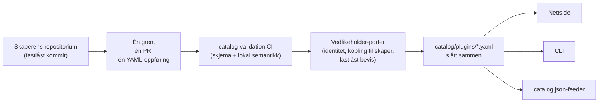

<div align="center">


# 🧩 Awesome Omni DSH Plugins

> **Uoffisielt fellesskapsprosjekt. Ikke tilknyttet, godkjent av eller sponset av DeepSeek.**
> DeepSeek-navn og -merker tilhører sine respektive eiere.

Kreatørfokusert oppdagelse og installasjon med én kommando for **DeepSeek Harness (DSH)**-plugins.

<h2>
  🌐 <a href="https://dsh-plugins.omniroute.online"><strong>dsh-plugins.omniroute.online</strong></a> 🌐
</h2>
<h3>
  <a href="https://dsh-plugins.omniroute.online">Bla gjennom, søk i og installer alle plugins på nettsiden →</a>
</h3>

[](https://dsh-plugins.omniroute.online)
[](https://www.npmjs.com/package/@diegosouza.pw/dsh-plugins)
[](https://github.com/diegosouzapw/awesome-omni-dsh-plugins/actions/workflows/validate-catalog.yml)
[](../../LICENSE)
[](https://dsh-plugins.omniroute.online)

<br/>

<b>🌐 På 43 språk</b>
<br/><br/>
<a href="../../README.md"></a>
<a href="../pt-BR/README.md"></a>
<a href="../zh-CN/README.md"></a>
<a href="../zh-TW/README.md"></a>
<a href="../pt/README.md"></a>
<a href="../es/README.md"></a>
<a href="../fr/README.md"></a>
<a href="../it/README.md"></a>
<a href="../de/README.md"></a>
<a href="../nl/README.md"></a>
<a href="../ru/README.md"></a>
<a href="../uk-UA/README.md"></a>
<a href="../pl/README.md"></a>
<a href="../cs/README.md"></a>
<a href="../sk/README.md"></a>
<a href="../ro/README.md"></a>
<a href="../hu/README.md"></a>
<a href="../bg/README.md"></a>
<a href="../da/README.md"></a>
<a href="../fi/README.md"></a>
<a href="README.md"></a>
<a href="../sv/README.md"></a>
<a href="../ja/README.md"></a>
<a href="../ko/README.md"></a>
<a href="../th/README.md"></a>
<a href="../vi/README.md"></a>
<a href="../id/README.md"></a>
<a href="../ms/README.md"></a>
<a href="../phi/README.md"></a>
<a href="../in/README.md"></a>
<a href="../hi/README.md"></a>
<a href="../gu/README.md"></a>
<a href="../mr/README.md"></a>
<a href="../ta/README.md"></a>
<a href="../te/README.md"></a>
<a href="../bn/README.md"></a>
<a href="../ur/README.md"></a>
<a href="../fa/README.md"></a>
<a href="../ar/README.md"></a>
<a href="../he/README.md"></a>
<a href="../tr/README.md"></a>
<a href="../az/README.md"></a>
<a href="../sw/README.md"></a>

</div>

---

## ⭐ Topp 10 plugins

Rangert etter stjerner i det nøyaktige repositoriet — bare stjerner opptjent av pluginens eget
repositorium teller, aldri et foreldreprosjekts ([rangeringspredikat](../../docs/RANKING.md)).
Hvert navn lenker til skaperens repositorium, fastlåst til den nøyaktige kommiten katalogen validerte.

| #   | Plugin | Skaper | ★ | Kategori | Hva den gjør |
| --- | ------ | ------- | --- | -------- | ------------ |
| 1 | [dsh-visualize](https://github.com/Nagi-ovo/dsh-visualize) | [@Nagi-ovo](https://github.com/Nagi-ovo) | 180 | UI & dashboards | Innebygd visualisering: modellen tegner interaktive diagrammer og grafer inne i økten |
| 2 | [dsh-pet-remielle](https://github.com/Gin-7/dsh-pet-remielle) | [@Gin-7](https://github.com/Gin-7) | 20 | Entertainment | Hot-pluggbart, gjennomsiktig skrivebordskjæledyr (Remielle, Zenless Zone Zero) for DSH-nettgrensesnittet |
| 3 | [dsh-whale-musume](https://github.com/Sutera-Diffusus/dsh-whale-musume) | [@Sutera-Diffusus](https://github.com/Sutera-Diffusus) | 19 | Entertainment | Animert hvaljente-maskott (Kanban Musume) som reagerer på aktivitet i dashbordet |
| 4 | [deepseek-harness-tui](https://github.com/gxinxing/deepseek-harness-tui) | [@gxinxing](https://github.com/gxinxing) | 7 | UI & dashboards | Fullskjerms terminal-chatteklient i curses-stil for å styre dsh-økter |
| 5 | [dsh-tui](https://github.com/turtle1999/turtle-ui) | [@turtle1999](https://github.com/turtle1999) | 7 | UI & dashboards | Interaktiv pi-tui-terminalinngang: øktvelger, strømmende chat, tastatursnarveier |
| 6 | [dsh-tavily-workspace](https://github.com/moguiyu/dsh-tavily) | [@moguiyu](https://github.com/moguiyu) | 3 | Search & research | Valgfritt avansert Tavily-søkeverktøy med håndtering av flere nøkler og en bruksmåler |
| 7 | [dsh-bili-widget](https://github.com/pyf2818/dsh-bili-widget) | [@pyf2818](https://github.com/pyf2818) | 2 | Entertainment | Flytende bilibili-videowidget: anbefalinger, trender, rangeringer og søk |
| 8 | [dsh-themes](https://github.com/MangMax/dsh-themes) | [@MangMax](https://github.com/MangMax) | 1 | Entertainment | Utseende-plugin: innebygde fargepaletter, lys/mørk/system-modus, VS Code-temaer |
| 9 | [dsh-arknights](https://github.com/DocJlm/dsh-arknights) | [@DocJlm](https://github.com/DocJlm) | — | Entertainment | Ikke-kommersiell Arknights astral-garden-skin med Pramanix og Eyjafjalla |
| 10 | [dsh-bridge-browser](https://github.com/Lum1104/dsh-browser) | [@Lum1104](https://github.com/Lum1104) | — | Browser automation | Tokenautentisert WebSocket-bro for den tilhørende nettleserutvidelsen |

<div align="center">

### 👉 [**Søk i alle plugins, les detaljene og kopier installasjonskommandoen på nettsiden →**](https://dsh-plugins.omniroute.online) 👈

</div>

## Kort oversikt

| Overflate     | Hva det er                                                       | Hvor                                                                    |
| ----------- | ---------------------------------------------------------------- | ------------------------------------------------------------------------ |
| **Nettside** | Visuell katalogvisning med søk og rangering                 | [dsh-plugins.omniroute.online](https://dsh-plugins.omniroute.online)     |
| **Katalog** | Én YAML-fil per plugin, den eneste kilden til sannhet             | [`catalog/plugins/`](../../catalog/plugins)                                    |
| **Skjema**  | Offentlig JSON Schema (draft 2020-12) hver oppføring valideres mot | [`schemas/plugin.schema.yaml`](../../schemas/plugin.schema.yaml)               |
| **CLI**     | Søk, inspiser, valider og installer fra katalogen           | [`@diegosouza.pw/dsh-plugins`](https://www.npmjs.com/package/@diegosouza.pw/dsh-plugins) |
| **Maskinfeeder** | `catalog.json` + `catalog.snapshot.json` for verktøy           | [catalog.json](https://dsh-plugins.omniroute.online/catalog.json) · [catalog.snapshot.json](https://dsh-plugins.omniroute.online/catalog.snapshot.json) |

Dette repositoriet er den offentlige kilden til sannhet for katalogen. Hver oppføring er én
YAML-fil under `catalog/plugins/`, validert mot et publisert JSON Schema, lagt til gjennom én
individuelt gjennomgått pull request, og alltid kreditert til pluginens opprinnelige skaper.
Ingenting i katalogen genereres fra en annen katalog eller liste: hver oppføring er
rekonstruert fra skaperens opprinnelige repositorium ved en fastlåst kommit.

Nettsiden og CLI-en vedlikeholdes fra privat kildekode; dette repositoriet inneholder de
offentlige katalogdataene, skjemaet og retningslinjene de bruker.

## Katalogstatus

**10 plugins er slått sammen.** Hver plugin kommer inn gjennom en individuelt gjennomgått pull
request, én om gangen, fra skaperens opprinnelige repositorium, med en fastlåst kildekommit og
eksplisitt kreditering.

## 🚀 Installer CLI-en

```bash
npx @diegosouza.pw/dsh-plugins --help
```

Den skopede pakken er publisert som `@diegosouza.pw/dsh-plugins@0.1.0`, og kommandoen over er
den kanoniske måten å kjøre den på i dag; det hostes ikke noe installasjonsskript her.

### Bruk CLI-en i dag

Versjon 0.1.0 leveres med skrivebeskyttede kommandoer for oppdagelse og validering, pluss
installasjonskommandoer som krever samtykke. Den fullstendige kommandoreferansen, inkludert
flagg, avslutningskoder og samtykkeporten for kodekjøring, finner du i
[docs/CLI.md](../../docs/CLI.md).

| Kommando                        | Hva den gjør                                                        | Berører den systemet ditt?                    |
| ------------------------------ | ------------------------------------------------------------------- | --------------------------------------- |
| `catalog validate --catalog .` | Validerer katalogens YAML, skjema og lokal semantikk                   | Nei — kun lesing                          |
| `search <query...>`            | Søker lokalt i offentlige katalogfelt                                | Nei — kun lesing                          |
| `info <id>`                    | Viser én offentlig katalogoppføring                                       | Nei — kun lesing                          |
| `list`                         | Lister katalogstyrte installasjoner uten å endre profiler            | Nei — kun lesing                          |
| `doctor`                       | Skrivebeskyttet diagnose av Node, DSH, retningslinjer for nativ Windows og katalogen  | Nei — kun lesing                          |
| `add <id> --profile <name> --dry-run` | Viser den verifiserte installasjonsplanen uten filer eller underprosesser | Nei — tørrkjøring                            |
| `add <id> --profile <name> --allow-code-execution` | Installerer via offisiell DSH-delegering        | Ja — kun med eksplisitt samtykkeflagg   |

```bash
# Validate the catalog in this repository (what CI runs):
npx @diegosouza.pw/dsh-plugins@0.1.0 catalog validate --catalog .

# Search and inspect locally, without installing anything:
npx @diegosouza.pw/dsh-plugins@0.1.0 search memory --catalog .
npx @diegosouza.pw/dsh-plugins@0.1.0 info <plugin-id> --catalog .

# Preview an install plan; nothing is written and no subprocess runs:
npx @diegosouza.pw/dsh-plugins@0.1.0 add <plugin-id> --profile default --dry-run
```

Kommandoer som endrer noe (`add`, `update`, `remove`) kjører aldri kode fra pluginens
livssyklus med mindre du sender `--allow-code-execution`. På nativ Windows er disse
endringene deaktivert i v0.1.0; bruk WSL. Skrivebeskyttede kommandoer og tørrkjøringer
fungerer overalt.

## 🔍 Slik kommer en plugin inn i katalogen



1. **Én plugin, én gren, én pull request.** PR-en legger til eller endrer nøyaktig én YAML-fil
   under `catalog/plugins/`.
2. **Skaperen først.** En PR åpnet av pluginens skaper eller eierorganisasjon har alltid forrang
   fremfor fellesskapskurasjon eller automatisering for samme plugin — se
   [docs/CREDIT.md](../../docs/CREDIT.md).
3. **Bevis fra den opprinnelige kilden.** Hvert felt rekonstrueres fra skaperens repositorium ved
   en fastlåst 40-tegns kommit: beskrivelse, lisens, DSH-integrasjon, installasjonsdeskriptor,
   stjerner.
4. **Lokal validering.** `catalog validate` sjekker struktur og lokal semantikk; det er den samme
   sjekken som CI-jobben `catalog-validation` kjører på PR-en.
5. **Vedlikeholder-porter.** Før sammenslåing verifiserer vedlikeholderne separat
   repositoriumsidentitet, kobling til skaperen og fastlåst bevis. En grønn lokal validering er
   nødvendig, men aldri tilstrekkelig.

Den fullstendige kontrakten — nødvendig bevis, YAML-regler, stjernepolicy, håndtering av
kollisjoner og gjennomgangsportene — finnes i [CONTRIBUTING.md](../../CONTRIBUTING.md). Hvordan
beslutninger tas og av hvem står i [docs/GOVERNANCE.md](../../docs/GOVERNANCE.md).

## 📄 Anatomien til en oppføring

Hver oppføring er én YAML-fil oppkalt etter sin ID. Eksempelet under valideres mot gjeldende
skjema (feltvis referanse i [docs/SCHEMA.md](../../docs/SCHEMA.md)):

```yaml
schemaVersion: 1
id: example-notes-search
name: Example Notes Search
description:
  en: >-
    Searches a local Markdown notes folder from DSH sessions and returns
    matching snippets with file paths.
  evidencePath: README.md
unofficial: true
kind: plugin
primaryCategory: search-research
tags:
  - search
  - notes
  - cli
source:
  repository: https://github.com/example-creator/example-notes-search
  repositoryNodeId: R_kgDOExample01
  subpath: null
  commit: 0123456789abcdef0123456789abcdef01234567
creator:
  github: example-creator
package:
  ecosystem: npm
  name: example-notes-search
  version: 1.4.2
dsh:
  profiles:
    - default
  evidencePath: dsh-plugin.json
repositoryScope: dedicated
popularity:
  starsPolicy: exact-repository
  stars: 128
license:
  spdx: MIT
verification:
  status: eligible
  checkedAt: "2026-08-18T12:00:00Z"
  repositoryIdentity: resolved
  smokeTest: null
provenance:
  discussion: null
  comment: null
```

Sentrale invarianter som håndheves av skjemaet:

- `unofficial: true` og `schemaVersion: 1` er konstanter.
- En monorepo-plugin må bruke `stars: null` — stjerner fra et foreldreprosjekt arves aldri.
- Installasjonsdeskriptoren er enten en npm-pakke med eksakt versjon eller den fastlåste kilden
  selv; det er data, aldri en shell-kommando.
- Statusen `verified` krever gjennomgåelig bevis fra en smoke-test; ellers er oppføringen
  `eligible` med `smokeTest: null`.

## 🗂 Hva hører hjemme her

Dette repositoriet katalogiserer uavhengig publiserte integrasjoner for DeepSeek Harness (DSH),
inkludert native plugins, pluginfamilier, temaer, ferdigheter, klienter og broer. Artefakttyper,
funksjonskategorier og grensesnitt-tagger er definert i
[docs/CATEGORIES.md](../../docs/CATEGORIES.md).

Hver offentlig oppføring er én YAML-fil under `catalog/plugins/` og må valideres mot
`schemas/plugin.schema.yaml`. En oppføring betyr at de dokumenterte kvalifiserings- eller
verifiseringssjekkene er fullført; det er ikke en sikkerhetssertifisering eller en godkjenning
fra DeepSeek.

## 🏅 Rangering og verifisering

Bare dedikerte, native, kvalifiserte eller verifiserte pluginrepositorier med stjerner som
tilhører nettopp det repositoriet, kan inngå i en stjernerangering. Integrasjoner lagret inne i
større monorepoer forblir søkbare, men bruker `stars: null` og arver aldri stjerner fra et
foreldreprosjekt. Se [docs/RANKING.md](../../docs/RANKING.md) for det fullstendige predikatet.

Offentlige verifiseringstilstander skiller strukturell kvalifisering fra en installasjons-
smoke-test. Ingen tilstand representerer absolutt sikkerhet. Gjennomgå pluginens repositorium,
fastlåste kommit, lisens og installasjonsatferd før du bruker den.

## 🤝 Bidra eller gjør krav på en oppføring

Les [CONTRIBUTING.md](../../CONTRIBUTING.md) før du åpner en pull request. En pull request må
legge til eller endre nøyaktig én pluginoppføring og må sitere det opprinnelige
skaper-repositoriet fremfor en annen katalog. Pull requests forfattet av skaperen har forrang
fremfor automatiserte katalog-pull-requester.

Strukturerte skjemaer for saker er tilgjengelige for skaperkrav, rettelser og fjerninger. Send
aldri inn påloggingsinformasjon, private kontaktopplysninger eller andre hemmeligheter.

## 👩‍🎨 Pluginskapere

Katalogen finnes fordi disse skaperne har laget plugins. Hver oppføring krediterer skaperen sin
og lenker tilbake til repositoriet deres — alltid.

<a href="https://github.com/Nagi-ovo" title="@Nagi-ovo — dsh-visualize"></a>
<a href="https://github.com/Gin-7" title="@Gin-7 — dsh-pet-remielle"></a>
<a href="https://github.com/Sutera-Diffusus" title="@Sutera-Diffusus — dsh-whale-musume"></a>
<a href="https://github.com/gxinxing" title="@gxinxing — deepseek-harness-tui"></a>
<a href="https://github.com/turtle1999" title="@turtle1999 — dsh-tui"></a>
<a href="https://github.com/moguiyu" title="@moguiyu — dsh-tavily-workspace"></a>
<a href="https://github.com/pyf2818" title="@pyf2818 — dsh-bili-widget"></a>
<a href="https://github.com/MangMax" title="@MangMax — dsh-themes"></a>
<a href="https://github.com/DocJlm" title="@DocJlm — dsh-arknights"></a>
<a href="https://github.com/Lum1104" title="@Lum1104 — dsh-bridge-browser"></a>

Vil du ha pluginen din her med full kreditering?
[Åpne én PR med én YAML-oppføring](../../CONTRIBUTING.md) — eller
[gjør krav på en eksisterende oppføring](https://github.com/diegosouzapw/awesome-omni-dsh-plugins/issues/new/choose)
hvis noen katalogiserte arbeidet ditt før du gjorde det selv.

## 📚 Dokumentasjon

| Dokument                                     | Hva det dekker                                                       |
| -------------------------------------------- | -------------------------------------------------------------------- |
| [CONTRIBUTING.md](../../CONTRIBUTING.md)           | Hele bidragskontrakten: bevis, YAML-regler, gjennomgangsporter    |
| [SECURITY.md](../../SECURITY.md)                   | Rapportering av sårbarheter i plugins eller katalogen; policy for hemmeligheter           |
| [docs/SCHEMA.md](../../docs/SCHEMA.md)             | Feltvis referanse for `schemas/plugin.schema.yaml`             |
| [docs/CLI.md](../../docs/CLI.md)                   | CLI-kommandoreferanse for `@diegosouza.pw/dsh-plugins@0.1.0`          |
| [docs/GOVERNANCE.md](../../docs/GOVERNANCE.md)     | Hvordan katalogen styres: forrang, porter, krav og fjerninger   |
| [docs/CATEGORIES.md](../../docs/CATEGORIES.md)     | Artefakttyper, primære funksjonskategorier, tagger, repositoriumsomfang |
| [docs/CREDIT.md](../../docs/CREDIT.md)             | Kreditering av skaper, PR-forrang og policy for Git-identitet                 |
| [docs/RANKING.md](../../docs/RANKING.md)           | Det offentlige rangeringspredikatet og verifiseringstilstandene                  |
| [docs/UNOFFICIAL.md](../../docs/UNOFFICIAL.md)     | Uoffisiell status og holdning til varemerker                               |

## 🌐 Oversettelser

Denne README-en er tilgjengelig på 43 språk under [`docs/i18n/`](..) — bruk flaggvelgeren øverst.
Engelsk er kilden til sannhet; når en oversettelse og den engelske teksten er uenige, gjelder den
engelske teksten. Rettelser til enhver oversettelse er velkomne gjennom vanlige pull requests.

## 📜 Lisens og kreditering

Dokumentasjon og repositoriumsmaler er lisensiert under [MIT-lisensen](../../LICENSE).
Opprinnelige katalogfakta og redaksjonelle YAML-metadata er viet under
[CC0-1.0](../../LICENSE-CATALOG). Kildekode, navn, logoer og skjermbilder fra oppstrøms forblir
under sine opprinnelige eiere og lisenser. Se [docs/CREDIT.md](../../docs/CREDIT.md) og
[docs/UNOFFICIAL.md](../../docs/UNOFFICIAL.md).

<div align="center">

### ⭐ Hvis denne katalogen hjalp deg å finne en plugin, gi repositoriet en stjerne — det hjelper skapere med å bli oppdaget.

**[Bla gjennom alle plugins på nettsiden →](https://dsh-plugins.omniroute.online)**

</div>
