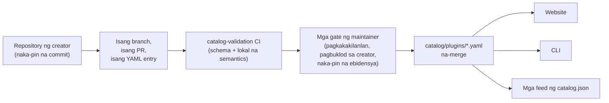

<div align="center">


# 🧩 Awesome Omni DSH Plugins

> **Hindi opisyal na proyekto ng komunidad. Hindi kaugnay, inendorso, o inispansor ng DeepSeek.**
> Ang mga pangalan at marka ng DeepSeek ay pag-aari ng kani-kanilang may-ari.

Pagtuklas na unang nagbibigay-priyoridad sa mga creator at isang-utos na pag-install para sa mga plugin ng **DeepSeek Harness (DSH)**.

<h2>
  🌐 <a href="https://dsh-plugins.omniroute.online"><strong>dsh-plugins.omniroute.online</strong></a> 🌐
</h2>
<h3>
  <a href="https://dsh-plugins.omniroute.online">Mag-browse, maghanap at mag-install ng bawat plugin sa website →</a>
</h3>

[](https://dsh-plugins.omniroute.online)
[](https://www.npmjs.com/package/@diegosouza.pw/dsh-plugins)
[](https://github.com/diegosouzapw/awesome-omni-dsh-plugins/actions/workflows/validate-catalog.yml)
[](../../LICENSE)
[](https://dsh-plugins.omniroute.online)

<br/>

<b>🌐 Sa 43 wika</b>
<br/><br/>
<a href="../../README.md"></a>
<a href="../pt-BR/README.md"></a>
<a href="../zh-CN/README.md"></a>
<a href="../zh-TW/README.md"></a>
<a href="../pt/README.md"></a>
<a href="../es/README.md"></a>
<a href="../fr/README.md"></a>
<a href="../it/README.md"></a>
<a href="../de/README.md"></a>
<a href="../nl/README.md"></a>
<a href="../ru/README.md"></a>
<a href="../uk-UA/README.md"></a>
<a href="../pl/README.md"></a>
<a href="../cs/README.md"></a>
<a href="../sk/README.md"></a>
<a href="../ro/README.md"></a>
<a href="../hu/README.md"></a>
<a href="../bg/README.md"></a>
<a href="../da/README.md"></a>
<a href="../fi/README.md"></a>
<a href="../no/README.md"></a>
<a href="../sv/README.md"></a>
<a href="../ja/README.md"></a>
<a href="../ko/README.md"></a>
<a href="../th/README.md"></a>
<a href="../vi/README.md"></a>
<a href="../id/README.md"></a>
<a href="../ms/README.md"></a>
<a href="README.md"></a>
<a href="../in/README.md"></a>
<a href="../hi/README.md"></a>
<a href="../gu/README.md"></a>
<a href="../mr/README.md"></a>
<a href="../ta/README.md"></a>
<a href="../te/README.md"></a>
<a href="../bn/README.md"></a>
<a href="../ur/README.md"></a>
<a href="../fa/README.md"></a>
<a href="../ar/README.md"></a>
<a href="../he/README.md"></a>
<a href="../tr/README.md"></a>
<a href="../az/README.md"></a>
<a href="../sw/README.md"></a>

</div>

---

## ⭐ Nangungunang 10 plugin

Inayos ayon sa eksaktong bituin ng repository — ang mga bituing kinita lamang ng sariling repository ng plugin ang binibilang, hindi kailanman ang sa isang parent project ([predicate ng ranggo](../../docs/RANKING.md)). Bawat pangalan ay naka-link sa repository ng creator, naka-pin sa eksaktong commit na na-validate ng katalogo.

| # | Plugin | Creator | ★ | Kategorya | Ano ang ginagawa nito |
| --- | ------ | ------- | --- | -------- | ------------ |
| 1 | [dsh-visualize](https://github.com/Nagi-ovo/dsh-visualize) | [@Nagi-ovo](https://github.com/Nagi-ovo) | 180 | UI & dashboards | Inline na visualization: nagre-render ang modelo ng interactive na mga chart at diagram sa loob ng session |
| 2 | [dsh-pet-remielle](https://github.com/Gin-7/dsh-pet-remielle) | [@Gin-7](https://github.com/Gin-7) | 20 | Entertainment | Hot-pluggable na transparent na desktop pet (Remielle, Zenless Zone Zero) para sa web GUI ng DSH |
| 3 | [dsh-whale-musume](https://github.com/Sutera-Diffusus/dsh-whale-musume) | [@Sutera-Diffusus](https://github.com/Sutera-Diffusus) | 19 | Entertainment | Animated na balyena-babae na Kanban Musume mascot na tumutugon sa aktibidad ng dashboard |
| 4 | [deepseek-harness-tui](https://github.com/gxinxing/deepseek-harness-tui) | [@gxinxing](https://github.com/gxinxing) | 7 | UI & dashboards | Full-screen curses-style na terminal chat client para sa pagpapatakbo ng mga dsh session |
| 5 | [dsh-tui](https://github.com/turtle1999/turtle-ui) | [@turtle1999](https://github.com/turtle1999) | 7 | UI & dashboards | Interactive na pi-tui terminal front door: session picker, streaming chat, keybindings |
| 6 | [dsh-tavily-workspace](https://github.com/moguiyu/dsh-tavily) | [@moguiyu](https://github.com/moguiyu) | 3 | Search & research | Opt-in na advanced na search tool ng Tavily na may multi-key management at usage gauge |
| 7 | [dsh-bili-widget](https://github.com/pyf2818/dsh-bili-widget) | [@pyf2818](https://github.com/pyf2818) | 2 | Entertainment | Lumulutang na bilibili video widget: mga rekomendasyon, trending, ranking at paghahanap |
| 8 | [dsh-themes](https://github.com/MangMax/dsh-themes) | [@MangMax](https://github.com/MangMax) | 1 | Entertainment | Plugin sa hitsura: built-in na palette, light/dark/system mode, mga tema ng VS Code |
| 9 | [dsh-arknights](https://github.com/DocJlm/dsh-arknights) | [@DocJlm](https://github.com/DocJlm) | — | Entertainment | Non-commercial na Arknights astral-garden skin na may Pramanix at Eyjafjalla |
| 10 | [dsh-bridge-browser](https://github.com/Lum1104/dsh-browser) | [@Lum1104](https://github.com/Lum1104) | — | Browser automation | Token-authenticated na WebSocket bridge para sa kasamang browser extension |

<div align="center">

### 👉 [**Hanapin ang lahat ng plugin, basahin ang mga detalye at kopyahin ang install command sa website →**](https://dsh-plugins.omniroute.online) 👈

</div>

## Sa isang tingin

| Surface | Ano ito | Saan |
| ----------- | ---------------------------------------------------------------- | ------------------------------------------------------------------------ |
| **Website** | Nakarender na catalog browser na may paghahanap at ranggo | [dsh-plugins.omniroute.online](https://dsh-plugins.omniroute.online) |
| **Catalog** | Isang YAML file bawat plugin, ang nag-iisang pinagmumulan ng katotohanan | [`catalog/plugins/`](../../catalog/plugins) |
| **Schema** | Pampublikong JSON Schema (draft 2020-12) na kinokompara ang bawat entry | [`schemas/plugin.schema.yaml`](../../schemas/plugin.schema.yaml) |
| **CLI** | Maghanap, suriin, i-validate at i-install mula sa katalogo | [`@diegosouza.pw/dsh-plugins`](https://www.npmjs.com/package/@diegosouza.pw/dsh-plugins) |
| **Machine feeds** | `catalog.json` + `catalog.snapshot.json` para sa mga tool | [catalog.json](https://dsh-plugins.omniroute.online/catalog.json) · [catalog.snapshot.json](https://dsh-plugins.omniroute.online/catalog.snapshot.json) |

Ang repository na ito ang pampublikong pinagmumulan ng katotohanan para sa katalogo. Ang bawat listing ay isang YAML file sa ilalim ng `catalog/plugins/`, na-validate laban sa isang naipublikang JSON Schema, idinagdag sa pamamagitan ng isang indibidwal na na-review na pull request, at palaging kinikilala ang orihinal na creator ng plugin. Walang anuman sa katalogo ang ginawa mula sa ibang katalogo o listahan: ang bawat entry ay muling binuo mula sa orihinal na repository ng creator sa isang naka-pin na commit.

Ang website at CLI ay pinapanatili mula sa pribadong source; dala ng repository na ito ang pampublikong data ng katalogo, schema, at mga patakarang ginagamit nila.

## Status ng katalogo

**10 plugin na ang na-merge.** Ang bawat plugin ay pumapasok sa pamamagitan ng isang indibidwal na na-review na pull request, isa-isa, mula sa orihinal na repository ng creator, na may naka-pin na source commit at malinaw na atribusyon.

## 🚀 I-install ang CLI

```bash
npx @diegosouza.pw/dsh-plugins --help
```

Ang scoped na package ay inilalathala bilang `@diegosouza.pw/dsh-plugins@0.1.0` at ang command sa itaas ang pamantayang paraan sa paggamit ngayon; walang naka-host na installer script dito.

### Gamitin ang CLI ngayon

Ang bersyon 0.1.0 ay naglalaman ng read-only na mga command para sa discovery at validation kasama ang mga install command na may consent gate. Ang buong command reference, kasama ang mga flag, exit code, at ang code-execution consent gate, ay nasa [docs/CLI.md](../../docs/CLI.md).

| Command | Ano ang ginagawa nito | May hinahawakan ba ito sa system mo? |
| ------------------------------ | ------------------------------------------------------------------- | --------------------------------------- |
| `catalog validate --catalog .` | I-validate ang catalog YAML, schema at lokal na semantics | Hindi — read-only |
| `search <query...>` | Maghanap ng mga pampublikong catalog field nang lokal | Hindi — read-only |
| `info <id>` | Ipakita ang isang pampublikong catalog entry | Hindi — read-only |
| `list` | Ilista ang mga install na pinamamahalaan ng katalogo nang hindi binabago ang mga profile | Hindi — read-only |
| `doctor` | Read-only na diagnostics para sa Node, DSH, native na Windows policy at katalogo | Hindi — read-only |
| `add <id> --profile <name> --dry-run` | Ipakita ang na-verify na install plan nang walang file o subprocess | Hindi — dry-run |
| `add <id> --profile <name> --allow-code-execution` | Mag-install sa pamamagitan ng opisyal na delegasyon ng DSH | Oo — sa flag lamang ng malinaw na pahintulot |

```bash
# Validate the catalog in this repository (what CI runs):
npx @diegosouza.pw/dsh-plugins@0.1.0 catalog validate --catalog .

# Search and inspect locally, without installing anything:
npx @diegosouza.pw/dsh-plugins@0.1.0 search memory --catalog .
npx @diegosouza.pw/dsh-plugins@0.1.0 info <plugin-id> --catalog .

# Preview an install plan; nothing is written and no subprocess runs:
npx @diegosouza.pw/dsh-plugins@0.1.0 add <plugin-id> --profile default --dry-run
```

Ang mga mutating command (`add`, `update`, `remove`) ay hindi kailanman nagpapatakbo ng plugin lifecycle code maliban kung ipapasa mo ang `--allow-code-execution`. Sa native na Windows, naka-disable ang mga mutation na ito sa v0.1.0; gumamit ng WSL. Gumagana kahit saan ang mga read-only at dry-run na command.

## 🔍 Paano pumapasok ang isang plugin sa katalogo



1. **Isang plugin, isang branch, isang pull request.** Ang PR ay nagdaragdag o nagbabago ng eksaktong isang YAML file sa ilalim ng `catalog/plugins/`.
2. **Creator ang unang priyoridad.** Ang PR na binuksan ng creator ng plugin o ang organisasyong may-ari nito ay laging nauuna sa community curation o automation para sa parehong plugin — tingnan ang [docs/CREDIT.md](../../docs/CREDIT.md).
3. **Ebidensya mula sa orihinal na source.** Ang bawat field ay muling binuo mula sa repository ng creator sa isang naka-pin na 40-karakter na commit: paglalarawan, lisensya, integrasyon ng DSH, install descriptor, mga bituin.
4. **Lokal na validation.** Sinusuri ng `catalog validate` ang istruktura at lokal na semantics; ito rin ang parehong check na pinapatakbo ng `catalog-validation` CI job sa PR.
5. **Mga gate ng maintainer.** Bago mag-merge, hiwalay na beinerify ng mga maintainer ang pagkakakilanlan ng repository, pagbuklod sa creator, at naka-pin na ebidensya. Kailangan ang berdeng lokal na validation, ngunit hindi ito kailanman sapat.

Ang buong kontrata — kinakailangang ebidensya, mga panuntunan sa YAML, patakaran sa bituin, paghawak sa banggaan, at mga review gate — ay nasa [CONTRIBUTING.md](../../CONTRIBUTING.md). Kung paano ginagawa ang mga desisyon at ng sino ay nasa [docs/GOVERNANCE.md](../../docs/GOVERNANCE.md).

## 📄 Anatomiya ng isang entry

Ang bawat entry ay isang YAML file na pinangalanan ayon sa ID nito. Ang halimbawa sa ibaba ay na-validate laban sa kasalukuyang schema (field-by-field na reference sa [docs/SCHEMA.md](../../docs/SCHEMA.md)):

```yaml
schemaVersion: 1
id: example-notes-search
name: Example Notes Search
description:
  en: >-
    Searches a local Markdown notes folder from DSH sessions and returns
    matching snippets with file paths.
  evidencePath: README.md
unofficial: true
kind: plugin
primaryCategory: search-research
tags:
  - search
  - notes
  - cli
source:
  repository: https://github.com/example-creator/example-notes-search
  repositoryNodeId: R_kgDOExample01
  subpath: null
  commit: 0123456789abcdef0123456789abcdef01234567
creator:
  github: example-creator
package:
  ecosystem: npm
  name: example-notes-search
  version: 1.4.2
dsh:
  profiles:
    - default
  evidencePath: dsh-plugin.json
repositoryScope: dedicated
popularity:
  starsPolicy: exact-repository
  stars: 128
license:
  spdx: MIT
verification:
  status: eligible
  checkedAt: "2026-08-18T12:00:00Z"
  repositoryIdentity: resolved
  smokeTest: null
provenance:
  discussion: null
  comment: null
```

Mga pangunahing invariant na pinapatupad ng schema:

- Ang `unofficial: true` at `schemaVersion: 1` ay mga constant.
- Ang isang monorepo na plugin ay dapat gumamit ng `stars: null` — ang mga bituin ng parent project ay hindi kailanman namamana.
- Ang install descriptor ay maaaring isang exact-version na npm package o ang naka-pin na source mismo; datos ito, hindi kailanman shell command.
- Kailangan ng status na `verified` ang na-verify na smoke-test evidence; kung hindi, ang entry ay `eligible` na may `smokeTest: null`.

## 🗂 Ano ang nabibilang dito

Ang repository na ito ay nagkakatalogo ng mga independiyenteng inilathalang integration para sa DeepSeek Harness (DSH), kabilang ang mga native na plugin, plugin family, tema, skill, client, at bridge. Ang mga uri ng artifact, kategorya ng kakayahan, at mga interface tag ay tinutukoy sa [docs/CATEGORIES.md](../../docs/CATEGORIES.md).

Ang bawat pampublikong record ay isang YAML file sa ilalim ng `catalog/plugins/` at dapat mag-validate laban sa `schemas/plugin.schema.yaml`. Ang pagiging naka-lista ay nangangahulugang natapos na ang mga naka-dokumentong pagsusuri sa pagiging kwalipikado o pag-verify; hindi ito security certification o pag-endorso ng DeepSeek.

## 🏅 Ranggo at pag-verify

Tanging ang dedicated, native, kwalipikado, o na-verify na mga repository ng plugin na ang mga bituin ay pag-aari mismo ng eksaktong repository na iyon ang maaaring makapasok sa ranggo ng bituin. Ang mga integration na naka-imbak sa loob ng mas malawak na monorepo ay nananatiling matutuklasan ngunit gumagamit ng `stars: null` at hindi kailanman namamana ang mga bituin ng parent project. Tingnan ang [docs/RANKING.md](../../docs/RANKING.md) para sa kumpletong predicate.

Ang mga pampublikong estado ng pag-verify ay ibinubukod ang structural eligibility mula sa isang installation smoke test. Walang estadong kumakatawan sa ganap na kaligtasan. Suriin ang repository, naka-pin na commit, lisensya, at gawi sa pag-install ng isang plugin bago ito gamitin.

## 🤝 Mag-ambag o mag-claim ng entry

Basahin ang [CONTRIBUTING.md](../../CONTRIBUTING.md) bago magbukas ng pull request. Ang isang pull request ay dapat magdagdag o magbago ng eksaktong isang plugin entry at dapat banggitin ang orihinal na repository ng creator sa halip na ibang katalogo. Ang mga pull request na isinulat ng creator ay nauuna sa mga awtomatikong pull request ng katalogo.

May available na structured na issue form para sa mga claim ng creator, pagwawasto, at pagtanggal. Huwag kailanman magsumite ng credential, pribadong detalye ng contact, o iba pang lihim.

## 👩‍🎨 Mga creator ng plugin

Umiiral ang katalogo dahil naglabas ang mga creator na ito ng mga plugin. Bawat entry ay kumikilala sa kanilang creator at laging naka-link pabalik sa kanilang repository.

<a href="https://github.com/Nagi-ovo" title="@Nagi-ovo — dsh-visualize"></a>
<a href="https://github.com/Gin-7" title="@Gin-7 — dsh-pet-remielle"></a>
<a href="https://github.com/Sutera-Diffusus" title="@Sutera-Diffusus — dsh-whale-musume"></a>
<a href="https://github.com/gxinxing" title="@gxinxing — deepseek-harness-tui"></a>
<a href="https://github.com/turtle1999" title="@turtle1999 — dsh-tui"></a>
<a href="https://github.com/moguiyu" title="@moguiyu — dsh-tavily-workspace"></a>
<a href="https://github.com/pyf2818" title="@pyf2818 — dsh-bili-widget"></a>
<a href="https://github.com/MangMax" title="@MangMax — dsh-themes"></a>
<a href="https://github.com/DocJlm" title="@DocJlm — dsh-arknights"></a>
<a href="https://github.com/Lum1104" title="@Lum1104 — dsh-bridge-browser"></a>

Gusto mo bang narito ang iyong plugin nang may buong credit? [Magbukas ng isang PR na may isang YAML entry](../../CONTRIBUTING.md) — o [mag-claim ng umiiral na entry](https://github.com/diegosouzapw/awesome-omni-dsh-plugins/issues/new/choose) kung may nagkatalogo na ng iyong trabaho bago ka.

## 📚 Dokumentasyon

| Dokumento | Ano ang saklaw nito |
| --------------------------------------------- | ---------------------------------------------------------------------- |
| [CONTRIBUTING.md](../../CONTRIBUTING.md) | Ang buong kontrata ng pag-ambag: ebidensya, mga panuntunan sa YAML, review gate |
| [SECURITY.md](../../SECURITY.md) | Pag-uulat ng mga vulnerability sa plugin o katalogo; patakaran sa lihim |
| [docs/SCHEMA.md](../../docs/SCHEMA.md) | Field-by-field na reference para sa `schemas/plugin.schema.yaml` |
| [docs/CLI.md](../../docs/CLI.md) | CLI command reference para sa `@diegosouza.pw/dsh-plugins@0.1.0` |
| [docs/GOVERNANCE.md](../../docs/GOVERNANCE.md) | Kung paano pinapamahalaan ang katalogo: priyoridad, gate, mga claim at pagtanggal |
| [docs/CATEGORIES.md](../../docs/CATEGORIES.md) | Mga uri ng artifact, pangunahing kategorya ng kakayahan, tag, saklaw ng repository |
| [docs/CREDIT.md](../../docs/CREDIT.md) | Credit ng creator, priyoridad ng PR at patakaran sa pagkakakilanlan ng Git |
| [docs/RANKING.md](../../docs/RANKING.md) | Ang pampublikong ranking predicate at mga estado ng pag-verify |
| [docs/UNOFFICIAL.md](../../docs/UNOFFICIAL.md) | Hindi opisyal na status at pananaw sa trademark |

## 🌐 Mga salin

Available ang README na ito sa 43 wika sa ilalim ng [`docs/i18n/`](..) — gamitin ang flag selector sa itaas. Ang Ingles ang pinagmumulan ng katotohanan; kapag hindi magkatugma ang isang salin at ang tekstong Ingles, ang tekstong Ingles ang mananaig. Malugod na tinatanggap ang mga pagwawasto sa alinmang salin sa pamamagitan ng normal na pull request.

## 📜 Lisensya at atribusyon

Ang dokumentasyon at mga template ng repository ay lisensyado sa ilalim ng [MIT License](../../LICENSE). Ang orihinal na katotohanan ng katalogo at editoryal na YAML metadata ay nakalaan sa ilalim ng [CC0-1.0](../../LICENSE-CATALOG). Ang upstream na code, mga pangalan, logo, at screenshot ay nananatili sa ilalim ng kanilang orihinal na may-ari at lisensya. Tingnan ang [docs/CREDIT.md](../../docs/CREDIT.md) at [docs/UNOFFICIAL.md](../../docs/UNOFFICIAL.md).

<div align="center">

### ⭐ Kung nakatulong sa iyo ang katalogong ito na makahanap ng plugin, i-star ang repo — nakakatulong ito sa mga creator na matuklasan.

**[I-browse ang lahat ng plugin sa website →](https://dsh-plugins.omniroute.online)**

</div>
