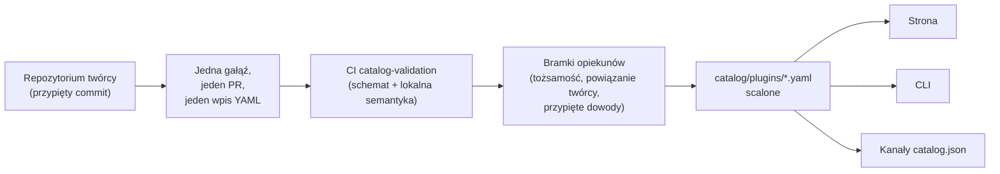

<div align="center">


# 🧩 Awesome Omni DSH Plugins

> **Nieoficjalny projekt społeczności. Niepowiązany z DeepSeek, niezatwierdzony ani niesponsorowany przez DeepSeek.**
> Nazwy i znaki DeepSeek należą do ich właściciela.

Wyszukiwanie stawiające na pierwszym miejscu twórców i instalacja jedną komendą dla wtyczek **DeepSeek Harness (DSH)**.

<h2>
  🌐 <a href="https://dsh-plugins.omniroute.online"><strong>dsh-plugins.omniroute.online</strong></a> 🌐
</h2>
<h3>
  <a href="https://dsh-plugins.omniroute.online">Przeglądaj, wyszukuj i instaluj każdą wtyczkę na stronie →</a>
</h3>

[](https://dsh-plugins.omniroute.online)
[](https://www.npmjs.com/package/@diegosouza.pw/dsh-plugins)
[](https://github.com/diegosouzapw/awesome-omni-dsh-plugins/actions/workflows/validate-catalog.yml)
[](../../LICENSE)
[](https://dsh-plugins.omniroute.online)

<br/>

<b>🌐 W 43 językach</b>
<br/><br/>
<a href="../../README.md"></a>
<a href="../pt-BR/README.md"></a>
<a href="../zh-CN/README.md"></a>
<a href="../zh-TW/README.md"></a>
<a href="../pt/README.md"></a>
<a href="../es/README.md"></a>
<a href="../fr/README.md"></a>
<a href="../it/README.md"></a>
<a href="../de/README.md"></a>
<a href="../nl/README.md"></a>
<a href="../ru/README.md"></a>
<a href="../uk-UA/README.md"></a>
<a href="README.md"></a>
<a href="../cs/README.md"></a>
<a href="../sk/README.md"></a>
<a href="../ro/README.md"></a>
<a href="../hu/README.md"></a>
<a href="../bg/README.md"></a>
<a href="../da/README.md"></a>
<a href="../fi/README.md"></a>
<a href="../no/README.md"></a>
<a href="../sv/README.md"></a>
<a href="../ja/README.md"></a>
<a href="../ko/README.md"></a>
<a href="../th/README.md"></a>
<a href="../vi/README.md"></a>
<a href="../id/README.md"></a>
<a href="../ms/README.md"></a>
<a href="../phi/README.md"></a>
<a href="../in/README.md"></a>
<a href="../hi/README.md"></a>
<a href="../gu/README.md"></a>
<a href="../mr/README.md"></a>
<a href="../ta/README.md"></a>
<a href="../te/README.md"></a>
<a href="../bn/README.md"></a>
<a href="../ur/README.md"></a>
<a href="../fa/README.md"></a>
<a href="../ar/README.md"></a>
<a href="../he/README.md"></a>
<a href="../tr/README.md"></a>
<a href="../az/README.md"></a>
<a href="../sw/README.md"></a>

</div>

---

## ⭐ Top 10 wtyczek

Ranking oparty na gwiazdkach dokładnego repozytorium — liczą się tylko gwiazdki zdobyte przez
własne repozytorium wtyczki, nigdy repozytorium projektu nadrzędnego ([predykat rankingu](../../docs/RANKING.md)).
Każda nazwa prowadzi do repozytorium twórcy, przypiętego na dokładnym commicie zweryfikowanym przez katalog.

| #   | Wtyczka | Twórca | ★ | Kategoria | Co robi |
| --- | ------ | ------- | --- | -------- | ------------ |
| 1 | [dsh-visualize](https://github.com/Nagi-ovo/dsh-visualize) | [@Nagi-ovo](https://github.com/Nagi-ovo) | 180 | UI & dashboards | Wizualizacja w treści: model renderuje interaktywne wykresy i diagramy bezpośrednio w sesji |
| 2 | [dsh-pet-remielle](https://github.com/Gin-7/dsh-pet-remielle) | [@Gin-7](https://github.com/Gin-7) | 20 | Entertainment | Podłączany na gorąco przezroczysty pupil pulpitu (Remielle, Zenless Zone Zero) dla webowego interfejsu DSH |
| 3 | [dsh-whale-musume](https://github.com/Sutera-Diffusus/dsh-whale-musume) | [@Sutera-Diffusus](https://github.com/Sutera-Diffusus) | 19 | Entertainment | Animowana maskotka wieloryba-dziewczyny w stylu Kanban Musume, reagująca na aktywność w panelu |
| 4 | [deepseek-harness-tui](https://github.com/gxinxing/deepseek-harness-tui) | [@gxinxing](https://github.com/gxinxing) | 7 | UI & dashboards | Pełnoekranowy terminalowy klient czatu w stylu curses do sterowania sesjami dsh |
| 5 | [dsh-tui](https://github.com/turtle1999/turtle-ui) | [@turtle1999](https://github.com/turtle1999) | 7 | UI & dashboards | Interaktywna powłoka terminalowa pi-tui: wybór sesji, strumieniowy czat, skróty klawiszowe |
| 6 | [dsh-tavily-workspace](https://github.com/moguiyu/dsh-tavily) | [@moguiyu](https://github.com/moguiyu) | 3 | Search & research | Opcjonalne zaawansowane wyszukiwanie Tavily z zarządzaniem wieloma kluczami i wskaźnikiem zużycia |
| 7 | [dsh-bili-widget](https://github.com/pyf2818/dsh-bili-widget) | [@pyf2818](https://github.com/pyf2818) | 2 | Entertainment | Pływający widżet wideo bilibili: rekomendacje, popularne, rankingi i wyszukiwanie |
| 8 | [dsh-themes](https://github.com/MangMax/dsh-themes) | [@MangMax](https://github.com/MangMax) | 1 | Entertainment | Wtyczka wyglądu: wbudowane palety, tryb jasny/ciemny/systemowy, motywy VS Code |
| 9 | [dsh-arknights](https://github.com/DocJlm/dsh-arknights) | [@DocJlm](https://github.com/DocJlm) | — | Entertainment | Niekomercyjna skórka „astralny ogród” w stylu Arknights z postaciami Pramanix i Eyjafjalla |
| 10 | [dsh-bridge-browser](https://github.com/Lum1104/dsh-browser) | [@Lum1104](https://github.com/Lum1104) | — | Browser automation | Most WebSocket z uwierzytelnianiem tokenem dla towarzyszącego rozszerzenia przeglądarki |

<div align="center">

### 👉 [**Przeszukuj wszystkie wtyczki, czytaj szczegóły i kopiuj komendę instalacji na stronie →**](https://dsh-plugins.omniroute.online) 👈

</div>

## W skrócie

| Element     | Co to jest                                                       | Gdzie                                                                    |
| ----------- | ---------------------------------------------------------------- | ------------------------------------------------------------------------ |
| **Strona** | Wyrenderowana przeglądarka katalogu z wyszukiwaniem i rankingiem                 | [dsh-plugins.omniroute.online](https://dsh-plugins.omniroute.online)     |
| **Katalog** | Jeden plik YAML na wtyczkę, jedyne źródło prawdy             | [`catalog/plugins/`](../../catalog/plugins)                                    |
| **Schemat**  | Publiczny JSON Schema (draft 2020-12), z którym walidowany jest każdy wpis | [`schemas/plugin.schema.yaml`](../../schemas/plugin.schema.yaml)               |
| **CLI**     | Wyszukiwanie, inspekcja, walidacja i instalacja z katalogu           | [`@diegosouza.pw/dsh-plugins`](https://www.npmjs.com/package/@diegosouza.pw/dsh-plugins) |
| **Kanały maszynowe** | `catalog.json` + `catalog.snapshot.json` dla narzędzi           | [catalog.json](https://dsh-plugins.omniroute.online/catalog.json) · [catalog.snapshot.json](https://dsh-plugins.omniroute.online/catalog.snapshot.json) |

To repozytorium jest publicznym źródłem prawdy dla katalogu. Każdy wpis to jeden plik YAML
w `catalog/plugins/`, zwalidowany względem opublikowanego JSON Schema, dodany przez osobno
zrecenzowany pull request i zawsze z przypisaniem oryginalnego twórcy wtyczki.
Nic w katalogu nie jest generowane z innego katalogu ani listy: każdy wpis jest odtwarzany
z repozytorium oryginalnego twórcy na przypiętym commicie.

Strona i CLI są utrzymywane z prywatnego kodu źródłowego; to repozytorium zawiera publiczne
dane katalogu, schemat i zasady, z których korzystają.

## Status katalogu

**Scalono 10 wtyczek.** Każda wtyczka trafia do katalogu przez osobno zrecenzowany pull request,
po jednej naraz, z repozytorium oryginalnego twórcy, z przypiętym commitem źródłowym
i jawnym przypisaniem autorstwa.

## 🚀 Instalacja CLI

```bash
npx @diegosouza.pw/dsh-plugins --help
```

Pakiet zakresowy jest publikowany jako `@diegosouza.pw/dsh-plugins@0.1.0`, a powyższa komenda
jest dziś kanonicznym wywołaniem; skrypt instalacyjny nie jest tu hostowany.

### Możliwości CLI już dziś

Wersja 0.1.0 zawiera komendy wyszukiwania i walidacji tylko do odczytu oraz komendy instalacji
wymagające zgody. Pełna dokumentacja komend, w tym flagi, kody wyjścia i bramka zgody na
wykonanie kodu, znajduje się w [docs/CLI.md](../../docs/CLI.md).

| Komenda                        | Co robi                                                        | Wpływa na system?                    |
| ------------------------------ | ------------------------------------------------------------------- | --------------------------------------- |
| `catalog validate --catalog .` | Waliduje YAML katalogu, schemat i lokalną semantykę                   | Nie — tylko odczyt                          |
| `search <query...>`            | Przeszukuje publiczne pola katalogu lokalnie                                | Nie — tylko odczyt                          |
| `info <id>`                    | Pokazuje jeden publiczny wpis katalogu                                       | Nie — tylko odczyt                          |
| `list`                         | Wyświetla instalacje zarządzane przez katalog bez modyfikowania profili            | Nie — tylko odczyt                          |
| `doctor`                       | Diagnostyka Node, DSH, natywnej polityki Windows i katalogu tylko do odczytu  | Nie — tylko odczyt                          |
| `add <id> --profile <name> --dry-run` | Pokazuje zweryfikowany plan instalacji bez plików i podprocesów | Nie — symulacja                            |
| `add <id> --profile <name> --allow-code-execution` | Instaluje przez oficjalną delegację DSH        | Tak — tylko z jawną flagą zgody   |

```bash
# Validate the catalog in this repository (what CI runs):
npx @diegosouza.pw/dsh-plugins@0.1.0 catalog validate --catalog .

# Search and inspect locally, without installing anything:
npx @diegosouza.pw/dsh-plugins@0.1.0 search memory --catalog .
npx @diegosouza.pw/dsh-plugins@0.1.0 info <plugin-id> --catalog .

# Preview an install plan; nothing is written and no subprocess runs:
npx @diegosouza.pw/dsh-plugins@0.1.0 add <plugin-id> --profile default --dry-run
```

Komendy modyfikujące (`add`, `update`, `remove`) nigdy nie wykonują kodu cyklu życia wtyczki,
jeśli nie przekażesz flagi `--allow-code-execution`. W natywnym Windows te modyfikacje są
wyłączone w v0.1.0; użyj WSL. Komendy tylko do odczytu i symulacji działają wszędzie.

## 🔍 Jak wtyczka trafia do katalogu



1. **Jedna wtyczka, jedna gałąź, jeden pull request.** PR dodaje lub zmienia dokładnie jeden
   plik YAML w `catalog/plugins/`.
2. **Priorytet twórcy.** PR otwarty przez twórcę wtyczki lub organizację będącą właścicielem
   zawsze ma pierwszeństwo przed kuratelą społeczności lub automatyzacją dla tej samej wtyczki
   — zob. [docs/CREDIT.md](../../docs/CREDIT.md).
3. **Dowody z oryginalnego źródła.** Każde pole jest odtwarzane z repozytorium twórcy na
   przypiętym 40-znakowym commicie: opis, licencja, integracja z DSH, deskryptor instalacji,
   gwiazdki.
4. **Walidacja lokalna.** `catalog validate` sprawdza strukturę i lokalną semantykę; to ta sama
   kontrola, którą zadanie CI `catalog-validation` uruchamia dla PR.
5. **Bramki opiekunów.** Przed scaleniem opiekunowie osobno weryfikują tożsamość repozytorium,
   powiązanie twórcy i przypięte dowody. Zielona walidacja lokalna jest konieczna, ale nigdy
   niewystarczająca.

Pełny kontrakt — wymagane dowody, zasady YAML, politykę gwiazdek, obsługę kolizji i bramki
recenzji — znajdziesz w [CONTRIBUTING.md](../../CONTRIBUTING.md). O tym, jak i przez kogo podejmowane
są decyzje, mówi [docs/GOVERNANCE.md](../../docs/GOVERNANCE.md).

## 📄 Anatomia wpisu

Każdy wpis to jeden plik YAML nazwany zgodnie z jego ID. Poniższy przykład jest zgodny z
aktualnym schematem (opis pole po polu w [docs/SCHEMA.md](../../docs/SCHEMA.md)):

```yaml
schemaVersion: 1
id: example-notes-search
name: Example Notes Search
description:
  en: >-
    Searches a local Markdown notes folder from DSH sessions and returns
    matching snippets with file paths.
  evidencePath: README.md
unofficial: true
kind: plugin
primaryCategory: search-research
tags:
  - search
  - notes
  - cli
source:
  repository: https://github.com/example-creator/example-notes-search
  repositoryNodeId: R_kgDOExample01
  subpath: null
  commit: 0123456789abcdef0123456789abcdef01234567
creator:
  github: example-creator
package:
  ecosystem: npm
  name: example-notes-search
  version: 1.4.2
dsh:
  profiles:
    - default
  evidencePath: dsh-plugin.json
repositoryScope: dedicated
popularity:
  starsPolicy: exact-repository
  stars: 128
license:
  spdx: MIT
verification:
  status: eligible
  checkedAt: "2026-08-18T12:00:00Z"
  repositoryIdentity: resolved
  smokeTest: null
provenance:
  discussion: null
  comment: null
```

Kluczowe niezmienniki wymuszane przez schemat:

- `unofficial: true` i `schemaVersion: 1` są stałymi.
- Wtyczka z monorepo musi używać `stars: null` — gwiazdki projektu nadrzędnego nigdy nie są dziedziczone.
- Deskryptor instalacji to albo pakiet npm o dokładnej wersji, albo sam przypięty kod źródłowy;
  to dane, nigdy komenda powłoki.
- Status `verified` wymaga możliwych do zweryfikowania dowodów testu smoke; w przeciwnym razie
  wpis ma status `eligible` z `smokeTest: null`.

## 🗂 Co tu się znajduje

To repozytorium katalogizuje niezależnie publikowane integracje dla DeepSeek Harness (DSH),
w tym natywne wtyczki, rodziny wtyczek, motywy, umiejętności, klientów i mosty. Rodzaje
artefaktów, kategorie możliwości i tagi interfejsów są zdefiniowane w [docs/CATEGORIES.md](../../docs/CATEGORIES.md).

Każdy publiczny rekord to jeden plik YAML w `catalog/plugins/`, który musi być zgodny z
`schemas/plugin.schema.yaml`. Wpis oznacza, że udokumentowane kontrole kwalifikowalności lub
weryfikacji zostały wykonane; nie jest to certyfikacja bezpieczeństwa ani zatwierdzenie DeepSeek.

## 🏅 Ranking i weryfikacja

Do rankingu gwiazdek mogą trafić tylko dedykowane, natywne, kwalifikujące się lub zweryfikowane
repozytoria wtyczek, których gwiazdki należą do dokładnie tego repozytorium. Integracje
przechowywane w większych monorepo pozostają wykrywalne, ale używają `stars: null` i nigdy nie
dziedziczą gwiazdek projektu nadrzędnego. Pełny predykat znajduje się w [docs/RANKING.md](../../docs/RANKING.md).

Publiczne stany weryfikacji odróżniają kwalifikowalność strukturalną od testu smoke instalacji.
Żaden stan nie oznacza absolutnego bezpieczeństwa. Przed użyciem wtyczki sprawdź jej
repozytorium, przypięty commit, licencję i zachowanie podczas instalacji.

## 🤝 Wnieś wkład lub zgłoś wpis

Przeczytaj [CONTRIBUTING.md](../../CONTRIBUTING.md) przed otwarciem pull requesta. Pull request musi
dodawać lub zmieniać dokładnie jeden wpis wtyczki i musi wskazywać oryginalne repozytorium
twórcy, a nie inny katalog. Pull requesty autorstwa twórców mają pierwszeństwo przed
zautomatyzowanymi pull requestami katalogu.

Dostępne są ustrukturyzowane formularze zgłoszeń do roszczeń twórców, poprawek i usunięć.
Nigdy nie przesyłaj danych uwierzytelniających, prywatnych danych kontaktowych ani innych sekretów.

## 👩‍🎨 Twórcy wtyczek

Ten katalog istnieje, ponieważ ci twórcy wydali swoje wtyczki. Każdy wpis zawsze przypisuje
autorstwo i prowadzi z powrotem do repozytorium twórcy.

<a href="https://github.com/Nagi-ovo" title="@Nagi-ovo — dsh-visualize"></a>
<a href="https://github.com/Gin-7" title="@Gin-7 — dsh-pet-remielle"></a>
<a href="https://github.com/Sutera-Diffusus" title="@Sutera-Diffusus — dsh-whale-musume"></a>
<a href="https://github.com/gxinxing" title="@gxinxing — deepseek-harness-tui"></a>
<a href="https://github.com/turtle1999" title="@turtle1999 — dsh-tui"></a>
<a href="https://github.com/moguiyu" title="@moguiyu — dsh-tavily-workspace"></a>
<a href="https://github.com/pyf2818" title="@pyf2818 — dsh-bili-widget"></a>
<a href="https://github.com/MangMax" title="@MangMax — dsh-themes"></a>
<a href="https://github.com/DocJlm" title="@DocJlm — dsh-arknights"></a>
<a href="https://github.com/Lum1104" title="@Lum1104 — dsh-bridge-browser"></a>

Chcesz, żeby twoja wtyczka znalazła się tutaj z pełnym przypisaniem? [Otwórz jeden PR z jednym
wpisem YAML](../../CONTRIBUTING.md) — albo [zgłoś istniejący
wpis](https://github.com/diegosouzapw/awesome-omni-dsh-plugins/issues/new/choose), jeśli ktoś
skatalogował twoją pracę zanim ty to zrobiłeś.

## 📚 Dokumentacja

| Dokument                                     | Co opisuje                                                       |
| -------------------------------------------- | -------------------------------------------------------------------- |
| [CONTRIBUTING.md](../../CONTRIBUTING.md)           | Pełny kontrakt współpracy: dowody, zasady YAML, bramki recenzji    |
| [SECURITY.md](../../SECURITY.md)                   | Zgłaszanie podatności wtyczki lub katalogu; polityka sekretów           |
| [docs/SCHEMA.md](../../docs/SCHEMA.md)             | Dokumentacja pole po polu dla `schemas/plugin.schema.yaml`             |
| [docs/CLI.md](../../docs/CLI.md)                   | Dokumentacja komend CLI dla `@diegosouza.pw/dsh-plugins@0.1.0`          |
| [docs/GOVERNANCE.md](../../docs/GOVERNANCE.md)     | Jak zarządzany jest katalog: pierwszeństwo, bramki, roszczenia i usunięcia   |
| [docs/CATEGORIES.md](../../docs/CATEGORIES.md)     | Rodzaje artefaktów, główne kategorie możliwości, tagi, zakres repozytorium |
| [docs/CREDIT.md](../../docs/CREDIT.md)             | Przypisanie autorstwa, pierwszeństwo PR i polityka tożsamości Git                 |
| [docs/RANKING.md](../../docs/RANKING.md)           | Publiczny predykat rankingu i stany weryfikacji                  |
| [docs/UNOFFICIAL.md](../../docs/UNOFFICIAL.md)     | Status nieoficjalny i stanowisko wobec znaków towarowych                               |

## 🌐 Tłumaczenia

Ten README jest dostępny w 43 językach w [`docs/i18n/`](..) — użyj selektora flag u góry
strony. Język angielski jest źródłem prawdy; w razie rozbieżności między tłumaczeniem
a tekstem angielskim rozstrzyga tekst angielski. Poprawki do dowolnego tłumaczenia są mile
widziane w formie zwykłych pull requestów.

## 📜 Licencja i przypisanie

Dokumentacja i szablony repozytorium są licencjonowane na [licencji MIT](../../LICENSE). Oryginalne
fakty katalogu i redakcyjne metadane YAML są udostępnione na licencji [CC0-1.0](../../LICENSE-CATALOG).
Kod źródłowy, nazwy, logotypy i zrzuty ekranu pozostają pod oryginalnymi właścicielami i
licencjami. Zob. [docs/CREDIT.md](../../docs/CREDIT.md) oraz [docs/UNOFFICIAL.md](../../docs/UNOFFICIAL.md).

<div align="center">

### ⭐ Jeśli ten katalog pomógł ci znaleźć wtyczkę, oznacz repozytorium gwiazdką — to pomaga twórcom zaistnieć.

**[Przeglądaj wszystkie wtyczki na stronie →](https://dsh-plugins.omniroute.online)**

</div>
