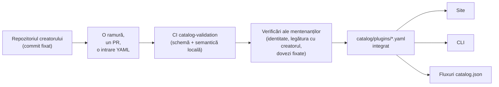

<div align="center">


# 🧩 Awesome Omni DSH Plugins

> **Proiect neoficial al comunității. Nu este afiliat, aprobat sau sponsorizat de DeepSeek.**
> Numele și mărcile DeepSeek aparțin proprietarului lor.

Descoperire ce pune creatorii pe primul loc și instalare cu o singură comandă pentru pluginurile **DeepSeek Harness (DSH)**.

<h2>
  🌐 <a href="https://dsh-plugins.omniroute.online"><strong>dsh-plugins.omniroute.online</strong></a> 🌐
</h2>
<h3>
  <a href="https://dsh-plugins.omniroute.online">Răsfoiește, caută și instalează orice plugin pe site →</a>
</h3>

[](https://dsh-plugins.omniroute.online)
[](https://www.npmjs.com/package/@diegosouza.pw/dsh-plugins)
[](https://github.com/diegosouzapw/awesome-omni-dsh-plugins/actions/workflows/validate-catalog.yml)
[](../../LICENSE)
[](https://dsh-plugins.omniroute.online)

<br/>

<b>🌐 În 43 de limbi</b>
<br/><br/>
<a href="../../README.md"></a>
<a href="../pt-BR/README.md"></a>
<a href="../zh-CN/README.md"></a>
<a href="../zh-TW/README.md"></a>
<a href="../pt/README.md"></a>
<a href="../es/README.md"></a>
<a href="../fr/README.md"></a>
<a href="../it/README.md"></a>
<a href="../de/README.md"></a>
<a href="../nl/README.md"></a>
<a href="../ru/README.md"></a>
<a href="../uk-UA/README.md"></a>
<a href="../pl/README.md"></a>
<a href="../cs/README.md"></a>
<a href="../sk/README.md"></a>
<a href="README.md"></a>
<a href="../hu/README.md"></a>
<a href="../bg/README.md"></a>
<a href="../da/README.md"></a>
<a href="../fi/README.md"></a>
<a href="../no/README.md"></a>
<a href="../sv/README.md"></a>
<a href="../ja/README.md"></a>
<a href="../ko/README.md"></a>
<a href="../th/README.md"></a>
<a href="../vi/README.md"></a>
<a href="../id/README.md"></a>
<a href="../ms/README.md"></a>
<a href="../phi/README.md"></a>
<a href="../in/README.md"></a>
<a href="../hi/README.md"></a>
<a href="../gu/README.md"></a>
<a href="../mr/README.md"></a>
<a href="../ta/README.md"></a>
<a href="../te/README.md"></a>
<a href="../bn/README.md"></a>
<a href="../ur/README.md"></a>
<a href="../fa/README.md"></a>
<a href="../ar/README.md"></a>
<a href="../he/README.md"></a>
<a href="../tr/README.md"></a>
<a href="../az/README.md"></a>
<a href="../sw/README.md"></a>

</div>

---

## ⭐ Top 10 pluginuri

Clasament după stelele repozitoriului exact — contează doar stelele câștigate de repozitoriul
propriu al pluginului, niciodată cele ale unui proiect-părinte ([predicatul clasamentului](../../docs/RANKING.md)).
Fiecare nume trimite către repozitoriul creatorului, fixat la commit-ul exact validat de catalog.

| #   | Plugin | Creator | ★ | Categorie | Ce face |
| --- | ------ | ------- | --- | -------- | ------------ |
| 1 | [dsh-visualize](https://github.com/Nagi-ovo/dsh-visualize) | [@Nagi-ovo](https://github.com/Nagi-ovo) | 180 | UI & dashboards | Vizualizare integrată: modelul randează grafice și diagrame interactive direct în sesiune |
| 2 | [dsh-pet-remielle](https://github.com/Gin-7/dsh-pet-remielle) | [@Gin-7](https://github.com/Gin-7) | 20 | Entertainment | Animăluț de birou transparent, conectabil la cald (Remielle, Zenless Zone Zero) pentru interfața web DSH |
| 3 | [dsh-whale-musume](https://github.com/Sutera-Diffusus/dsh-whale-musume) | [@Sutera-Diffusus](https://github.com/Sutera-Diffusus) | 19 | Entertainment | Mascotă animată balenă-fată în stil Kanban Musume, care reacționează la activitatea din tabloul de bord |
| 4 | [deepseek-harness-tui](https://github.com/gxinxing/deepseek-harness-tui) | [@gxinxing](https://github.com/gxinxing) | 7 | UI & dashboards | Client de chat pe tot ecranul, în stil curses, pentru controlul sesiunilor dsh |
| 5 | [dsh-tui](https://github.com/turtle1999/turtle-ui) | [@turtle1999](https://github.com/turtle1999) | 7 | UI & dashboards | Interfață terminal interactivă pi-tui: selector de sesiuni, chat în flux continuu, scurtături de taste |
| 6 | [dsh-tavily-workspace](https://github.com/moguiyu/dsh-tavily) | [@moguiyu](https://github.com/moguiyu) | 3 | Search & research | Instrument de căutare avansată Tavily, opțional, cu gestionare a mai multor chei și indicator de utilizare |
| 7 | [dsh-bili-widget](https://github.com/pyf2818/dsh-bili-widget) | [@pyf2818](https://github.com/pyf2818) | 2 | Entertainment | Widget video plutitor bilibili: recomandări, trenduri, clasamente și căutare |
| 8 | [dsh-themes](https://github.com/MangMax/dsh-themes) | [@MangMax](https://github.com/MangMax) | 1 | Entertainment | Plugin de aspect: palete integrate, mod deschis/întunecat/sistem, teme VS Code |
| 9 | [dsh-arknights](https://github.com/DocJlm/dsh-arknights) | [@DocJlm](https://github.com/DocJlm) | — | Entertainment | Aspect necomercial „grădină astrală” inspirat din Arknights, cu personajele Pramanix și Eyjafjalla |
| 10 | [dsh-bridge-browser](https://github.com/Lum1104/dsh-browser) | [@Lum1104](https://github.com/Lum1104) | — | Browser automation | Punte WebSocket cu autentificare prin token pentru extensia de browser asociată |

<div align="center">

### 👉 [**Caută toate pluginurile, citește detaliile și copiază comanda de instalare pe site →**](https://dsh-plugins.omniroute.online) 👈

</div>

## Pe scurt

| Element     | Ce este                                                       | Unde                                                                    |
| ----------- | ---------------------------------------------------------------- | ------------------------------------------------------------------------ |
| **Site** | Interfață randată a catalogului, cu căutare și clasament                 | [dsh-plugins.omniroute.online](https://dsh-plugins.omniroute.online)     |
| **Catalog** | Un fișier YAML per plugin, singura sursă de adevăr             | [`catalog/plugins/`](../../catalog/plugins)                                    |
| **Schemă**  | JSON Schema publică (draft 2020-12) față de care se validează fiecare intrare | [`schemas/plugin.schema.yaml`](../../schemas/plugin.schema.yaml)               |
| **CLI**     | Căutare, inspectare, validare și instalare din catalog           | [`@diegosouza.pw/dsh-plugins`](https://www.npmjs.com/package/@diegosouza.pw/dsh-plugins) |
| **Fluxuri pentru mașini** | `catalog.json` + `catalog.snapshot.json` pentru unelte           | [catalog.json](https://dsh-plugins.omniroute.online/catalog.json) · [catalog.snapshot.json](https://dsh-plugins.omniroute.online/catalog.snapshot.json) |

Acest repozitoriu este sursa publică de adevăr pentru catalog. Fiecare intrare este un fișier
YAML în `catalog/plugins/`, validat față de un JSON Schema publicat, adăugat printr-un pull
request revizuit individual și mereu creditat creatorului original al pluginului.
Nimic din catalog nu este generat dintr-un alt catalog sau listă: fiecare intrare este
reconstruită din repozitoriul creatorului original, la un commit fixat.

Site-ul și CLI-ul sunt întreținute dintr-un cod sursă privat; acest repozitoriu conține
datele publice ale catalogului, schema și politicile pe care acestea le folosesc.

## Starea catalogului

**10 pluginuri integrate.** Fiecare plugin intră în catalog printr-un pull request revizuit
individual, unul câte unul, din repozitoriul creatorului original, cu un commit sursă fixat
și atribuire explicită.

## 🚀 Instalează CLI-ul

```bash
npx @diegosouza.pw/dsh-plugins --help
```

Pachetul cu scop este publicat ca `@diegosouza.pw/dsh-plugins@0.1.0`, iar comanda de mai sus
este astăzi modul canonic de invocare; niciun script de instalare nu este găzduit aici.

### Ce poți face cu CLI-ul deja

Versiunea 0.1.0 include comenzi de descoperire și validare doar-citire, plus comenzi de
instalare condiționate de consimțământ. Referința completă a comenzilor, inclusiv opțiunile,
codurile de ieșire și poarta de consimțământ pentru execuția de cod, se află în
[docs/CLI.md](../../docs/CLI.md).

| Comandă                        | Ce face                                                        | Afectează sistemul?                    |
| ------------------------------ | ------------------------------------------------------------------- | --------------------------------------- |
| `catalog validate --catalog .` | Validează YAML-ul catalogului, schema și semantica locală                   | Nu — doar citire                          |
| `search <query...>`            | Caută local în câmpurile publice ale catalogului                                | Nu — doar citire                          |
| `info <id>`                    | Afișează o intrare publică din catalog                                       | Nu — doar citire                          |
| `list`                         | Listează instalările gestionate de catalog fără a modifica profilurile            | Nu — doar citire                          |
| `doctor`                       | Diagnostic doar-citire pentru Node, DSH, politica nativă Windows și catalog  | Nu — doar citire                          |
| `add <id> --profile <name> --dry-run` | Afișează planul de instalare verificat, fără fișiere sau subprocese | Nu — simulare                            |
| `add <id> --profile <name> --allow-code-execution` | Instalează prin delegarea oficială DSH        | Da — doar cu opțiunea explicită de consimțământ   |

```bash
# Validate the catalog in this repository (what CI runs):
npx @diegosouza.pw/dsh-plugins@0.1.0 catalog validate --catalog .

# Search and inspect locally, without installing anything:
npx @diegosouza.pw/dsh-plugins@0.1.0 search memory --catalog .
npx @diegosouza.pw/dsh-plugins@0.1.0 info <plugin-id> --catalog .

# Preview an install plan; nothing is written and no subprocess runs:
npx @diegosouza.pw/dsh-plugins@0.1.0 add <plugin-id> --profile default --dry-run
```

Comenzile care modifică (`add`, `update`, `remove`) nu execută niciodată codul ciclului de
viață al pluginului decât dacă transmiți opțiunea `--allow-code-execution`. Pe Windows nativ,
aceste modificări sunt dezactivate în v0.1.0; folosește WSL. Comenzile doar-citire și cele de
simulare funcționează peste tot.

## 🔍 Cum intră un plugin în catalog



1. **Un plugin, o ramură, un pull request.** PR-ul adaugă sau modifică exact un fișier YAML
   în `catalog/plugins/`.
2. **Prioritate pentru creator.** Un PR deschis de creatorul pluginului sau de organizația
   deținătoare are întotdeauna prioritate față de curatorierea comunității sau automatizare
   pentru același plugin — vezi [docs/CREDIT.md](../../docs/CREDIT.md).
3. **Dovezi din sursa originală.** Fiecare câmp este reconstruit din repozitoriul creatorului,
   la un commit fixat de 40 de caractere: descriere, licență, integrare DSH, descriptor de
   instalare, stele.
4. **Validare locală.** `catalog validate` verifică structura și semantica locală; este
   aceeași verificare pe care task-ul CI `catalog-validation` o rulează pentru PR.
5. **Verificări ale mentenanților.** Înainte de integrare, mentenanții verifică separat
   identitatea repozitoriului, legătura cu creatorul și dovezile fixate. O validare locală
   reușită este necesară, dar niciodată suficientă.

Contractul complet — dovezile necesare, regulile YAML, politica stelelor, gestionarea
coliziunilor și verificările de revizuire — se află în [CONTRIBUTING.md](../../CONTRIBUTING.md). Cum și
de către cine se iau deciziile este descris în [docs/GOVERNANCE.md](../../docs/GOVERNANCE.md).

## 📄 Anatomia unei intrări

Fiecare intrare este un fișier YAML numit după ID-ul său. Exemplul de mai jos se validează
față de schema curentă (referință câmp cu câmp în [docs/SCHEMA.md](../../docs/SCHEMA.md)):

```yaml
schemaVersion: 1
id: example-notes-search
name: Example Notes Search
description:
  en: >-
    Searches a local Markdown notes folder from DSH sessions and returns
    matching snippets with file paths.
  evidencePath: README.md
unofficial: true
kind: plugin
primaryCategory: search-research
tags:
  - search
  - notes
  - cli
source:
  repository: https://github.com/example-creator/example-notes-search
  repositoryNodeId: R_kgDOExample01
  subpath: null
  commit: 0123456789abcdef0123456789abcdef01234567
creator:
  github: example-creator
package:
  ecosystem: npm
  name: example-notes-search
  version: 1.4.2
dsh:
  profiles:
    - default
  evidencePath: dsh-plugin.json
repositoryScope: dedicated
popularity:
  starsPolicy: exact-repository
  stars: 128
license:
  spdx: MIT
verification:
  status: eligible
  checkedAt: "2026-08-18T12:00:00Z"
  repositoryIdentity: resolved
  smokeTest: null
provenance:
  discussion: null
  comment: null
```

Invarianți-cheie impuși de schemă:

- `unofficial: true` și `schemaVersion: 1` sunt constante.
- Un plugin dintr-un monorepo trebuie să folosească `stars: null` — stelele proiectului-părinte nu se moștenesc niciodată.
- Descriptorul de instalare este fie un pachet npm cu versiune exactă, fie chiar sursa fixată;
  este date, niciodată o comandă de shell.
- Statusul `verified` necesită dovezi verificabile ale unui test smoke; altfel, intrarea are
  statusul `eligible` cu `smokeTest: null`.

## 🗂 Ce se catalogează aici

Acest repozitoriu catalogează integrări publicate independent pentru DeepSeek Harness (DSH),
incluzând pluginuri native, familii de pluginuri, teme, skill-uri, clienți și punți. Tipurile
de artefacte, categoriile de capabilități și etichetele de interfață sunt definite în
[docs/CATEGORIES.md](../../docs/CATEGORIES.md).

Fiecare înregistrare publică este un fișier YAML în `catalog/plugins/` și trebuie să se
valideze față de `schemas/plugin.schema.yaml`. O intrare înseamnă că verificările documentate
de eligibilitate sau verificare au fost finalizate; nu este o certificare de securitate și nici
o aprobare din partea DeepSeek.

## 🏅 Clasament și verificare

Doar repozitoriile de pluginuri dedicate, native, eligibile sau verificate, ale căror stele
aparțin exact acelui repozitoriu, pot intra într-un clasament după stele. Integrările stocate
în monorepo-uri mai mari rămân descoperibile, dar folosesc `stars: null` și nu moștenesc
niciodată stelele proiectului-părinte. Vezi predicatul complet în [docs/RANKING.md](../../docs/RANKING.md).

Stările publice de verificare disting eligibilitatea structurală de un test smoke de instalare.
Niciun status nu reprezintă siguranță absolută. Analizează repozitoriul pluginului, commit-ul
fixat, licența și comportamentul la instalare înainte de a-l folosi.

## 🤝 Contribuie sau revendică o intrare

Citește [CONTRIBUTING.md](../../CONTRIBUTING.md) înainte de a deschide un pull request. Un pull
request trebuie să adauge sau să modifice exact o intrare de plugin și trebuie să citeze
repozitoriul creatorului original, nu un alt catalog. Pull request-urile create de creatori au
prioritate față de pull request-urile automate ale catalogului.

Sunt disponibile formulare structurate de issue pentru revendicări ale creatorilor, corecturi
și eliminări. Nu trimite niciodată date de autentificare, detalii private de contact sau alte
secrete.

## 👩‍🎨 Creatorii de pluginuri

Catalogul există pentru că acești creatori au lansat pluginuri. Fiecare intrare creditează
creatorul și trimite mereu înapoi către repozitoriul lui.

<a href="https://github.com/Nagi-ovo" title="@Nagi-ovo — dsh-visualize"></a>
<a href="https://github.com/Gin-7" title="@Gin-7 — dsh-pet-remielle"></a>
<a href="https://github.com/Sutera-Diffusus" title="@Sutera-Diffusus — dsh-whale-musume"></a>
<a href="https://github.com/gxinxing" title="@gxinxing — deepseek-harness-tui"></a>
<a href="https://github.com/turtle1999" title="@turtle1999 — dsh-tui"></a>
<a href="https://github.com/moguiyu" title="@moguiyu — dsh-tavily-workspace"></a>
<a href="https://github.com/pyf2818" title="@pyf2818 — dsh-bili-widget"></a>
<a href="https://github.com/MangMax" title="@MangMax — dsh-themes"></a>
<a href="https://github.com/DocJlm" title="@DocJlm — dsh-arknights"></a>
<a href="https://github.com/Lum1104" title="@Lum1104 — dsh-bridge-browser"></a>

Vrei ca pluginul tău să apară aici, cu credit complet? [Deschide un PR cu o intrare
YAML](../../CONTRIBUTING.md) — sau [revendică o intrare
existentă](https://github.com/diegosouzapw/awesome-omni-dsh-plugins/issues/new/choose), dacă
cineva ți-a catalogat munca înainte să o faci tu.

## 📚 Documentație

| Document                                     | Ce acoperă                                                       |
| -------------------------------------------- | -------------------------------------------------------------------- |
| [CONTRIBUTING.md](../../CONTRIBUTING.md)           | Contractul complet de contribuție: dovezi, reguli YAML, verificări de revizuire    |
| [SECURITY.md](../../SECURITY.md)                   | Raportarea vulnerabilităților pluginului sau catalogului; politica secretelor           |
| [docs/SCHEMA.md](../../docs/SCHEMA.md)             | Referință câmp cu câmp pentru `schemas/plugin.schema.yaml`             |
| [docs/CLI.md](../../docs/CLI.md)                   | Referința comenzilor CLI pentru `@diegosouza.pw/dsh-plugins@0.1.0`          |
| [docs/GOVERNANCE.md](../../docs/GOVERNANCE.md)     | Cum este guvernat catalogul: prioritate, verificări, revendicări și eliminări   |
| [docs/CATEGORIES.md](../../docs/CATEGORIES.md)     | Tipuri de artefacte, categorii principale de capabilități, etichete, domeniul repozitoriului |
| [docs/CREDIT.md](../../docs/CREDIT.md)             | Creditarea creatorului, prioritatea PR-urilor și politica de identitate Git                 |
| [docs/RANKING.md](../../docs/RANKING.md)           | Predicatul public al clasamentului și stările de verificare                  |
| [docs/UNOFFICIAL.md](../../docs/UNOFFICIAL.md)     | Statutul neoficial și poziția privind mărcile înregistrate                               |

## 🌐 Traduceri

Acest README este disponibil în 43 de limbi în [`docs/i18n/`](..) — folosește selectorul de
steaguri din partea de sus. Engleza este sursa de adevăr; când o traducere și textul în engleză
diferă, prevalează textul în engleză. Corecturile la orice traducere sunt binevenite prin pull
request-uri normale.

## 📜 Licență și atribuire

Documentația și șabloanele de repozitoriu sunt licențiate sub [Licența MIT](../../LICENSE). Faptele
originale ale catalogului și metadatele editoriale YAML sunt dedicate sub [CC0-1.0](../../LICENSE-CATALOG).
Codul upstream, numele, siglele și capturile de ecran rămân sub proprietarii și licențele lor
originale. Vezi [docs/CREDIT.md](../../docs/CREDIT.md) și [docs/UNOFFICIAL.md](../../docs/UNOFFICIAL.md).

<div align="center">

### ⭐ Dacă acest catalog te-a ajutat să găsești un plugin, dă o stea repozitoriului — îi ajută pe creatori să fie descoperiți.

**[Răsfoiește toate pluginurile pe site →](https://dsh-plugins.omniroute.online)**

</div>
