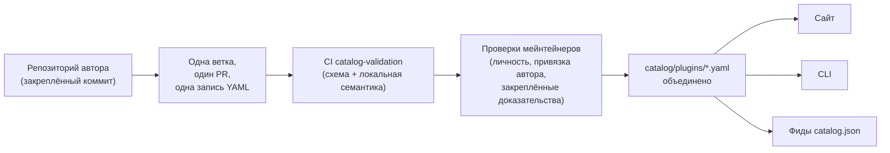

<div align="center">


# 🧩 Awesome Omni DSH Plugins

> **Неофициальный проект сообщества. Не связан с DeepSeek, не одобрен и не спонсируется компанией DeepSeek.**
> Названия и товарные знаки DeepSeek принадлежат их владельцу.

Поиск с приоритетом авторов и установка одной командой для плагинов **DeepSeek Harness (DSH)**.

<h2>
  🌐 <a href="https://dsh-plugins.omniroute.online"><strong>dsh-plugins.omniroute.online</strong></a> 🌐
</h2>
<h3>
  <a href="https://dsh-plugins.omniroute.online">Просматривайте, ищите и устанавливайте любой плагин на сайте →</a>
</h3>

[](https://dsh-plugins.omniroute.online)
[](https://www.npmjs.com/package/@diegosouza.pw/dsh-plugins)
[](https://github.com/diegosouzapw/awesome-omni-dsh-plugins/actions/workflows/validate-catalog.yml)
[](../../LICENSE)
[](https://dsh-plugins.omniroute.online)

<br/>

<b>🌐 На 43 языках</b>
<br/><br/>
<a href="../../README.md"></a>
<a href="../pt-BR/README.md"></a>
<a href="../zh-CN/README.md"></a>
<a href="../zh-TW/README.md"></a>
<a href="../pt/README.md"></a>
<a href="../es/README.md"></a>
<a href="../fr/README.md"></a>
<a href="../it/README.md"></a>
<a href="../de/README.md"></a>
<a href="../nl/README.md"></a>
<a href="README.md"></a>
<a href="../uk-UA/README.md"></a>
<a href="../pl/README.md"></a>
<a href="../cs/README.md"></a>
<a href="../sk/README.md"></a>
<a href="../ro/README.md"></a>
<a href="../hu/README.md"></a>
<a href="../bg/README.md"></a>
<a href="../da/README.md"></a>
<a href="../fi/README.md"></a>
<a href="../no/README.md"></a>
<a href="../sv/README.md"></a>
<a href="../ja/README.md"></a>
<a href="../ko/README.md"></a>
<a href="../th/README.md"></a>
<a href="../vi/README.md"></a>
<a href="../id/README.md"></a>
<a href="../ms/README.md"></a>
<a href="../phi/README.md"></a>
<a href="../in/README.md"></a>
<a href="../hi/README.md"></a>
<a href="../gu/README.md"></a>
<a href="../mr/README.md"></a>
<a href="../ta/README.md"></a>
<a href="../te/README.md"></a>
<a href="../bn/README.md"></a>
<a href="../ur/README.md"></a>
<a href="../fa/README.md"></a>
<a href="../ar/README.md"></a>
<a href="../he/README.md"></a>
<a href="../tr/README.md"></a>
<a href="../az/README.md"></a>
<a href="../sw/README.md"></a>

</div>

---

## ⭐ Топ-10 плагинов

Рейтинг составлен по звёздам именно репозитория плагина — учитываются только звёзды, полученные
репозиторием самого плагина, а не родительского проекта ([правило ранжирования](../../docs/RANKING.md)). Каждое имя
ссылается на репозиторий автора, закреплённый на том коммите, который проверил каталог.

| #   | Плагин | Автор | ★ | Категория | Что делает |
| --- | ------ | ------- | --- | -------- | ------------ |
| 1 | [dsh-visualize](https://github.com/Nagi-ovo/dsh-visualize) | [@Nagi-ovo](https://github.com/Nagi-ovo) | 180 | UI & dashboards | Встроенная визуализация: модель отрисовывает интерактивные графики и диаграммы прямо в сессии |
| 2 | [dsh-pet-remielle](https://github.com/Gin-7/dsh-pet-remielle) | [@Gin-7](https://github.com/Gin-7) | 20 | Entertainment | Подключаемый на лету прозрачный десктопный питомец (Ремиэль, Zenless Zone Zero) для веб-интерфейса DSH |
| 3 | [dsh-whale-musume](https://github.com/Sutera-Diffusus/dsh-whale-musume) | [@Sutera-Diffusus](https://github.com/Sutera-Diffusus) | 19 | Entertainment | Анимированный маскот-кит-девушка в стиле Kanban Musume, реагирующий на активность в панели |
| 4 | [deepseek-harness-tui](https://github.com/gxinxing/deepseek-harness-tui) | [@gxinxing](https://github.com/gxinxing) | 7 | UI & dashboards | Полноэкранный терминальный чат-клиент в стиле curses для управления сессиями dsh |
| 5 | [dsh-tui](https://github.com/turtle1999/turtle-ui) | [@turtle1999](https://github.com/turtle1999) | 7 | UI & dashboards | Интерактивная терминальная оболочка на pi-tui: выбор сессии, потоковый чат, горячие клавиши |
| 6 | [dsh-tavily-workspace](https://github.com/moguiyu/dsh-tavily) | [@moguiyu](https://github.com/moguiyu) | 3 | Search & research | Подключаемый по желанию продвинутый поиск через Tavily с управлением несколькими ключами и индикатором использования |
| 7 | [dsh-bili-widget](https://github.com/pyf2818/dsh-bili-widget) | [@pyf2818](https://github.com/pyf2818) | 2 | Entertainment | Плавающий видеовиджет bilibili: рекомендации, тренды, рейтинги и поиск |
| 8 | [dsh-themes](https://github.com/MangMax/dsh-themes) | [@MangMax](https://github.com/MangMax) | 1 | Entertainment | Плагин оформления: встроенные палитры, светлый/тёмный/системный режим, темы VS Code |
| 9 | [dsh-arknights](https://github.com/DocJlm/dsh-arknights) | [@DocJlm](https://github.com/DocJlm) | — | Entertainment | Некоммерческий скин «астральный сад» по мотивам Arknights с персонажами Pramanix и Eyjafjalla |
| 10 | [dsh-bridge-browser](https://github.com/Lum1104/dsh-browser) | [@Lum1104](https://github.com/Lum1104) | — | Browser automation | WebSocket-мост с токен-аутентификацией для сопутствующего браузерного расширения |

<div align="center">

### 👉 [**Ищите все плагины, читайте подробности и копируйте команду установки на сайте →**](https://dsh-plugins.omniroute.online) 👈

</div>

## Коротко о главном

| Раздел     | Что это                                                       | Где                                                                    |
| ----------- | ---------------------------------------------------------------- | ------------------------------------------------------------------------ |
| **Сайт** | Готовый веб-каталог с поиском и рейтингом                 | [dsh-plugins.omniroute.online](https://dsh-plugins.omniroute.online)     |
| **Каталог** | Один YAML-файл на плагин, единственный источник истины             | [`catalog/plugins/`](../../catalog/plugins)                                    |
| **Схема**  | Публичная JSON Schema (draft 2020-12), по которой проверяется каждая запись | [`schemas/plugin.schema.yaml`](../../schemas/plugin.schema.yaml)               |
| **CLI**     | Поиск, просмотр, проверка и установка из каталога           | [`@diegosouza.pw/dsh-plugins`](https://www.npmjs.com/package/@diegosouza.pw/dsh-plugins) |
| **Машиночитаемые фиды** | `catalog.json` + `catalog.snapshot.json` для инструментов           | [catalog.json](https://dsh-plugins.omniroute.online/catalog.json) · [catalog.snapshot.json](https://dsh-plugins.omniroute.online/catalog.snapshot.json) |

Этот репозиторий — публичный источник истины для каталога. Каждая запись — это один YAML-файл
в `catalog/plugins/`, проверенный по опубликованной JSON Schema, добавленный через отдельно
рассмотренный pull request и всегда с указанием оригинального автора плагина.
Ничего в каталоге не сгенерировано из другого каталога или списка: каждая запись восстановлена
из репозитория оригинального автора на закреплённом коммите.

Сайт и CLI разрабатываются в закрытом исходном коде; этот репозиторий содержит публичные
данные каталога, схему и политики, которые они используют.

## Статус каталога

**Объединено 10 плагинов.** Каждый плагин попадает в каталог через отдельно рассмотренный pull
request, по одному за раз, из репозитория оригинального автора, с закреплённым исходным
коммитом и явным указанием авторства.

## 🚀 Установка CLI

```bash
npx @diegosouza.pw/dsh-plugins --help
```

Пакет опубликован под скоупом как `@diegosouza.pw/dsh-plugins@0.1.0`, и приведённая выше
команда сегодня является канонической; скрипт установки здесь не размещён.

### Возможности CLI уже сейчас

Версия 0.1.0 включает команды поиска и валидации только для чтения, а также команды установки,
требующие явного согласия. Полный справочник команд — с флагами, кодами завершения и шлюзом
согласия на выполнение кода — в [docs/CLI.md](../../docs/CLI.md).

| Команда                        | Что делает                                                        | Затрагивает систему?                    |
| ------------------------------ | ------------------------------------------------------------------- | --------------------------------------- |
| `catalog validate --catalog .` | Проверяет YAML каталога, схему и локальную семантику                   | Нет — только чтение                          |
| `search <query...>`            | Ищет по публичным полям каталога локально                                | Нет — только чтение                          |
| `info <id>`                    | Показывает одну публичную запись каталога                                       | Нет — только чтение                          |
| `list`                         | Показывает установки, управляемые каталогом, не изменяя профили            | Нет — только чтение                          |
| `doctor`                       | Диагностика Node, DSH, политики нативного Windows и каталога только для чтения  | Нет — только чтение                          |
| `add <id> --profile <name> --dry-run` | Показывает проверенный план установки без файлов и подпроцессов | Нет — тестовый прогон                            |
| `add <id> --profile <name> --allow-code-execution` | Устанавливает через официальное делегирование DSH        | Да — только с явным флагом согласия   |

```bash
# Validate the catalog in this repository (what CI runs):
npx @diegosouza.pw/dsh-plugins@0.1.0 catalog validate --catalog .

# Search and inspect locally, without installing anything:
npx @diegosouza.pw/dsh-plugins@0.1.0 search memory --catalog .
npx @diegosouza.pw/dsh-plugins@0.1.0 info <plugin-id> --catalog .

# Preview an install plan; nothing is written and no subprocess runs:
npx @diegosouza.pw/dsh-plugins@0.1.0 add <plugin-id> --profile default --dry-run
```

Изменяющие команды (`add`, `update`, `remove`) никогда не выполняют код жизненного цикла плагина,
если не передан флаг `--allow-code-execution`. В нативном Windows эти изменяющие команды
отключены в v0.1.0; используйте WSL. Команды только для чтения и тестового прогона работают везде.

## 🔍 Как плагин попадает в каталог



1. **Один плагин, одна ветка, один pull request.** PR добавляет или изменяет ровно один YAML-файл
   в `catalog/plugins/`.
2. **Приоритет автора.** PR, открытый автором плагина или владеющей организацией, всегда имеет
   приоритет над кураторством сообщества или автоматизацией для того же плагина — см.
   [docs/CREDIT.md](../../docs/CREDIT.md).
3. **Доказательства из первоисточника.** Каждое поле восстанавливается из репозитория автора
   на закреплённом 40-символьном коммите: описание, лицензия, интеграция с DSH, дескриптор
   установки, звёзды.
4. **Локальная проверка.** `catalog validate` проверяет структуру и локальную семантику — это
   та же проверка, что запускает задача CI `catalog-validation` для PR.
5. **Проверки мейнтейнеров.** Перед слиянием мейнтейнеры отдельно проверяют идентичность
   репозитория, привязку автора и закреплённые доказательства. Успешная локальная проверка
   необходима, но никогда не достаточна.

Полный контракт — необходимые доказательства, правила YAML, политика звёзд, обработка коллизий
и проверки при ревью — находится в [CONTRIBUTING.md](../../CONTRIBUTING.md). О том, как и кем
принимаются решения, — в [docs/GOVERNANCE.md](../../docs/GOVERNANCE.md).

## 📄 Анатомия записи

Каждая запись — это один YAML-файл, названный по её ID. Пример ниже проходит проверку по текущей
схеме (постатейный справочник — в [docs/SCHEMA.md](../../docs/SCHEMA.md)):

```yaml
schemaVersion: 1
id: example-notes-search
name: Example Notes Search
description:
  en: >-
    Searches a local Markdown notes folder from DSH sessions and returns
    matching snippets with file paths.
  evidencePath: README.md
unofficial: true
kind: plugin
primaryCategory: search-research
tags:
  - search
  - notes
  - cli
source:
  repository: https://github.com/example-creator/example-notes-search
  repositoryNodeId: R_kgDOExample01
  subpath: null
  commit: 0123456789abcdef0123456789abcdef01234567
creator:
  github: example-creator
package:
  ecosystem: npm
  name: example-notes-search
  version: 1.4.2
dsh:
  profiles:
    - default
  evidencePath: dsh-plugin.json
repositoryScope: dedicated
popularity:
  starsPolicy: exact-repository
  stars: 128
license:
  spdx: MIT
verification:
  status: eligible
  checkedAt: "2026-08-18T12:00:00Z"
  repositoryIdentity: resolved
  smokeTest: null
provenance:
  discussion: null
  comment: null
```

Ключевые инварианты, которые обеспечивает схема:

- `unofficial: true` и `schemaVersion: 1` — константы.
- Плагин из монорепозитория обязан использовать `stars: null` — звёзды родительского проекта никогда не наследуются.
- Дескриптор установки — это либо npm-пакет с точной версией, либо сам закреплённый источник;
  это данные, а не команда shell.
- Статус `verified` требует проверяемых доказательств smoke-теста; в противном случае запись
  имеет статус `eligible` с `smokeTest: null`.

## 🗂 Что здесь публикуется

Этот репозиторий каталогизирует независимо опубликованные интеграции для DeepSeek Harness (DSH),
включая нативные плагины, семейства плагинов, темы, навыки, клиенты и мосты. Виды артефактов,
категории возможностей и теги интерфейсов определены в [docs/CATEGORIES.md](../../docs/CATEGORIES.md).

Каждая публичная запись — это один YAML-файл в `catalog/plugins/`, который должен проходить
проверку по `schemas/plugin.schema.yaml`. Наличие записи означает, что документированные
проверки соответствия или верификации были выполнены; это не сертификация безопасности
и не одобрение со стороны DeepSeek.

## 🏅 Рейтинг и верификация

В рейтинг по звёздам могут попасть только выделенные, нативные, допущенные или верифицированные
репозитории плагинов, чьи звёзды принадлежат именно этому репозиторию. Интеграции, хранящиеся
внутри более крупных монорепозиториев, остаются доступными для поиска, но используют
`stars: null` и никогда не наследуют звёзды родительского проекта. Полное правило — в
[docs/RANKING.md](../../docs/RANKING.md).

Публичные статусы верификации отличают структурное соответствие от smoke-теста установки.
Ни один статус не означает абсолютную безопасность. Перед использованием плагина изучите
его репозиторий, закреплённый коммит, лицензию и поведение при установке.

## 🤝 Внести вклад или заявить права на запись

Прочтите [CONTRIBUTING.md](../../CONTRIBUTING.md), прежде чем открывать pull request. Pull request
должен добавлять или изменять ровно одну запись плагина и ссылаться на репозиторий оригинального
автора, а не на другой каталог. Pull request-ы, авторами которых являются создатели плагинов,
имеют приоритет над автоматизированными pull request-ами каталога.

Для заявления авторских прав, исправлений и удаления записей доступны структурированные формы
issue. Никогда не отправляйте учётные данные, личные контактные данные или другие секреты.

## 👩‍🎨 Авторы плагинов

Этот каталог существует благодаря тому, что эти авторы выпустили свои плагины. Каждая запись
указывает автора и всегда ссылается на его репозиторий.

<a href="https://github.com/Nagi-ovo" title="@Nagi-ovo — dsh-visualize"></a>
<a href="https://github.com/Gin-7" title="@Gin-7 — dsh-pet-remielle"></a>
<a href="https://github.com/Sutera-Diffusus" title="@Sutera-Diffusus — dsh-whale-musume"></a>
<a href="https://github.com/gxinxing" title="@gxinxing — deepseek-harness-tui"></a>
<a href="https://github.com/turtle1999" title="@turtle1999 — dsh-tui"></a>
<a href="https://github.com/moguiyu" title="@moguiyu — dsh-tavily-workspace"></a>
<a href="https://github.com/pyf2818" title="@pyf2818 — dsh-bili-widget"></a>
<a href="https://github.com/MangMax" title="@MangMax — dsh-themes"></a>
<a href="https://github.com/DocJlm" title="@DocJlm — dsh-arknights"></a>
<a href="https://github.com/Lum1104" title="@Lum1104 — dsh-bridge-browser"></a>

Хотите видеть здесь свой плагин с полным указанием авторства? [Откройте один PR с одной записью
YAML](../../CONTRIBUTING.md) — или [заявите права на существующую
запись](https://github.com/diegosouzapw/awesome-omni-dsh-plugins/issues/new/choose), если кто-то уже
каталогизировал вашу работу до вас.

## 📚 Документация

| Документ                                     | Что описывает                                                       |
| -------------------------------------------- | -------------------------------------------------------------------- |
| [CONTRIBUTING.md](../../CONTRIBUTING.md)           | Полный контракт участника: доказательства, правила YAML, проверки при ревью    |
| [SECURITY.md](../../SECURITY.md)                   | Как сообщать об уязвимостях плагина или каталога; политика секретов           |
| [docs/SCHEMA.md](../../docs/SCHEMA.md)             | Постатейный справочник по `schemas/plugin.schema.yaml`             |
| [docs/CLI.md](../../docs/CLI.md)                   | Справочник команд CLI для `@diegosouza.pw/dsh-plugins@0.1.0`          |
| [docs/GOVERNANCE.md](../../docs/GOVERNANCE.md)     | Как управляется каталог: приоритеты, проверки, заявки и удаления   |
| [docs/CATEGORIES.md](../../docs/CATEGORIES.md)     | Виды артефактов, основные категории возможностей, теги, область репозитория |
| [docs/CREDIT.md](../../docs/CREDIT.md)             | Указание авторства, приоритет PR и политика идентификации в Git                 |
| [docs/RANKING.md](../../docs/RANKING.md)           | Публичное правило ранжирования и статусы верификации                  |
| [docs/UNOFFICIAL.md](../../docs/UNOFFICIAL.md)     | Неофициальный статус и позиция по товарным знакам                               |

## 🌐 Переводы

Этот README доступен на 43 языках в [`docs/i18n/`](..) — используйте селектор флагов вверху
страницы. Английский текст является источником истины; при расхождении перевода с английским
текстом приоритет имеет английский текст. Исправления любого перевода принимаются через
обычные pull request-ы.

## 📜 Лицензия и атрибуция

Документация и шаблоны репозитория лицензированы по [лицензии MIT](../../LICENSE). Оригинальные
факты каталога и редакционные YAML-метаданные переданы в общественное достояние по
[CC0-1.0](../../LICENSE-CATALOG). Исходный код, названия, логотипы и скриншоты остаются под
своими оригинальными владельцами и лицензиями. См. [docs/CREDIT.md](../../docs/CREDIT.md) и
[docs/UNOFFICIAL.md](../../docs/UNOFFICIAL.md).

<div align="center">

### ⭐ Если этот каталог помог вам найти плагин, поставьте звезду репозиторию — это помогает авторам стать заметнее.

**[Смотреть все плагины на сайте →](https://dsh-plugins.omniroute.online)**

</div>
