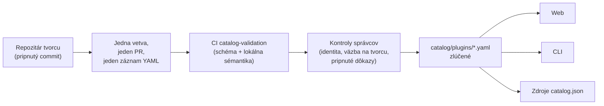

<div align="center">


# 🧩 Awesome Omni DSH Plugins

> **Neoficiálny komunitný projekt. Nie je prepojený so spoločnosťou DeepSeek, nie je ňou schválený ani sponzorovaný.**
> Názvy a ochranné známky DeepSeek patria ich vlastníkovi.

Vyhľadávanie uprednostňujúce tvorcov a inštalácia jedným príkazom pre pluginy **DeepSeek Harness (DSH)**.

<h2>
  🌐 <a href="https://dsh-plugins.omniroute.online"><strong>dsh-plugins.omniroute.online</strong></a> 🌐
</h2>
<h3>
  <a href="https://dsh-plugins.omniroute.online">Prehliadajte, vyhľadávajte a inštalujte ľubovoľný plugin na webe →</a>
</h3>

[](https://dsh-plugins.omniroute.online)
[](https://www.npmjs.com/package/@diegosouza.pw/dsh-plugins)
[](https://github.com/diegosouzapw/awesome-omni-dsh-plugins/actions/workflows/validate-catalog.yml)
[](../../LICENSE)
[](https://dsh-plugins.omniroute.online)

<br/>

<b>🌐 V 43 jazykoch</b>
<br/><br/>
<a href="../../README.md"></a>
<a href="../pt-BR/README.md"></a>
<a href="../zh-CN/README.md"></a>
<a href="../zh-TW/README.md"></a>
<a href="../pt/README.md"></a>
<a href="../es/README.md"></a>
<a href="../fr/README.md"></a>
<a href="../it/README.md"></a>
<a href="../de/README.md"></a>
<a href="../nl/README.md"></a>
<a href="../ru/README.md"></a>
<a href="../uk-UA/README.md"></a>
<a href="../pl/README.md"></a>
<a href="../cs/README.md"></a>
<a href="README.md"></a>
<a href="../ro/README.md"></a>
<a href="../hu/README.md"></a>
<a href="../bg/README.md"></a>
<a href="../da/README.md"></a>
<a href="../fi/README.md"></a>
<a href="../no/README.md"></a>
<a href="../sv/README.md"></a>
<a href="../ja/README.md"></a>
<a href="../ko/README.md"></a>
<a href="../th/README.md"></a>
<a href="../vi/README.md"></a>
<a href="../id/README.md"></a>
<a href="../ms/README.md"></a>
<a href="../phi/README.md"></a>
<a href="../in/README.md"></a>
<a href="../hi/README.md"></a>
<a href="../gu/README.md"></a>
<a href="../mr/README.md"></a>
<a href="../ta/README.md"></a>
<a href="../te/README.md"></a>
<a href="../bn/README.md"></a>
<a href="../ur/README.md"></a>
<a href="../fa/README.md"></a>
<a href="../ar/README.md"></a>
<a href="../he/README.md"></a>
<a href="../tr/README.md"></a>
<a href="../az/README.md"></a>
<a href="../sw/README.md"></a>

</div>

---

## ⭐ 10 najlepších pluginov

Rebríček podľa hviezdičiek presného repozitára — počítajú sa len hviezdičky získané vlastným
repozitárom pluginu, nikdy repozitárom nadradeného projektu ([predikát rebríčka](../../docs/RANKING.md)).
Každý názov odkazuje na repozitár tvorcu, pripnutý na presnom commite, ktorý katalóg overil.

| #   | Plugin | Tvorca | ★ | Kategória | Čo robí |
| --- | ------ | ------- | --- | -------- | ------------ |
| 1 | [dsh-visualize](https://github.com/Nagi-ovo/dsh-visualize) | [@Nagi-ovo](https://github.com/Nagi-ovo) | 180 | UI & dashboards | Vizualizácia priamo v obsahu: model vykresľuje interaktívne grafy a diagramy priamo v relácii |
| 2 | [dsh-pet-remielle](https://github.com/Gin-7/dsh-pet-remielle) | [@Gin-7](https://github.com/Gin-7) | 20 | Entertainment | Za chodu pripojiteľný priehľadný desktopový maznáčik (Remielle, Zenless Zone Zero) pre webové rozhranie DSH |
| 3 | [dsh-whale-musume](https://github.com/Sutera-Diffusus/dsh-whale-musume) | [@Sutera-Diffusus](https://github.com/Sutera-Diffusus) | 19 | Entertainment | Animovaný maskot veľrybej dievčiny v štýle Kanban Musume, reagujúci na aktivitu na paneli |
| 4 | [deepseek-harness-tui](https://github.com/gxinxing/deepseek-harness-tui) | [@gxinxing](https://github.com/gxinxing) | 7 | UI & dashboards | Celoobrazovkový terminálový chatovací klient v štýle curses na ovládanie relácií dsh |
| 5 | [dsh-tui](https://github.com/turtle1999/turtle-ui) | [@turtle1999](https://github.com/turtle1999) | 7 | UI & dashboards | Interaktívne terminálové rozhranie pi-tui: výber relácie, streamovaný chat, klávesové skratky |
| 6 | [dsh-tavily-workspace](https://github.com/moguiyu/dsh-tavily) | [@moguiyu](https://github.com/moguiyu) | 3 | Search & research | Voliteľný pokročilý vyhľadávací nástroj Tavily so správou viacerých kľúčov a ukazovateľom využitia |
| 7 | [dsh-bili-widget](https://github.com/pyf2818/dsh-bili-widget) | [@pyf2818](https://github.com/pyf2818) | 2 | Entertainment | Plávajúci video widget bilibili: odporúčania, trendy, rebríčky a vyhľadávanie |
| 8 | [dsh-themes](https://github.com/MangMax/dsh-themes) | [@MangMax](https://github.com/MangMax) | 1 | Entertainment | Plugin vzhľadu: vstavané palety, svetlý/tmavý/systémový režim, motívy VS Code |
| 9 | [dsh-arknights](https://github.com/DocJlm/dsh-arknights) | [@DocJlm](https://github.com/DocJlm) | — | Entertainment | Nekomerčný vzhľad „astrálna záhrada“ podľa Arknights s postavami Pramanix a Eyjafjalla |
| 10 | [dsh-bridge-browser](https://github.com/Lum1104/dsh-browser) | [@Lum1104](https://github.com/Lum1104) | — | Browser automation | WebSocket most s autentifikáciou tokenom pre sprievodné rozšírenie prehliadača |

<div align="center">

### 👉 [**Vyhľadávajte všetky pluginy, čítajte podrobnosti a kopírujte inštalačný príkaz na webe →**](https://dsh-plugins.omniroute.online) 👈

</div>

## Stručný prehľad

| Oblasť     | Čo to je                                                       | Kde                                                                    |
| ----------- | ---------------------------------------------------------------- | ------------------------------------------------------------------------ |
| **Web** | Vykreslený prehliadač katalógu s vyhľadávaním a rebríčkom                 | [dsh-plugins.omniroute.online](https://dsh-plugins.omniroute.online)     |
| **Katalóg** | Jeden súbor YAML na plugin, jediný zdroj pravdy             | [`catalog/plugins/`](../../catalog/plugins)                                    |
| **Schéma**  | Verejné JSON Schema (draft 2020-12), voči ktorému je overený každý záznam | [`schemas/plugin.schema.yaml`](../../schemas/plugin.schema.yaml)               |
| **CLI**     | Vyhľadávanie, prehliadanie, overovanie a inštalácia z katalógu           | [`@diegosouza.pw/dsh-plugins`](https://www.npmjs.com/package/@diegosouza.pw/dsh-plugins) |
| **Strojovo čitateľné zdroje** | `catalog.json` + `catalog.snapshot.json` pre nástroje           | [catalog.json](https://dsh-plugins.omniroute.online/catalog.json) · [catalog.snapshot.json](https://dsh-plugins.omniroute.online/catalog.snapshot.json) |

Tento repozitár je verejným zdrojom pravdy pre katalóg. Každý záznam je jeden súbor YAML
v `catalog/plugins/`, overený voči zverejnenému JSON Schema, pridaný samostatne skontrolovaným
pull requestom a vždy s uvedením pôvodného tvorcu pluginu.
Nič v katalógu nie je generované z iného katalógu ani zoznamu: každý záznam je zrekonštruovaný
z repozitára pôvodného tvorcu na pripnutom commite.

Web a CLI sú udržiavané zo súkromného zdrojového kódu; tento repozitár obsahuje verejné
dáta katalógu, schému a zásady, ktoré využívajú.

## Stav katalógu

**Zlúčených 10 pluginov.** Každý plugin vstupuje do katalógu cez samostatne skontrolovaný pull
request, jeden po druhom, z repozitára pôvodného tvorcu, s pripnutým zdrojovým commitom
a výslovným uvedením autorstva.

## 🚀 Inštalácia CLI

```bash
npx @diegosouza.pw/dsh-plugins --help
```

Balík s rozsahom je publikovaný ako `@diegosouza.pw/dsh-plugins@0.1.0` a vyššie uvedený príkaz
je dnes kanonickým spôsobom volania; inštalačný skript tu nie je hostovaný.

### Možnosti CLI už dnes

Verzia 0.1.0 obsahuje príkazy na vyhľadávanie a overovanie iba na čítanie a inštalačné príkazy
podmienené súhlasom. Úplná referenčná dokumentácia príkazov vrátane príznakov, návratových
kódov a brány súhlasu so spustením kódu je v [docs/CLI.md](../../docs/CLI.md).

| Príkaz                        | Čo robí                                                        | Zasahuje do systému?                    |
| ------------------------------ | ------------------------------------------------------------------- | --------------------------------------- |
| `catalog validate --catalog .` | Overí YAML katalógu, schému a lokálnu sémantiku                   | Nie — iba na čítanie                          |
| `search <query...>`            | Lokálne prehľadá verejné polia katalógu                                | Nie — iba na čítanie                          |
| `info <id>`                    | Zobrazí jeden verejný záznam katalógu                                       | Nie — iba na čítanie                          |
| `list`                         | Vypíše inštalácie spravované katalógom bez úpravy profilov            | Nie — iba na čítanie                          |
| `doctor`                       | Diagnostika Node, DSH, natívnej politiky Windows a katalógu iba na čítanie  | Nie — iba na čítanie                          |
| `add <id> --profile <name> --dry-run` | Zobrazí overený inštalačný plán bez súborov alebo podprocesov | Nie — skúšobný beh                            |
| `add <id> --profile <name> --allow-code-execution` | Inštaluje cez oficiálnu delegáciu DSH        | Áno — iba s výslovným príznakom súhlasu   |

```bash
# Validate the catalog in this repository (what CI runs):
npx @diegosouza.pw/dsh-plugins@0.1.0 catalog validate --catalog .

# Search and inspect locally, without installing anything:
npx @diegosouza.pw/dsh-plugins@0.1.0 search memory --catalog .
npx @diegosouza.pw/dsh-plugins@0.1.0 info <plugin-id> --catalog .

# Preview an install plan; nothing is written and no subprocess runs:
npx @diegosouza.pw/dsh-plugins@0.1.0 add <plugin-id> --profile default --dry-run
```

Meniace príkazy (`add`, `update`, `remove`) nikdy nespustia kód životného cyklu pluginu, pokiaľ
nepredáte príznak `--allow-code-execution`. V natívnom Windows sú tieto meniace operácie vo
v0.1.0 zakázané; použite WSL. Príkazy iba na čítanie a skúšobný beh fungujú všade.

## 🔍 Ako sa plugin dostane do katalógu



1. **Jeden plugin, jedna vetva, jeden pull request.** PR pridáva alebo mení presne jeden súbor
   YAML v `catalog/plugins/`.
2. **Prednosť tvorcu.** PR otvorený tvorcom pluginu alebo vlastniacou organizáciou má vždy
   prednosť pred kurátorstvom komunity alebo automatizáciou pre ten istý plugin — pozri
   [docs/CREDIT.md](../../docs/CREDIT.md).
3. **Dôkazy z pôvodného zdroja.** Každé pole je zrekonštruované z repozitára tvorcu na
   pripnutom 40-znakovom commite: popis, licencia, integrácia s DSH, inštalačný deskriptor,
   hviezdičky.
4. **Lokálna validácia.** `catalog validate` kontroluje štruktúru a lokálnu sémantiku; ide
   o rovnakú kontrolu, akú pre PR spúšťa úloha CI `catalog-validation`.
5. **Kontroly správcov.** Pred zlúčením správcovia samostatne overujú identitu repozitára,
   väzbu na tvorcu a pripnuté dôkazy. Zelená lokálna validácia je nutná, nikdy však postačujúca.

Úplná zmluva — požadované dôkazy, pravidlá YAML, zásady hviezdičiek, riešenie kolízií a kontroly
pri revízii — je v [CONTRIBUTING.md](../../CONTRIBUTING.md). Ako a kým sa rozhoduje, popisuje
[docs/GOVERNANCE.md](../../docs/GOVERNANCE.md).

## 📄 Anatómia záznamu

Každý záznam je jeden súbor YAML pomenovaný podľa svojho ID. Nižšie uvedený príklad je platný
voči aktuálnej schéme (referenciu pole po poli nájdete v [docs/SCHEMA.md](../../docs/SCHEMA.md)):

```yaml
schemaVersion: 1
id: example-notes-search
name: Example Notes Search
description:
  en: >-
    Searches a local Markdown notes folder from DSH sessions and returns
    matching snippets with file paths.
  evidencePath: README.md
unofficial: true
kind: plugin
primaryCategory: search-research
tags:
  - search
  - notes
  - cli
source:
  repository: https://github.com/example-creator/example-notes-search
  repositoryNodeId: R_kgDOExample01
  subpath: null
  commit: 0123456789abcdef0123456789abcdef01234567
creator:
  github: example-creator
package:
  ecosystem: npm
  name: example-notes-search
  version: 1.4.2
dsh:
  profiles:
    - default
  evidencePath: dsh-plugin.json
repositoryScope: dedicated
popularity:
  starsPolicy: exact-repository
  stars: 128
license:
  spdx: MIT
verification:
  status: eligible
  checkedAt: "2026-08-18T12:00:00Z"
  repositoryIdentity: resolved
  smokeTest: null
provenance:
  discussion: null
  comment: null
```

Kľúčové invarianty vynútené schémou:

- `unofficial: true` a `schemaVersion: 1` sú konštanty.
- Plugin z monorepozitára musí používať `stars: null` — hviezdičky nadradeného projektu sa nikdy nededia.
- Inštalačný deskriptor je buď npm balík s presnou verziou, alebo priamo pripnutý zdroj; ide
  o dáta, nikdy o shellový príkaz.
- Stav `verified` vyžaduje overiteľné dôkazy o smoke teste; inak má záznam stav `eligible`
  s `smokeTest: null`.

## 🗂 Čo sem patrí

Tento repozitár katalogizuje nezávisle publikované integrácie pre DeepSeek Harness (DSH),
vrátane natívnych pluginov, rodín pluginov, motívov, zručností, klientov a mostov. Druhy
artefaktov, kategórie schopností a značky rozhrania sú definované v [docs/CATEGORIES.md](../../docs/CATEGORIES.md).

Každý verejný záznam je jeden súbor YAML v `catalog/plugins/` a musí byť platný voči
`schemas/plugin.schema.yaml`. Zaradenie znamená, že boli dokončené zdokumentované kontroly
spôsobilosti alebo overenia; nejde o bezpečnostnú certifikáciu ani schválenie zo strany DeepSeek.

## 🏅 Rebríček a overenie

Do rebríčka hviezdičiek sa môžu dostať iba vyhradené, natívne, spôsobilé alebo overené
repozitáre pluginov, ktorých hviezdičky patria presne tomuto repozitáru. Integrácie uložené
vnútri širších monorepozitárov zostávajú vyhľadateľné, ale používajú `stars: null` a nikdy
nededia hviezdičky nadradeného projektu. Úplný predikát je v [docs/RANKING.md](../../docs/RANKING.md).

Verejné stavy overenia odlišujú štrukturálnu spôsobilosť od inštalačného smoke testu.
Žiadny stav nepredstavuje absolútnu bezpečnosť. Pred použitím pluginu skontrolujte jeho
repozitár, pripnutý commit, licenciu a správanie pri inštalácii.

## 🤝 Prispejte alebo si nárokujte záznam

Pred otvorením pull requestu si prečítajte [CONTRIBUTING.md](../../CONTRIBUTING.md). Pull request musí
pridávať alebo meniť presne jeden záznam pluginu a musí odkazovať na repozitár pôvodného tvorcu,
nie na iný katalóg. Pull requesty od tvorcov majú prednosť pred automatizovanými pull
requestami katalógu.

Pre nároky tvorcov, opravy a odstránenia sú k dispozícii štruktúrované formuláre issue. Nikdy
neposielajte prihlasovacie údaje, súkromné kontaktné údaje ani iné tajomstvá.

## 👩‍🎨 Tvorcovia pluginov

Tento katalóg existuje vďaka tomu, že títo tvorcovia vydali svoje pluginy. Každý záznam vždy
uvádza svojho tvorcu a odkazuje späť na jeho repozitár.

<a href="https://github.com/Nagi-ovo" title="@Nagi-ovo — dsh-visualize"></a>
<a href="https://github.com/Gin-7" title="@Gin-7 — dsh-pet-remielle"></a>
<a href="https://github.com/Sutera-Diffusus" title="@Sutera-Diffusus — dsh-whale-musume"></a>
<a href="https://github.com/gxinxing" title="@gxinxing — deepseek-harness-tui"></a>
<a href="https://github.com/turtle1999" title="@turtle1999 — dsh-tui"></a>
<a href="https://github.com/moguiyu" title="@moguiyu — dsh-tavily-workspace"></a>
<a href="https://github.com/pyf2818" title="@pyf2818 — dsh-bili-widget"></a>
<a href="https://github.com/MangMax" title="@MangMax — dsh-themes"></a>
<a href="https://github.com/DocJlm" title="@DocJlm — dsh-arknights"></a>
<a href="https://github.com/Lum1104" title="@Lum1104 — dsh-bridge-browser"></a>

Chcete tu svoj plugin s plným uvedením autorstva? [Otvorte jeden PR s jedným záznamom
YAML](../../CONTRIBUTING.md) — alebo [si nárokujte existujúci
záznam](https://github.com/diegosouzapw/awesome-omni-dsh-plugins/issues/new/choose), ak vašu
prácu zaradil do katalógu niekto iný skôr ako vy.

## 📚 Dokumentácia

| Dokument                                     | Čo popisuje                                                       |
| -------------------------------------------- | -------------------------------------------------------------------- |
| [CONTRIBUTING.md](../../CONTRIBUTING.md)           | Úplná zmluva pre prispievateľov: dôkazy, pravidlá YAML, kontroly pri revízii    |
| [SECURITY.md](../../SECURITY.md)                   | Hlásenie zraniteľností pluginu alebo katalógu; zásady pre tajomstvá           |
| [docs/SCHEMA.md](../../docs/SCHEMA.md)             | Referencia pole po poli pre `schemas/plugin.schema.yaml`             |
| [docs/CLI.md](../../docs/CLI.md)                   | Referencia príkazov CLI pre `@diegosouza.pw/dsh-plugins@0.1.0`          |
| [docs/GOVERNANCE.md](../../docs/GOVERNANCE.md)     | Ako je katalóg riadený: prednosť, kontroly, nároky a odstránenia   |
| [docs/CATEGORIES.md](../../docs/CATEGORIES.md)     | Druhy artefaktov, hlavné kategórie schopností, značky, rozsah repozitára |
| [docs/CREDIT.md](../../docs/CREDIT.md)             | Uvedenie tvorcu, prednosť PR a zásady identity v Gite                 |
| [docs/RANKING.md](../../docs/RANKING.md)           | Verejný predikát rebríčka a stavy overenia                  |
| [docs/UNOFFICIAL.md](../../docs/UNOFFICIAL.md)     | Neoficiálny status a postoj k ochranným známkam                               |

## 🌐 Preklady

Tento README je k dispozícii v 43 jazykoch v priečinku [`docs/i18n/`](..) — použite výber
vlajok navrchu. Zdrojom pravdy je anglický text; ak sa preklad a anglický text líšia, platí
anglický text. Opravy akéhokoľvek prekladu sú vítané prostredníctvom bežných pull
requestov.

## 📜 Licencia a uvedenie autorstva

Dokumentácia a šablóny repozitára sú licencované pod [licenciou MIT](../../LICENSE). Pôvodné
fakty katalógu a redakčné metadáta YAML sú uvoľnené pod licenciou [CC0-1.0](../../LICENSE-CATALOG).
Zdrojový kód, názvy, logá a snímky obrazovky zostávajú pod svojimi pôvodnými vlastníkmi a
licenciami. Pozri [docs/CREDIT.md](../../docs/CREDIT.md) a [docs/UNOFFICIAL.md](../../docs/UNOFFICIAL.md).

<div align="center">

### ⭐ Ak vám tento katalóg pomohol nájsť plugin, dajte repozitáru hviezdičku — pomôže to tvorcom, aby ich bolo vidieť.

**[Prehliadať všetky pluginy na webe →](https://dsh-plugins.omniroute.online)**

</div>
