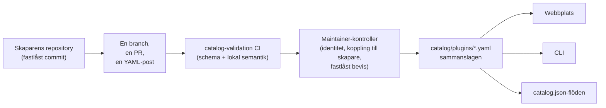

<div align="center">


# 🧩 Awesome Omni DSH Plugins

> **Inofficiellt community-projekt. Inte anslutet till, godkänt av eller sponsrat av DeepSeek.**
> DeepSeek-namn och -märken tillhör sina respektive ägare.

Skaparfokuserad upptäckt och installation med ett kommando för **DeepSeek Harness (DSH)**-plugin.

<h2>
  🌐 <a href="https://dsh-plugins.omniroute.online"><strong>dsh-plugins.omniroute.online</strong></a> 🌐
</h2>
<h3>
  <a href="https://dsh-plugins.omniroute.online">Bläddra, sök och installera alla plugin på webbplatsen →</a>
</h3>

[](https://dsh-plugins.omniroute.online)
[](https://www.npmjs.com/package/@diegosouza.pw/dsh-plugins)
[](https://github.com/diegosouzapw/awesome-omni-dsh-plugins/actions/workflows/validate-catalog.yml)
[](../../LICENSE)
[](https://dsh-plugins.omniroute.online)

<br/>

<b>🌐 På 43 språk</b>
<br/><br/>
<a href="../../README.md"></a>
<a href="../pt-BR/README.md"></a>
<a href="../zh-CN/README.md"></a>
<a href="../zh-TW/README.md"></a>
<a href="../pt/README.md"></a>
<a href="../es/README.md"></a>
<a href="../fr/README.md"></a>
<a href="../it/README.md"></a>
<a href="../de/README.md"></a>
<a href="../nl/README.md"></a>
<a href="../ru/README.md"></a>
<a href="../uk-UA/README.md"></a>
<a href="../pl/README.md"></a>
<a href="../cs/README.md"></a>
<a href="../sk/README.md"></a>
<a href="../ro/README.md"></a>
<a href="../hu/README.md"></a>
<a href="../bg/README.md"></a>
<a href="../da/README.md"></a>
<a href="../fi/README.md"></a>
<a href="../no/README.md"></a>
<a href="README.md"></a>
<a href="../ja/README.md"></a>
<a href="../ko/README.md"></a>
<a href="../th/README.md"></a>
<a href="../vi/README.md"></a>
<a href="../id/README.md"></a>
<a href="../ms/README.md"></a>
<a href="../phi/README.md"></a>
<a href="../in/README.md"></a>
<a href="../hi/README.md"></a>
<a href="../gu/README.md"></a>
<a href="../mr/README.md"></a>
<a href="../ta/README.md"></a>
<a href="../te/README.md"></a>
<a href="../bn/README.md"></a>
<a href="../ur/README.md"></a>
<a href="../fa/README.md"></a>
<a href="../ar/README.md"></a>
<a href="../he/README.md"></a>
<a href="../tr/README.md"></a>
<a href="../az/README.md"></a>
<a href="../sw/README.md"></a>

</div>

---

## ⭐ Topp 10 plugin

Rankade efter exakta repository-stjärnor — endast stjärnor som pluginets eget repository har
fått räknas, aldrig ett moderprojekts ([rankningspredikat](../../docs/RANKING.md)). Varje namn
länkar till skaparens repository, fastlåst vid den exakta commit som katalogen validerade.

| #   | Plugin | Skapare | ★ | Kategori | Vad det gör |
| --- | ------ | ------- | --- | -------- | ------------ |
| 1 | [dsh-visualize](https://github.com/Nagi-ovo/dsh-visualize) | [@Nagi-ovo](https://github.com/Nagi-ovo) | 180 | UI & dashboards | Infogad visualisering: modellen renderar interaktiva diagram och grafer direkt i sessionen |
| 2 | [dsh-pet-remielle](https://github.com/Gin-7/dsh-pet-remielle) | [@Gin-7](https://github.com/Gin-7) | 20 | Entertainment | Hot-pluggbart transparent skrivbordshusdjur (Remielle, Zenless Zone Zero) för DSH:s webbgränssnitt |
| 3 | [dsh-whale-musume](https://github.com/Sutera-Diffusus/dsh-whale-musume) | [@Sutera-Diffusus](https://github.com/Sutera-Diffusus) | 19 | Entertainment | Animerad val-flicka-maskot (Kanban Musume) som reagerar på aktivitet i instrumentpanelen |
| 4 | [deepseek-harness-tui](https://github.com/gxinxing/deepseek-harness-tui) | [@gxinxing](https://github.com/gxinxing) | 7 | UI & dashboards | Helskärms terminalchattklient i curses-stil för att styra dsh-sessioner |
| 5 | [dsh-tui](https://github.com/turtle1999/turtle-ui) | [@turtle1999](https://github.com/turtle1999) | 7 | UI & dashboards | Interaktiv pi-tui-terminalentré: sessionsväljare, strömmande chatt, tangentbindningar |
| 6 | [dsh-tavily-workspace](https://github.com/moguiyu/dsh-tavily) | [@moguiyu](https://github.com/moguiyu) | 3 | Search & research | Valbart avancerat Tavily-sökverktyg med hantering av flera nycklar och en användningsmätare |
| 7 | [dsh-bili-widget](https://github.com/pyf2818/dsh-bili-widget) | [@pyf2818](https://github.com/pyf2818) | 2 | Entertainment | Flytande bilibili-videowidget: rekommendationer, trender, rankningar och sökning |
| 8 | [dsh-themes](https://github.com/MangMax/dsh-themes) | [@MangMax](https://github.com/MangMax) | 1 | Entertainment | Utseendeplugin: inbyggda paletter, ljust/mörkt/systemläge, VS Code-teman |
| 9 | [dsh-arknights](https://github.com/DocJlm/dsh-arknights) | [@DocJlm](https://github.com/DocJlm) | — | Entertainment | Icke-kommersiellt Arknights astral-garden-skin med Pramanix och Eyjafjalla |
| 10 | [dsh-bridge-browser](https://github.com/Lum1104/dsh-browser) | [@Lum1104](https://github.com/Lum1104) | — | Browser automation | Tokenautentiserad WebSocket-brygga för det medföljande webbläsartillägget |

<div align="center">

### 👉 [**Sök bland alla plugin, läs detaljerna och kopiera installationskommandot på webbplatsen →**](https://dsh-plugins.omniroute.online) 👈

</div>

## I korthet

| Yta         | Vad det är                                                       | Var                                                                       |
| ----------- | ---------------------------------------------------------------- | ------------------------------------------------------------------------ |
| **Webbplats** | Renderad katalogbläddrare med sökning och rankning                 | [dsh-plugins.omniroute.online](https://dsh-plugins.omniroute.online)     |
| **Katalog** | En YAML-fil per plugin, den enda sanningskällan             | [`catalog/plugins/`](../../catalog/plugins)                                    |
| **Schema**  | Publikt JSON Schema (draft 2020-12) som varje post validerar mot | [`schemas/plugin.schema.yaml`](../../schemas/plugin.schema.yaml)               |
| **CLI**     | Sök, inspektera, validera och installera från katalogen           | [`@diegosouza.pw/dsh-plugins`](https://www.npmjs.com/package/@diegosouza.pw/dsh-plugins) |
| **Maskinflöden** | `catalog.json` + `catalog.snapshot.json` för verktyg           | [catalog.json](https://dsh-plugins.omniroute.online/catalog.json) · [catalog.snapshot.json](https://dsh-plugins.omniroute.online/catalog.snapshot.json) |

Detta repository är den publika sanningskällan för katalogen. Varje post är en YAML-fil under
`catalog/plugins/`, validerad mot ett publicerat JSON Schema, tillagd genom en individuellt
granskad pull request och alltid krediterad till pluginets ursprungliga skapare. Ingenting i
katalogen genereras från en annan katalog eller lista: varje post rekonstrueras från skaparens
ursprungliga repository vid en fastlåst commit.

Webbplatsen och CLI:et underhålls från privat källkod; detta repository innehåller de publika
katalogdata, schema och policyer som de använder.

## Katalogstatus

**10 plugin sammanslagna.** Varje plugin kommer in genom en individuellt granskad pull request,
en i taget, från det ursprungliga skaparrepositoryt, med en fastlåst källcommit och uttrycklig
kreditering.

## 🚀 Installera CLI:et

```bash
npx @diegosouza.pw/dsh-plugins --help
```

Det scopade paketet publiceras som `@diegosouza.pw/dsh-plugins@0.1.0` och kommandot ovan är det
kanoniska anropet idag; inget installationsskript hostas här.

### Använd CLI:et idag

Version 0.1.0 levereras med skrivskyddade kommandon för upptäckt och validering samt
installationskommandon som kräver samtycke. Den fullständiga kommandoreferensen, inklusive
flaggor, avslutskoder och samtyckesgrinden för kodkörning, finns i [docs/CLI.md](../../docs/CLI.md).

| Kommando                       | Vad det gör                                                        | Påverkar det ditt system?               |
| ------------------------------ | ------------------------------------------------------------------- | --------------------------------------- |
| `catalog validate --catalog .` | Validerar katalogens YAML, schema och lokala semantik                   | Nej — skrivskyddat                          |
| `search <query...>`            | Söker i katalogens publika fält lokalt                                | Nej — skrivskyddat                          |
| `info <id>`                    | Visar en publik katalogpost                                       | Nej — skrivskyddat                          |
| `list`                         | Listar katalogstyrda installationer utan att ändra profiler            | Nej — skrivskyddat                          |
| `doctor`                       | Skrivskyddad diagnostik för Node, DSH, nativ Windows-policy och katalogen  | Nej — skrivskyddat                          |
| `add <id> --profile <name> --dry-run` | Visar den verifierade installationsplanen utan filer eller subprocesser | Nej — torrkörning                            |
| `add <id> --profile <name> --allow-code-execution` | Installerar genom officiell DSH-delegering        | Ja — endast med uttrycklig samtyckesflagga   |

```bash
# Validate the catalog in this repository (what CI runs):
npx @diegosouza.pw/dsh-plugins@0.1.0 catalog validate --catalog .

# Search and inspect locally, without installing anything:
npx @diegosouza.pw/dsh-plugins@0.1.0 search memory --catalog .
npx @diegosouza.pw/dsh-plugins@0.1.0 info <plugin-id> --catalog .

# Preview an install plan; nothing is written and no subprocess runs:
npx @diegosouza.pw/dsh-plugins@0.1.0 add <plugin-id> --profile default --dry-run
```

Muterande kommandon (`add`, `update`, `remove`) kör aldrig pluginets livscykelkod om du inte
anger `--allow-code-execution`. På nativ Windows är dessa mutationer avaktiverade i v0.1.0;
använd WSL. Skrivskyddade kommandon och torrkörningar fungerar överallt.

## 🔍 Så kommer en plugin in i katalogen



1. **En plugin, en branch, en pull request.** PR:en lägger till eller ändrar exakt en YAML-fil
   under `catalog/plugins/`.
2. **Skaparen först.** En PR öppnad av pluginets skapare eller ägande organisation har alltid
   företräde framför community-kuratering eller automatisering för samma plugin — se
   [docs/CREDIT.md](../../docs/CREDIT.md).
3. **Bevis från den ursprungliga källan.** Varje fält rekonstrueras från skaparens repository vid
   en fastlåst 40-teckens commit: beskrivning, licens, DSH-integration, installationsdeskriptor,
   stjärnor.
4. **Lokal validering.** `catalog validate` kontrollerar struktur och lokal semantik; det är
   samma kontroll som CI-jobbet `catalog-validation` kör på PR:en.
5. **Maintainer-kontroller.** Före sammanslagning verifierar maintainers separat repositoryts
   identitet, kopplingen till skaparen och det fastlåsta beviset. En grön lokal validering är
   nödvändig, men aldrig tillräcklig.

Det fullständiga kontraktet — nödvändiga bevis, YAML-regler, stjärnpolicy, hantering av
kollisioner och granskningsgrindarna — finns i [CONTRIBUTING.md](../../CONTRIBUTING.md). Hur
beslut fattas och av vem beskrivs i [docs/GOVERNANCE.md](../../docs/GOVERNANCE.md).

## 📄 Anatomin hos en post

Varje post är en YAML-fil uppkallad efter sitt ID. Exemplet nedan validerar mot det aktuella
schemat (fält-för-fält-referens i [docs/SCHEMA.md](../../docs/SCHEMA.md)):

```yaml
schemaVersion: 1
id: example-notes-search
name: Example Notes Search
description:
  en: >-
    Searches a local Markdown notes folder from DSH sessions and returns
    matching snippets with file paths.
  evidencePath: README.md
unofficial: true
kind: plugin
primaryCategory: search-research
tags:
  - search
  - notes
  - cli
source:
  repository: https://github.com/example-creator/example-notes-search
  repositoryNodeId: R_kgDOExample01
  subpath: null
  commit: 0123456789abcdef0123456789abcdef01234567
creator:
  github: example-creator
package:
  ecosystem: npm
  name: example-notes-search
  version: 1.4.2
dsh:
  profiles:
    - default
  evidencePath: dsh-plugin.json
repositoryScope: dedicated
popularity:
  starsPolicy: exact-repository
  stars: 128
license:
  spdx: MIT
verification:
  status: eligible
  checkedAt: "2026-08-18T12:00:00Z"
  repositoryIdentity: resolved
  smokeTest: null
provenance:
  discussion: null
  comment: null
```

Viktiga invarianter som upprätthålls av schemat:

- `unofficial: true` och `schemaVersion: 1` är konstanter.
- En plugin i ett monorepo måste använda `stars: null` — moderprojektets stjärnor ärvs aldrig.
- Installationsdeskriptorn är antingen ett npm-paket med exakt version eller själva den
  fastlåsta källan; det är data, aldrig ett shell-kommando.
- Statusen `verified` kräver granskningsbart bevis från ett smoke-test; annars är posten
  `eligible` med `smokeTest: null`.

## 🗂 Vad hör hemma här

Detta repository katalogiserar oberoende publicerade integrationer för DeepSeek Harness (DSH),
inklusive nativa plugin, pluginfamiljer, teman, skills, klienter och bryggor. Artefakttyper,
kapabilitetskategorier och gränssnittstaggar definieras i [docs/CATEGORIES.md](../../docs/CATEGORIES.md).

Varje publik post är en YAML-fil under `catalog/plugins/` och måste validera mot
`schemas/plugin.schema.yaml`. En listning innebär att de dokumenterade behörighets- eller
verifieringskontrollerna har genomförts; det är inte ett säkerhetsintyg eller ett godkännande
från DeepSeek.

## 🏅 Rankning och verifiering

Endast dedikerade, nativa, behöriga eller verifierade pluginrepositoryn med stjärnor som tillhör
exakt det repositoryt kan komma med i en stjärnrankning. Integrationer som lagras inuti bredare
monorepon förblir sökbara men använder `stars: null` och ärver aldrig moderprojektets stjärnor.
Se [docs/RANKING.md](../../docs/RANKING.md) för det fullständiga predikatet.

Publika verifieringstillstånd skiljer strukturell behörighet från ett installationssmoke-test.
Inget tillstånd representerar absolut säkerhet. Granska ett plugins repository, fastlåsta
commit, licens och installationsbeteende innan du använder det.

## 🤝 Bidra eller gör anspråk på en post

Läs [CONTRIBUTING.md](../../CONTRIBUTING.md) innan du öppnar en pull request. En pull request
måste lägga till eller ändra exakt en pluginpost och måste hänvisa till det ursprungliga
skaparrepositoryt snarare än en annan katalog. Pull requests författade av skaparen har
företräde framför automatiserade katalog-pull requests.

Strukturerade issue-formulär finns tillgängliga för anspråk från skapare, korrigeringar och
borttagningar. Skicka aldrig in inloggningsuppgifter, privata kontaktuppgifter eller andra
hemligheter.

## 👩‍🎨 Pluginskapare

Katalogen finns eftersom dessa skapare lanserade plugin. Varje post krediterar sin skapare och
länkar tillbaka till dennes repository — alltid.

<a href="https://github.com/Nagi-ovo" title="@Nagi-ovo — dsh-visualize"></a>
<a href="https://github.com/Gin-7" title="@Gin-7 — dsh-pet-remielle"></a>
<a href="https://github.com/Sutera-Diffusus" title="@Sutera-Diffusus — dsh-whale-musume"></a>
<a href="https://github.com/gxinxing" title="@gxinxing — deepseek-harness-tui"></a>
<a href="https://github.com/turtle1999" title="@turtle1999 — dsh-tui"></a>
<a href="https://github.com/moguiyu" title="@moguiyu — dsh-tavily-workspace"></a>
<a href="https://github.com/pyf2818" title="@pyf2818 — dsh-bili-widget"></a>
<a href="https://github.com/MangMax" title="@MangMax — dsh-themes"></a>
<a href="https://github.com/DocJlm" title="@DocJlm — dsh-arknights"></a>
<a href="https://github.com/Lum1104" title="@Lum1104 — dsh-bridge-browser"></a>

Vill du ha ditt plugin här med full kreditering? [Öppna en PR med en YAML-post](../../CONTRIBUTING.md) — eller
[gör anspråk på en befintlig post](https://github.com/diegosouzapw/awesome-omni-dsh-plugins/issues/new/choose)
om någon katalogiserade ditt arbete innan du gjorde det.

## 📚 Dokumentation

| Dokument                                     | Vad det täcker                                                       |
| -------------------------------------------- | -------------------------------------------------------------------- |
| [CONTRIBUTING.md](../../CONTRIBUTING.md)           | Det fullständiga bidragskontraktet: bevis, YAML-regler, granskningsgrindar    |
| [SECURITY.md](../../SECURITY.md)                   | Rapportering av sårbarheter i plugin eller katalog; policy för hemligheter           |
| [docs/SCHEMA.md](../../docs/SCHEMA.md)             | Fält-för-fält-referens för `schemas/plugin.schema.yaml`             |
| [docs/CLI.md](../../docs/CLI.md)                   | CLI-kommandoreferens för `@diegosouza.pw/dsh-plugins@0.1.0`          |
| [docs/GOVERNANCE.md](../../docs/GOVERNANCE.md)     | Hur katalogen styrs: företräde, grindar, anspråk och borttagningar   |
| [docs/CATEGORIES.md](../../docs/CATEGORIES.md)     | Artefakttyper, primära kapabilitetskategorier, taggar, repository-omfattning |
| [docs/CREDIT.md](../../docs/CREDIT.md)             | Kreditering av skapare, PR-företräde och policy för Git-identitet                 |
| [docs/RANKING.md](../../docs/RANKING.md)           | Det publika rankningspredikatet och verifieringstillstånden                  |
| [docs/UNOFFICIAL.md](../../docs/UNOFFICIAL.md)     | Inofficiell status och hållning kring varumärken                               |

## 🌐 Översättningar

Denna README finns tillgänglig på 43 språk under [`docs/i18n/`](..) — använd flaggväljaren
högst upp. Engelska är sanningskällan; när en översättning och den engelska texten skiljer sig
åt gäller den engelska texten. Korrigeringar av alla översättningar är välkomna genom vanliga
pull requests.

## 📜 Licens och kreditering

Dokumentation och repository-mallar är licensierade under [MIT-licensen](../../LICENSE).
Ursprungliga katalogfakta och redaktionell YAML-metadata är dedikerade under
[CC0-1.0](../../LICENSE-CATALOG). Uppströmskod, namn, logotyper och skärmdumpar förblir under
sina ursprungliga ägare och licenser. Se [docs/CREDIT.md](../../docs/CREDIT.md) och
[docs/UNOFFICIAL.md](../../docs/UNOFFICIAL.md).

<div align="center">

### ⭐ Om den här katalogen hjälpte dig att hitta ett plugin, ge repot en stjärna — det hjälper skapare att bli hittade.

**[Bläddra bland alla plugin på webbplatsen →](https://dsh-plugins.omniroute.online)**

</div>
