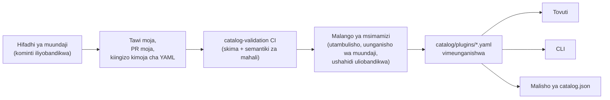

<div align="center">


# 🧩 Awesome Omni DSH Plugins

> **Mradi wa jamii usio rasmi. Hauhusiani na, wala kuidhinishwa na, wala kufadhiliwa na DeepSeek.**
> Majina na alama za DeepSeek ni mali ya wamiliki wake husika.

Ugunduzi unaotanguliza waundaji na usakinishaji wa amri moja kwa programu-jalizi za **DeepSeek Harness (DSH)**.

<h2>
  🌐 <a href="https://dsh-plugins.omniroute.online"><strong>dsh-plugins.omniroute.online</strong></a> 🌐
</h2>
<h3>
  <a href="https://dsh-plugins.omniroute.online">Vinjari, tafuta na sakinisha kila programu-jalizi kwenye tovuti →</a>
</h3>

[](https://dsh-plugins.omniroute.online)
[](https://www.npmjs.com/package/@diegosouza.pw/dsh-plugins)
[](https://github.com/diegosouzapw/awesome-omni-dsh-plugins/actions/workflows/validate-catalog.yml)
[](../../LICENSE)
[](https://dsh-plugins.omniroute.online)

<br/>

<b>🌐 Katika lugha 43</b>
<br/><br/>
<a href="../../README.md"></a>
<a href="../pt-BR/README.md"></a>
<a href="../zh-CN/README.md"></a>
<a href="../zh-TW/README.md"></a>
<a href="../pt/README.md"></a>
<a href="../es/README.md"></a>
<a href="../fr/README.md"></a>
<a href="../it/README.md"></a>
<a href="../de/README.md"></a>
<a href="../nl/README.md"></a>
<a href="../ru/README.md"></a>
<a href="../uk-UA/README.md"></a>
<a href="../pl/README.md"></a>
<a href="../cs/README.md"></a>
<a href="../sk/README.md"></a>
<a href="../ro/README.md"></a>
<a href="../hu/README.md"></a>
<a href="../bg/README.md"></a>
<a href="../da/README.md"></a>
<a href="../fi/README.md"></a>
<a href="../no/README.md"></a>
<a href="../sv/README.md"></a>
<a href="../ja/README.md"></a>
<a href="../ko/README.md"></a>
<a href="../th/README.md"></a>
<a href="../vi/README.md"></a>
<a href="../id/README.md"></a>
<a href="../ms/README.md"></a>
<a href="../phi/README.md"></a>
<a href="../in/README.md"></a>
<a href="../hi/README.md"></a>
<a href="../gu/README.md"></a>
<a href="../mr/README.md"></a>
<a href="../ta/README.md"></a>
<a href="../te/README.md"></a>
<a href="../bn/README.md"></a>
<a href="../ur/README.md"></a>
<a href="../fa/README.md"></a>
<a href="../ar/README.md"></a>
<a href="../he/README.md"></a>
<a href="../tr/README.md"></a>
<a href="../az/README.md"></a>
<a href="README.md"></a>

</div>

---

## ⭐ Programu-jalizi 10 bora

Zimepangwa kwa nyota halisi za hifadhi — ni nyota zilizopatikana na hifadhi ya programu-jalizi yenyewe pekee ndizo zinazohesabiwa, kamwe si za mradi mzazi ([kigezo cha upangaji](../../docs/RANKING.md)). Kila jina linaunganisha kwenye hifadhi ya muundaji, likiwa limebandikwa kwenye kominti hasa ambayo orodha ilithibitisha.

| # | Programu-jalizi | Muundaji | ★ | Jamii | Inafanya nini |
| --- | ------ | ------- | --- | -------- | ------------ |
| 1 | [dsh-visualize](https://github.com/Nagi-ovo/dsh-visualize) | [@Nagi-ovo](https://github.com/Nagi-ovo) | 180 | UI & dashboards | Uonyeshaji wa moja kwa moja: modeli inaonyesha chati na michoro shirikishi ndani ya kikao |
| 2 | [dsh-pet-remielle](https://github.com/Gin-7/dsh-pet-remielle) | [@Gin-7](https://github.com/Gin-7) | 20 | Entertainment | Kipenzi cha dawati chenye uwazi kinachoweza kuunganishwa papo hapo (Remielle, Zenless Zone Zero) kwa GUI ya wavuti ya DSH |
| 3 | [dsh-whale-musume](https://github.com/Sutera-Diffusus/dsh-whale-musume) | [@Sutera-Diffusus](https://github.com/Sutera-Diffusus) | 19 | Entertainment | Mtambo wa nyangumi-msichana wenye uhuishaji Kanban Musume unaoitikia shughuli za dashibodi |
| 4 | [deepseek-harness-tui](https://github.com/gxinxing/deepseek-harness-tui) | [@gxinxing](https://github.com/gxinxing) | 7 | UI & dashboards | Kiteja cha mazungumzo cha terminal cha skrini nzima kwa mtindo wa curses cha kuendesha vikao vya dsh |
| 5 | [dsh-tui](https://github.com/turtle1999/turtle-ui) | [@turtle1999](https://github.com/turtle1999) | 7 | UI & dashboards | Mlango wa mbele shirikishi wa terminal pi-tui: kichagua kikao, mazungumzo ya mkondo, funguo za mkato |
| 6 | [dsh-tavily-workspace](https://github.com/moguiyu/dsh-tavily) | [@moguiyu](https://github.com/moguiyu) | 3 | Search & research | Zana ya utafutaji ya hali ya juu ya Tavily ya hiari na usimamizi wa funguo nyingi na kipimo cha matumizi |
| 7 | [dsh-bili-widget](https://github.com/pyf2818/dsh-bili-widget) | [@pyf2818](https://github.com/pyf2818) | 2 | Entertainment | Widget ya video ya bilibili inayoelea: mapendekezo, yanayovuma, viwango na utafutaji |
| 8 | [dsh-themes](https://github.com/MangMax/dsh-themes) | [@MangMax](https://github.com/MangMax) | 1 | Entertainment | Programu-jalizi ya mwonekano: palette zilizojengwa ndani, hali ya mwanga/giza/mfumo, mandhari ya VS Code |
| 9 | [dsh-arknights](https://github.com/DocJlm/dsh-arknights) | [@DocJlm](https://github.com/DocJlm) | — | Entertainment | Ngozi isiyo ya kibiashara ya bustani ya nyota ya Arknights inayoonyesha Pramanix na Eyjafjalla |
| 10 | [dsh-bridge-browser](https://github.com/Lum1104/dsh-browser) | [@Lum1104](https://github.com/Lum1104) | — | Browser automation | Daraja la WebSocket lililothibitishwa kwa tokeni kwa kiendelezi cha kivinjari kinachoambatana |

<div align="center">

### 👉 [**Tafuta programu-jalizi zote, soma maelezo na nakili amri ya usakinishaji kwenye tovuti →**](https://dsh-plugins.omniroute.online) 👈

</div>

## Kwa mtazamo mmoja

| Sehemu | Ni nini | Wapi |
| ----------- | ---------------------------------------------------------------- | ------------------------------------------------------------------------ |
| **Tovuti** | Kivinjari cha orodha kilichoonyeshwa chenye utafutaji na upangaji | [dsh-plugins.omniroute.online](https://dsh-plugins.omniroute.online) |
| **Orodha** | Faili moja la YAML kwa kila programu-jalizi, chanzo pekee cha ukweli | [`catalog/plugins/`](../../catalog/plugins) |
| **Skima** | Skima ya JSON ya umma (rasimu 2020-12) ambayo kila kiingizo kinathibitishwa dhidi yake | [`schemas/plugin.schema.yaml`](../../schemas/plugin.schema.yaml) |
| **CLI** | Tafuta, kagua, thibitisha na sakinisha kutoka kwenye orodha | [`@diegosouza.pw/dsh-plugins`](https://www.npmjs.com/package/@diegosouza.pw/dsh-plugins) |
| **Malisho ya mashine** | `catalog.json` + `catalog.snapshot.json` kwa zana | [catalog.json](https://dsh-plugins.omniroute.online/catalog.json) · [catalog.snapshot.json](https://dsh-plugins.omniroute.online/catalog.snapshot.json) |

Hifadhi hii ni chanzo cha ukweli cha umma kwa orodha. Kila kiingizo ni faili moja la YAML chini ya `catalog/plugins/`, kilichothibitishwa dhidi ya Skima ya JSON iliyochapishwa, kilichoongezwa kupitia ombi moja la kuvuta lililokaguliwa kibinafsi, na daima kinamtambua muundaji wa asili wa programu-jalizi. Hakuna kitu kwenye orodha kinachozalishwa kutoka orodha au orodha nyingine: kila kiingizo kinajengwa upya kutoka hifadhi ya muundaji wa asili kwenye kominti iliyobandikwa.

Tovuti na CLI zinadumishwa kutoka chanzo cha faragha; hifadhi hii inabeba data ya orodha ya umma, skima na sera wanazotumia.

## Hali ya orodha

**Programu-jalizi 10 zimeunganishwa.** Kila programu-jalizi inaingia kupitia ombi moja la kuvuta lililokaguliwa kibinafsi, moja baada ya nyingine, kutoka hifadhi ya muundaji wa asili, ikiwa na kominti ya chanzo iliyobandikwa na utambuzi wazi.

## 🚀 Sakinisha CLI

```bash
npx @diegosouza.pw/dsh-plugins --help
```

Kifurushi hiki chenye wigo maalum kinachapishwa kama `@diegosouza.pw/dsh-plugins@0.1.0` na amri iliyo hapo juu ndiyo mwito rasmi wa leo; hakuna hati ya usakinishaji inayohifadhiwa hapa.

### Tumia CLI leo

Toleo la 0.1.0 linabeba amri za ugunduzi na uthibitishaji za kusoma pekee pamoja na amri za usakinishaji zenye lango la ridhaa. Marejeleo kamili ya amri, ikiwemo bendera, misimbo ya kutoka, na lango la ridhaa la utekelezaji wa msimbo, yamo kwenye [docs/CLI.md](../../docs/CLI.md).

| Amri | Inafanya nini | Inagusa mfumo wako? |
| ------------------------------ | ------------------------------------------------------------------- | --------------------------------------- |
| `catalog validate --catalog .` | Thibitisha YAML ya orodha, skima na semantiki za mahali | Hapana — kusoma pekee |
| `search <query...>` | Tafuta sehemu za orodha za umma kwa mahali | Hapana — kusoma pekee |
| `info <id>` | Onyesha kiingizo kimoja cha orodha ya umma | Hapana — kusoma pekee |
| `list` | Orodhesha usakinishaji unaosimamiwa na orodha bila kubadilisha wasifu | Hapana — kusoma pekee |
| `doctor` | Uchunguzi wa kusoma pekee wa Node, DSH, sera asilia ya Windows na orodha | Hapana — kusoma pekee |
| `add <id> --profile <name> --dry-run` | Onyesha mpango wa usakinishaji uliothibitishwa bila faili au michakato-ndogo | Hapana — dry-run |
| `add <id> --profile <name> --allow-code-execution` | Sakinisha kupitia uwakilishi rasmi wa DSH | Ndiyo — kwa bendera ya ridhaa dhahiri pekee |

```bash
# Validate the catalog in this repository (what CI runs):
npx @diegosouza.pw/dsh-plugins@0.1.0 catalog validate --catalog .

# Search and inspect locally, without installing anything:
npx @diegosouza.pw/dsh-plugins@0.1.0 search memory --catalog .
npx @diegosouza.pw/dsh-plugins@0.1.0 info <plugin-id> --catalog .

# Preview an install plan; nothing is written and no subprocess runs:
npx @diegosouza.pw/dsh-plugins@0.1.0 add <plugin-id> --profile default --dry-run
```

Amri za kubadilisha (`add`, `update`, `remove`) haziwahi kutekeleza msimbo wa mzunguko wa maisha wa programu-jalizi isipokuwa upitishe `--allow-code-execution`. Kwenye Windows asilia, mabadiliko haya yamezimwa katika v0.1.0; tumia WSL. Amri za kusoma pekee na dry-run zinafanya kazi kila mahali.

## 🔍 Jinsi programu-jalizi inavyoingia kwenye orodha



1. **Programu-jalizi moja, tawi moja, ombi moja la kuvuta.** PR inaongeza au kubadilisha faili moja hasa la YAML chini ya `catalog/plugins/`.
2. **Muundaji anatanguliwa.** PR iliyofunguliwa na muundaji wa programu-jalizi au shirika linalomiliki daima inatangulia uratibu wa jamii au otomatiki kwa programu-jalizi hiyo hiyo — angalia [docs/CREDIT.md](../../docs/CREDIT.md).
3. **Ushahidi kutoka chanzo asilia.** Kila sehemu inajengwa upya kutoka hifadhi ya muundaji kwenye kominti iliyobandikwa ya herufi 40: maelezo, leseni, muunganiko wa DSH, kielelezi cha usakinishaji, nyota.
4. **Uthibitishaji wa mahali.** `catalog validate` inakagua muundo na semantiki za mahali; hii ndiyo ukaguzi uleule ambao kazi ya CI ya `catalog-validation` inaendesha kwenye PR.
5. **Malango ya msimamizi.** Kabla ya kuunganisha, wasimamizi wanathibitisha kando utambulisho wa hifadhi, uunganisho wa muundaji na ushahidi uliobandikwa. Uthibitishaji wa mahali wa kijani unahitajika, lakini kamwe si wa kutosha peke yake.

Mkataba kamili — ushahidi unaohitajika, kanuni za YAML, sera ya nyota, ushughulikiaji wa mgongano, na malango ya ukaguzi — umo kwenye [CONTRIBUTING.md](../../CONTRIBUTING.md). Jinsi maamuzi yanavyofanywa na na nani yamo kwenye [docs/GOVERNANCE.md](../../docs/GOVERNANCE.md).

## 📄 Muundo wa kiingizo

Kila kiingizo ni faili moja la YAML lililopewa jina kulingana na kitambulisho chake. Mfano ulio hapa chini unathibitishwa dhidi ya skima ya sasa (marejeleo ya sehemu kwa sehemu kwenye [docs/SCHEMA.md](../../docs/SCHEMA.md)):

```yaml
schemaVersion: 1
id: example-notes-search
name: Example Notes Search
description:
  en: >-
    Searches a local Markdown notes folder from DSH sessions and returns
    matching snippets with file paths.
  evidencePath: README.md
unofficial: true
kind: plugin
primaryCategory: search-research
tags:
  - search
  - notes
  - cli
source:
  repository: https://github.com/example-creator/example-notes-search
  repositoryNodeId: R_kgDOExample01
  subpath: null
  commit: 0123456789abcdef0123456789abcdef01234567
creator:
  github: example-creator
package:
  ecosystem: npm
  name: example-notes-search
  version: 1.4.2
dsh:
  profiles:
    - default
  evidencePath: dsh-plugin.json
repositoryScope: dedicated
popularity:
  starsPolicy: exact-repository
  stars: 128
license:
  spdx: MIT
verification:
  status: eligible
  checkedAt: "2026-08-18T12:00:00Z"
  repositoryIdentity: resolved
  smokeTest: null
provenance:
  discussion: null
  comment: null
```

Sheria kuu zisizobadilika zinazotekelezwa na skima:

- `unofficial: true` na `schemaVersion: 1` ni thabiti.
- Programu-jalizi ya monorepo lazima itumie `stars: null` — nyota za mradi mzazi kamwe hazirithiwi.
- Kielelezi cha usakinishaji ni ama kifurushi cha npm chenye toleo hasa au chanzo kilichobandikwa chenyewe; ni data, kamwe si amri ya shell.
- Hali ya `verified` inahitaji ushahidi wa smoke test unaoweza kukaguliwa; vinginevyo kiingizo ni `eligible` chenye `smokeTest: null`.

## 🗂 Kinachostahili kuwa hapa

Hifadhi hii inaorodhesha uunganishaji uliochapishwa kwa uhuru kwa DeepSeek Harness (DSH), ikiwemo programu-jalizi asilia, familia za programu-jalizi, mandhari, ujuzi, wateja na madaraja. Aina za kazi, jamii za uwezo, na lebo za kiolesura zimefafanuliwa kwenye [docs/CATEGORIES.md](../../docs/CATEGORIES.md).

Kila rekodi ya umma ni faili moja la YAML chini ya `catalog/plugins/` na lazima lithibitishwe dhidi ya `schemas/plugin.schema.yaml`. Kuorodheshwa kunamaanisha ukaguzi wa ustahiki au uthibitisho ulioandikwa umekamilika; si uthibitisho wa usalama wala idhini ya DeepSeek.

## 🏅 Upangaji na uthibitishaji

Ni hifadhi za programu-jalizi maalum, asilia, zenye ustahiki au zilizothibitishwa pekee zenye nyota zinazomilikiwa na hifadhi hiyo hasa ndizo zinazoweza kuingia kwenye upangaji wa nyota. Uunganishaji ulio ndani ya monorepo pana zaidi unabaki kugunduliwa lakini unatumia `stars: null` na kamwe hairithi nyota za mradi mzazi. Angalia [docs/RANKING.md](../../docs/RANKING.md) kwa kigezo kamili.

Hali za uthibitishaji za umma zinatofautisha ustahiki wa kimuundo na jaribio la usakinishaji (smoke test). Hakuna hali inayowakilisha usalama kamili. Kagua hifadhi ya programu-jalizi, kominti iliyobandikwa, leseni na tabia ya usakinishaji kabla ya kuitumia.

## 🤝 Changia au dai kiingizo

Soma [CONTRIBUTING.md](../../CONTRIBUTING.md) kabla ya kufungua ombi la kuvuta. Ombi la kuvuta lazima liongeze au kubadilisha kiingizo kimoja hasa cha programu-jalizi na lazima litaje hifadhi ya muundaji wa asili badala ya orodha nyingine. Maombi ya kuvuta yaliyoandikwa na muundaji yanatangulia maombi ya kuvuta ya otomatiki ya orodha.

Fomu za suala zilizoundwa zinapatikana kwa madai ya waundaji, marekebisho na uondoaji. Kamwe usiwasilishe vitambulisho, maelezo ya mawasiliano ya faragha au siri nyingine.

## 👩‍🎨 Waundaji wa programu-jalizi

Orodha hii ipo kwa sababu waundaji hawa walitoa programu-jalizi. Kila kiingizo kinamtambua muundaji wake na kuunganisha nyuma kwenye hifadhi yao — daima.

<a href="https://github.com/Nagi-ovo" title="@Nagi-ovo — dsh-visualize"></a>
<a href="https://github.com/Gin-7" title="@Gin-7 — dsh-pet-remielle"></a>
<a href="https://github.com/Sutera-Diffusus" title="@Sutera-Diffusus — dsh-whale-musume"></a>
<a href="https://github.com/gxinxing" title="@gxinxing — deepseek-harness-tui"></a>
<a href="https://github.com/turtle1999" title="@turtle1999 — dsh-tui"></a>
<a href="https://github.com/moguiyu" title="@moguiyu — dsh-tavily-workspace"></a>
<a href="https://github.com/pyf2818" title="@pyf2818 — dsh-bili-widget"></a>
<a href="https://github.com/MangMax" title="@MangMax — dsh-themes"></a>
<a href="https://github.com/DocJlm" title="@DocJlm — dsh-arknights"></a>
<a href="https://github.com/Lum1104" title="@Lum1104 — dsh-bridge-browser"></a>

Unataka programu-jalizi yako iwe hapa ikiwa na utambuzi kamili? [Fungua PR moja yenye kiingizo kimoja cha YAML](../../CONTRIBUTING.md) — au [dai kiingizo kilichopo](https://github.com/diegosouzapw/awesome-omni-dsh-plugins/issues/new/choose) ikiwa mtu aliorodhesha kazi yako kabla yako.

## 📚 Nyaraka

| Hati | Inayohusu nini |
| --------------------------------------------- | ---------------------------------------------------------------------- |
| [CONTRIBUTING.md](../../CONTRIBUTING.md) | Mkataba kamili wa mchango: ushahidi, kanuni za YAML, malango ya ukaguzi |
| [SECURITY.md](../../SECURITY.md) | Kuripoti udhaifu wa programu-jalizi au orodha; sera ya siri |
| [docs/SCHEMA.md](../../docs/SCHEMA.md) | Marejeleo ya sehemu kwa sehemu ya `schemas/plugin.schema.yaml` |
| [docs/CLI.md](../../docs/CLI.md) | Marejeleo ya amri za CLI kwa `@diegosouza.pw/dsh-plugins@0.1.0` |
| [docs/GOVERNANCE.md](../../docs/GOVERNANCE.md) | Jinsi orodha inavyosimamiwa: kipaumbele, malango, madai na uondoaji |
| [docs/CATEGORIES.md](../../docs/CATEGORIES.md) | Aina za kazi, jamii kuu za uwezo, lebo, wigo wa hifadhi |
| [docs/CREDIT.md](../../docs/CREDIT.md) | Utambuzi wa muundaji, kipaumbele cha PR na sera ya utambulisho wa Git |
| [docs/RANKING.md](../../docs/RANKING.md) | Kigezo cha upangaji cha umma na hali za uthibitishaji |
| [docs/UNOFFICIAL.md](../../docs/UNOFFICIAL.md) | Hadhi isiyo rasmi na msimamo wa alama ya biashara |

## 🌐 Tafsiri

README hii inapatikana katika lugha 43 chini ya [`docs/i18n/`](..) — tumia kichaguzi cha bendera hapo juu. Kiingereza ndicho chanzo cha ukweli; wakati tafsiri na maandishi ya Kiingereza yanapotofautiana, maandishi ya Kiingereza ndiyo yanayotawala. Masahihisho kwa tafsiri yoyote yanakaribishwa kupitia maombi ya kawaida ya kuvuta.

## 📜 Leseni na utambuzi

Nyaraka na violezo vya hifadhi vina leseni chini ya [Leseni ya MIT](../../LICENSE). Ukweli asilia wa orodha na metadata ya uhariri ya YAML vimewekwa wakfu chini ya [CC0-1.0](../../LICENSE-CATALOG). Msimbo, majina, nembo na picha za skrini za chanzo cha juu zinabaki chini ya wamiliki na leseni zao asilia. Angalia [docs/CREDIT.md](../../docs/CREDIT.md) na [docs/UNOFFICIAL.md](../../docs/UNOFFICIAL.md).

<div align="center">

### ⭐ Ikiwa orodha hii ilikusaidia kupata programu-jalizi, ipe hifadhi nyota — hii inasaidia waundaji kugunduliwa.

**[Vinjari programu-jalizi zote kwenye tovuti →](https://dsh-plugins.omniroute.online)**

</div>
