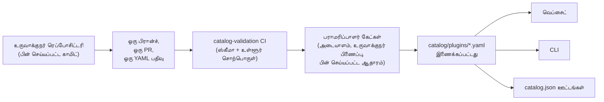

<div align="center">


# 🧩 Awesome Omni DSH Plugins

> **அதிகாரப்பூர்வமற்ற சமூகத் திட்டம். DeepSeek உடன் இணைப்பு இல்லை, அங்கீகாரம் இல்லை, ஆதரவு இல்லை.**
> DeepSeek பெயர்களும் முத்திரைகளும் அவற்றின் உரிமையாளருக்கு சொந்தமானவை.

**DeepSeek Harness (DSH)** பிளகின்களுக்கான உருவாக்குநர்-முதன்மை கண்டறிதல் மற்றும் ஒரே கட்டளையில் நிறுவல்.

<h2>
  🌐 <a href="https://dsh-plugins.omniroute.online"><strong>dsh-plugins.omniroute.online</strong></a> 🌐
</h2>
<h3>
  <a href="https://dsh-plugins.omniroute.online">வெப்சைட்டில் ஒவ்வொரு பிளகினையும் உலாவி, தேடி, நிறுவுங்கள் →</a>
</h3>

[](https://dsh-plugins.omniroute.online)
[](https://www.npmjs.com/package/@diegosouza.pw/dsh-plugins)
[](https://github.com/diegosouzapw/awesome-omni-dsh-plugins/actions/workflows/validate-catalog.yml)
[](../../LICENSE)
[](https://dsh-plugins.omniroute.online)

<br/>

<b>🌐 43 மொழிகளில்</b>
<br/><br/>
<a href="../../README.md"></a>
<a href="../pt-BR/README.md"></a>
<a href="../zh-CN/README.md"></a>
<a href="../zh-TW/README.md"></a>
<a href="../pt/README.md"></a>
<a href="../es/README.md"></a>
<a href="../fr/README.md"></a>
<a href="../it/README.md"></a>
<a href="../de/README.md"></a>
<a href="../nl/README.md"></a>
<a href="../ru/README.md"></a>
<a href="../uk-UA/README.md"></a>
<a href="../pl/README.md"></a>
<a href="../cs/README.md"></a>
<a href="../sk/README.md"></a>
<a href="../ro/README.md"></a>
<a href="../hu/README.md"></a>
<a href="../bg/README.md"></a>
<a href="../da/README.md"></a>
<a href="../fi/README.md"></a>
<a href="../no/README.md"></a>
<a href="../sv/README.md"></a>
<a href="../ja/README.md"></a>
<a href="../ko/README.md"></a>
<a href="../th/README.md"></a>
<a href="../vi/README.md"></a>
<a href="../id/README.md"></a>
<a href="../ms/README.md"></a>
<a href="../phi/README.md"></a>
<a href="../in/README.md"></a>
<a href="../hi/README.md"></a>
<a href="../gu/README.md"></a>
<a href="../mr/README.md"></a>
<a href="README.md"></a>
<a href="../te/README.md"></a>
<a href="../bn/README.md"></a>
<a href="../ur/README.md"></a>
<a href="../fa/README.md"></a>
<a href="../ar/README.md"></a>
<a href="../he/README.md"></a>
<a href="../tr/README.md"></a>
<a href="../az/README.md"></a>
<a href="../sw/README.md"></a>

</div>

---

## ⭐ சிறந்த 10 பிளகின்கள்

துல்லியமான-ரெப்போசிட்டரி நட்சத்திரங்களின் அடிப்படையில் தரவரிசைப்படுத்தப்பட்டுள்ளது — பிளகினின் சொந்த
ரெப்போசிட்டரி பெற்ற நட்சத்திரங்கள் மட்டுமே கணக்கிடப்படும், பெற்றோர் திட்டத்தினுடையவை ஒருபோதும் கிடையாது
([தரவரிசை நியதி](../../docs/RANKING.md)). ஒவ்வொரு பெயரும் உருவாக்குநரின் ரெப்போசிட்டரிக்கு இணைக்கப்பட்டுள்ளது,
கேட்டலாக் சரிபார்த்த சரியான காமிட்டில் பின் செய்யப்பட்டுள்ளது.

| #   | Plugin | Creator | ★ | Category | இது என்ன செய்கிறது |
| --- | ------ | ------- | --- | -------- | ------------ |
| 1 | [dsh-visualize](https://github.com/Nagi-ovo/dsh-visualize) | [@Nagi-ovo](https://github.com/Nagi-ovo) | 180 | UI & dashboards | உள்-வரி காட்சிப்படுத்தல்: மாடல் அமர்விற்குள் ஊடாடும் விளக்கப்படங்களையும் வரைபடங்களையும் உருவாக்குகிறது |
| 2 | [dsh-pet-remielle](https://github.com/Gin-7/dsh-pet-remielle) | [@Gin-7](https://github.com/Gin-7) | 20 | Entertainment | DSH வெப் GUI-க்கான ஹாட்-பிளகபிள் வெளிப்படையான டெஸ்க்டாப் செல்லப்பிராணி (Remielle, Zenless Zone Zero) |
| 3 | [dsh-whale-musume](https://github.com/Sutera-Diffusus/dsh-whale-musume) | [@Sutera-Diffusus](https://github.com/Sutera-Diffusus) | 19 | Entertainment | டாஷ்போர்டு செயல்பாட்டிற்கு எதிர்வினையாற்றும் அனிமேஷன் திமிங்கல-பெண் Kanban Musume சின்னம் |
| 4 | [deepseek-harness-tui](https://github.com/gxinxing/deepseek-harness-tui) | [@gxinxing](https://github.com/gxinxing) | 7 | UI & dashboards | dsh அமர்வுகளை இயக்குவதற்கான முழுத்திரை curses-பாணி டெர்மினல் சாட் கிளையன்ட் |
| 5 | [dsh-tui](https://github.com/turtle1999/turtle-ui) | [@turtle1999](https://github.com/turtle1999) | 7 | UI & dashboards | ஊடாடும் pi-tui டெர்மினல் முகப்பு: அமர்வு தேர்வி, ஸ்ட்ரீமிங் சாட், விசைப் பிணைப்புகள் |
| 6 | [dsh-tavily-workspace](https://github.com/moguiyu/dsh-tavily) | [@moguiyu](https://github.com/moguiyu) | 3 | Search & research | பல்-கீ மேலாண்மையும் பயன்பாட்டு அளவியும் கொண்ட ஆப்ட்-இன் Tavily மேம்பட்ட தேடல் கருவி |
| 7 | [dsh-bili-widget](https://github.com/pyf2818/dsh-bili-widget) | [@pyf2818](https://github.com/pyf2818) | 2 | Entertainment | மிதக்கும் bilibili வீடியோ விட்ஜெட்: பரிந்துரைகள், டிரெண்டிங், தரவரிசைகள் மற்றும் தேடல் |
| 8 | [dsh-themes](https://github.com/MangMax/dsh-themes) | [@MangMax](https://github.com/MangMax) | 1 | Entertainment | தோற்றப் பிளகின்: உள்ளமைந்த பாலெட்டுகள், லைட்/டார்க்/சிஸ்டம் பயன்முறை, VS Code தீம்கள் |
| 9 | [dsh-arknights](https://github.com/DocJlm/dsh-arknights) | [@DocJlm](https://github.com/DocJlm) | — | Entertainment | Pramanix மற்றும் Eyjafjalla இடம்பெறும் வணிகமற்ற Arknights astral-garden ஸ்கின் |
| 10 | [dsh-bridge-browser](https://github.com/Lum1104/dsh-browser) | [@Lum1104](https://github.com/Lum1104) | — | Browser automation | துணை உலாவி நீட்டிப்பிற்கான டோக்கன்-அங்கீகரிக்கப்பட்ட WebSocket பாலம் |

<div align="center">

### 👉 [**வெப்சைட்டில் அனைத்து பிளகின்களையும் தேடி, விவரங்களைப் படித்து, நிறுவல் கட்டளையை நகலெடுக்கவும் →**](https://dsh-plugins.omniroute.online) 👈

</div>

## ஒரு பார்வையில்

| பரப்பு     | இது என்ன                                                       | எங்கே                                                                    |
| ----------- | ---------------------------------------------------------------- | ------------------------------------------------------------------------ |
| **வெப்சைட்** | தேடல் மற்றும் தரவரிசையுடன் கூடிய ரெண்டர் செய்யப்பட்ட கேட்டலாக் உலாவி                 | [dsh-plugins.omniroute.online](https://dsh-plugins.omniroute.online)     |
| **கேட்டலாக்** | ஒவ்வொரு பிளகினுக்கும் ஒரு YAML கோப்பு, ஒரே உண்மையின் மூலம்             | [`catalog/plugins/`](../../catalog/plugins)                                    |
| **ஸ்கீமா**  | ஒவ்வொரு பதிவும் சரிபார்க்கும் பொது JSON ஸ்கீமா (draft 2020-12) | [`schemas/plugin.schema.yaml`](../../schemas/plugin.schema.yaml)               |
| **CLI**     | கேட்டலாக்கிலிருந்து தேடுதல், ஆய்வு செய்தல், சரிபார்த்தல் மற்றும் நிறுவுதல்           | [`@diegosouza.pw/dsh-plugins`](https://www.npmjs.com/package/@diegosouza.pw/dsh-plugins) |
| **இயந்திர ஊட்டங்கள்** | கருவிகளுக்கான `catalog.json` + `catalog.snapshot.json`           | [catalog.json](https://dsh-plugins.omniroute.online/catalog.json) · [catalog.snapshot.json](https://dsh-plugins.omniroute.online/catalog.snapshot.json) |

இந்த ரெப்போசிட்டரி கேட்டலாக்கிற்கான பொது உண்மையின் மூலமாகும். ஒவ்வொரு பட்டியலும் `catalog/plugins/` கீழ்
உள்ள ஒரு YAML கோப்பு, வெளியிடப்பட்ட JSON ஸ்கீமாவிற்கு எதிராக சரிபார்க்கப்பட்டு, தனித்தனியாக மதிப்பாய்வு
செய்யப்பட்ட ஒரு pull request மூலம் சேர்க்கப்பட்டு, எப்போதும் பிளகினின் அசல் உருவாக்குநருக்கு நன்றி
தெரிவிக்கப்படுகிறது. கேட்டலாக்கில் உள்ள எதுவும் மற்றொரு கேட்டலாக் அல்லது பட்டியலிலிருந்து உருவாக்கப்படவில்லை:
ஒவ்வொரு பதிவும் பின் செய்யப்பட்ட காமிட்டில் அசல் உருவாக்குநர் ரெப்போசிட்டரியிலிருந்து மறுகட்டமைக்கப்படுகிறது.

வெப்சைட்டும் CLI-யும் தனியார் மூலத்திலிருந்து பராமரிக்கப்படுகின்றன; அவை பயன்படுத்தும் பொது கேட்டலாக் தரவு,
ஸ்கீமா மற்றும் கொள்கைகளை இந்த ரெப்போசிட்டரி கொண்டுள்ளது.

## கேட்டலாக் நிலை

**10 பிளகின்கள் இணைக்கப்பட்டுள்ளன.** ஒவ்வொரு பிளகினும் ஒரு நேரத்தில் ஒன்றாக, அசல் உருவாக்குநர்
ரெப்போசிட்டரியிலிருந்து, பின் செய்யப்பட்ட மூல காமிட் மற்றும் தெளிவான நன்றி தெரிவிப்புடன், தனித்தனியாக
மதிப்பாய்வு செய்யப்பட்ட ஒரு pull request மூலம் நுழைகிறது.

## 🚀 CLI-ஐ நிறுவுங்கள்

```bash
npx @diegosouza.pw/dsh-plugins --help
```

நோக்கம் கொண்ட தொகுப்பு `@diegosouza.pw/dsh-plugins@0.1.0` என வெளியிடப்பட்டுள்ளது, மேலே உள்ள கட்டளையே
இன்றைய நியமன அழைப்பாகும்; இங்கு எந்த நிறுவி ஸ்கிரிப்டும் ஹோஸ்ட் செய்யப்படவில்லை.

### CLI-ஐ இன்று பயன்படுத்துங்கள்

பதிப்பு 0.1.0, படிக்க-மட்டும் கண்டறிதல் மற்றும் சரிபார்ப்பு கட்டளைகளுடன், ஒப்புதல்-கேட் நிறுவல் கட்டளைகளையும்
அனுப்புகிறது. கொடிகள், வெளியேறும் குறியீடுகள் மற்றும் குறியீடு-செயல்படுத்தல் ஒப்புதல் கேட் உள்ளிட்ட முழு
கட்டளை குறிப்பு [docs/CLI.md](../../docs/CLI.md)-இல் உள்ளது.

| கட்டளை                        | இது என்ன செய்கிறது                                                        | உங்கள் கணினியைத் தொடுகிறதா?                    |
| ------------------------------ | ------------------------------------------------------------------- | --------------------------------------- |
| `catalog validate --catalog .` | கேட்டலாக் YAML, ஸ்கீமா மற்றும் உள்ளூர் சொற்பொருளை சரிபார்க்கிறது                   | இல்லை — படிக்க-மட்டும்                          |
| `search <query...>`            | பொது கேட்டலாக் புலங்களை உள்ளூரில் தேடுகிறது                                | இல்லை — படிக்க-மட்டும்                          |
| `info <id>`                    | ஒரு பொது கேட்டலாக் பதிவைக் காட்டுகிறது                                       | இல்லை — படிக்க-மட்டும்                          |
| `list`                         | சுயவிவரங்களை மாற்றாமல் கேட்டலாக்-நிர்வகிக்கப்படும் நிறுவல்களைப் பட்டியலிடுகிறது            | இல்லை — படிக்க-மட்டும்                          |
| `doctor`                       | படிக்க-மட்டும் Node, DSH, native Windows கொள்கை மற்றும் கேட்டலாக் கண்டறிதல்  | இல்லை — படிக்க-மட்டும்                          |
| `add <id> --profile <name> --dry-run` | கோப்புகள் அல்லது துணை-செயல்முறைகள் இல்லாமல் சரிபார்க்கப்பட்ட நிறுவல் திட்டத்தைக் காட்டுகிறது | இல்லை — dry-run                            |
| `add <id> --profile <name> --allow-code-execution` | அதிகாரப்பூர்வ DSH பிரதிநிதித்துவம் மூலம் நிறுவுகிறது        | ஆம் — தெளிவான ஒப்புதல் கொடியுடன் மட்டும்   |

```bash
# Validate the catalog in this repository (what CI runs):
npx @diegosouza.pw/dsh-plugins@0.1.0 catalog validate --catalog .

# Search and inspect locally, without installing anything:
npx @diegosouza.pw/dsh-plugins@0.1.0 search memory --catalog .
npx @diegosouza.pw/dsh-plugins@0.1.0 info <plugin-id> --catalog .

# Preview an install plan; nothing is written and no subprocess runs:
npx @diegosouza.pw/dsh-plugins@0.1.0 add <plugin-id> --profile default --dry-run
```

மாற்றும் கட்டளைகள் (`add`, `update`, `remove`) நீங்கள் `--allow-code-execution` கடக்காத வரை பிளகின்
வாழ்க்கைச்சுழற்சி குறியீட்டை ஒருபோதும் இயக்காது. native Windows-இல் அந்த மாற்றங்கள் v0.1.0-இல்
முடக்கப்பட்டுள்ளன; WSL-ஐப் பயன்படுத்தவும். படிக்க-மட்டும் மற்றும் dry-run கட்டளைகள் எங்கும் வேலை செய்கின்றன.

## 🔍 ஒரு பிளகின் கேட்டலாக்கில் எவ்வாறு நுழைகிறது



1. **ஒரு பிளகின், ஒரு பிரான்ச், ஒரு pull request.** PR `catalog/plugins/` கீழ் சரியாக ஒரே ஒரு YAML
   கோப்பை மட்டுமே சேர்க்கும் அல்லது மாற்றும்.
2. **உருவாக்குநர்-முதன்மை.** பிளகினின் உருவாக்குநர் அல்லது உரிமையாளர் நிறுவனத்தால் திறக்கப்பட்ட PR,
   அதே பிளகினுக்கான சமூக க்யூரேஷன் அல்லது ஆட்டோமேஷனை விட எப்போதும் முன்னுரிமை பெறும் — பார்க்கவும்
   [docs/CREDIT.md](../../docs/CREDIT.md).
3. **அசல் மூலத்திலிருந்து ஆதாரம்.** ஒவ்வொரு புலமும் உருவாக்குநரின் ரெப்போசிட்டரியிலிருந்து பின்
   செய்யப்பட்ட 40-எழுத்து காமிட்டில் மறுகட்டமைக்கப்படுகிறது: விளக்கம், உரிமம், DSH ஒருங்கிணைப்பு,
   நிறுவல் விவரிப்பான், நட்சத்திரங்கள்.
4. **உள்ளூர் சரிபார்ப்பு.** `catalog validate` கட்டமைப்பையும் உள்ளூர் சொற்பொருளையும் சரிபார்க்கிறது;
   இது PR-இல் `catalog-validation` CI பணி இயக்கும் அதே சரிபார்ப்பாகும்.
5. **பராமரிப்பாளர் கேட்கள்.** இணைப்பதற்கு முன், பராமரிப்பாளர்கள் ரெப்போசிட்டரி அடையாளம், உருவாக்குநர்
   பிணைப்பு மற்றும் பின் செய்யப்பட்ட ஆதாரத்தை தனித்தனியாக சரிபார்க்கிறார்கள். பச்சை நிற உள்ளூர் சரிபார்ப்பு
   அவசியமானது, ஆனால் ஒருபோதும் போதுமானதல்ல.

முழுமையான ஒப்பந்தம் — தேவையான ஆதாரம், YAML விதிகள், நட்சத்திர கொள்கை, முரண்பாடு கையாளுதல் மற்றும்
மதிப்பாய்வு கேட்கள் — [CONTRIBUTING.md](../../CONTRIBUTING.md)-இல் உள்ளது. முடிவுகள் எவ்வாறு, யாரால்
எடுக்கப்படுகின்றன என்பது [docs/GOVERNANCE.md](../../docs/GOVERNANCE.md)-இல் உள்ளது.

## 📄 ஒரு பதிவின் கூறமைப்பு

ஒவ்வொரு பதிவும் அதன் ID-யின் பெயரிடப்பட்ட ஒரு YAML கோப்பாகும். கீழே உள்ள எடுத்துக்காட்டு தற்போதைய
ஸ்கீமாவிற்கு எதிராக சரிபார்க்கப்படுகிறது (புலம்-வாரியான குறிப்பு [docs/SCHEMA.md](../../docs/SCHEMA.md)-இல்):

```yaml
schemaVersion: 1
id: example-notes-search
name: Example Notes Search
description:
  en: >-
    Searches a local Markdown notes folder from DSH sessions and returns
    matching snippets with file paths.
  evidencePath: README.md
unofficial: true
kind: plugin
primaryCategory: search-research
tags:
  - search
  - notes
  - cli
source:
  repository: https://github.com/example-creator/example-notes-search
  repositoryNodeId: R_kgDOExample01
  subpath: null
  commit: 0123456789abcdef0123456789abcdef01234567
creator:
  github: example-creator
package:
  ecosystem: npm
  name: example-notes-search
  version: 1.4.2
dsh:
  profiles:
    - default
  evidencePath: dsh-plugin.json
repositoryScope: dedicated
popularity:
  starsPolicy: exact-repository
  stars: 128
license:
  spdx: MIT
verification:
  status: eligible
  checkedAt: "2026-08-18T12:00:00Z"
  repositoryIdentity: resolved
  smokeTest: null
provenance:
  discussion: null
  comment: null
```

ஸ்கீமாவால் அமல்படுத்தப்படும் முக்கிய மாறிலிகள்:

- `unofficial: true` மற்றும் `schemaVersion: 1` மாறிலிகள்.
- ஒரு மோனோரெப்போ பிளகின் `stars: null`-ஐப் பயன்படுத்த வேண்டும் — பெற்றோர்-திட்ட நட்சத்திரங்கள்
  ஒருபோதும் மரபுரிமையாக பெறப்படாது.
- நிறுவல் விவரிப்பான் ஒன்று சரியான-பதிப்பு npm தொகுப்பு அல்லது பின் செய்யப்பட்ட மூலமே ஆகும்; இது தரவு,
  ஒருபோதும் shell கட்டளை அல்ல.
- `verified` நிலைக்கு மதிப்பாய்வு செய்யக்கூடிய smoke-test ஆதாரம் தேவை; இல்லையெனில் பதிவு `smokeTest: null`-உடன்
  `eligible` ஆகும்.

## 🗂 இங்கு என்ன சேர்கிறது

இந்த ரெப்போசிட்டரி DeepSeek Harness (DSH)-க்கான சுயாதீனமாக வெளியிடப்பட்ட ஒருங்கிணைப்புகளை
பட்டியலிடுகிறது, இதில் native பிளகின்கள், பிளகின் குடும்பங்கள், தீம்கள், ஸ்கில்கள், கிளையன்ட்கள் மற்றும்
பாலங்கள் அடங்கும். கலைப்பொருள் வகைகள், திறன் வகைகள் மற்றும் இடைமுக டேக்குகள்
[docs/CATEGORIES.md](../../docs/CATEGORIES.md)-இல் வரையறுக்கப்பட்டுள்ளன.

ஒவ்வொரு பொது பதிவும் `catalog/plugins/` கீழ் உள்ள ஒரு YAML கோப்பாகும், மேலும்
`schemas/plugin.schema.yaml`-க்கு எதிராக சரிபார்க்கப்பட வேண்டும். ஒரு பட்டியல் என்பது ஆவணப்படுத்தப்பட்ட
தகுதி அல்லது சரிபார்ப்பு சோதனைகள் முடிக்கப்பட்டன என்பதைக் குறிக்கும்; இது ஒரு பாதுகாப்பு சான்றிதழோ அல்லது
DeepSeek அங்கீகாரமோ அல்ல.

## 🏅 தரவரிசை மற்றும் சரிபார்ப்பு

அர்ப்பணிக்கப்பட்ட, native, தகுதியான அல்லது சரிபார்க்கப்பட்ட பிளகின் ரெப்போசிட்டரிகள் மட்டுமே, அந்த சரியான
ரெப்போசிட்டரிக்குச் சொந்தமான நட்சத்திரங்களுடன், ஒரு நட்சத்திர தரவரிசையில் நுழையலாம். பரந்த மோனோரெப்போக்களுக்குள்
சேமிக்கப்பட்ட ஒருங்கிணைப்புகள் கண்டறியக்கூடியதாகவே இருக்கும் ஆனால் `stars: null`-ஐப் பயன்படுத்துகின்றன,
மேலும் ஒருபோதும் பெற்றோர்-திட்ட நட்சத்திரங்களை மரபுரிமையாகப் பெறாது. முழு நியதிக்கும்
[docs/RANKING.md](../../docs/RANKING.md) பார்க்கவும்.

பொது சரிபார்ப்பு நிலைகள் கட்டமைப்பு தகுதியையும் நிறுவல் smoke test-ஐயும் வேறுபடுத்துகின்றன. எந்த நிலையும்
முழுமையான பாதுகாப்பைக் குறிக்காது. பயன்படுத்துவதற்கு முன் பிளகினின் ரெப்போசிட்டரி, பின் செய்யப்பட்ட காமிட்,
உரிமம் மற்றும் நிறுவல் நடத்தையை மதிப்பாய்வு செய்யவும்.

## 🤝 பங்களியுங்கள் அல்லது ஒரு பதிவை உரிமை கோருங்கள்

pull request ஒன்றைத் திறப்பதற்கு முன் [CONTRIBUTING.md](../../CONTRIBUTING.md)-ஐப் படியுங்கள். ஒரு
pull request சரியாக ஒரே ஒரு பிளகின் பதிவை மட்டுமே சேர்க்க அல்லது மாற்ற வேண்டும், மேலும் மற்றொரு
கேட்டலாக்கிற்குப் பதிலாக அசல் உருவாக்குநர் ரெப்போசிட்டரியை மேற்கோள் காட்ட வேண்டும். உருவாக்குநர் எழுதிய
pull request-கள் ஆட்டோமேட்டட் கேட்டலாக் pull request-களை விட முன்னுரிமை பெறும்.

உருவாக்குநர் உரிமைகோரல்கள், திருத்தங்கள் மற்றும் நீக்குதல்களுக்கான கட்டமைக்கப்பட்ட issue படிவங்கள்
கிடைக்கின்றன. நற்சான்றிதழ்கள், தனிப்பட்ட தொடர்பு விவரங்கள் அல்லது பிற ரகசியங்களை ஒருபோதும் சமர்ப்பிக்க
வேண்டாம்.

## 👩‍🎨 பிளகின் உருவாக்குநர்கள்

இந்த உருவாக்குநர்கள் பிளகின்களை வெளியிட்டதால்தான் இந்த கேட்டலாக் உள்ளது. ஒவ்வொரு பதிவும் அதன்
உருவாக்குநருக்கு நன்றி தெரிவித்து, அவர்களின் ரெப்போசிட்டரிக்கு எப்போதும் இணைக்கிறது.

<a href="https://github.com/Nagi-ovo" title="@Nagi-ovo — dsh-visualize"></a>
<a href="https://github.com/Gin-7" title="@Gin-7 — dsh-pet-remielle"></a>
<a href="https://github.com/Sutera-Diffusus" title="@Sutera-Diffusus — dsh-whale-musume"></a>
<a href="https://github.com/gxinxing" title="@gxinxing — deepseek-harness-tui"></a>
<a href="https://github.com/turtle1999" title="@turtle1999 — dsh-tui"></a>
<a href="https://github.com/moguiyu" title="@moguiyu — dsh-tavily-workspace"></a>
<a href="https://github.com/pyf2818" title="@pyf2818 — dsh-bili-widget"></a>
<a href="https://github.com/MangMax" title="@MangMax — dsh-themes"></a>
<a href="https://github.com/DocJlm" title="@DocJlm — dsh-arknights"></a>
<a href="https://github.com/Lum1104" title="@Lum1104 — dsh-bridge-browser"></a>

உங்கள் பிளகின் முழு நன்றியுடன் இங்கு வேண்டுமா? [ஒரு YAML பதிவுடன் ஒரு PR-ஐத் திறக்கவும்](../../CONTRIBUTING.md) —
அல்லது நீங்கள் செய்வதற்கு முன் யாராவது உங்கள் வேலையை கேட்டலாக் செய்திருந்தால்
[ஏற்கனவே உள்ள பதிவை உரிமை கோருங்கள்](https://github.com/diegosouzapw/awesome-omni-dsh-plugins/issues/new/choose).

## 📚 ஆவணப்படுத்தல்

| ஆவணம்                                     | இது எதை உள்ளடக்குகிறது                                                       |
| -------------------------------------------- | -------------------------------------------------------------------- |
| [CONTRIBUTING.md](../../CONTRIBUTING.md)           | முழுமையான பங்களிப்பு ஒப்பந்தம்: ஆதாரம், YAML விதிகள், மதிப்பாய்வு கேட்கள்    |
| [SECURITY.md](../../SECURITY.md)                   | பிளகின் அல்லது கேட்டலாக் பாதிப்புகளைப் புகாரளித்தல்; ரகசியங்கள் கொள்கை           |
| [docs/SCHEMA.md](../../docs/SCHEMA.md)             | `schemas/plugin.schema.yaml`-க்கான புலம்-வாரியான குறிப்பு             |
| [docs/CLI.md](../../docs/CLI.md)                   | `@diegosouza.pw/dsh-plugins@0.1.0`-க்கான CLI கட்டளை குறிப்பு          |
| [docs/GOVERNANCE.md](../../docs/GOVERNANCE.md)     | கேட்டலாக் எவ்வாறு நிர்வகிக்கப்படுகிறது: முன்னுரிமை, கேட்கள், உரிமைகோரல்கள் மற்றும் நீக்குதல்கள்   |
| [docs/CATEGORIES.md](../../docs/CATEGORIES.md)     | கலைப்பொருள் வகைகள், முதன்மை திறன் வகைகள், டேக்குகள், ரெப்போசிட்டரி நோக்கம் |
| [docs/CREDIT.md](../../docs/CREDIT.md)             | உருவாக்குநர் நன்றி, PR முன்னுரிமை மற்றும் Git அடையாள கொள்கை                 |
| [docs/RANKING.md](../../docs/RANKING.md)           | பொது தரவரிசை நியதி மற்றும் சரிபார்ப்பு நிலைகள்                             |
| [docs/UNOFFICIAL.md](../../docs/UNOFFICIAL.md)     | அதிகாரப்பூர்வமற்ற நிலை மற்றும் வர்த்தக முத்திரை நிலைப்பாடு                               |

## 🌐 மொழிபெயர்ப்புகள்

இந்த README [`docs/i18n/`](..) கீழ் 43 மொழிகளில் கிடைக்கிறது — மேலே உள்ள கொடி தேர்வியைப் பயன்படுத்தவும்.
ஆங்கிலம் உண்மையின் மூலமாகும்; ஒரு மொழிபெயர்ப்பும் ஆங்கில உரையும் முரண்படும்போது, ஆங்கில உரையே ஆளுகை
செய்யும். எந்த மொழிபெயர்ப்பிற்கும் திருத்தங்கள் இயல்பான pull request-கள் மூலம் வரவேற்கப்படுகின்றன.

## 📜 உரிமம் மற்றும் நன்றி தெரிவிப்பு

ஆவணப்படுத்தலும் ரெப்போசிட்டரி வார்ப்புருக்களும் [MIT உரிமத்தின்](../../LICENSE) கீழ் உரிமம் பெற்றுள்ளன.
அசல் கேட்டலாக் உண்மைகளும் எடிட்டோரியல் YAML மெட்டாடேட்டாவும் [CC0-1.0](../../LICENSE-CATALOG) கீழ்
அர்ப்பணிக்கப்பட்டுள்ளன. அப்ஸ்ட்ரீம் குறியீடு, பெயர்கள், லோகோக்கள் மற்றும் ஸ்கிரீன்ஷாட்கள் அவற்றின் அசல்
உரிமையாளர்கள் மற்றும் உரிமங்களின் கீழேயே உள்ளன. [docs/CREDIT.md](../../docs/CREDIT.md) மற்றும்
[docs/UNOFFICIAL.md](../../docs/UNOFFICIAL.md) பார்க்கவும்.

<div align="center">

### ⭐ இந்த கேட்டலாக் உங்களுக்கு ஒரு பிளகினைக் கண்டறிய உதவியிருந்தால், ரெப்போவை ஸ்டார் செய்யுங்கள் — இது உருவாக்குநர்களைக் கண்டறியப் பெற உதவுகிறது.

**[வெப்சைட்டில் அனைத்து பிளகின்களையும் உலாவுங்கள் →](https://dsh-plugins.omniroute.online)**

</div>
