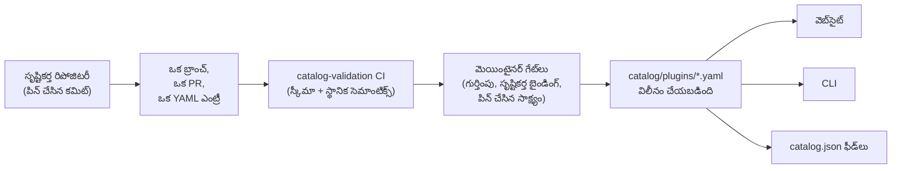

<div align="center">


# 🧩 Awesome Omni DSH Plugins

> **అనధికారిక కమ్యూనిటీ ప్రాజెక్ట్. DeepSeek తో ఎలాంటి అనుబంధం లేదు, ఆమోదం లేదు, స్పాన్సర్‌షిప్ లేదు.**
> DeepSeek పేర్లు మరియు గుర్తులు వాటి సంబంధిత యజమానులకే చెందుతాయి.

**DeepSeek Harness (DSH)** ప్లగిన్‌ల కోసం సృష్టికర్త-ప్రాధాన్య అన్వేషణ మరియు ఒకే కమాండ్‌తో ఇన్‌స్టాలేషన్.

<h2>
  🌐 <a href="https://dsh-plugins.omniroute.online"><strong>dsh-plugins.omniroute.online</strong></a> 🌐
</h2>
<h3>
  <a href="https://dsh-plugins.omniroute.online">వెబ్‌సైట్‌లో అన్ని ప్లగిన్‌లను బ్రౌజ్ చేయండి, శోధించండి మరియు ఇన్‌స్టాల్ చేయండి →</a>
</h3>

[](https://dsh-plugins.omniroute.online)
[](https://www.npmjs.com/package/@diegosouza.pw/dsh-plugins)
[](https://github.com/diegosouzapw/awesome-omni-dsh-plugins/actions/workflows/validate-catalog.yml)
[](../../LICENSE)
[](https://dsh-plugins.omniroute.online)

<br/>

<b>🌐 43 భాషల్లో</b>
<br/><br/>
<a href="../../README.md"></a>
<a href="../pt-BR/README.md"></a>
<a href="../zh-CN/README.md"></a>
<a href="../zh-TW/README.md"></a>
<a href="../pt/README.md"></a>
<a href="../es/README.md"></a>
<a href="../fr/README.md"></a>
<a href="../it/README.md"></a>
<a href="../de/README.md"></a>
<a href="../nl/README.md"></a>
<a href="../ru/README.md"></a>
<a href="../uk-UA/README.md"></a>
<a href="../pl/README.md"></a>
<a href="../cs/README.md"></a>
<a href="../sk/README.md"></a>
<a href="../ro/README.md"></a>
<a href="../hu/README.md"></a>
<a href="../bg/README.md"></a>
<a href="../da/README.md"></a>
<a href="../fi/README.md"></a>
<a href="../no/README.md"></a>
<a href="../sv/README.md"></a>
<a href="../ja/README.md"></a>
<a href="../ko/README.md"></a>
<a href="../th/README.md"></a>
<a href="../vi/README.md"></a>
<a href="../id/README.md"></a>
<a href="../ms/README.md"></a>
<a href="../phi/README.md"></a>
<a href="../in/README.md"></a>
<a href="../hi/README.md"></a>
<a href="../gu/README.md"></a>
<a href="../mr/README.md"></a>
<a href="../ta/README.md"></a>
<a href="README.md"></a>
<a href="../bn/README.md"></a>
<a href="../ur/README.md"></a>
<a href="../fa/README.md"></a>
<a href="../ar/README.md"></a>
<a href="../he/README.md"></a>
<a href="../tr/README.md"></a>
<a href="../az/README.md"></a>
<a href="../sw/README.md"></a>

</div>

---

## ⭐ టాప్ 10 ప్లగిన్‌లు

ఖచ్చితమైన-రిపోజిటరీ స్టార్ల ఆధారంగా ర్యాంక్ చేయబడింది — ప్లగిన్ యొక్క సొంత రిపోజిటరీకి లభించిన స్టార్లు మాత్రమే
లెక్కించబడతాయి, తల్లి ప్రాజెక్ట్ స్టార్లు ఎప్పుడూ కాదు ([ర్యాంకింగ్ నియమం](../../docs/RANKING.md)). ప్రతి పేరు సృష్టికర్త
రిపోజిటరీకి లింక్ చేయబడి ఉంటుంది, కేటలాగ్ ధృవీకరించిన ఖచ్చితమైన కమిట్ వద్ద పిన్ చేయబడింది.

| #   | ప్లగిన్ | సృష్టికర్త | ★ | వర్గం | ఇది ఏం చేస్తుంది |
| --- | ------ | ------- | --- | -------- | ------------ |
| 1 | [dsh-visualize](https://github.com/Nagi-ovo/dsh-visualize) | [@Nagi-ovo](https://github.com/Nagi-ovo) | 180 | UI & dashboards | ఇన్‌లైన్ విజువలైజేషన్: మోడల్ సెషన్‌లో ఇంటరాక్టివ్ చార్ట్‌లు మరియు రేఖాచిత్రాలను రెండర్ చేస్తుంది |
| 2 | [dsh-pet-remielle](https://github.com/Gin-7/dsh-pet-remielle) | [@Gin-7](https://github.com/Gin-7) | 20 | Entertainment | DSH వెబ్ GUI కోసం హాట్-ప్లగబుల్ పారదర్శక డెస్క్‌టాప్ పెట్ (Remielle, Zenless Zone Zero) |
| 3 | [dsh-whale-musume](https://github.com/Sutera-Diffusus/dsh-whale-musume) | [@Sutera-Diffusus](https://github.com/Sutera-Diffusus) | 19 | Entertainment | డాష్‌బోర్డ్ కార్యకలాపానికి స్పందించే యానిమేటెడ్ వేల్-గర్ల్ కాన్‌బన్ ముసుమే మాస్కట్ |
| 4 | [deepseek-harness-tui](https://github.com/gxinxing/deepseek-harness-tui) | [@gxinxing](https://github.com/gxinxing) | 7 | UI & dashboards | dsh సెషన్‌లను నడిపించడానికి పూర్తి-స్క్రీన్ curses-శైలి టెర్మినల్ చాట్ క్లయింట్ |
| 5 | [dsh-tui](https://github.com/turtle1999/turtle-ui) | [@turtle1999](https://github.com/turtle1999) | 7 | UI & dashboards | ఇంటరాక్టివ్ pi-tui టెర్మినల్ ఫ్రంట్ డోర్: సెషన్ పికర్, స్ట్రీమింగ్ చాట్, కీబైండింగ్‌లు |
| 6 | [dsh-tavily-workspace](https://github.com/moguiyu/dsh-tavily) | [@moguiyu](https://github.com/moguiyu) | 3 | Search & research | మల్టీ-కీ నిర్వహణ మరియు వినియోగ గేజ్‌తో కూడిన ఆప్ట్-ఇన్ Tavily అధునాతన శోధన సాధనం |
| 7 | [dsh-bili-widget](https://github.com/pyf2818/dsh-bili-widget) | [@pyf2818](https://github.com/pyf2818) | 2 | Entertainment | తేలియాడే bilibili వీడియో విడ్జెట్: సిఫార్సులు, ట్రెండింగ్, ర్యాంకింగ్‌లు మరియు శోధన |
| 8 | [dsh-themes](https://github.com/MangMax/dsh-themes) | [@MangMax](https://github.com/MangMax) | 1 | Entertainment | రూపురేఖల ప్లగిన్: అంతర్నిర్మిత పాలెట్‌లు, లైట్/డార్క్/సిస్టమ్ మోడ్, VS Code థీమ్‌లు |
| 9 | [dsh-arknights](https://github.com/DocJlm/dsh-arknights) | [@DocJlm](https://github.com/DocJlm) | — | Entertainment | Pramanix మరియు Eyjafjalla ఫీచర్ చేసే వాణిజ్యేతర Arknights astral-garden స్కిన్ |
| 10 | [dsh-bridge-browser](https://github.com/Lum1104/dsh-browser) | [@Lum1104](https://github.com/Lum1104) | — | Browser automation | కంపానియన్ బ్రౌజర్ ఎక్స్‌టెన్షన్ కోసం టోకెన్-ప్రామాణీకృత WebSocket బ్రిడ్జ్ |

<div align="center">

### 👉 [**వెబ్‌సైట్‌లో అన్ని ప్లగిన్‌లను శోధించండి, వివరాలు చదవండి మరియు ఇన్‌స్టాల్ కమాండ్‌ను కాపీ చేయండి →**](https://dsh-plugins.omniroute.online) 👈

</div>

## ఒక చూపులో

| ఉపరితలం     | అది ఏమిటి                                                       | ఎక్కడ                                                                    |
| ----------- | ---------------------------------------------------------------- | ------------------------------------------------------------------------ |
| **వెబ్‌సైట్** | శోధన మరియు ర్యాంకింగ్‌తో రెండర్ చేయబడిన కేటలాగ్ బ్రౌజర్                 | [dsh-plugins.omniroute.online](https://dsh-plugins.omniroute.online)     |
| **కేటలాగ్** | ప్రతి ప్లగిన్‌కు ఒక YAML ఫైల్, ఏకైక ప్రామాణిక మూలం             | [`catalog/plugins/`](../../catalog/plugins)                                    |
| **స్కీమా**  | ప్రతి ఎంట్రీ దీనికి వ్యతిరేకంగా ధృవీకరించబడే పబ్లిక్ JSON స్కీమా (draft 2020-12) | [`schemas/plugin.schema.yaml`](../../schemas/plugin.schema.yaml)               |
| **CLI**     | కేటలాగ్ నుండి శోధించండి, పరిశీలించండి, ధృవీకరించండి మరియు ఇన్‌స్టాల్ చేయండి           | [`@diegosouza.pw/dsh-plugins`](https://www.npmjs.com/package/@diegosouza.pw/dsh-plugins) |
| **మెషిన్ ఫీడ్‌లు** | సాధనాల కోసం `catalog.json` + `catalog.snapshot.json`           | [catalog.json](https://dsh-plugins.omniroute.online/catalog.json) · [catalog.snapshot.json](https://dsh-plugins.omniroute.online/catalog.snapshot.json) |

ఈ రిపోజిటరీ కేటలాగ్ కోసం పబ్లిక్ ప్రామాణిక మూలం. ప్రతి లిస్టింగ్ `catalog/plugins/` కింద ఒక YAML ఫైల్, ప్రచురించిన JSON
స్కీమాకు వ్యతిరేకంగా ధృవీకరించబడింది, ఒక వ్యక్తిగతంగా సమీక్షించిన పుల్ రిక్వెస్ట్ ద్వారా జోడించబడింది, మరియు ఎల్లప్పుడూ
ప్లగిన్ యొక్క అసలు సృష్టికర్తకు క్రెడిట్ ఇవ్వబడుతుంది. కేటలాగ్‌లో ఏదీ మరొక కేటలాగ్ లేదా జాబితా నుండి రూపొందించబడదు: ప్రతి
ఎంట్రీ పిన్ చేసిన కమిట్ వద్ద అసలు సృష్టికర్త రిపోజిటరీ నుండి పునర్నిర్మించబడుతుంది.

వెబ్‌సైట్ మరియు CLI ప్రైవేట్ సోర్స్ నుండి నిర్వహించబడతాయి; ఈ రిపోజిటరీ అవి ఉపయోగించే పబ్లిక్ కేటలాగ్ డేటా, స్కీమా మరియు
విధానాలను కలిగి ఉంటుంది.

## కేటలాగ్ స్థితి

**10 ప్లగిన్‌లు విలీనం చేయబడ్డాయి.** ప్రతి ప్లగిన్ ఒక్కొక్కటిగా, అసలు సృష్టికర్త రిపోజిటరీ నుండి, పిన్ చేసిన సోర్స్ కమిట్
మరియు స్పష్టమైన ఆపాదనతో, వ్యక్తిగతంగా సమీక్షించిన పుల్ రిక్వెస్ట్ ద్వారా ప్రవేశిస్తుంది.

## 🚀 CLI ఇన్‌స్టాల్ చేయండి

```bash
npx @diegosouza.pw/dsh-plugins --help
```

స్కోప్ చేసిన ప్యాకేజీ `@diegosouza.pw/dsh-plugins@0.1.0` గా ప్రచురించబడింది మరియు పైన ఉన్న కమాండ్ నేటికి ప్రామాణిక
ఆహ్వానం; ఇక్కడ ఏ ఇన్‌స్టాలర్ స్క్రిప్ట్ కూడా హోస్ట్ చేయబడలేదు.

### CLI ను ఈరోజే వాడండి

వెర్షన్ 0.1.0 రీడ్-ఓన్లీ డిస్కవరీ మరియు వాలిడేషన్ కమాండ్‌లతో పాటు అనుమతి-గేటెడ్ ఇన్‌స్టాల్ కమాండ్‌లను అందిస్తుంది. ఫ్లాగ్‌లు,
ఎగ్జిట్ కోడ్‌లు మరియు కోడ్-ఎగ్జిక్యూషన్ అనుమతి గేట్‌తో సహా పూర్తి కమాండ్ రిఫరెన్స్ [docs/CLI.md](../../docs/CLI.md) లో ఉంది.

| కమాండ్                        | ఇది ఏం చేస్తుంది                                                        | మీ సిస్టమ్‌ను తాకుతుందా?                    |
| ------------------------------ | ------------------------------------------------------------------- | --------------------------------------- |
| `catalog validate --catalog .` | కేటలాగ్ YAML, స్కీమా మరియు స్థానిక సెమాంటిక్స్‌ను ధృవీకరిస్తుంది                   | కాదు — రీడ్-ఓన్లీ                          |
| `search <query...>`            | పబ్లిక్ కేటలాగ్ ఫీల్డ్‌లను స్థానికంగా శోధిస్తుంది                                | కాదు — రీడ్-ఓన్లీ                          |
| `info <id>`                    | ఒక పబ్లిక్ కేటలాగ్ ఎంట్రీని చూపిస్తుంది                                       | కాదు — రీడ్-ఓన్లీ                          |
| `list`                         | ప్రొఫైల్‌లను సవరించకుండా కేటలాగ్-నిర్వహిత ఇన్‌స్టాల్‌లను జాబితా చేస్తుంది            | కాదు — రీడ్-ఓన్లీ                          |
| `doctor`                       | రీడ్-ఓన్లీ Node, DSH, native Windows విధానం మరియు కేటలాగ్ డయాగ్నస్టిక్స్  | కాదు — రీడ్-ఓన్లీ                          |
| `add <id> --profile <name> --dry-run` | ఫైల్‌లు లేదా సబ్‌ప్రాసెస్‌లు లేకుండా ధృవీకరించిన ఇన్‌స్టాల్ ప్రణాళికను చూపిస్తుంది | కాదు — డ్రై-రన్                            |
| `add <id> --profile <name> --allow-code-execution` | అధికారిక DSH డెలిగేషన్ ద్వారా ఇన్‌స్టాల్ చేస్తుంది        | అవును — స్పష్టమైన అనుమతి ఫ్లాగ్‌తో మాత్రమే   |

```bash
# Validate the catalog in this repository (what CI runs):
npx @diegosouza.pw/dsh-plugins@0.1.0 catalog validate --catalog .

# Search and inspect locally, without installing anything:
npx @diegosouza.pw/dsh-plugins@0.1.0 search memory --catalog .
npx @diegosouza.pw/dsh-plugins@0.1.0 info <plugin-id> --catalog .

# Preview an install plan; nothing is written and no subprocess runs:
npx @diegosouza.pw/dsh-plugins@0.1.0 add <plugin-id> --profile default --dry-run
```

మ్యుటేటింగ్ కమాండ్‌లు (`add`, `update`, `remove`) మీరు `--allow-code-execution` పాస్ చేయకపోతే ఎప్పుడూ ప్లగిన్
లైఫ్‌సైకిల్ కోడ్‌ను అమలు చేయవు. native Windows పై v0.1.0 లో ఈ మ్యుటేషన్‌లు నిలిపివేయబడ్డాయి; WSL వాడండి. రీడ్-ఓన్లీ మరియు
డ్రై-రన్ కమాండ్‌లు ప్రతిచోటా పనిచేస్తాయి.

## 🔍 ఒక ప్లగిన్ కేటలాగ్‌లోకి ఎలా ప్రవేశిస్తుంది



1. **ఒక ప్లగిన్, ఒక బ్రాంచ్, ఒక పుల్ రిక్వెస్ట్.** PR `catalog/plugins/` కింద సరిగ్గా ఒక YAML ఫైల్‌ను జోడిస్తుంది లేదా
   మారుస్తుంది.
2. **సృష్టికర్త-ప్రాధాన్యం.** ప్లగిన్ సృష్టికర్త లేదా యజమాన్య సంస్థ తెరిచిన PR అదే ప్లగిన్ కోసం కమ్యూనిటీ క్యూరేషన్ లేదా
   ఆటోమేషన్ కంటే ఎల్లప్పుడూ ప్రాధాన్యత పొందుతుంది — చూడండి [docs/CREDIT.md](../../docs/CREDIT.md).
3. **అసలు మూలం నుండి సాక్ష్యం.** ప్రతి ఫీల్డ్ సృష్టికర్త రిపోజిటరీ నుండి పిన్ చేసిన 40-అక్షరాల కమిట్ వద్ద
   పునర్నిర్మించబడుతుంది: వివరణ, లైసెన్స్, DSH ఇంటిగ్రేషన్, ఇన్‌స్టాల్ డిస్క్రిప్టర్, స్టార్‌లు.
4. **స్థానిక ధృవీకరణ.** `catalog validate` నిర్మాణాన్ని మరియు స్థానిక సెమాంటిక్స్‌ను తనిఖీ చేస్తుంది; ఇది
   `catalog-validation` CI జాబ్ PR పై అమలు చేసే తనిఖీ లాంటిదే.
5. **మెయింటైనర్ గేట్‌లు.** విలీనానికి ముందు, మెయింటైనర్‌లు రిపోజిటరీ గుర్తింపు, సృష్టికర్త బైండింగ్ మరియు పిన్ చేసిన
   సాక్ష్యాన్ని విడిగా ధృవీకరిస్తారు. గ్రీన్ స్థానిక ధృవీకరణ అవసరం, కానీ ఎప్పుడూ సరిపోదు.

పూర్తి ఒప్పందం — అవసరమైన సాక్ష్యం, YAML నియమాలు, స్టార్‌ల విధానం, ఘర్షణ నిర్వహణ మరియు సమీక్ష గేట్‌లు —
[CONTRIBUTING.md](../../CONTRIBUTING.md) లో ఉంది. నిర్ణయాలు ఎలా, ఎవరిచే తీసుకోబడతాయో [docs/GOVERNANCE.md](../../docs/GOVERNANCE.md)
లో ఉంది.

## 📄 ఒక ఎంట్రీ నిర్మాణం

ప్రతి ఎంట్రీ దాని ID పేరు మీద ఒక YAML ఫైల్. దిగువన ఉన్న ఉదాహరణ ప్రస్తుత స్కీమాకు వ్యతిరేకంగా ధృవీకరించబడుతుంది
(ఫీల్డ్-బై-ఫీల్డ్ రిఫరెన్స్ [docs/SCHEMA.md](../../docs/SCHEMA.md) లో ఉంది):

```yaml
schemaVersion: 1
id: example-notes-search
name: Example Notes Search
description:
  en: >-
    Searches a local Markdown notes folder from DSH sessions and returns
    matching snippets with file paths.
  evidencePath: README.md
unofficial: true
kind: plugin
primaryCategory: search-research
tags:
  - search
  - notes
  - cli
source:
  repository: https://github.com/example-creator/example-notes-search
  repositoryNodeId: R_kgDOExample01
  subpath: null
  commit: 0123456789abcdef0123456789abcdef01234567
creator:
  github: example-creator
package:
  ecosystem: npm
  name: example-notes-search
  version: 1.4.2
dsh:
  profiles:
    - default
  evidencePath: dsh-plugin.json
repositoryScope: dedicated
popularity:
  starsPolicy: exact-repository
  stars: 128
license:
  spdx: MIT
verification:
  status: eligible
  checkedAt: "2026-08-18T12:00:00Z"
  repositoryIdentity: resolved
  smokeTest: null
provenance:
  discussion: null
  comment: null
```

స్కీమా అమలు చేసే కీలక నియమాలు (invariants):

- `unofficial: true` మరియు `schemaVersion: 1` స్థిరాంకాలు.
- మోనోరిపో ప్లగిన్ తప్పనిసరిగా `stars: null` వాడాలి — తల్లి-ప్రాజెక్ట్ స్టార్లు ఎప్పుడూ వారసత్వంగా రావు.
- ఇన్‌స్టాల్ డిస్క్రిప్టర్ ఖచ్చితమైన-వెర్షన్ npm ప్యాకేజీ లేదా పిన్ చేసిన సోర్స్ స్వయంగా అయి ఉంటుంది; ఇది డేటా, shell
  కమాండ్ ఎప్పుడూ కాదు.
- `verified` స్థితికి సమీక్షించదగిన స్మోక్-టెస్ట్ సాక్ష్యం అవసరం; లేకపోతే ఎంట్రీ `smokeTest: null` తో `eligible` గా ఉంటుంది.

## 🗂 ఇక్కడ ఏమి చేరుతుంది

ఈ రిపోజిటరీ DeepSeek Harness (DSH) కోసం స్వతంత్రంగా ప్రచురించిన ఇంటిగ్రేషన్‌లను జాబితా చేస్తుంది, వీటిలో native
ప్లగిన్‌లు, ప్లగిన్ కుటుంబాలు, థీమ్‌లు, స్కిల్‌లు, క్లయింట్‌లు మరియు బ్రిడ్జ్‌లు ఉన్నాయి. ఆర్టిఫాక్ట్ రకాలు, సామర్థ్య
వర్గాలు మరియు ఇంటర్‌ఫేస్ ట్యాగ్‌లు [docs/CATEGORIES.md](../../docs/CATEGORIES.md) లో నిర్వచించబడ్డాయి.

ప్రతి పబ్లిక్ రికార్డ్ `catalog/plugins/` కింద ఒక YAML ఫైల్ మరియు తప్పనిసరిగా `schemas/plugin.schema.yaml` కు
వ్యతిరేకంగా ధృవీకరించబడాలి. లిస్టింగ్ అంటే డాక్యుమెంట్ చేసిన అర్హత లేదా ధృవీకరణ తనిఖీలు పూర్తయ్యాయని అర్థం; ఇది
భద్రతా ధృవీకరణ లేదా DeepSeek ఆమోదం కాదు.

## 🏅 ర్యాంకింగ్ మరియు ధృవీకరణ

అంకితమైన, native, అర్హత గల లేదా ధృవీకరించిన ప్లగిన్ రిపోజిటరీలు మాత్రమే, ఆ ఖచ్చితమైన రిపోజిటరీకి చెందిన
స్టార్‌లతో, స్టార్ ర్యాంకింగ్‌లోకి ప్రవేశించగలవు. విస్తృత మోనోరిపోల లోపల నిల్వ చేయబడిన ఇంటిగ్రేషన్‌లు అన్వేషించదగినవిగానే
ఉంటాయి కానీ `stars: null` వాడతాయి మరియు తల్లి-ప్రాజెక్ట్ స్టార్‌లను ఎప్పుడూ వారసత్వంగా పొందవు. పూర్తి నియమం కోసం
[docs/RANKING.md](../../docs/RANKING.md) చూడండి.

పబ్లిక్ ధృవీకరణ స్థితులు నిర్మాణాత్మక అర్హతను ఇన్‌స్టాలేషన్ స్మోక్-టెస్ట్ నుండి వేరు చేస్తాయి. ఏ స్థితి కూడా సంపూర్ణ
భద్రతను సూచించదు. వాడకముందు ప్లగిన్ రిపోజిటరీ, పిన్ చేసిన కమిట్, లైసెన్స్ మరియు ఇన్‌స్టాలేషన్ ప్రవర్తనను సమీక్షించండి.

## 🤝 దోహదం చేయండి లేదా ఎంట్రీని క్లెయిమ్ చేయండి

పుల్ రిక్వెస్ట్ తెరవడానికి ముందు [CONTRIBUTING.md](../../CONTRIBUTING.md) చదవండి. పుల్ రిక్వెస్ట్ తప్పనిసరిగా సరిగ్గా
ఒక ప్లగిన్ ఎంట్రీని జోడించాలి లేదా మార్చాలి మరియు మరొక కేటలాగ్‌కు బదులుగా అసలు సృష్టికర్త రిపోజిటరీని ఉదహరించాలి.
సృష్టికర్త-రచించిన పుల్ రిక్వెస్ట్‌లు ఆటోమేటెడ్ కేటలాగ్ పుల్ రిక్వెస్ట్‌ల కంటే ప్రాధాన్యత పొందుతాయి.

సృష్టికర్త క్లెయిమ్‌లు, సవరణలు మరియు తొలగింపుల కోసం నిర్మాణాత్మక issue ఫారమ్‌లు అందుబాటులో ఉన్నాయి. క్రెడెన్షియల్‌లు,
ప్రైవేట్ సంప్రదింపు వివరాలు లేదా ఇతర రహస్యాలను ఎప్పుడూ సమర్పించవద్దు.

## 👩‍🎨 ప్లగిన్ సృష్టికర్తలు

ఈ సృష్టికర్తలు ప్లగిన్‌లను రూపొందించారు కాబట్టే ఈ కేటలాగ్ ఉంది. ప్రతి ఎంట్రీ తన సృష్టికర్తకు క్రెడిట్ ఇస్తుంది మరియు
వారి రిపోజిటరీకి లింక్ చేస్తుంది — ఎల్లప్పుడూ.

<a href="https://github.com/Nagi-ovo" title="@Nagi-ovo — dsh-visualize"></a>
<a href="https://github.com/Gin-7" title="@Gin-7 — dsh-pet-remielle"></a>
<a href="https://github.com/Sutera-Diffusus" title="@Sutera-Diffusus — dsh-whale-musume"></a>
<a href="https://github.com/gxinxing" title="@gxinxing — deepseek-harness-tui"></a>
<a href="https://github.com/turtle1999" title="@turtle1999 — dsh-tui"></a>
<a href="https://github.com/moguiyu" title="@moguiyu — dsh-tavily-workspace"></a>
<a href="https://github.com/pyf2818" title="@pyf2818 — dsh-bili-widget"></a>
<a href="https://github.com/MangMax" title="@MangMax — dsh-themes"></a>
<a href="https://github.com/DocJlm" title="@DocJlm — dsh-arknights"></a>
<a href="https://github.com/Lum1104" title="@Lum1104 — dsh-bridge-browser"></a>

మీ ప్లగిన్ పూర్తి క్రెడిట్‌తో ఇక్కడ ఉండాలని అనుకుంటున్నారా? [ఒక YAML ఎంట్రీతో ఒక PR తెరవండి](../../CONTRIBUTING.md) —
లేదా మీకంటే ముందే ఎవరైనా మీ పనిని కేటలాగ్ చేసి ఉంటే
[ఇప్పటికే ఉన్న ఎంట్రీని క్లెయిమ్ చేయండి](https://github.com/diegosouzapw/awesome-omni-dsh-plugins/issues/new/choose).

## 📚 డాక్యుమెంటేషన్

| డాక్యుమెంట్                                     | ఇది ఏమి కవర్ చేస్తుంది                                                       |
| -------------------------------------------- | ---------------------------------------------------------------------------- |
| [CONTRIBUTING.md](../../CONTRIBUTING.md)           | పూర్తి దోహదపు ఒప్పందం: సాక్ష్యం, YAML నియమాలు, సమీక్ష గేట్‌లు    |
| [SECURITY.md](../../SECURITY.md)                   | ప్లగిన్ లేదా కేటలాగ్ దుర్బలత్వాలను నివేదించడం; రహస్యాల విధానం           |
| [docs/SCHEMA.md](../../docs/SCHEMA.md)             | `schemas/plugin.schema.yaml` కోసం ఫీల్డ్-బై-ఫీల్డ్ రిఫరెన్స్             |
| [docs/CLI.md](../../docs/CLI.md)                   | `@diegosouza.pw/dsh-plugins@0.1.0` కోసం CLI కమాండ్ రిఫరెన్స్          |
| [docs/GOVERNANCE.md](../../docs/GOVERNANCE.md)     | కేటలాగ్ ఎలా నిర్వహించబడుతుంది: ప్రాధాన్యత, గేట్‌లు, క్లెయిమ్‌లు మరియు తొలగింపులు   |
| [docs/CATEGORIES.md](../../docs/CATEGORIES.md)     | ఆర్టిఫాక్ట్ రకాలు, ప్రధాన సామర్థ్య వర్గాలు, ట్యాగ్‌లు, రిపోజిటరీ పరిధి |
| [docs/CREDIT.md](../../docs/CREDIT.md)             | సృష్టికర్త క్రెడిట్, PR ప్రాధాన్యత మరియు Git గుర్తింపు విధానం                 |
| [docs/RANKING.md](../../docs/RANKING.md)           | పబ్లిక్ ర్యాంకింగ్ నియమం మరియు ధృవీకరణ స్థితులు                  |
| [docs/UNOFFICIAL.md](../../docs/UNOFFICIAL.md)     | అనధికారిక స్థితి మరియు ట్రేడ్‌మార్క్ వైఖరి                               |

## 🌐 అనువాదాలు

ఈ README [`docs/i18n/`](..) కింద 43 భాషల్లో అందుబాటులో ఉంది — పైన ఉన్న జెండా ఎంపిక సాధనం వాడండి. ఇంగ్లీష్
ప్రామాణిక మూలం; అనువాదం మరియు ఇంగ్లీష్ టెక్స్ట్ విభేదిస్తే, ఇంగ్లీష్ టెక్స్ట్ నే అనుసరించాలి. ఏదైనా అనువాదానికి
సవరణలు సాధారణ పుల్ రిక్వెస్ట్‌ల ద్వారా స్వాగతం.

## 📜 లైసెన్స్ మరియు ఆపాదన

డాక్యుమెంటేషన్ మరియు రిపోజిటరీ టెంప్లేట్‌లు [MIT లైసెన్స్](../../LICENSE) కింద లైసెన్స్ చేయబడ్డాయి. అసలు కేటలాగ్
వాస్తవాలు మరియు సంపాదకీయ YAML మెటాడేటా [CC0-1.0](../../LICENSE-CATALOG) కింద అంకితం చేయబడ్డాయి. అప్‌స్ట్రీమ్ కోడ్,
పేర్లు, లోగోలు మరియు స్క్రీన్‌షాట్‌లు వాటి అసలు యజమానులు మరియు లైసెన్స్‌ల కిందే ఉంటాయి.
[docs/CREDIT.md](../../docs/CREDIT.md) మరియు [docs/UNOFFICIAL.md](../../docs/UNOFFICIAL.md) చూడండి.

<div align="center">

### ⭐ ఈ కేటలాగ్ మీకు ప్లగిన్ కనుగొనడంలో సహాయపడితే, రిపోను స్టార్ చేయండి — ఇది సృష్టికర్తలను గుర్తించడంలో సహాయపడుతుంది.

**[వెబ్‌సైట్‌లో అన్ని ప్లగిన్‌లను బ్రౌజ్ చేయండి →](https://dsh-plugins.omniroute.online)**

</div>
